# Progressive Fine-Tuning：把“持续增量的 Reference 抽取器”做成可学习、可回滚的生产闭环

## 0. 结论先行

本次从 `奢侈品文章调研.md` 中选取论文 **Progressive Fine-Tuning for Cost-Effective Structured Attribute Generation in E-commerce** 做深入分析。

- 论文：<https://aclanthology.org/2026.acl-industry.40/>
- PDF：<https://aclanthology.org/2026.acl-industry.40.pdf>
- 目标需求：<https://app.notion.com/p/Spec-3bf7b2a8538b812fba00fb258024ff31>

分析前先检查了 `奢侈品调研/a` 当前已有结果，已分析过的对象包括：

- `ALMSER-GB.md`
- `Ameli.md`
- `An Entity-Matching System Based on Multimodal Data for Two Major E-Commerce Stores in Mexico.md`
- `AnyMatch -- Efficient Zero-Shot Entity Matching with a Small Language Model.md`
- `AutoBlock - A Hands-off Blocking Framework for Entity Matching.md`
- `ComEM.md`
- `Confidence Classifiers with Guaranteed Accuracy or Precision.md`
- `Conformal Selective Prediction with General Risk Control.md`
- `De-noised Vision-language Fusion Guided by Visual Cues for E-commerce Product Search.md`
- `Deep Entity Matching with Pre-Trained Language Models.md`
- `DeepBlocker.md`
- `Efficient Model Repository for Entity Resolution - Construction, Search, and Integration.md`
- `End-to-end multi-modal product matching in fashion e-commerce.md`
- `Entity Matching with 7B LLMs - A Study on Prompting Strategies and Hardware Limitations.md`
- `Fine-tuning large language models with contrastive margin ranking loss for selective entity matching in product data integration.md`
- `GoldenMatch.md`
- `GraLMatch - Matching Groups of Entities with Graphs and Language Models.md`
- `LangExtract.md`
- `Large Scale Generative Multimodal Attribute Extraction for E-commerce Attributes.md`
- `LinkTransformer.md`
- `MOON2.0 -- Dynamic Modality-balanced Multimodal Representation Learning for E-commerce Product Understanding.md`
- `Multi-Value-Product Retrieval-Augmented Generation for Industrial Product Attribute Value Identification.md`
- `PAM - Understanding Product Images in Cross Product Category Attribute Extraction.md`
- `Product Matching RAG Pipeline.md`
- `Query Brand Entity Linking in E-Commerce Search.md`
- `Shoptera MCP.md`
- `Tailoring entity resolution for matching product offers.md`
- `TransClean - Finding False Positives in Multi-Source Entity Matching under Real-World Conditions via Transitive Consistency.md`
- `Using LLMs for the Extraction and Normalization of Product Attribute Values.md`
- `catalog-forge.md`
- `parts-distributor-sku-classifier.md`
- `pyJedAI.md`

本次论文尚未出现在 `a` 目录，因此继续执行。

当前 Spec 的约束非常明确：

1. 数据来自雷小安、腕表之家、奢当家三个来源；
2. 数据量 100 万～1000 万，并持续增量；
3. “同一个商品”的业务定义是 **同一 reference number / 型号**；
4. reference 有时是独立字段，有时埋在标题/描述，图片也可用；
5. **precision 极端优先，宁可漏匹配，也不能误匹配**；
6. 可接受几百对人工黄金标签。

这篇论文最值得当前项目借鉴的，并不是“让一个小模型一次生成几十个商品属性”，而是它构建的 **持续学习闭环**：

```text
线上数据
  -> 找当前模型最薄弱的样本
  -> 只挑少量 hard cases
  -> 从上一个 checkpoint 继续 LoRA 微调
  -> 固定基准 + 线上 A/B 验证
  -> 再从最新失败样本进入下一轮
```

这个闭环非常适合当前三源二奢系统，因为真正长期变化的是：

- 新品牌；
- 新系列；
- 新 reference 格式；
- 各来源标题模板变化；
- OCR 风格变化；
- 新商家/新爬虫字段分布；
- 新型误导性文本，例如“适配 126610LN”“同款 126610LV”“专柜型号……”等。

但论文的 **优化目标不能直接照搬**。

论文主要优化“属性 completeness（覆盖率）”，且其线上流程允许用户最终人工确认；当前项目则要求“自动匹配几乎不能出 false positive”。因此我建议只复用论文的 **hard-case curation + progressive fine-tuning + checkpoint continuation**，把目标重新定义为：

> **Reference 抽取覆盖率可以逐步提升，但任何自动入库/自动合并必须经过 deterministic safety gate；模型永远没有权限仅凭语义相似就创建跨源 match。**

最终推荐架构：

```text
Reference-first 主链路

三源记录
  -> 品牌规范化
  -> 文本/OCR Reference 候选抽取
  -> 保守 canonicalization
  -> 候选 Reference Catalog 检索
  -> 小模型做 constrained resolver / abstain
  -> Safety Gate
  -> listing -> reference_entity
  -> 按 reference_entity_id exact join

持续学习旁路

拒识 / 冲突 / 人工退回 / 新格式
  -> Hard Case Store
  -> 少量人工确认
  -> Progressive LoRA Round t
  -> Shadow / Canary
  -> 达标后替换线上 extractor
```

其中：

- **模型负责“看懂脏数据”**；
- **规则负责“决定能不能自动合并”**；
- **Reference Entity 负责“定义实体身份”**。

这是这篇论文对当前需求最有价值、且可以直接落地的改造方式。

---

# 1. 论文解决的生产问题是什么

论文研究的是电商商品上架时的结构化属性生成。

输入：

```text
产品图片 + 产品描述
```

输出：

```json
{
  "brand": "...",
  "color": "...",
  "material": "...",
  "size": "..."
}
```

真实生产系统里，每个商品通常需要填写几十个甚至更多结构化属性。大模型质量高，但百万级请求长期运行时成本和延迟较高，所以论文尝试将能力迁移到更小的模型，并重点解决一个持续上线后的问题：

> 模型上线之后，新的失败样本不断出现，应该怎么低成本持续吸收这些失败模式？

论文给出的回答包含两个核心机制：

1. **Completeness-Deficit Guided Curation**：不要随机采样，而是优先挑“现有目录信息比模型输出更完整”的商品；
2. **Progressive Fine-Tuning**：每一轮从上一轮模型 checkpoint 继续训练，只用本轮新挑出的 hard samples，而不是每次从 base model 重新训练全部历史数据。

这和当前 reference 系统很像。

当前项目最缺的不是一个“一次性训练结束”的 extractor，而是一个能处理未来变化的 extractor：

```text
Round 0：能处理常见 Rolex/Omega reference
Round 1：补齐某平台新标题格式
Round 2：补齐 OCR 中 O/0、I/1、S/5 混淆
Round 3：补齐品牌特有点号、斜杠、短横线规则
Round 4：补齐“配件兼容型号”误抽取
...
```

因此，论文真正有价值的是 **训练运营架构**，而不只是某一个模型。

---

# 2. 论文的技术实现与训练架构

## 2.1 完整度指标

论文把一个商品需要生成的属性集合记为 `A`，如果模型能生成 schema-valid 且非空的属性值，则认为这个属性“complete”。

可简化写成：

```text
Completeness(y)
= 有效且非空的属性数 / 请求属性总数
```

论文特别强调：

```text
completeness != exact-match correctness
```

例如允许值中同时存在 `Navy` 与 `Dark Blue`，模型输出任意一个 schema-valid 值，都可计入 completeness；正确性通过另外的人工审计衡量。

这一点对我们非常重要，因为它恰恰说明：

> **论文的 completeness 可以用于“找模型哪里没覆盖”，但不能直接作为当前 Reference 匹配的质量门。**

对 reference 而言：

```text
126610LN != 126610LV
```

即使只差两个字符，也必须当成不同实体。

所以当前项目只能借鉴论文的“缺口驱动采样”，不能沿用它的“只要 schema-valid 就算完成”的线上放行逻辑。

---

## 2.2 Completeness Gap

论文对同一个商品 `x`，分别计算：

```text
Ccat(x)   = 商品目录已有属性完整度
Cmodel(x) = 当前模型生成属性完整度
```

定义：

```text
Gap(x) = Ccat(x) - Cmodel(x)
```

Gap 越大，意味着：

```text
目录里明明已有较完整信息
但模型没生成出来
```

这样的样本最有学习价值。

每轮只选择 gap 最大的 `k` 条进入训练。

这本质上是一种与业务指标绑定的 active learning / hard-example mining：

```text
不是“哪条数据最不确定”
而是“哪条数据最能暴露当前生产模型的真实缺口”
```

这比随机采样非常适合持续增量系统。

---

## 2.3 Progressive Training vs Cumulative Training

论文对比两种方案。

### Cumulative

每轮都从 base model `M0` 开始训练：

```text
Round 1: M0 + S1
Round 2: M0 + S1 + S2
Round 3: M0 + S1 + S2 + S3
```

随着数据越来越多，在固定训练步数下，每轮的有效 epoch 数下降。

### Progressive

每轮直接继承上一轮 checkpoint：

```text
Round 1: M0   + S1 -> M1
Round 2: M1   + S2 -> M2
Round 3: M2   + S3 -> M3
```

即：

```text
Mt = FineTune(Mt-1, St)
```

它的逻辑是：

> 已经学会的模式不从头再学，本轮只集中处理最新模型仍然不会的 hard cases。

论文在固定 compute budget 下观察到 progressive round 2 从更低的训练 loss 起步，并且同等数据量下 completeness 略优于 cumulative 方案。

这个思想非常适合我们的来源漂移场景。

---

## 2.4 LoRA 与论文训练参数

论文使用参数高效微调 LoRA，公开的实验设置包括：

```text
LoRA rank = 32
每轮新增训练样本 k = 1000
每轮 validation = 100
training steps = 100
learning rate = 1e-5
global batch size = 32
sequence length = 8192
训练硬件 = 4 × NVIDIA A100
```

同时论文将属性拆成 4 批生成，减少一次输出太多属性导致的长上下文问题。

对于当前项目，不需要照抄 8192 token 和“四批属性生成”，因为我们只聚焦一个身份属性 `reference`，任务可以被设计得短得多、约束更强。

更合理的是：

```text
输入：品牌 + 标题 + 描述片段 + OCR 文本 + Top-K reference candidates
输出：reference candidate id / abstain + evidence span
```

这会比“自由生成完整 reference 字符串”更安全。

---

## 2.5 论文的线上结果与一个关键警告

论文报告：

- 小模型相对大模型基线显著降低推理成本；
- p90 latency 显著下降；
- 离线 completeness 经过 progressive fine-tuning 后提升；
- 但线上 A/B 中，小模型 completeness 仍落后于大模型，论文将其归因于离线与线上分布漂移。

这对当前项目是一个非常重要的警告：

> **不要因为离线 reference benchmark 达标，就认为线上三源数据一定安全。**

二奢数据的漂移更严重：

- 不同店铺有不同标题模板；
- 新年份/新系列 reference 结构变化；
- 图片来源和清晰度变化；
- “附件/表带/盒证/适配型号”等脏文本大量存在；
- 某来源可能突然更改字段结构。

因此必须从一开始就设计：

```text
model_version + source_version + shadow traffic + online audit + rollback
```

不能只做一个 notebook 模型然后全量跑。

---

# 3. 论文哪些地方不能直接用于当前 Spec

## 3.1 论文是“提高填写效率”，当前是“身份判定”

论文业务允许用户最终确认模型建议，所以生成一个 schema-valid 但不完全等于 catalog value 的值，仍然可能有用。

当前系统不同：

```text
reference 错一个字符
=> 错实体
=> 跨来源错误合并
```

因此我们不能优化：

```text
“尽量多生成 reference”
```

而应该优化：

```text
“在允许自动发布的集合里，reference 必须极高精度；不确定就拒识”
```

---

## 3.2 论文缺少当前场景需要的“硬证据门”

论文最终还是生成式模型输出结构化值。

当前系统必须在模型后增加 deterministic verifier：

```text
模型输出
  != 自动匹配结论
```

模型最多只能输出：

```text
候选 reference + 证据位置 + 置信度/拒识
```

最终是否进入同一实体，必须由硬规则判断。

---

## 3.3 论文 Progressive 只有少量轮次，长期可能积累偏差

论文自己也指出长期 progressive learning 的行为仍需进一步验证。

如果每轮永远只训练“最难的新样本”，模型可能逐步偏向 hard tail：

```text
某一来源异常数据很多
-> hard cases 被它占满
-> 连续数轮都只学习该来源
-> 常规来源性能反而退化
```

所以当前项目不能只用：

```text
Mt = FineTune(Mt-1, St)
```

建议改成：

```text
Mt = FineTune(Mt-1, St + AnchorReplay)
```

其中 `AnchorReplay` 是固定的高质量锚点集，用来防止遗忘和分布漂移。

推荐每轮训练数据：

```text
70% 本轮 hard cases
20% 历史高价值错误样本 replay
10% 固定 anchor / easy-normal cases
```

比例可调，但一定要保留 replay。

---

## 3.4 GitHub 调研描述里的“蒸馏”需要更精确理解

`奢侈品文章调研.md` 对该论文的推荐语提到“将大模型能力蒸馏到低成本小模型”。

严格看论文实现，它并不是经典 teacher-logit / teacher-output knowledge distillation；论文主要使用经过验证的生产 catalog attributes 作为 proxy labels，对小模型做 progressive LoRA，并用 Claude Sonnet 4.5 做质量/成本基线比较。

因此对当前项目也无需先构造复杂 teacher-student distillation 系统。

更直接的落地方式是：

```text
人工确认 / 高可信 catalog reference
-> 作为 SFT ground truth
-> progressive LoRA
```

大模型可以用于辅助生成候选或解释，但不需要成为训练链路的强依赖。

---

# 4. 把 Completeness Gap 改造成“Reference Hardness Gap”

当前业务要学习的不是几十个属性，而是一个极端重要的身份字段。

我建议把论文的：

```text
Gap = catalog completeness - model completeness
```

改造成一个 **Reference Hardness Score**。

每条 listing 可以计算：

```text
hardness(x) =
    w1 * known_reference_but_model_abstains
  + w2 * model_reference_conflicts_with_verified_reference
  + w3 * multi_evidence_conflict
  + w4 * nearest_reference_is_too_close
  + w5 * source_format_is_new
  + w6 * human_rejected_recently
  + w7 * OCR_text_disagrees_with_title
```

含义如下。

## 4.1 known_reference_but_model_abstains

如果人工/可信字段已经知道 reference，但当前模型拒识，则这是“可学习漏召回”。

它最像论文的 completeness deficit。

例如：

```text
verified_ref = 126610LN
model = ABSTAIN
```

这是安全但漏匹配，适合进入下一轮训练。

---

## 4.2 model_reference_conflicts_with_verified_reference

例如：

```text
verified = 126610LN
model    = 126610LV
```

这是最高优先级 hard negative。

这种错误不能只作为普通 loss 样本，应该进入单独的“危险混淆对”集合。

---

## 4.3 multi_evidence_conflict

同一条 listing 可能出现：

```text
structured field = 126610LN
title             = 126610LN
OCR               = 126610LV
```

或者：

```text
title = 126610LN
描述  = “适配 126610LV 表带”
```

任何冲突都应该提高 hardness，并默认进入拒识，而不是让模型“投票猜一个”。

---

## 4.4 nearest_reference_is_too_close

对于同品牌 reference catalog，计算 Top-1/Top-2 候选的字符距离。

例如：

```text
126610LN
126610LV
```

视觉和语义几乎一样，但实体不同。

如果候选之间只有 1～2 个字符差异，这种样本应当被视为高风险，而不是高相似度自动放行。

当前任务中：

> **候选越像，有时反而越危险。**

---

## 4.5 source_format_is_new

通过 source + parser version + 字段模板统计检测 drift。

例如某天腕表之家标题由：

```text
品牌 系列 型号 价格
```

变成：

```text
【年份】品牌中文名/英文名 Ref.xxx 保卡信息
```

出现大量新 token pattern 时，自动提高该批数据的 hardness，进入 shadow，而不是直接用旧模型全量自动链接。

---

# 5. 推荐的生产架构：Reference-first，而不是 Pairwise-first

当前业务定义已经给了一个非常强的实体键：reference。

因此没必要先构造：

```text
1000 万记录 × 1000 万记录
```

的 pairwise matching 问题。

应该把问题改写成：

```text
listing -> canonical reference entity
```

然后：

```text
same reference_entity_id
=> same product definition
```

建议总体架构：

```mermaid
flowchart LR
    A[雷小安] --> I[Ingestion / Source Adapter]
    B[腕表之家] --> I
    C[奢当家] --> I

    I --> N[Brand / Text Normalization]
    N --> T[Title & Description Candidate Extractor]
    N --> O[Image OCR Evidence]

    T --> E[Reference Evidence Store]
    O --> E

    E --> R[Reference Catalog Retrieval]
    R --> M[Small Model Resolver / Abstain]
    M --> G[Deterministic Safety Gate]

    G -->|PASS| RE[Reference Entity]
    G -->|REJECT / CONFLICT| H[Hard Case Store]

    RE --> J[Exact Join Across Sources]

    H --> U[Human Verification]
    U --> D[Curated Training Round]
    D --> L[Progressive LoRA]
    L --> S[Shadow / Canary Evaluation]
    S -->|pass| M
    S -->|fail| RB[Rollback]
```



这套架构最关键的地方是：

```text
M -> G -> Reference Entity
```

模型和实体库之间永远隔着 Safety Gate。

---

# 6. 数据流拆解

## 6.1 Source Adapter

统一三源最小字段：

```json
{
  "source": "leixiaoan|watchhome|shedangjia",
  "source_item_id": "...",
  "title": "...",
  "description": "...",
  "brand_raw": "...",
  "reference_raw_field": "...",
  "images": ["..."],
  "crawl_time": "...",
  "source_schema_version": "..."
}
```

必须保留原始字段，不要一开始就覆盖写成 normalized value。

原因：

```text
未来 parser 出错时，需要回溯原证据。
```

---

## 6.2 Brand Canonicalization

Reference 不应全局裸匹配。

最安全实体键至少应是：

```text
(brand_id, canonical_reference)
```

因为不同品牌可能出现相同或相似编号字符串。

例如：

```text
brand_raw -> brand_id
```

品牌无法高可信确定时：

```text
不自动建 reference_entity
```

---

## 6.3 Reference Candidate Extraction

候选抽取建议分三层。

### Layer A：结构化字段

如果来源提供独立 reference/model 字段，优先读取。

但不能“字段存在就绝对可信”，仍需：

- 格式校验；
- 品牌 catalog 校验；
- 与标题/OCR 的冲突检测。

### Layer B：标题/描述规则

先通过品牌专属 regex / trie / dictionary 找出可能的 reference token。

例如：

```text
Rolex: 6 位数字 + 可选字母后缀
Omega: 点号分段格式
Cartier / AP / PP: 各自不同规则
```

不要使用一个全品牌通用的“删除所有符号后比对”。

### Layer C：OCR

图片只作为 **reference evidence**，不直接作为视觉相似 match。

重点 OCR 区域：

- 保卡；
- 吊牌；
- 表背；
- 盒证标签；
- 机芯/证书可见编号区域。

OCR 输出进入 evidence store：

```json
{
  "evidence_type": "image_ocr",
  "raw_text": "126610 LN",
  "image_id": "...",
  "bbox": [0,0,0,0],
  "ocr_score": 0.98
}
```

必须保留 bbox / image_id，方便人工复核。

---

# 7. Canonicalization 必须“保守”，不能为了召回过度清洗

对于 identity key，最大风险不是没 normalize，而是 **normalize 过度**。

推荐只做确定无语义的信息标准化：

```text
Unicode NFKC
全角 -> 半角
trim
大小写统一
明确允许的空格规范化
品牌确认安全的 delimiter 规范化
```

高风险操作：

```text
删除所有字母
删除所有后缀
删除所有点号/斜杠
把 O 自动改成 0
把 I 自动改成 1
截断到固定长度
```

这些操作不能直接形成 canonical reference。

建议保留：

```json
{
  "raw_reference": "126610-LN",
  "normalized_reference": "126610LN",
  "canonical_reference": "126610LN",
  "normalization_rule_id": "rolex_rule_v3"
}
```

每一次 canonicalization 都应该可审计。

---

# 8. Reference Catalog：把生成问题改成受限解析问题

当前任务不建议让模型自由生成：

```text
“我觉得型号是 126610LN”
```

更安全的方式：

1. 先从品牌 catalog 中召回 Top-K；
2. 模型只能从候选里选择，或者 `ABSTAIN`；
3. 输出必须带 evidence span。

例如输入：

```json
{
  "brand": "Rolex",
  "title": "劳力士潜航者 126610LN 黑盘 全套",
  "ocr": ["ROLEX", "126610LN"],
  "candidates": [
    "126610LN",
    "126610LV",
    "116610LN"
  ]
}
```

目标输出：

```json
{
  "decision": "SELECT",
  "candidate": "126610LN",
  "evidence": [
    {"source": "title", "span": "126610LN"},
    {"source": "ocr", "span": "126610LN"}
  ]
}
```

如果标题写：

```text
“适配 Rolex 126610LN 的表带”
```

正确输出应是：

```json
{
  "decision": "ABSTAIN",
  "reason": "reference appears as compatibility target, not sold-product identity"
}
```

也就是说训练目标不只是“抽字符串”，还要判断 **reference role**。

这一点可以直接复用 `parts-distributor-sku-classifier.md` 已经讨论过的“制造商编号 vs 平台 SKU / 其他角色”思想，而本篇补充的是：

> 把这些 role mistake 持续收集为 progressive fine-tuning 的 hard cases。

---

# 9. 模型输出 Schema

建议模型永远输出机器可验证 JSON：

```json
{
  "brand_id": "rolex",
  "decision": "SELECT|ABSTAIN|CONFLICT",
  "candidate_reference": "126610LN|null",
  "reference_role": "PRIMARY_PRODUCT|COMPATIBLE_WITH|ACCESSORY_FOR|UNKNOWN",
  "evidence": [
    {
      "source": "structured_field|title|description|ocr",
      "span": "126610LN",
      "image_id": null
    }
  ],
  "reason_code": "EXACT_TEXT_EVIDENCE|MULTI_EVIDENCE_AGREE|CONFLICT|NO_VALID_CANDIDATE|ROLE_RISK"
}
```

注意：

```text
reason_code
```

最好是枚举，不要依赖自由文本解释作为程序判断依据。

---

# 10. Deterministic Safety Gate：真正决定“能不能自动匹配”

这是整个系统最重要的一层。

伪代码：

```python
def safety_gate(listing, resolution, catalog):
    if resolution.decision != "SELECT":
        return "REVIEW"

    if resolution.reference_role != "PRIMARY_PRODUCT":
        return "REVIEW"

    ref = resolution.candidate_reference

    if not catalog.exists(listing.brand_id, ref):
        return "REVIEW"

    high_trust_refs = collect_high_trust_refs(listing)
    if len(set(high_trust_refs)) > 1:
        return "CONFLICT"

    if high_trust_refs and ref not in high_trust_refs:
        return "CONFLICT"

    if not has_literal_or_whitelisted_normalized_evidence(
        listing, ref, resolution.evidence
    ):
        return "REVIEW"

    if is_high_risk_neighbor(ref, listing.brand_id) \
       and not has_two_independent_evidences(listing, ref):
        return "REVIEW"

    return "AUTO_LINK"
```

关键原则：

```text
模型高置信度
!= 自动放行条件
```

真正的自动放行条件应该是“硬证据条件成立”。

---

# 11. 建议的证据等级

可以给每条 listing-reference link 一个 evidence tier。

## Tier A：最强

```text
可信结构化 reference 字段
+ brand 一致
+ reference catalog exact hit
+ 无任何冲突证据
```

可自动 link。

## Tier B：强

```text
标题出现完整 reference literal span
+ brand 一致
+ catalog exact hit
+ role = PRIMARY_PRODUCT
+ 无冲突
```

可考虑自动 link。

## Tier C：双证据

```text
标题规范化结果 == OCR 规范化结果
+ catalog exact hit
+ 无冲突
```

适合自动 link，但要对相邻型号做更严格规则。

## Tier D：仅模型推断

```text
模型从上下文猜 reference
但没有可定位的 literal evidence
```

一律不自动 link。

## Tier E：视觉相似

```text
图片看起来与某型号很像
```

只能用于候选召回/人工排序，不能定义实体。

---

# 12. 自动匹配不需要做 N² Pairwise

如果每条记录最终都被解析为：

```text
reference_entity_id
```

跨源匹配就变成：

```sql
SELECT *
FROM listing_reference_link a
JOIN listing_reference_link b
  ON a.reference_entity_id = b.reference_entity_id
WHERE a.source <> b.source;
```

这比做所有 listing pair 的模型匹配安全得多。

增量数据也非常简单：

```text
新 listing
-> 只解析自己
-> link 到已有 reference_entity
-> 自动获得跨来源同 reference 组
```

不需要每来一条记录就重新和千万历史记录两两比较。

---

# 13. 数据库建议

## 13.1 `listing_record`

```sql
listing_record(
  id,
  source,
  source_item_id,
  source_schema_version,
  brand_raw,
  title_raw,
  description_raw,
  reference_raw_field,
  crawl_time,
  payload_json
)
```

唯一键：

```text
(source, source_item_id)
```

---

## 13.2 `reference_entity`

```sql
reference_entity(
  id,
  brand_id,
  canonical_reference,
  catalog_source,
  catalog_version,
  status,
  created_at
)
```

唯一键：

```text
(brand_id, canonical_reference)
```

---

## 13.3 `reference_observation`

```sql
reference_observation(
  id,
  listing_id,
  evidence_type,
  raw_value,
  normalized_value,
  role,
  image_id,
  bbox_json,
  parser_version,
  created_at
)
```

同一 listing 可以有多个 observation。

---

## 13.4 `listing_reference_link`

```sql
listing_reference_link(
  listing_id,
  reference_entity_id,
  decision,
  evidence_tier,
  extractor_model_version,
  safety_rule_version,
  created_at,
  invalidated_at
)
```

`decision` 建议：

```text
AUTO_LINK
HUMAN_LINK
REVIEW
CONFLICT
UNRESOLVED
```

---

## 13.5 `hard_case`

```sql
hard_case(
  id,
  listing_id,
  hardness_score,
  reason_codes,
  model_version,
  source,
  brand_id,
  human_label,
  label_status,
  created_at
)
```

这是 Progressive Fine-Tuning 的核心数据源。

---

## 13.6 `model_registry`

```sql
model_registry(
  model_version,
  parent_model_version,
  base_model,
  adapter_uri,
  training_round,
  training_dataset_snapshot,
  eval_dataset_snapshot,
  metrics_json,
  deployment_status,
  created_at
)
```

必须有：

```text
parent_model_version
```

因为 progressive training 天然是一条 checkpoint lineage。

---

# 14. Progressive Fine-Tuning 在当前项目中的具体实现

## Round 0：先不要急着训练模型

先建立：

1. brand canonicalization；
2. reference catalog；
3. 高精度 regex / dictionary；
4. OCR evidence pipeline；
5. Safety Gate；
6. hard case 记录机制。

这一阶段往往就能解决最安全的一大批数据。

最重要的是：

> 没有 Safety Gate 与 reference catalog，模型训得再好也没有可靠的生产边界。

---

## Round 1：训练“常见格式 + 明确证据”的 extractor

训练目标：

```text
从 title / desc / OCR 中识别 PRIMARY_PRODUCT reference
```

不要一开始就追求所有长尾。

训练样本优先：

- 每个来源均衡；
- 每个主要品牌均衡；
- 正样本必须有明确 evidence span；
- 负样本加入“无 reference”“配件兼容 reference”“平台 SKU”。

---

## Round 2：只挑当前模型真实失败的样本

执行线上/离线扫描，计算 hardness。

Top hard cases 可能包括：

```text
模型 ABSTAIN，但人工确认有明确 reference
模型把 126610LV 识别成 126610LN
OCR 与 title 冲突
同一标题存在多个型号
“适配/兼容/同款”语义导致角色错误
新品牌 reference 不在 catalog
```

人工只确认最有价值的几百条。

然后：

```text
M2 = LoRA(M1, HardRound2 + Replay)
```

---

## Round 3 以后：按“错误类型”持续迭代

不要只看总 loss。

每一轮都应该形成 error taxonomy：

```text
FORMAT_NEW
OCR_CONFUSION
ROLE_COMPATIBILITY
ROLE_PLATFORM_SKU
BRAND_ALIAS
REF_NEIGHBOR_CONFUSION
MULTI_REF_TITLE
SOURCE_SCHEMA_DRIFT
CATALOG_MISSING
```

每个模型版本发布时记录：

```text
哪些错误下降
哪些错误反而上升
```

这比单个 F1 更有生产价值。

---

# 15. 几百条人工标签应该怎么花

Spec 说可接受几百对人工黄金标签。

如果 identity 已定义为 reference equality，我不建议把预算主要浪费在随机 pair 标注：

```text
商品 A / 商品 B 是不是同一款？
```

更有价值的是标“reference extraction hard cases”。

建议 400 条左右的黄金集：

## 100 条：相邻 reference hard negatives

例如：

```text
126610LN vs 126610LV
116610LN vs 126610LN
```

目标：测试系统会不会被极高相似度诱导误合并。

## 100 条：Reference Role

包括：

```text
主商品型号
适配型号
配件型号
平台 SKU
内部货号
证书号
机芯号
```

目标：避免“看到像型号的串就当 reference”。

## 100 条：OCR

覆盖：

```text
0/O
1/I/l
5/S
8/B
断裂字符
反光
倾斜
低清晰度
```

## 100 条：来源漂移与无 reference

覆盖：

- 三个平台各自模板；
- 多语言品牌写法；
- 完全没有 reference 的 listing；
- 标题含多个 competing references。

训练集与验收集不能完全重合。

---

# 16. 一个非常重要的统计现实：几百条样本不足以“证明 99.99% Precision”

如果在 `n` 个被自动接受的样本中观察到 0 个错误，常用的粗略“rule of three”给出：

```text
95% 上界错误率 ≈ 3 / n
```

如果只审 500 条且 0 错：

```text
错误率上界大约仍是 0.6%
```

这远远不能证明“万分之一以下误匹配”。

要把 95% 上界压到 0.01% 左右，数量级需要：

```text
n ≈ 30,000 个自动接受样本且 0 错
```

所以：

> 几百条黄金标签足够做 hard-case 微调与迭代方向判断，但不足以统计认证“几乎零 false positive”。

解决办法不是无限扩大人工训练集，而是：

1. 用 deterministic rule 把自动接受集合限制得非常窄；
2. 对 **AUTO_LINK 输出** 持续抽样审计；
3. 对高风险 reference 邻居做全量规则检查；
4. 对新来源/新模型先 shadow；
5. 长期积累自动接受样本审计量。

---

# 17. 评测指标必须重写

不要只看：

```text
F1
accuracy
overall recall
```

建议分 4 层。

## 17.1 Reference Extraction

```text
reference_exact_precision
reference_exact_recall
abstain_rate
```

这里必须 exact string / canonical entity exact match。

---

## 17.2 AUTO_LINK Safety

核心指标：

```text
auto_link_precision
false_accept_count
```

**false_accept_count 比 F1 更重要。**

验收要求可以设成：

```text
黄金 + 对抗 + 线上审计集中 false_accept_count = 0
```

然后再逐步扩大自动接受 coverage。

---

## 17.3 Coverage

```text
auto_link_coverage
human_review_coverage
unresolved_coverage
```

只有在 precision 安全的前提下优化 coverage。

---

## 17.4 Drift Metrics

按以下维度切分：

```text
source
brand
reference_format
input_modality
parser_version
crawl_week
```

否则总体指标会掩盖某个来源已经崩掉。

---

# 18. Progressive Round 的训练数据采样策略

论文按 completeness gap 选 top-k。

当前项目建议增加 source/brand quota，防止 hard cases 被某个来源垄断。

伪代码：

```python
pool = get_recent_hard_cases()

for x in pool:
    x.score = (
        5.0 * x.wrong_reference
        + 4.0 * x.multi_evidence_conflict
        + 3.0 * x.reference_neighbor_confusion
        + 2.0 * x.known_ref_but_abstained
        + 2.0 * x.new_source_format
        + 1.0 * x.human_rejected
    )

selected = stratified_topk(
    pool,
    by=["source", "brand_id", "reason_code"],
    total_k=300
)

train = selected + replay_anchor_set
```

不要直接：

```text
ORDER BY score DESC LIMIT 300
```

否则极可能 300 条都来自同一个异常品牌。

---

# 19. Anchor Replay：对论文 Progressive 的生产化补丁

建议维护一个小型固定集：

```text
anchor_easy
anchor_normal
anchor_hard
anchor_negative
```

每次训练都带一部分。

作用：

```text
防止模型为了学新错误，把已经稳定的常见 reference 识别能力弄坏
```

尤其是 LoRA progressive checkpoint 连续多轮叠加后，这个保护非常重要。

同时保留：

```text
M0
M1
M2
...
```

所有 checkpoint 可以一键回滚。

---

# 20. Shadow / Canary 发布流程

新模型绝不能训练完直接替换线上。

建议：

```text
Train M_t
  -> Offline Gold
  -> Adversarial Set
  -> Historical Replay
  -> Shadow on live traffic
  -> Compare to current M_(t-1)
  -> 1% canary
  -> 5%
  -> 20%
  -> 100%
```

任何阶段触发：

```text
新增 false accept
高风险品牌 precision 下降
冲突率异常升高
abstain 率异常下降但人工退回暴涨
```

立即 rollback。

注意：

```text
abstain 下降不一定是好事
```

对 precision-first 系统来说，如果新模型突然“更勇敢”，反而要警惕。

---

# 21. Reference Catalog 缺失时怎么处理

持续增量场景一定会出现：

```text
文本/OCR 里看到了一个很像真的新 reference
但 catalog 没有
```

不能让模型自动创建实体。

建议：

```text
UNKNOWN_REFERENCE_CANDIDATE
```

进入独立队列：

1. 聚合同品牌同 raw reference 的多条 listing；
2. 检查多个来源是否重复出现；
3. 人工确认是否为真实 reference；
4. 写入 catalog；
5. 重新跑受影响 listing。

这样 reference catalog 本身也有 version：

```text
catalog_v17
catalog_v18
```

所有 link 必须记录使用的 catalog_version。

---

# 22. 为什么图片不应该直接参与“同款最终判定”

图片非常有用，但位置应该是：

```text
图像 -> OCR / 候选召回 / 冲突检测
```

不建议：

```text
图像 embedding 很像
=> same product
```

因为腕表领域最危险的恰恰是：

```text
同系列相邻 reference 外观极像
```

视觉模型可以帮助回答：

```text
这张保卡上有没有 126610LN？
这张图是不是明显是另一种盘面？
```

但最终 identity 仍必须收口到：

```text
canonical reference exact equality
```

---

# 23. 对“同一 Reference”业务定义再加一个安全限定

建议不要直接使用：

```text
reference_string
```

而使用：

```text
reference_entity_id = hash(brand_id, canonical_reference)
```

原因：

- 品牌之间可能撞号；
- 同品牌可能存在历史别名/格式别名；
- canonicalization 规则未来会变；
- catalog 中可能有 deprecated / alias reference。

可以增加：

```sql
reference_alias(
  brand_id,
  alias_value,
  reference_entity_id,
  alias_type,
  verified_by,
  version
)
```

但 alias 必须人工或可信 catalog 验证，不能由模糊字符串相似自动生成。

---

# 24. 一个可直接实现的 API 设计

## `/extract-reference`

输入 listing，输出 observations：

```json
{
  "listing_id": "...",
  "observations": [
    {
      "raw": "126610 LN",
      "normalized": "126610LN",
      "source": "ocr",
      "role": "UNKNOWN"
    }
  ]
}
```

---

## `/resolve-reference`

输入 observations + catalog candidates，输出：

```json
{
  "decision": "SELECT",
  "candidate_reference": "126610LN",
  "reference_role": "PRIMARY_PRODUCT",
  "reason_code": "MULTI_EVIDENCE_AGREE"
}
```

---

## `/safety-check`

输出：

```json
{
  "decision": "AUTO_LINK|REVIEW|CONFLICT",
  "rule_version": "ref_gate_v5",
  "failed_rules": []
}
```

---

## `/link-reference-entity`

只有 `AUTO_LINK` 或人工确认才能调用。

---

# 25. 一个可直接实现的 Batch Job

```text
job_ingest_source
job_extract_reference_evidence
job_ocr_reference_region
job_retrieve_reference_candidates
job_model_resolve_reference
job_safety_gate
job_materialize_reference_groups
job_collect_hard_cases
job_build_training_round
job_shadow_eval
```

每个 job 输入输出都应是可重跑、幂等的。

不要把“抓取 + OCR + 模型 + 合并”写成一个不可追踪的大脚本。

---

# 26. Progressive Fine-Tuning 的 Dataset Snapshot

每一轮必须冻结数据快照：

```text
train_round_001.parquet
valid_round_001.parquet
anchor_v3.parquet
gold_v5.parquet
adversarial_v4.parquet
```

训练元数据：

```json
{
  "round": 3,
  "parent_model": "ref-extractor-r2",
  "hard_case_query_version": "hardness_v4",
  "catalog_version": "catalog_v18",
  "normalization_rule_version": "norm_v7",
  "safety_rule_version": "ref_gate_v5"
}
```

否则未来出现错误时，无法知道究竟是：

```text
模型变了
catalog 变了
normalize 变了
还是 safety rule 变了
```

---

# 27. 对抗测试集应该包含什么

当前系统最重要的测试集不是普通随机样本，而是“看起来几乎一样但不能合并”的样本。

建议固定以下 adversarial suite。

## 27.1 一字符差异

```text
ABC1234A
ABC1234B
```

## 27.2 后缀差异

```text
126610LN
126610LV
```

## 27.3 前导零

```text
001234
1234
```

只有品牌规则明确允许才能视为同一。

## 27.4 分隔符

```text
210.30.42.20.01.001
21030422001001
```

不能全局默认等价，必须品牌级规则。

## 27.5 配件兼容

```text
“适配 126610LN 表带”
```

不得把配件挂到 126610LN 腕表实体。

## 27.6 多型号标题

```text
“126610LN / 126610LV 通用配件”
```

必须冲突/拒识。

## 27.7 OCR 混淆

```text
O/0
I/1
S/5
B/8
```

没有第二证据不自动纠正。

---

# 28. 与当前 `a` 目录已有分析的互补关系

这篇论文不是替代已有方案，而是补上一个此前非常重要的“运营闭环”。

## 与 `Using LLMs for the Extraction and Normalization...` 的关系

已有分析更关注：

```text
如何抽取 / 规范化属性值
```

本篇补充：

```text
上线后如何持续吸收新失败模式，而不反复从头训练
```

---

## 与 `parts-distributor-sku-classifier.md` 的关系

已有分析强调：

```text
编号角色不能混淆
```

本篇补充：

```text
把角色误判持续沉淀成 hard-case curriculum
```

---

## 与 `Confidence Classifiers...` / `Conformal...` 的关系

已有分析关注：

```text
怎样只接受高可信输出
```

本篇补充：

```text
怎样让模型通过生产失败样本一轮轮扩大“可安全接受”的覆盖范围
```

---

## 与 `TransClean...` 的关系

TransClean 更适合：

```text
match graph 形成后做 false-positive 审计
```

本篇负责更上游：

```text
持续提升 listing -> reference_entity 的抽取/解析器
```

两者可以同时存在：

```text
上游：Progressive Reference Resolver
下游：Transitive / Component Safety Auditor
```

---

# 29. 直接落地方案：P0 / P1 / P2

## P0：先上线 deterministic Reference-first MVP

必须实现：

- 三源统一 listing schema；
- brand canonicalization；
- reference catalog；
- 结构化字段解析；
- title/desc regex candidate extraction；
- OCR evidence；
- conservative normalization；
- Safety Gate；
- reference_entity exact join；
- review / conflict queue；
- 全链路 versioning。

此阶段即使 coverage 低，也没关系。

目标：

```text
先把“不会错”的部分稳定跑起来
```

---

## P1：引入小模型做 Resolver，但只 shadow

模型任务：

```text
从 Top-K reference candidates 中 SELECT / ABSTAIN
并判断 reference role
```

不能直接改实体结果。

对比：

```text
当前 rule output
模型 output
人工 gold
```

收集 first hard-case round。

---

## P2：建立 Progressive Fine-Tuning Loop

循环：

```text
线上 hard case
-> hardness ranking
-> 分层抽样
-> 人工确认 200~500
-> + anchor replay
-> LoRA from previous checkpoint
-> offline + adversarial
-> shadow
-> canary
-> promote / rollback
```

只有模型版本提升 **AUTO_LINK precision 且不引入新 false accept**，才允许扩大自动放行覆盖。

---

# 30. 最终推荐的决策规则

把整个项目的核心规则写成一句话：

> **任何 listing 只有在品牌已确定、canonical reference 已存在于可信 catalog、reference role 是 PRIMARY_PRODUCT、有可回溯的文本/结构化/OCR 证据、且没有冲突证据时，才允许自动挂到 reference entity；跨源“同商品”只通过同一 reference_entity_id exact join 得出。**

模型的职责：

```text
提高 evidence extraction / role classification / candidate resolution coverage
```

模型没有权限：

```text
直接说“两件商品看起来很像，所以是同一个 reference”
```

---

# 31. 对论文方法的最终评价

这篇论文对当前项目的价值很高，但价值点不是“属性生成模型本身”。

真正可复用的是：

1. **用线上缺口驱动样本选择，而不是随机采样**；
2. **每轮只训练当前模型仍不会的 hard cases**；
3. **从上一轮 checkpoint 继续 LoRA，而不是反复从 base 重训**；
4. **固定计算预算下做持续小步迭代**；
5. **离线与线上指标必须分开看，主动面对 distribution shift**；
6. **小模型足够承担窄而结构化的生产任务，前提是边界明确**。

但对当前二奢 Reference Matching，必须加三项论文没有提供的安全改造：

1. `Reference Catalog + constrained candidates`；
2. `Deterministic Safety Gate + abstain`；
3. `Anchor Replay + model lineage + rollback`。

最后建议形成如下生产闭环：

```text
                          ┌─────────────────────┐
                          │  Verified Catalog   │
                          │ brand + reference   │
                          └─────────┬───────────┘
                                    │
三源增量 listing ──> Evidence Extractor ──> Candidate Retrieval
                                    │
                                    v
                          Small Model Resolver
                          SELECT / ABSTAIN
                                    │
                                    v
                         Deterministic Safety Gate
                       /                          \
                    PASS                         REJECT
                     │                              │
                     v                              v
            reference_entity                  Hard Case Store
                     │                              │
                     v                              v
              Exact Cross-Source              Human Verify
                   Join                            │
                                                   v
                                          Progressive LoRA
                                                   │
                                                   v
                                            Shadow / Canary
                                                   │
                                                   └────> 新版本 Resolver
```

如果只能从本篇选择一个最值得立即落地的点，我会选：

> **先把“所有拒识、冲突和人工退回样本”统一沉淀成 Hard Case Store，再按来源/品牌/错误类型分层抽取少量样本做 progressive LoRA。**

这会让当前系统从“一次性规则/模型工程”升级为真正能跟随二奢数据持续变化的长期生产系统，同时仍然由 Reference exact rule 守住 precision-first 的底线。
