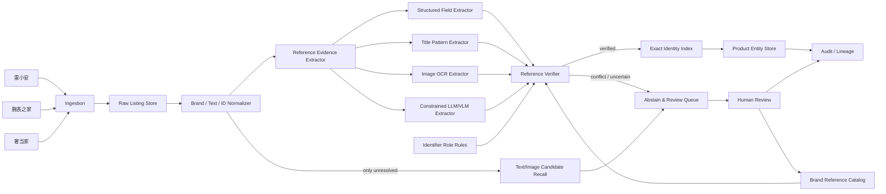

# Shoptera MCP：从“候选 → 强验证 → 审核”迁移到跨源二奢 Reference 身份门禁

> 分析对象：`shoptera-ai/shoptera-mcp`  
> 对应需求：跨源二奢/腕表商品实体匹配系统（雷小安 × 腕表之家 × 奢当家）  
> 身份定义：**同一商品 = 同一制造商 reference number / 型号参考号**  
> 约束：100 万–1000 万级持续增量；字段稀疏；图片可用；**precision 极端优先，允许漏匹配**；可人工标注几百对。

---

## 0. 结论先行

Shoptera MCP 最值得这个需求借鉴的，不是它的 `find_similar_products` / `find_all_duplicates` 模糊标题去重，而是它在补 GTIN 时体现出的工程范式：

1. **候选发现与身份确认分离**：`find_gtin_donors` 只负责找可能的 GTIN；
2. **强制验证**：README 明确要求在保存 GTIN 前调用 `verify_gtin`；
3. **验证后再写入**：`save_results` 把结果先写入 Inbox，可按置信度自动应用或人工复核；
4. **模型号作为可审计字符串证据**：`extract_product_model` 从标题里抽 model/MPN，而不是直接用语义相似度宣布“同一商品”；
5. **检索、验证、提交是独立工具/API**，便于审计、重放、人工介入。

对于本项目，应把这一范式进一步收紧为：

> **Recall 可以宽，Identity Gate 必须窄。任何文本向量、图片向量、LLM 或标题相似度都只能帮助发现候选或补充 reference 证据；自动归并的最终充分条件必须是“品牌作用域内、经过验证的 canonical reference 完全一致，且没有冲突证据”。**

这会把一个看似“实体匹配”问题，转化为更可控的 **Reference Extraction + Reference Verification + Exact Identity Index** 问题。对于“绝对不能误匹配”的业务目标，这是比训练一个 pairwise matcher 更合适的主架构。

---

## 1. 为什么选 Shoptera MCP

`奢侈品文章调研.md` 中对 Shoptera MCP 的推荐点非常贴合当前需求：它直接提供标题中的 model/MPN 抽取、GTIN 校验、相似商品和重复扫描工具，可以形成“标题恢复 reference → 候选召回 → 标识核验”的原型。

同时，`奢侈品调研/a` 现有结果中已经覆盖了 DeepMatcher、DeepBlocker、AnyMatch、AutoBlock、pyJedAI、LangExtract、多模态 EM、选择性预测等项目/论文，但尚未分析 Shoptera MCP，因此本次不存在重复分析。

项目地址：

- https://github.com/shoptera-ai/shoptera-mcp

---

## 2. Shoptera MCP 的公开实现与架构拆解

### 2.1 先说明边界：公开仓库不是后端源码仓库

从仓库树可以看到，公开内容主要是：

```text
shoptera-mcp/
├── README.md
├── server.json
├── pyproject.toml
├── adapters/
│   ├── chatgpt/instructions.md
│   ├── claude-code/mcp-config.json
│   ├── cursor/mcp-config.json
│   ├── vscode/mcp.json
│   └── windsurf/mcp-config.json
└── docs/examples/
    ├── detect-duplicates.md
    ├── find-missing-gtins.md
    └── optimize-titles.md
```

`server.json` 注册的是远程 MCP Server：

```text
https://shoptera.ai/mcp/merchant/
```

README 也给出 REST 入口：

```text
https://shoptera.ai/api/v1/merchant/
```

因此，**仓库公开了产品协议、工具边界、工作流和客户端适配，但没有公开服务端核心算法源码**。下面对“已实现”的描述以公开 API 契约与示例为准；涉及服务端内部数据结构的内容，会明确标记为“推断”或“本项目建议”，不把推断写成事实。

### 2.2 对外是 MCP + REST 双协议，内部能力按工具拆分

Shoptera 暴露 19 个工具，核心可分成四层：

#### A. 数据发现 / 状态层

- `list_my_projects`
- `get_status`
- `get_workflow`
- `diagnose_product`

这一层解决“当前有哪些数据、什么最值得处理”。

#### B. 商品数据读取层

- `get_products`
- `get_priority_products`
- `get_product_examples`
- `get_attribute_template`

这是批处理/Agent 的输入面。

#### C. 候选发现与标识验证层

- `find_similar_products`
- `find_all_duplicates`
- `find_gtin_donors`
- `verify_gtin`
- `extract_product_model`
- `search_taxonomy`
- `find_product_sources`
- `fetch_product_page`
- `web_search`

其中最值得迁移的是 **`find_gtin_donors` → `verify_gtin`** 的职责分离。

#### D. 决策落库 / 人审层

- `save_results`

`save_results` 不要求模型直接覆盖原始字段，而是先 stage 到 merchant Inbox；结果带：

```json
{
  "product_id": "uuid",
  "fields": {"gtin": "..."},
  "confidence": 92,
  "reason": "...",
  "current_value": "..."
}
```

这意味着“值 + 置信度 + 理由 + 原值”一起成为可审核对象。对于 precision-first 的身份系统，这是非常重要的设计。

---

## 3. 最关键的参考：GTIN 工作流，而不是 Duplicate 工作流

### 3.1 Shoptera 的 GTIN 流程

公开示例给出的流程是：

```text
缺 GTIN 商品
  ↓
find_gtin_donors
  ↓  语义候选
候选 GTIN
  ↓
verify_gtin  ← README 要求“Always verify before saving”
  ↓  checksum + database cross-reference
已验证 GTIN
  ↓
save_results
  ↓
Inbox / 审核 / 应用
```

找不到 donor 时，还有另一条路径：

```text
extract_product_model(title, brand)
  ↓
model / MPN
  ↓
web_search
  ↓
外部证据
  ↓
verify
```

本质是：**先恢复身份标识，再验证标识，再允许影响实体层。**

### 3.2 为什么不能直接照搬 Duplicate 工作流

Shoptera 的重复检测公开说明是：

- `find_similar_products`：fuzzy title search；
- `find_all_duplicates`：基于阈值做整库扫描，并用 union-find 形成 duplicate cluster；
- 示例中 title similarity 0.92 后仍让 merchant 在 Inbox 决定 merge/keep。

这套方法适合“普通商品目录去重”，但不适合本需求直接自动归并，原因是：

1. 同系列腕表不同 reference 的标题可能高度相似；
2. 同 reference 的标题反而可能因语言、成色、附件、年份、店铺营销词而很不相似；
3. union-find 具有传递扩散风险：一条错误边可能把两个 cluster 合并；
4. 当前业务明确定义 identity key 就是 reference，没有必要让相似度模型取代确定性身份键。

所以：

> **Shoptera 的 duplicate 模块可借作候选召回和人审工具；Shoptera 的 GTIN“候选 → 强验证 → 保存”才应该成为主干范式。**

---

## 4. 把 GTIN 范式迁移成 Reference Identity Gate

Shoptera 中：

```text
find_gtin_donors → verify_gtin → save_results
```

本项目建议直接对应为：

```text
find_reference_candidates → verify_reference → resolve_identity
```

三个阶段必须物理隔离：

### 4.1 `find_reference_candidates`：只负责召回

输入可以来自：

- 结构化 reference/model 字段；
- 标题正则 / pattern；
- OCR（表盘、表背、保卡、吊牌）；
- 品牌 reference 字典；
- 标题/描述 embedding；
- 图片 embedding；
- LLM/VLM 抽取；
- 外部商品页。

输出必须是“候选 reference + 证据”，而不是 match 决策。

### 4.2 `verify_reference`：身份门禁

验证至少包括：

1. 编号角色是不是 `MANUFACTURER_REFERENCE`；
2. 品牌作用域是否正确；
3. canonicalization 是否唯一、无歧义；
4. 是否能落到品牌 reference catalog；
5. 是否存在冲突 reference；
6. 证据来源是否足够可信；
7. 如果来自 OCR/LLM，是否有第二独立证据确认。

### 4.3 `resolve_identity`：只认验证后的身份键

最终身份键：

```text
identity_key = (canonical_brand_id, canonical_reference)
```

自动归并只发生在：

```text
listing_A.verified_identity_key == listing_B.verified_identity_key
```

任何相似度都不能直接创造这个等式。

---

## 5. 推荐的生产架构



### 核心思想

- **主路径不是 pairwise matching，而是每条 listing 独立解析 identity key。**
- 一旦得到 verified identity key，跨源匹配退化为 O(1) / O(log N) 精确查表。
- 图片、向量、LLM 只服务于“缺 reference 的 listing”，避免对 1000 万条都跑昂贵模型。
- 对不能可靠恢复 reference 的 listing，系统明确 `ABSTAIN`，而不是“猜一个最像的”。

---

## 6. 数据模型：把“证据”作为一等公民

建议至少保留以下表。

### 6.1 `listing_raw`

```sql
CREATE TABLE listing_raw (
  source              TEXT NOT NULL,
  source_listing_id   TEXT NOT NULL,
  fetched_at          TIMESTAMPTZ NOT NULL,
  title               TEXT,
  brand_raw           TEXT,
  reference_raw       TEXT,
  payload_json        JSONB NOT NULL,
  image_urls          JSONB,
  PRIMARY KEY (source, source_listing_id)
);
```

### 6.2 `brand_alias`

```sql
CREATE TABLE brand_alias (
  alias_norm          TEXT PRIMARY KEY,
  canonical_brand_id  BIGINT NOT NULL,
  canonical_name      TEXT NOT NULL,
  trust_level         SMALLINT NOT NULL
);
```

品牌必须先归一，否则不同品牌下相似的型号串可能被误合并。

### 6.3 `reference_catalog`

```sql
CREATE TABLE reference_catalog (
  canonical_brand_id  BIGINT NOT NULL,
  canonical_reference TEXT NOT NULL,
  reference_family    TEXT,
  valid               BOOLEAN NOT NULL DEFAULT TRUE,
  aliases_json        JSONB,
  source               TEXT,
  PRIMARY KEY (canonical_brand_id, canonical_reference)
);
```

它不是可有可无的“字典”，而是 precision-first 的核心约束集。

### 6.4 `reference_evidence`

```sql
CREATE TABLE reference_evidence (
  evidence_id          BIGSERIAL PRIMARY KEY,
  source               TEXT NOT NULL,
  source_listing_id    TEXT NOT NULL,
  raw_value            TEXT NOT NULL,
  normalized_value     TEXT,
  canonical_brand_id   BIGINT,
  canonical_reference  TEXT,
  identifier_role      TEXT NOT NULL,
  extraction_method    TEXT NOT NULL,
  evidence_location    JSONB,
  extractor_version    TEXT NOT NULL,
  confidence           NUMERIC(5,4),
  catalog_verified     BOOLEAN NOT NULL DEFAULT FALSE,
  created_at           TIMESTAMPTZ NOT NULL DEFAULT now()
);
```

`evidence_location` 可以记录：

- 标题中的字符 span；
- 原始字段名；
- 图片 URL + OCR bbox；
- 外部页面 URL；
- 人工 reviewer。

这样每个自动 match 都能回答：“为什么这两个 listing 被认为是同一个 reference？”

### 6.5 `listing_identity`

```sql
CREATE TABLE listing_identity (
  source               TEXT NOT NULL,
  source_listing_id    TEXT NOT NULL,
  canonical_brand_id   BIGINT,
  canonical_reference  TEXT,
  identity_status      TEXT NOT NULL,
  decision_reason      TEXT NOT NULL,
  decision_version     TEXT NOT NULL,
  decided_at           TIMESTAMPTZ NOT NULL,
  PRIMARY KEY (source, source_listing_id)
);
```

`identity_status` 建议固定枚举：

```text
VERIFIED
CONFLICT
UNRESOLVED
REJECTED_IDENTIFIER_ROLE
NEEDS_REVIEW
```

不要只有 `matched=true/false`，因为“未知”和“确定不同”不是一回事。

### 6.6 `product_entity`

```sql
CREATE TABLE product_entity (
  entity_id            BIGSERIAL PRIMARY KEY,
  canonical_brand_id   BIGINT NOT NULL,
  canonical_reference  TEXT NOT NULL,
  UNIQUE (canonical_brand_id, canonical_reference)
);
```

这里不需要模型分数：entity 的自然键就是业务定义本身。

---

## 7. 最容易造成 false positive 的点：编号角色识别

二奢数据里“像型号的字符串”不一定是 reference。必须先做 identifier role classification。

建议枚举：

```text
MANUFACTURER_REFERENCE
PLATFORM_SKU
SELLER_SKU
SERIAL_NUMBER
GTIN_EAN_UPC
ACCESSORY_COMPATIBLE_REFERENCE
ORDER_ID
UNKNOWN
```

### 特别危险：`ACCESSORY_COMPATIBLE_REFERENCE`

示例：

```text
适配 Rolex 116610 / 114060 的第三方表带
```

标题同时出现两个真实 reference，但这条 listing 自身不是这两个腕表之一。如果直接“发现 reference 即归类”，会产生灾难性误匹配。

因此标题抽取器不能只返回字符串，必须返回：

```json
{
  "value": "116610",
  "role": "ACCESSORY_COMPATIBLE_REFERENCE",
  "span": [9, 15],
  "context": "适配 Rolex ... 的第三方表带"
}
```

只有 `MANUFACTURER_REFERENCE` 能进入 Identity Gate。

---

## 8. Canonicalization 必须保守，不能做“字符串洗平”

常见错误做法：

```python
canonical = re.sub(r"[^A-Z0-9]", "", raw.upper())
```

在普通搜索里很好用，在身份系统里可能把两个不同 reference 压成同一字符串。

建议改成 **品牌作用域 + catalog-driven canonicalization**：

```python
def canonicalize_reference(brand_id, raw):
    candidates = generate_safe_variants(raw)
    hits = catalog.lookup(brand_id, candidates)

    if len(hits) == 1:
        return hits[0]

    # 0 个：未知；>1 个：歧义
    return None
```

`generate_safe_variants` 可以产生：

- 大小写统一；
- Unicode 全半角统一；
- 明确可逆的空格规范；
- 品牌已知的分隔符 alias。

但**不能**默认删除所有 `/`、`.`、`-` 后就认为等价。任何不可逆规范化都应该先在 reference catalog 上证明不会造成碰撞。

建议上线前对每个品牌计算：

```text
collision_rate(transform)
```

只允许 `collision_count = 0` 的 transform 用于自动身份确认。

---

## 9. Reference 抽取的四级流水线

### Level A：结构化字段，成本最低

如果来源直接给 `reference/model/ref_no` 字段：

1. 先做字段角色白名单；
2. 解析多个值；
3. brand scope 校验；
4. catalog exact lookup；
5. 通过后标记高可信 evidence。

### Level B：标题规则 / pattern

对腕表 reference，规则系统往往比自由生成 LLM 更适合第一层：

- 品牌特定模式；
- reference 周边触发词：`Ref.`, `Reference`, `型号`, `腕表型号`；
- 排除触发词：`适配`, `兼容`, `for`, `replacement`, `表带`, `盒`, `证书套`；
- 只允许命中 catalog 或非常严格的品牌 pattern。

### Level C：图片 OCR

优先 OCR：

- 表背刻字；
- 保卡；
- 吊牌；
- 标签；
- 机芯/壳号区域（注意 serial 与 reference 的角色区分）。

OCR 输出不能只是最终字符串，要保留：

```text
image_id
bbox
raw_text
normalized_text
ocr_model_version
char_confidences
```

对 `O/0`, `I/1`, `S/5`, `B/8` 等混淆，不做自由纠错；生成多个候选后用品牌 reference catalog 约束。

### Level D：LLM/VLM，只做受限抽取

LLM 的输出 schema 应是：

```json
{
  "references": [
    {
      "raw_span": "...",
      "candidate": "...",
      "role": "MANUFACTURER_REFERENCE|...",
      "evidence_quote": "..."
    }
  ]
}
```

并强制：

- candidate 必须对应输入中的字符 span，或来自允许的 catalog candidate；
- 不允许凭知识“补一个看起来正确的型号”；
- LLM 单独命中永不触发自动归并；
- 必须由 catalog + 第二独立 evidence 再确认。

这相当于把 Shoptera 的 `extract_product_model` 从辅助工具升级为“证据产生器”，而不是裁决器。

---

## 10. Identity Gate：建议直接写成确定性规则

伪代码：

```python
def resolve_listing_identity(listing, evidences, catalog):
    brand = resolve_brand(listing, evidences)
    if brand is None:
        return UNRESOLVED("brand_not_verified")

    refs = []
    conflicts = []

    for e in evidences:
        if e.identifier_role != "MANUFACTURER_REFERENCE":
            continue

        ref = catalog.canonicalize(brand.id, e.raw_value)
        if ref is None:
            continue

        if is_high_trust(e):
            refs.append(ref)
        else:
            conflicts.append((ref, e))

    uniq = set(refs)

    if len(uniq) == 0:
        return UNRESOLVED("no_verified_reference")

    if len(uniq) > 1:
        return CONFLICT("multiple_verified_references")

    ref = next(iter(uniq))

    # 任何高可信冲突都否决
    if has_high_trust_conflict(ref, evidences, brand, catalog):
        return CONFLICT("reference_conflict")

    return VERIFIED((brand.id, ref))
```

然后跨源实体匹配只需：

```python
if A.identity_status == VERIFIED and B.identity_status == VERIFIED:
    match = A.identity_key == B.identity_key
else:
    match = ABSTAIN
```

这满足“允许漏匹配、不允许误匹配”。

---

## 11. 证据等级：不要复用 Shoptera 的普通 90/70 阈值

Shoptera README 的通用置信度分层是：

- 90–100：Verified，可 auto-apply；
- 70–89：Likely，review；
- <70：Weak，人工确认。

对当前 identity 系统不能直接照搬数值阈值。原因是：分类模型的 99 分不等于“误匹配概率 <1%”，更不等于满足业务所需的极端 precision。

建议把 confidence 改成 **证据等级 + 校准概率** 两部分。

### 证据等级建议

#### E3：可单独支持 identity 的强证据

例如：

- 来源官方结构化 reference 字段，并通过品牌 catalog；
- 人工审核确认；
- 已验证的官方产品页 reference。

#### E2：需要独立交叉验证

例如：

- 标题中带明确 `Ref.` 触发词的 reference；
- 高质量保卡/吊牌 OCR；
- 模型抽取后 catalog 唯一命中。

两个独立 E2 证据一致，才可升级为 identity；来源不能同质（例如同一标题跑两个模型不算两个独立证据）。

#### E1：只用于召回

- 图片相似；
- title embedding；
- LLM 常识判断；
- 模糊字符串近邻；
- 同系列/同尺寸/同盘面。

E1 永远不能直接 auto-match。

---

## 12. 千万级规模：为什么 Exact Identity Index 比 Pairwise EM 更省

三源各有百万级数据，若做全 pairwise comparison，成本接近笛卡尔积；即使有 blocking，也要维护候选召回、模型推理、阈值和 cluster 清理。

但业务已经给出唯一身份规则：same reference。

因此建议把核心索引做成：

```text
key = hash(canonical_brand_id + "\x1f" + canonical_reference)
value = entity_id
```

### 增量数据路径

```text
new listing
  ↓
extract + verify reference
  ↓
identity_key
  ↓
KV / unique-index lookup
  ├─ exists → attach listing to existing entity
  └─ absent → create new entity atomically
```

可使用：

- PostgreSQL unique index（早期/中等规模完全够用）；
- FoundationDB / DynamoDB / Cassandra / ScyllaDB 等 KV（更高吞吐）；
- Kafka 以 identity_key hash 分区做流式幂等处理。

1000 万条数据本身并不要求复杂 ANN matcher；真正昂贵的是“缺 reference 的长尾”。因此计算资源应集中在 `UNRESOLVED` 集合。

### 推荐冷热路径

#### Hot Path

结构化字段 / 标题规则能得到 verified reference：

```text
毫秒级抽取 → exact index → 完成
```

#### Cold Path

缺失或冲突：

```text
OCR → catalog retrieval → LLM/VLM → image/text candidate recall → human review
```

只对少数难例走昂贵路径。

---

## 13. 图片应该怎么用：补证，不授权

当前 Spec 明确“有图片可用”。最容易犯的错误是把 CLIP/VLM 图片相似度直接当 match score。

腕表同系列不同 reference 往往：

- 表壳几乎一致；
- 盘面差异很小；
- 尺寸接近；
- 商品图角度和背景比型号差异更显著。

所以图片用途优先级应是：

1. **OCR reference / 型号文字**；
2. 找到“最可能的 reference 候选集合”；
3. 人工审核时显示视觉近邻；
4. 发现文本 reference 与图片表型明显冲突时触发拒绝；
5. 最后才是纯视觉相似度排序。

禁止：

```text
image_similarity > 0.99 ⇒ AUTO_MATCH
```

允许：

```text
image_similarity > 0.99 ⇒ fetch top candidate references for verification
```

---

## 14. 借鉴 Shoptera 设计一组内部 API

为了让数据工程、模型、人工审核解耦，可以把能力做成与 Shoptera 类似的小工具/API。

### 14.1 `extract_reference`

```json
POST /reference/extract
{
  "source": "leidashao",
  "listing_id": "123",
  "title": "...",
  "brand": "Rolex",
  "images": ["..."]
}
```

输出：

```json
{
  "candidates": [
    {
      "raw": "126610LN",
      "role": "MANUFACTURER_REFERENCE",
      "method": "title_pattern",
      "span": [18, 26]
    }
  ]
}
```

### 14.2 `verify_reference`

```json
POST /reference/verify
{
  "brand": "Rolex",
  "candidate": "126610LN",
  "evidence_ids": [101, 105]
}
```

输出：

```json
{
  "status": "VERIFIED",
  "canonical_brand_id": 17,
  "canonical_reference": "126610LN",
  "reason_codes": [
    "CATALOG_EXACT_HIT",
    "TITLE_EXPLICIT_REF",
    "OCR_CORROBORATED"
  ]
}
```

### 14.3 `resolve_identity`

```json
POST /identity/resolve
{
  "source": "watchhome",
  "listing_id": "abc"
}
```

输出必须允许拒识：

```json
{
  "status": "UNRESOLVED",
  "reason": "NO_VERIFIED_REFERENCE"
}
```

### 14.4 `find_reference_candidates`

这是 Shoptera `find_gtin_donors` 的对应物，只返回候选，不做 match：

```json
{
  "candidates": [
    {
      "reference": "126610LN",
      "signals": {
        "title": 0.91,
        "image": 0.97
      }
    },
    {
      "reference": "116610LN",
      "signals": {
        "title": 0.89,
        "image": 0.98
      }
    }
  ]
}
```

这正是“视觉最相似的两个 reference 可能不同”的典型情况，因此必须回到 `verify_reference`。

### 14.5 `submit_review` / `save_decision`

借鉴 Shoptera Inbox：

- 自动系统只提交 evidence bundle；
- reviewer 看到原图、OCR bbox、标题 span、catalog 候选、冲突；
- 人工结果回流 `reference_catalog` / brand pattern / hard-negative set；
- 所有决定带 `decision_version`，模型升级后可重放。

---

## 15. 人工标注的几百对应该怎么花

不要随机抽几百个普通正负样本训练一个 matcher。应该集中在最容易造成 false positive 的边界。

建议黄金集分层：

1. **同品牌、同系列、相邻 reference，外观极像**；
2. 标题含“兼容/适配其他型号”的配件；
3. 平台 SKU 长得像 reference；
4. 同 reference 不同格式（空格/横杠/大小写）；
5. OCR 的 `O/0`, `I/1`, `5/S`, `8/B` 混淆；
6. 品牌缺失/品牌别名；
7. 标题出现多个 reference；
8. 套装/盒证/表带单卖；
9. 同一 listing 文本 reference 与图片 OCR 冲突；
10. 长尾品牌和新增 reference。

黄金集的主要用途不是“让模型更聪明”，而是：

- 验证 canonicalization 是否会碰撞；
- 找出 identifier role 规则漏洞；
- 校准哪些 evidence combination 可以自动放行；
- 构造长期 regression suite。

---

## 16. 评估指标：不要把 F1 当主指标

本项目的主指标应该围绕 false positive。

### 必看

```text
Auto-match Precision
False Positives per 1M auto decisions
Auto-match Coverage
Abstain Rate
Conflict Detection Rate
Reference Extraction Precision
Reference Verification Precision
```

建议发布门槛使用：

```text
precision-first + coverage-second
```

例如模型 A coverage 80%、precision 99.8%，模型 B coverage 35%、precision 在高风险黄金集上无已知 FP，那么在当前需求约束下优先 B，再逐步扩大 verified evidence 覆盖，而不是先追 recall。

同时按品牌、来源、抽取方式分别看 precision，不能只看全局平均。

---

## 17. 对 Shoptera 的“照搬 / 修改 / 禁用”清单

### 可以直接借鉴

1. 候选发现和验证分离；
2. `extract_product_model` 这类标识抽取工具化；
3. `find_gtin_donors → verify_gtin` 的 mandatory verify 思路；
4. `save_results` 的 staging / Inbox 模式；
5. 保存 `confidence + reason + current_value`；
6. MCP/REST 双接口，把能力拆成小而可编排的服务；
7. 数据读取支持字段裁剪、分页、按缺失字段筛选，方便只处理 unresolved 数据。

### 必须修改

1. GTIN checksum 对 reference 不存在，需要换成品牌 reference catalog 验证；
2. 通用 90/70 confidence tier 不够，需要 evidence policy；
3. duplicate fuzzy-title 必须降级为 candidate recall；
4. union-find 不能作为 identity 主聚类算法；
5. `extract_product_model` 的输出必须带 identifier role 和 evidence span；
6. 图片/语义检索结果不得自动 merge。

### 建议明确禁用

```text
模糊标题相似度达到某阈值 => 自动归并
图片相似度达到某阈值 => 自动归并
LLM 返回“same product” => 自动归并
一个弱 evidence 的 reference 猜测 => 自动归并
跨品牌只因 reference 字符串相同 => 自动归并
```

---

## 18. 可直接落地的 MVP 顺序

### P0：先把确定性主干跑通

- source listing 原始数据落库；
- brand alias 归一；
- 结构化 reference 字段映射；
- conservative canonicalization；
- `(brand_id, canonical_reference)` unique entity index；
- `VERIFIED / CONFLICT / UNRESOLVED` 三态；
- audit log。

这一步就可以解决大量“reference 已明确”的数据，而且 precision 最容易控制。

### P1：标题 reference 抽取

- 品牌特定 pattern；
- identifier role；
- accessory/compatible exclusion；
- catalog exact verification；
- hard-negative regression。

### P2：图片 OCR

- 保卡/吊牌/表背优先；
- 字符级置信度；
- OCR 候选只通过 catalog 收口；
- 文本/OCR 冲突一律 abstain。

### P3：只处理 unresolved 的智能召回

- title embedding；
- image embedding；
- multimodal candidate retrieval；
- LLM/VLM 受限抽取；
- human review。

这样模型越复杂，所在路径越靠后，错误越不容易污染主实体库。

---

## 19. 一个更贴合当前 Spec 的最终判定表

| 场景 | 自动归并？ | 原因 |
|---|---:|---|
| 两边均有 verified brand + canonical reference，完全一致 | **是** | 满足业务 identity 定义 |
| reference 一致，但其中一边只来自低置信 LLM 猜测 | 否 | 证据不足 |
| 图片极像、标题极像，但 reference 不同 | **否** | 明确不同商品 |
| 图片极像，一边没有 reference | 否 | 只能作为候选，不能证明 identity |
| 标题抽到 reference，但语境是“适配/兼容” | **否** | identifier role 错 |
| reference 文本相同但品牌不同 | 否 | 必须 brand scoped |
| 标题 reference 与保卡 OCR reference 冲突 | **否 / review** | 高风险冲突 |
| canonicalization 后唯一命中 catalog，且有可信原始证据 | 可按 evidence policy 放行 | 可审计确定性证据 |
| 两条记录都无 reference，但模型 same=0.999 | **否** | 业务定义不允许相似度代替 reference |

---

## 20. 最终建议

如果按当前 Spec 的定义实现，我不建议把项目主类命名为 `EntityMatcher`，更建议把核心域模型定义为：

```text
ReferenceResolver
ReferenceVerifier
IdentityIndex
EvidenceStore
ReviewQueue
```

“Entity Matching”只是最终表现，核心其实是**身份标识恢复与验证**。

Shoptera MCP 给出的最重要工程启发可以浓缩成一句话：

> **不要让发现候选的算法拥有确认身份的权限。**

在 Shoptera 中，语义 donor 不能跳过 `verify_gtin`；在当前二奢系统里，文本/图片/LLM 候选同样不能跳过 `verify_reference`。把这个权限边界做成服务边界、数据表状态和审计日志，才能在 1000 万级增量数据上长期保持 precision-first，而不是依赖某个模型阈值“目前看起来很准”。

---

## 参考

### 本项目需求

- Notion：调研计划 Spec：跨源二奢/腕表商品实体匹配系统（雷小安 × 腕表之家 × 奢当家）

### Shoptera MCP

- Repository: https://github.com/shoptera-ai/shoptera-mcp
- README: https://github.com/shoptera-ai/shoptera-mcp/blob/main/README.md
- MCP server manifest: https://github.com/shoptera-ai/shoptera-mcp/blob/main/server.json
- Duplicate example: https://github.com/shoptera-ai/shoptera-mcp/blob/main/docs/examples/detect-duplicates.md
- Missing GTIN example: https://github.com/shoptera-ai/shoptera-mcp/blob/main/docs/examples/find-missing-gtins.md
- ChatGPT adapter: https://github.com/shoptera-ai/shoptera-mcp/blob/main/adapters/chatgpt/instructions.md
