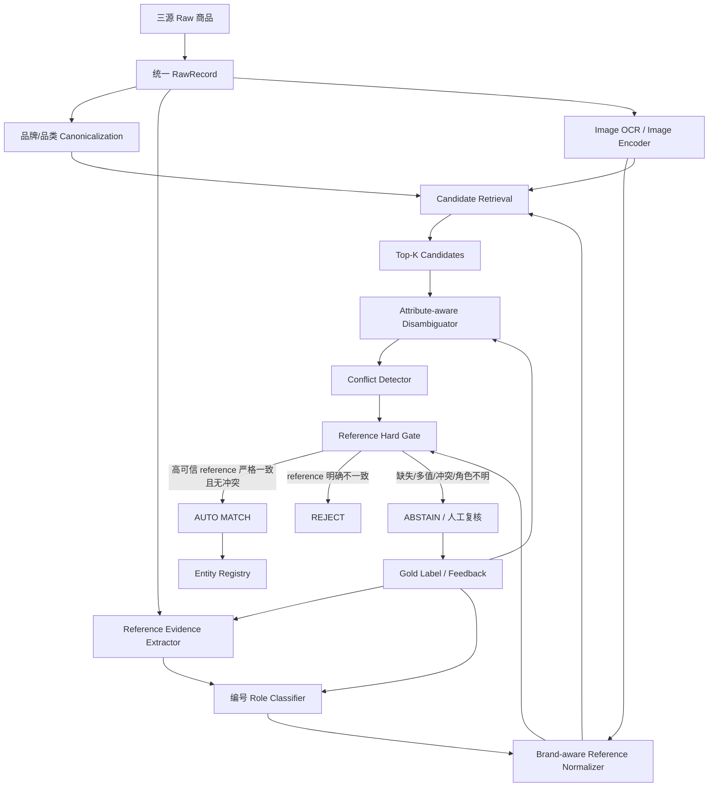

# Ameli：Enhancing Multimodal Entity Linking with Fine-Grained Attributes

## 0. 调研对象与结论先行

- 论文：**Ameli: Enhancing Multimodal Entity Linking with Fine-Grained Attributes**（EACL 2024）
- 论文地址：https://aclanthology.org/2024.eacl-long.172/
- 官方实现：https://github.com/PLUM-Lab/Ameli （论文中原地址 `VT-NLP/Ameli` 已重定向到该仓库）
- 本次对应 Spec：**跨源二奢/腕表商品实体匹配系统（雷小安 × 腕表之家 × 奢当家）**

**核心结论：Ameli 最值得借鉴的不是“多模态打一个总分”，而是它把大规模实体链接拆成“候选召回 → 细粒度属性抽取 → 候选消歧”的分层架构。**

但本需求与论文有一个决定性差异：Spec 已明确“同一个商品 = 同一 reference number / 型号”，且要求 **precision 极端优先、绝对不能误匹配**。因此不能直接照搬 Ameli 的软融合分类器。落地时应把 `reference` 从“高权重特征”升级为 **自动合并的硬门禁（hard gate）**：

> 文本模型、图片模型、属性模型只负责“找候选、补证据、发现冲突、排序人工复核”；自动 MATCH 必须由高可信、角色正确、规范化后的 reference 严格一致来收口。

这会把 Ameli 从一个“选最像实体”的模型，改造成一个适合二奢场景的 **Evidence-first、Reference-gated、可拒识实体解析系统**。

---

## 1. 为什么选 Ameli

`奢侈品文章调研.md` 中对该工作的推荐理由是：

> 把多模态商品实体链接拆成 Candidate Retrieval 与 Entity Disambiguation，并显式抽取 Model Number 等细粒度属性后过滤候选；很适合百万级数据先召回小候选集，再用 reference/属性冲突做硬否决，图片只承担辅助消歧。

它与本 Spec 的重合点很高：

1. **对象是商品实体**，不是普通百科实体；
2. 输入同时有文本、图片、结构化属性；
3. 明确研究 `Model Number` 等细粒度商品属性；
4. 采用两阶段架构，适合把千万级搜索空间压缩到小候选集；
5. 论文实验证明属性信息对消歧提升明显，说明“型号/参考号”不应被埋没在通用语义向量里；
6. 官方代码把 retrieval、attribute、disambiguation 分成独立模块，便于拆开复用。

我已经排除 b 目录中此前分析过的 `DeepBlocker`、`TransClean`、`parts-distributor-sku-classifier`，本次选择 Ameli，不重复已有分析。

---

## 2. Ameli 原始问题定义

Ameli 把任务定义成 **Attribute-aware Multimodal Entity Linking**：

- 一个 mention 由文本段落与若干图片描述；
- 一个候选实体来自多模态 KB，包含文本描述、图片和结构化 attributes；
- 系统从 KB 中找出 mention 对应的唯一目标实体。

论文构造的数据规模为：

- 16,735 个 mentions；
- 30,472 张 mention images；
- 34,690 个 KB entities；
- 177,873 张 entity images；
- 798,216 个 attributes。

这比直接做 pairwise 二分类更接近我们实际要面对的形态：一个新抓取商品进入系统后，本质上要从一个巨大的历史实体空间里确定“它属于哪个 reference 实体”，而不是对任意两条记录做笛卡尔比较。

---

## 3. Ameli 的原始技术架构

可以把原系统概括为：

```text
Review / Mention
  ├─ text
  ├─ images
  └─ extracted attributes
          │
          ▼
┌─────────────────────────────┐
│ 1. Candidate Retrieval      │
│ text retrieval + image      │
│ retrieval + score fusion    │
└──────────────┬──────────────┘
               │ Top-K
               ▼
┌─────────────────────────────┐
│ 2. Entity Disambiguation    │
│ text/NLI + attributes       │
│ + CLIP image + retrieval    │
│ score                       │
└──────────────┬──────────────┘
               │
               ▼
          target entity
```

官方仓库的目录也直接反映了这套分层：

```text
Ameli/
├── candidate_retrieval.py
├── retrieve_train.py
├── retrieval/
├── attribute/
│   ├── attribution_extraction.py
│   ├── fuse_attribute_for_disambiguation.py
│   └── extractor/
├── entity_disambiguation_v2.py
└── disambiguation/
    ├── train_nli.py
    ├── train_biencoder.py
    ├── train_verify.py
    └── model/
```

`candidate_retrieval.py` 暴露了 `top_k`、文本 bi-encoder、cross-encoder、CLIP image encoder、image fusion、是否只在 category 内检索等配置；默认 `top_k=1000`。`entity_disambiguation_v2.py` 则独立控制候选数、属性数、是否使用 text/image/attribute、DeBERTa NLI 模型、CLIP 模型、融合权重、训练和超参搜索等。

这说明 Ameli 工程上并不是一个不可拆的“大模型”，而是多个可替换模块组成的 pipeline，这一点很适合迁移。

---

## 4. Candidate Retrieval：先把 O(N²) 问题变成 Top-K

### 4.1 文本召回

论文采用 Sentence-BERT 一类的双塔编码器，把 mention 文本和 KB entity 文本分别编码成向量，通过 cosine similarity 做近邻召回。

优点：

- entity 侧 embedding 可离线预计算；
- 新商品只需编码一次，再查 ANN；
- 非常适合百万/千万级数据。

### 4.2 图片召回

图片侧使用 CLIP 表征 review/mention image 与 entity image，同样用向量相似度召回。

对商品场景，图像尤其能补文本缺失，但论文也没有让图片单独决定最终实体，而是作为候选召回和消歧的一路信号。

### 4.3 融合召回

论文把文本、图片 retrieval score 做加权融合。可以抽象为：

```text
s_retrieval = λ * s_text + (1 - λ) * s_image
```

权重通过开发集调优。

论文中 fine-tuned 多模态召回相较预训练模型有明显提升，最终 Top-100 recall 可以做到约 95%，说明两阶段方案的关键是：**第一阶段不追求最终判定，只要把真实体尽量留在一个足够小的候选集合里。**

### 4.4 对 Spec 的迁移

我们的候选召回不应该只用语义向量，而应把业务硬条件放到最前面：

```text
brand blocking
  → product_type blocking
  → reference candidate inverted-index
  → title/reference char-ngram retrieval
  → text embedding retrieval
  → optional image retrieval
  → union + dedup
  → Top-K
```

其中：

- `brand_id` 是一级 blocking；
- 已抽到 reference 时，reference 候选倒排应比语义向量优先；
- reference 缺失或不确定时，才依赖 title embedding / image embedding 扩召回；
- 图片不能跨品牌自由召回，否则外观极像的同系列不同 reference 会引入大量危险候选。

在 100 万～1000 万记录量上，目标不是生成所有 record pair，而是每条新记录只产生几十个候选，复杂度从近似 `O(N²)` 降到 `O(N log N + NK)`，且 K 很小。

---

## 5. 细粒度 Attribute Extraction：Ameli 最有价值的部分

Ameli 的关键创新不是“再加一个图像编码器”，而是把实体属性显式拉出来参与判断。

论文从 mention 文本和图片中抽取：Brand、Color、Model Number 等属性。实现思路包括：

1. 文本中的属性抽取；
2. 图片 OCR 后再匹配知识库中的属性值；
3. 对常见属性使用大模型抽取；
4. 对长尾属性用较轻量生成模型做 zero-shot extraction；
5. 最终把抽到的 mention 属性与候选实体结构化属性对齐。

论文结果里，加入 System Attributes 后的 disambiguation F1 明显优于不使用属性；使用 Gold Attributes 后还能进一步大幅提升。这说明系统的瓶颈很大程度上不是“匹配模型不够大”，而是 **关键属性能否被正确抽出来并结构化**。

这与本 Spec 完全一致：reference 有时在独立字段、有时埋标题、有时可能只出现在图片/保卡/吊牌/表背。

### 5.1 我们应该建立 Reference Evidence，而不是只有一个 reference 字段

不建议数据表里简单保存：

```json
{"reference": "126610LN"}
```

建议保留完整证据链：

```json
{
  "record_id": "lxa:123",
  "reference_evidences": [
    {
      "raw": "126610LN",
      "canonical": "126610LN",
      "source": "STRUCTURED_FIELD",
      "role": "PRODUCT_REFERENCE",
      "confidence": 0.999,
      "extractor_version": "ref-field-v2"
    },
    {
      "raw": "126610 LN",
      "canonical": "126610LN",
      "source": "TITLE",
      "role": "PRODUCT_REFERENCE",
      "confidence": 0.995,
      "extractor_version": "title-ref-v5"
    }
  ]
}
```

这样做的好处是：

- 同一记录出现多个相互冲突 reference 时可以拒识；
- 可以区分结构化字段、标题、描述、OCR 的可信度；
- 可以回溯“为什么匹配”；
- extractor 升级后可重跑并比较版本；
- 后续人工复核可直接看到原始证据。

---

## 6. Reference 规范化：必须是品牌感知的，不是粗暴删字符

如果“同商品 = 同 reference”，规范化规则本身就是核心业务逻辑。

推荐流程：

```text
raw ref
 → Unicode NFKC
 → uppercase
 → trim / normalize whitespace
 → normalize full-width chars
 → brand-specific separator rule
 → brand-specific prefix/suffix rule
 → dictionary validation
 → canonical ref
```

不能简单地全局执行 `remove('-', '.', '/', ' ')` 后比较，因为不同品牌可能把后缀、材质码、表带码、颜色码编码在 reference 中；错误归一化可能把两个真实不同 variant 合并。

建议每个品牌维护：

```yaml
brand: ROLEX
patterns:
  - '[0-9]{6}[A-Z]{0,4}'
canonicalization:
  upper: true
  remove_spaces: true
  separator_policy: conservative
known_prefixes: []
known_suffixes:
  - LN
  - LV
```

关键原则：**只能做被验证为等价的 normalization，不能做“为了提高 recall”的猜测性 normalization。**

例如 `126610LN` 与 `126610LV` 视觉极相似、文本也高度相似，但在本需求定义下必须是不同实体。

---

## 7. 编号角色识别：避免把“看起来像型号”的字符串都当 reference

二奢/电商标题里会同时出现多种编号：

- 品牌 reference / model number；
- 平台商品 ID；
- 商家自有 SKU；
- 库存号；
- 序列号；
- 配件的兼容型号；
- 保卡/盒证上的其他编号。

因此抽取器输出必须包含 `role`：

```text
PRODUCT_REFERENCE
PLATFORM_SKU
SELLER_SKU
SERIAL_NUMBER
COMPATIBLE_REFERENCE
ACCESSORY_REFERENCE
UNKNOWN_CODE
```

**只有 `PRODUCT_REFERENCE` 能进入自动匹配硬门禁。**

这也是 Ameli “attribute-aware” 思想需要进一步业务化的地方：不是只识别字符串，而是识别它在当前商品上下文中的语义角色。

---

## 8. Entity Disambiguation：Ameli 如何把属性、文本、图片融合

### 8.1 文本 / NLI 分支

Ameli 的 disambiguation 代码默认使用 `cross-encoder/nli-deberta-base` 一类 NLI 模型。

核心思路不是只比较两段 title embedding，而是把 mention 文本与候选实体描述、候选属性值构造成细粒度对齐问题。可以理解为：

```text
mention text  ⟷ candidate description
mention text  ⟷ candidate Brand
mention text  ⟷ candidate Model Number
mention text  ⟷ candidate Color
...
```

多个属性级 representation 再汇总得到文本侧判别分数。

这种设计特别适合“标题里同时有系列、尺寸、材质、型号”的商品，因为模型能回答“这条文本是否支持候选实体的某个具体属性”，而不是只判断整体语义像不像。

### 8.2 图片分支

图片侧基于 CLIP。论文倾向先从多张图片中选出最相关的 mention/entity 图片对，再用可学习映射层调整 CLIP embedding，并使用对比学习训练。

对我们的腕表场景，可以把图片拆成不同证据类型：

- 表盘正面：品牌、系列、表圈/盘面外观；
- 表背：刻字、reference、serial 附近区域；
- 保卡：reference 文本；
- 吊牌：reference 文本；
- 盒证/附件：辅助判断，但需要防止兼容型号污染。

图片更适合两种用途：

1. **补 reference 证据**：OCR/视觉文字识别；
2. **冲突否决**：文本声称某 reference，但图片强烈显示另一 variant 时转人工。

不建议让“图片看起来很像”直接产生 MATCH。

### 8.3 Retrieval score 进入最终 disambiguation

Ameli 最终不仅看文本和图像判别分，还保留第一阶段 retrieval score，类似：

```text
s_final = λ1 * s_text
        + λ2 * s_image
        + (1 - λ1 - λ2) * s_retrieval
```

这在通用 Entity Linking 中合理，但本 Spec 不能把这个 `s_final` 直接作为自动合并阈值，因为：

- 同系列相邻 reference 会同时拥有极高文本/图片相似度；
- score 是概率意义上的近似，不是业务定义；
- 极端 precision 场景里，一次 false positive 的业务损失远高于多次 abstain。

所以我们的最终架构应改为：

```text
soft scores = candidate ranking / review priority / veto hints
hard reference gate = automatic match authority
```

---

## 9. 推荐的落地架构：Reference-Gated Ameli



### 9.1 服务拆分

建议生产环境拆成 6 个逻辑服务：

#### A. Ingestion Service

统一雷小安、腕表之家、奢当家字段：

```json
{
  "source": "lxa",
  "source_item_id": "...",
  "title": "...",
  "description": "...",
  "brand_raw": "...",
  "reference_raw": "...",
  "structured_attrs": {},
  "images": [],
  "crawl_time": "...",
  "content_hash": "..."
}
```

要求 upsert 幂等，`source + source_item_id` 唯一。

#### B. Attribute / Reference Extraction Service

优先级：

```text
结构化 reference 字段
  > 标题规则/词典抽取
  > 描述抽取
  > 图片 OCR
  > 受限候选 LLM/小模型抽取
```

LLM 如果使用，建议只输出受 schema 约束的候选，不允许自由“猜型号”。

#### C. Candidate Retrieval Service

索引至少包含：

- `brand_id`；
- `product_type`；
- `reference_canonical`；
- `reference_ngram`；
- title embedding；
- image embedding（可选）；
- collection / series / diameter / material 等辅助属性。

#### D. Disambiguation / Conflict Service

对 Top-K 运行较贵的模型：

- cross-encoder/NLI；
- attribute agreement；
- image CLIP；
- OCR evidence consistency；
- reference role consistency。

输出不是二分类，而是：

```json
{
  "candidate_entity_id": "...",
  "text_score": 0.97,
  "image_score": 0.95,
  "attribute_agreement": 0.91,
  "reference_equality": true,
  "reference_conflict": false,
  "veto_reasons": [],
  "review_score": 0.98
}
```

#### E. Decision Gate

这是整个系统最关键、最应该保持简单的模块。

#### F. Entity Registry / Audit Ledger

实体主键建议不是随机 pair 聚类结果，而是尽量建立稳定业务键：

```text
entity_key = canonical_brand_id + ':' + canonical_reference
```

例如：

```text
ROLEX:126610LN
```

所有跨源 listing 只是在这个实体下挂载 source records。

---

## 10. 自动 MATCH 的硬规则

推荐第一版决策逻辑：

```python
def decide_match(a, b):
    # 1. 品牌必须被可信地规范到同一实体
    if a.brand_id is None or b.brand_id is None:
        return "ABSTAIN", "brand_missing"
    if a.brand_id != b.brand_id:
        return "REJECT", "brand_mismatch"

    # 2. 两边都必须拿到唯一、高可信、角色正确的商品 reference
    ra = best_product_reference(a)
    rb = best_product_reference(b)
    if ra is None or rb is None:
        return "ABSTAIN", "reference_missing_or_low_confidence"

    if ra.role != "PRODUCT_REFERENCE" or rb.role != "PRODUCT_REFERENCE":
        return "ABSTAIN", "reference_role_uncertain"

    # 3. canonical reference 必须严格相等
    if ra.canonical != rb.canonical:
        return "REJECT", "reference_mismatch"

    # 4. 单条记录内部若存在第二个高可信冲突 reference，不能自动合并
    if has_high_confidence_reference_conflict(a):
        return "ABSTAIN", "left_reference_conflict"
    if has_high_confidence_reference_conflict(b):
        return "ABSTAIN", "right_reference_conflict"

    # 5. 品牌特定的 suffix/variant 语义不确定时拒识
    if is_variant_suffix_ambiguous(ra) or is_variant_suffix_ambiguous(rb):
        return "ABSTAIN", "variant_ambiguity"

    # 6. 图片/OCR/关键属性只拥有 veto 权，不拥有越过 reference 的放行权
    if hard_visual_or_attribute_conflict(a, b):
        return "ABSTAIN", "multimodal_conflict"

    return "MATCH", "exact_high_confidence_reference"
```

### 为什么不是简单 `reference == reference`

因为真正危险的不是字符串比较本身，而是比较之前的四件事：

1. 抽到的到底是不是 reference；
2. reference 是否属于当前售卖主体，而非兼容配件；
3. normalization 是否把两个 variant 错合并；
4. 一条记录是否同时存在互相冲突的证据。

所以“reference exact match”必须和 **evidence provenance + role + conflict detection** 一起实现。

---

## 11. 数据模型建议

### 11.1 `raw_record`

```sql
CREATE TABLE raw_record (
    id BIGSERIAL PRIMARY KEY,
    source VARCHAR(32) NOT NULL,
    source_item_id VARCHAR(128) NOT NULL,
    title TEXT,
    description TEXT,
    brand_raw TEXT,
    reference_raw TEXT,
    payload JSONB NOT NULL,
    content_hash VARCHAR(64),
    crawled_at TIMESTAMPTZ NOT NULL,
    updated_at TIMESTAMPTZ NOT NULL,
    UNIQUE(source, source_item_id)
);
```

### 11.2 `reference_evidence`

```sql
CREATE TABLE reference_evidence (
    id BIGSERIAL PRIMARY KEY,
    record_id BIGINT NOT NULL,
    evidence_source VARCHAR(32) NOT NULL,
    image_id BIGINT,
    bbox JSONB,
    raw_value TEXT NOT NULL,
    canonical_value TEXT,
    role VARCHAR(32) NOT NULL,
    confidence DOUBLE PRECISION NOT NULL,
    extractor_version VARCHAR(64) NOT NULL,
    created_at TIMESTAMPTZ NOT NULL
);

CREATE INDEX idx_ref_canonical
ON reference_evidence(canonical_value);
```

### 11.3 `product_entity`

```sql
CREATE TABLE product_entity (
    id BIGSERIAL PRIMARY KEY,
    brand_id BIGINT NOT NULL,
    reference_canonical VARCHAR(128) NOT NULL,
    status VARCHAR(16) NOT NULL DEFAULT 'ACTIVE',
    created_at TIMESTAMPTZ NOT NULL,
    UNIQUE(brand_id, reference_canonical)
);
```

### 11.4 `entity_listing`

```sql
CREATE TABLE entity_listing (
    entity_id BIGINT NOT NULL,
    record_id BIGINT NOT NULL UNIQUE,
    decision_id BIGINT NOT NULL,
    PRIMARY KEY(entity_id, record_id)
);
```

### 11.5 `match_decision`

```sql
CREATE TABLE match_decision (
    id BIGSERIAL PRIMARY KEY,
    left_record_id BIGINT NOT NULL,
    right_record_id BIGINT,
    entity_id BIGINT,
    decision VARCHAR(16) NOT NULL,
    reason_code VARCHAR(64) NOT NULL,
    rule_version VARCHAR(32) NOT NULL,
    model_version VARCHAR(64),
    scores JSONB,
    evidence_snapshot JSONB NOT NULL,
    created_at TIMESTAMPTZ NOT NULL
);
```

重点是保存 `rule_version` 和 `evidence_snapshot`，因为将来出现错匹配时必须能复盘“当时是哪一版抽取器、哪条证据、哪条规则放行”。

---

## 12. 千万级规模下的索引与计算方案

### 12.1 不要全量 pairwise

假设 1000 万条记录，任意两两比较是不可接受的。应把核心索引放在实体级：

```text
(brand_id, reference_canonical) → entity_id
```

对于已经高可信抽出 reference 的大多数记录，匹配几乎退化成一次 hash/B-tree lookup。

只有 reference 缺失、低置信或冲突的少数记录才进入 Ameli 风格的 Candidate Retrieval。

### 12.2 推荐存储组合

第一版不需要过度复杂：

- PostgreSQL：事实表、证据、实体 registry、决策审计；
- OpenSearch/Elasticsearch：title/reference n-gram、结构化属性倒排；
- FAISS / Milvus / pgvector：文本/图片向量候选召回，可按规模选择；
- Object Storage：原图与 OCR 中间结果；
- Kafka/Pulsar：只有在抓取增量和下游计算吞吐确实需要解耦时再上。

对于 100 万～1000 万级、每天增量并非极端的场景，**先做 PostgreSQL + OpenSearch/pgvector 就足够形成可生产 MVP**，不必一开始搭过重的实时流式体系。

### 12.3 增量处理

每次新 listing：

```text
upsert raw
 → detect content hash changed?
 → extract evidence
 → canonicalize
 → exact entity lookup
 → if safe: attach
 → else: retrieve Top-K
 → conflict/disambiguation
 → match/reject/abstain
 → persist audit
```

如果内容 hash 未变化，则不重复跑 OCR/embedding。

---

## 13. 图片在本系统里的正确地位

Spec 明确“有图片可用”，但图片很容易被误用。

腕表同系列不同 reference 可能只有细小配色、尺寸或材质差异；反过来同 reference 的二手商品因光线、角度、成色差异也会视觉距离很大。所以图片不适合作为主键。

推荐权限模型：

| 图像能力 | 可以做 | 不可以做 |
|---|---|---|
| CLIP/视觉 embedding | 候选召回、复核排序 | 单独决定 MATCH |
| OCR | 提供 reference evidence | 无上下文地把所有编号当 reference |
| 细粒度分类 | 发现表圈/盘色/材质冲突 | 覆盖明确 reference mismatch |
| 图像相似度 | 辅助人工 | 因“很像”跨 reference 合并 |

一句话：**图像可以 veto，也可以补证据，但不能越权。**

---

## 14. 少量黄金标注应该怎么花

Spec 允许人工标注几百对。不要随机抽几百对，因为随机样本大多太容易，无法提高极端 precision。

应该主动构造 hard cases：

1. 同品牌、同系列、相邻 reference；
2. 只差一个后缀的 variant；
3. 标题含兼容型号的表带/配件；
4. 平台 SKU 很像品牌 reference；
5. reference 在标题中被空格、`.`、`-`、`/` 拆开；
6. OCR 少一个字符/把 `0/O`、`1/I`、`5/S` 混淆；
7. 标题与结构化 reference 冲突；
8. 图片保卡与标题冲突；
9. 同 reference 不同来源写法；
10. 新品牌/新系列的分布外样本。

标注的目标也不应该只是一列 `same/not_same`，而建议带原因：

```json
{
  "pair_label": "NOT_MATCH",
  "left_reference": "126610LN",
  "right_reference": "126610LV",
  "reference_role_left": "PRODUCT_REFERENCE",
  "reference_role_right": "PRODUCT_REFERENCE",
  "hard_negative_type": "VARIANT_SUFFIX",
  "notes": "same series, different bezel variant"
}
```

这些标签能同时训练：

- reference extractor；
- code role classifier；
- conflict detector；
- candidate reranker。

---

## 15. 评测指标：不要再以 F1 为主目标

Ameli 论文用 F1 评估通用 entity linking 是合理的，但本 Spec 的损失函数明显不对称。

生产验收应至少看：

### 核心指标

```text
AutoMatch Precision
False Match Count
AutoMatch Coverage
Abstain Rate
Reference Extraction Precision
Reference Role Precision
Conflict Detection Recall on known hard cases
```

### 必须单列的切片

- 品牌；
- 来源对（雷小安×腕表之家、雷小安×奢当家、腕表之家×奢当家）；
- 是否有结构化 reference；
- 是否依赖 OCR；
- 新/旧 reference；
- 同系列 hard negatives；
- 配件/主体商品。

由于“绝不能误匹配”在统计上无法靠几百条测试集证明为绝对 0 风险，工程上应该采用 **极保守阈值 + abstain + 持续审计**，并用置信区间监测已接受集合的错误率，而不是声称模型可以数学上保证 100% precision。

---

## 16. 推荐的三阶段上线方案

### Phase 1：规则主导 MVP

目标：最快拿到可验证的超高 precision 自动匹配。

实现：

1. 品牌 canonicalization；
2. reference evidence 表；
3. 结构化字段 + title regex/字典抽取；
4. brand-aware normalization；
5. code role 基础规则；
6. `(brand_id, reference_canonical)` exact entity registry；
7. 冲突即 abstain；
8. 全量 audit log。

此阶段甚至可以不训练大模型。

### Phase 2：Ameli 式 Candidate Retrieval + OCR

针对 Phase 1 漏掉的记录：

1. OCR 表背/保卡/吊牌；
2. title SBERT / E5 / BGE embedding；
3. CLIP/SigLIP image embedding；
4. OpenSearch + ANN 多路召回；
5. Top-K 候选池；
6. 人工复核工作台。

这一阶段主要提升 recall / coverage，不改变自动 MATCH 的硬门禁。

### Phase 3：Attribute-aware Disambiguation

有了几百个 hard labels 后再训练：

1. reference role classifier；
2. attribute cross-encoder/NLI；
3. image conflict classifier；
4. review priority score；
5. selective/abstention calibration。

模型主要负责把 `ABSTAIN` 中的一部分变成“证据更清晰的可自动处理项”，而不是放松 reference 定义。

---

## 17. 与 Ameli 原方案相比，必须做的 7 个改造

| Ameli | 本 Spec 应改造为 |
|---|---|
| 从 KB 里选最可能实体 | 先确定 reference evidence，再决定是否可自动归并 |
| attribute 是 soft feature | reference 是 hard business key |
| 文本/图片/召回分数加权融合 | soft score 只能排序，不能覆盖 reference mismatch |
| 输出一个 target entity | 输出 MATCH / REJECT / ABSTAIN + reason |
| 重点优化整体 F1 | 优化 accepted-set precision 与 false-match count |
| 多模态提升最终分类 | 多模态优先做 evidence extraction / conflict veto |
| candidate error 会级联 | exact reference registry + abstention 阻断错误传播 |

---

## 18. 一个可以直接实现的 Matching API

### 请求

```json
POST /v1/match/resolve
{
  "source": "lxa",
  "source_item_id": "123456",
  "title": "劳力士 潜航者 126610 LN ...",
  "brand": "Rolex",
  "reference": null,
  "images": ["s3://.../1.jpg"]
}
```

### 响应：自动命中

```json
{
  "decision": "MATCH",
  "entity_key": "ROLEX:126610LN",
  "reason": "exact_high_confidence_reference",
  "reference": {
    "canonical": "126610LN",
    "confidence": 0.998,
    "role": "PRODUCT_REFERENCE",
    "evidence": ["TITLE", "OCR_CARD"]
  },
  "rule_version": "match-gate-v1",
  "model_versions": {
    "reference_extractor": "ref-v3",
    "ocr": "ocr-v2"
  }
}
```

### 响应：拒识

```json
{
  "decision": "ABSTAIN",
  "reason": "reference_conflict",
  "candidates": [
    {
      "reference": "126610LN",
      "source": "TITLE",
      "confidence": 0.96
    },
    {
      "reference": "126610LV",
      "source": "OCR_CARD",
      "confidence": 0.97
    }
  ],
  "review_priority": 0.99
}
```

这种 API 比只返回 `match_probability=0.98` 更符合业务，因为每一次自动合并都有明确可解释原因。

---

## 19. 失败模式与防线

### 19.1 同系列不同 reference 被视觉模型误合并

**防线：** reference mismatch 永久 hard reject；视觉不能覆盖。

### 19.2 标题出现“适配 126610LN”但商品其实是表带

**防线：** product type + code role classifier；`COMPATIBLE_REFERENCE` 不参与硬匹配。

### 19.3 OCR 把 `126610LV` 识别成 `126610LN`

**防线：** OCR 单证据不能直接放行高风险场景；与标题/结构化字段互证；字符级 uncertainty 保留。

### 19.4 normalization 删除有语义的 suffix

**防线：** brand-specific conservative normalization；规则必须有回归测试。

### 19.5 一条错误边通过聚类污染整个实体簇

**防线：** 不以普通 union-find 的“相似边传递”定义实体；实体核心键固定为 `(brand, canonical_reference)`，冲突记录 quarantine。

### 19.6 新来源/新品牌分布漂移

**防线：** extractor_version、source slice monitoring、abstain rate 告警；新品牌默认保守模式，不自动继承其他品牌 normalization。

---

## 20. 工程实现优先级

如果现在就开始开发，我建议按下面顺序，而不是先训练多模态大模型：

```text
P0 统一三源 schema
P0 Brand canonicalization
P0 Reference evidence + provenance
P0 Brand-aware reference normalization
P0 Reference hard gate + audit
P0 Entity registry

P1 Title/reference extractor
P1 编号 role classifier
P1 OCR evidence
P1 冲突检测
P1 人工复核工具

P2 Text ANN candidate retrieval
P2 Image ANN candidate retrieval
P2 Attribute-aware cross encoder
P2 Selective confidence calibration

P3 主动学习 / hard-negative mining
P3 自动漂移监控与定期重训练
```

最重要的架构原则是：**先把“允许自动合并的充分条件”做得极窄、极清晰，再用模型逐步扩大可覆盖集合，而不是先训练一个高 recall 模型然后靠阈值祈祷 precision。**

---

## 21. 可直接复用 Ameli 的哪些代码/思想

### 可以复用

1. retrieval / disambiguation 两阶段边界；
2. 文本 bi-encoder + ANN；
3. CLIP 图像 embedding 与多图选择；
4. attribute extraction 作为独立模块；
5. NLI/cross-encoder 做候选级细粒度属性一致性判断；
6. retrieval score 与判别 score 分离；
7. 多进程/多 GPU inference、Ray hyperparameter search 的工程模式。

### 不建议原样复用

1. 默认 top-1000 后统一神经网络消歧——腕表 reference 规则可把大部分样本直接定位，不必浪费计算；
2. 把 text/image/retrieval score 线性融合成最终自动决定；
3. 使用通用 Model Number 抽取后直接认为其角色正确；
4. 为追求 F1 调阈值；
5. 强行给每条记录选一个 entity——我们的系统必须支持 `ABSTAIN`。

---

## 22. 最终建议

Ameli 对本 Spec 的最大启发可以浓缩成一句话：

> **先把候选空间缩小，再把关键属性显式化，最后对候选做细粒度验证。**

针对二奢腕表，把这句话进一步收紧就是：

> **用多模态能力找 reference 证据、找候选、找冲突；用 canonical reference 的高可信严格一致决定是否自动归并；任何不确定性都拒识。**

推荐最终生产架构采用 **Reference-Gated Ameli**：

```text
三源数据
→ 证据抽取
→ reference role + canonicalization
→ 高召回 Candidate Retrieval
→ attribute-aware / multimodal verification
→ conflict veto
→ reference hard gate
→ MATCH / REJECT / ABSTAIN
→ entity registry + audit + feedback
```

该架构既利用了 Ameli 在“大规模候选召回 + 属性感知 + 多模态消歧”上的成熟思路，又严格遵守 Spec 的业务定义和 precision-first 约束。实际落地时，第一阶段就可以依靠规则与 reference registry 形成可用系统，后续再逐步加入 OCR、向量召回和属性级模型提高覆盖率，而不会牺牲自动匹配的安全边界。
