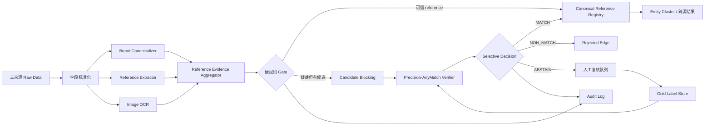
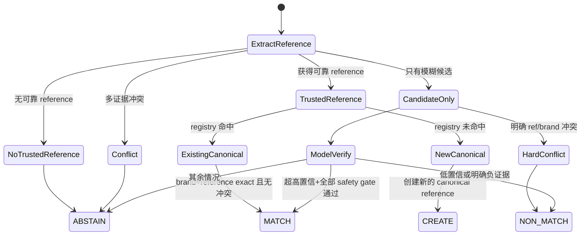

# AnyMatch -- Efficient Zero-Shot Entity Matching with a Small Language Model

## 0. 结论先行

本文选择调研清单中的 **AnyMatch -- Efficient Zero-Shot Entity Matching with a Small Language Model**，原因是它同时命中当前 Spec 的三个关键约束：

1. 目标数据是多来源、字段稀疏、模式不稳定，不能假设每个平台都提供统一字段；
2. 数据量是 100 万–1000 万级，不能让超大 LLM 成为全量 pairwise matcher；
3. 可以提供少量人工黄金标签，但生产系统必须能持续接入新来源/新品牌。

AnyMatch 本身不是“零误匹配系统”。论文和代码的优化目标主要是 F1，并且官方推理代码直接 `argmax` 二分类；这与 Spec 中“绝对不能误匹配、precision 优先到极致”的目标并不一致。因此，**不建议直接把 AnyMatch 的二分类输出作为最终合并依据**。

建议落地方式是：

> **Reference-first 硬规则做主裁决，AnyMatch 的小模型、困难样本挖掘、属性级训练三个思想做二阶段验证器；最终输出必须是 MATCH / NON_MATCH / ABSTAIN 三态，而不是强制二分类。**

对于腕表场景，“同一个商品”已经被 Spec 明确定义成“同一 reference number / 型号”，因此系统不应该先做模糊 pairwise 匹配再猜是不是同款，而应该优先把每条记录可靠地映射到 `(canonical_brand, canonical_reference)`，再按这个键聚合。模型只解决“reference 抽取是否可信”“两个候选是否存在冲突”“疑难记录是否值得自动放行”等问题。

这样可以把历史数据全量处理从潜在的 `O(N^2)` pairwise 比较，降成接近 `O(N)` 的 reference 抽取 + 哈希/索引归并；对 100 万–1000 万级历史数据和持续增量都更适合。

---

## 1. 调研对象

- 论文：AnyMatch -- Efficient Zero-Shot Entity Matching with a Small Language Model
- 论文：https://arxiv.org/abs/2409.04073
- 官方代码：https://github.com/Jantory/anymatch
- 当前需求 Spec：https://app.notion.com/p/3bf7b2a8538b812fba00fb258024ff31

论文将 zero-shot entity matching 建模为序列分类，并通过跨数据集 transfer learning 训练一个小模型。论文主模型使用 GPT-2（124M 参数），在 9 个 benchmark 上做 leave-one-dataset-out 评测，平均 F1 为 81.96；论文同时强调其推理成本显著低于超大 LLM。

这些结果说明 AnyMatch 适合作为“便宜、可批量跑、可迁移”的匹配组件，但 **F1=81.96 绝不能被解释为满足当前生产精度要求**。我们真正应该复用的是它的数据构造与迁移训练方式，而不是原始决策策略。

---

## 2. AnyMatch 的核心技术实现

### 2.1 总体架构

AnyMatch 的训练/推理逻辑可以简化成：

```text
多个已标注 EM 数据集
      │
      ├── AutoML 筛选困难正样本
      ├── 控制正负样本比例
      ├── pair flip 数据增强
      └── 生成 attribute-level 样本
                │
                ▼
       序列化为统一文本格式
                │
                ▼
      GPT-2 Sequence Classifier
                │
                ▼
       未见目标数据集 zero-shot 推理
```

核心不是“大模型知识”，而是：

- 把异构 record pair 序列化成统一输入；
- 从多个已知数据集迁移到未见数据集；
- 不均匀采样所有样本，而是偏向困难样本；
- 同时训练 record-level 和 attribute-level 比较能力。

### 2.2 序列化

官方 `utils/data_utils.py` 的 `df_serializer()` 在主 `mode1` 中会：

- 找出 `_l` 和 `_r` 结尾的左右记录字段；
- 缺失字段写成 `N/A`；
- 不写真实列名，而是统一写 `COL`；
- 将左右 record 包在 `<p>...</p>`；
- 最后附加问题 `Given the attributes of the two records, are they the same?`。

形式类似：

```text
Record A is <p>COL value1, COL value2, COL N/A</p>.
Record B is <p>COL value1, COL value2, COL value3</p>.
Given the attributes of the two records, are they the same?
```

论文消融实验显示，保留这种 schema-agnostic 表达有助于跨数据集迁移。

### 2.3 困难样本选择

论文描述的策略是通过 AutoML 模型找到传统模型容易错的 pair，再优先放进语言模型训练集。

官方仓库的 `automl_filter()` 实际执行流程是：

1. 如果数据集小于 1200 对，全部保留；
2. 大数据集读取预先生成的 `train_preds.csv`；
3. 找出 **真实 label=1 但 AutoML 预测错误** 的困难正样本；
4. 正样本最多保留 400；
5. 负样本随机采样为正样本的 2 倍；
6. 最终每个来源数据集最多大约 1200 条 record-level 样本。

README 说明实际 AutoML 预测由预处理 notebook 生成，运行时函数更多是在读取结果并筛样本。

这套思想对当前需求很重要，但采样方向要反过来增强：当前系统最怕 false positive，因此应该优先挖掘 **“传统规则/旧模型错误放行为 match 的负样本”**，也就是 hard negative，而不仅仅是论文原始策略中的 hard positive。

### 2.4 正负样本比例

论文和实现都避免直接使用高度失衡的全量候选 pair。

record-level 训练大致使用：

```text
positive : negative = 1 : 2
```

attribute-level 则按每个 attribute 单独做正负平衡，并在代码中每个 attribute 最多下采样到 800 条。

### 2.5 Attribute-level augmentation

`read_multi_attr_data()` 会读取各数据集的 `attr_train.csv / attr_valid.csv / attr_test.csv`，按 `attribute` 聚合后生成单属性比较样本。

例如完整 record 是：

```text
brand=Rolex, model=Datejust, ref=126334
```

attribute-level 可以单独训练：

```text
126334  vs  126334     -> match
126334  vs  126300     -> non-match
Datejust vs Date Just  -> match
```

论文消融结果表明，把 attribute-level 与 row-level 混合训练，比完全不使用 attribute-level 的版本平均 F1 高约 3 个点。

对腕表 reference 场景，这一思想非常有价值，因为最终最重要的能力不是“整条商品描述像不像”，而是模型能否在噪声字段中识别：

- 哪些值是 reference；
- 哪些 reference 只是格式差异；
- 哪些是同系列但不同 reference 的 hard negative；
- 哪些编号其实是平台 SKU、店铺货号、配件兼容型号。

### 2.6 Flip augmentation

`automl_filter_flip()` 会左右交换 Record A / Record B，再与原数据合并并去重。

这可以减少模型对左右来源位置的依赖，适合当前三个来源互相组合：

- 雷小安 -> 腕表之家
- 腕表之家 -> 雷小安
- 雷小安 -> 奢当家
- 奢当家 -> 雷小安
- 腕表之家 -> 奢当家
- 奢当家 -> 腕表之家

### 2.7 模型和训练代码

`model.py` 中：

```python
GPT2ForSequenceClassification.from_pretrained("gpt2")
```

并把 GPT-2 的 EOS token 作为 pad token。

`loo.py` 中论文主设置显式使用：

- `base_model=gpt2`
- learning rate `2e-5`
- batch size `64`
- max length `350`
- 最多 `50` epochs
- early stopping patience `6`

`utils/train_eval.py` 中实际 optimizer 是 `AdamW(weight_decay=0.01)`，并使用 linear scheduler 和 gradient clipping (`1.0`)。

官方验证集选 best model 的指标是 F1；推理阶段对 logits 直接 `argmax`。

这两个点必须在我们的版本中修改，否则无法满足 precision-first。

---

## 3. AnyMatch 原版为什么不能直接用于当前 Spec

### 3.1 原版目标函数与生产目标不一致

原版：

```text
目标：平均 F1 高
输出：0 / 1
决策：argmax
```

当前需求：

```text
目标：自动 match 集合几乎不能出现 false positive
输出：MATCH / NON_MATCH / ABSTAIN
决策：宁可漏掉，也不误合并
```

如果 logits 为：

```text
P(match)=0.51
P(non-match)=0.49
```

AnyMatch 原代码会直接判 match。对当前系统这是不可接受的。

### 3.2 论文 hard sample 更关注困难正样本

AnyMatch 的 AutoML 筛选重点是 false negative positive pairs，目的是提升总体泛化。

当前问题的损失极不对称：

```text
漏匹配成本 << 误匹配成本
```

因此训练数据应重点增加：

- 同品牌、同系列、只差一位 reference 的负样本；
- 外观高度相似但 reference 不同的负样本；
- 标题包含“适用/兼容 XXX 型号”的配件记录；
- 平台 SKU 恰好看起来像 reference 的记录；
- OCR 误识别造成 0/O、1/I、5/S 混淆的负样本；
- 标题、结构化 reference、表背 OCR 相互冲突的样本。

### 3.3 对腕表场景，“reference”应该是硬约束，不应该被模糊相似度覆盖

如果：

```text
A.ref = 126334
B.ref = 126300
```

即使：

- 标题 95% 相似；
- 图片非常像；
- 同品牌同系列；
- AnyMatch 给出 P(match)=0.999；

也必须判 NON_MATCH。

因为 Spec 已经定义“同一个商品 = 同一 reference”。

### 3.4 图片不能直接当最终同款判据

腕表同系列相邻 reference 往往外观很接近。图片应该用于：

- OCR 表背/保卡/吊牌上的 reference；
- 判断标题中某个 reference 是否属于主体商品；
- 检测明显冲突；
- 人工复核辅助。

不建议让“视觉 embedding 很相似”覆盖 reference 冲突。

---

## 4. 推荐落地架构：Reference-first + Precision-AnyMatch

### 4.1 总体架构



关键原则：

> **模型只在硬规则允许的候选空间里做验证；模型不能推翻明确 reference 冲突。**

### 4.2 数据对象

建议至少保留以下表/实体。

#### `normalized_record`

```text
record_id
source
source_record_id
brand_raw
brand_norm
reference_raw
reference_norm
reference_source
reference_confidence
title_norm
description_norm
category_norm
image_urls
updated_at
```

#### `reference_evidence`

一条商品可以有多个 reference 候选：

```text
record_id
candidate_ref_raw
candidate_ref_norm
provenance           # structured_field/title/description/ocr/card/backcase
extractor_version
confidence
context_before
context_after
is_negative_context  # 例如“兼容/适用/表带/配件”
```

#### `canonical_reference`

```text
canonical_id
brand_norm
reference_norm
reference_family
status
created_at
```

唯一键建议：

```text
UNIQUE(brand_norm, reference_norm)
```

不要只用 reference，因为不同品牌理论上可能出现相同字符串。

#### `match_decision`

```text
left_record_id
right_record_id
candidate_canonical_id
rule_result
model_probability
calibrated_probability
threshold_version
model_version
rule_version
decision             # MATCH/NON_MATCH/ABSTAIN
reason_codes
created_at
```

所有自动合并都必须可追溯到具体 evidence、规则版本和模型版本。

---

## 5. Reference 抽取与规范化：这是系统最重要的一层

### 5.1 证据优先级

建议按可靠性分层，而不是所有字段平权：

```text
Tier S: 平台明确的 reference/model-number 结构化字段
Tier A: 标题中高置信 reference
Tier A: 保卡/吊牌/表背 OCR 得到的 reference
Tier B: 描述正文中的 reference
Tier C: 通过相似文本/视觉猜到的候选
```

Tier C 只能用于召回和人工复核，不能单独触发自动 MATCH。

### 5.2 保守 canonicalization

不要简单执行：

```python
re.sub(r"[^A-Za-z0-9]", "", ref)
```

这种过度归一化会把某些品牌的语义后缀、分隔结构或变体信息抹掉。

建议拆成两层：

```text
display_ref     = 保留原始格式，用于审计
canonical_ref   = 只执行已证明安全的变换
```

安全的通用变换可以包括：

- Unicode normalization；
- 大小写统一；
- 全角/半角统一；
- 连字符字符集统一（`‐‑–—` -> `-`）；
- 去首尾空格；
- 连续空格压缩。

更激进的变换，例如：

- 删除 `/`；
- 删除 `-`；
- 删除尾部字母；
- 只保留数字；

必须按品牌维护规则白名单，不能全局执行。

### 5.3 多证据冲突直接拒识

例如：

```text
结构化字段: 126334
标题:       126334
OCR:        126300
```

即使两票对一票，也不应直接自动 MATCH。应生成：

```text
decision = ABSTAIN
reason = REFERENCE_EVIDENCE_CONFLICT
```

因为最坏情况下结构化字段和标题可能来自同一个错误上游，不能把它们当独立证据。

### 5.4 没有可靠 reference 时不要自动匹配

当前业务定义已经把 reference 作为实体边界。

因此：

```text
没有 reference 证据 != 可以用图片/标题相似度代替 reference
```

应该是：

```text
没有可靠 reference -> 尽量抽取 -> 仍失败 -> ABSTAIN / 人工复核
```

这一步虽然降低 recall，但完全符合 Spec。

---

## 6. Candidate Blocking：避免百万级笛卡尔积

### 6.1 第一优先：直接按 canonical reference 查找

如果一条新记录已经拿到：

```text
brand_norm = ROLEX
reference_norm = 126334
```

直接：

```sql
SELECT canonical_id
FROM canonical_reference
WHERE brand_norm = 'ROLEX'
  AND reference_norm = '126334';
```

这是最可靠、最便宜、最可扩展的路径。

### 6.2 reference 不完整时的召回

只有在 reference extraction 不完整但存在高质量候选时，才进入模糊 blocking：

```text
brand_norm 必须一致
+ reference prefix / family 相似
+ series/category 约束
+ title token 相似
```

候选数要强制限制，例如每条记录最多 top-K 进入模型验证。

如果 brand 都不可靠，就不建议做自动 MATCH。

### 6.3 图片只用于补证据

可以从图片产生：

```text
OCR tokens
logo brand
表背刻字
保卡 reference
吊牌 reference
```

但不要直接使用 image embedding 的 nearest-neighbor 结果作为 match edge。

---

## 7. 把 AnyMatch 改造成 Precision-AnyMatch

### 7.1 输入格式不要完全照搬原版

原版为了 zero-shot transfer 把列名全部变成 `COL`。当前项目目标不同：我们明确知道什么是 reference、brand、title、OCR evidence，并且 reference 必须有更高语义权重。

因此建议保留 AnyMatch 的“统一序列化”思想，但使用业务 schema marker：

```text
Record A is <p>
BRAND rolex,
REF 126334,
TITLE rolex datejust 41 ...,
OCR 126334,
SOURCE leixiaoan
</p>.

Record B is <p>
BRAND rolex,
REF 126334,
TITLE 劳力士 日志型 41 ...,
OCR N/A,
SOURCE watchhome
</p>.

Given the evidence, can these records safely be assigned to the same canonical reference?
```

注意问题不是“are they the same product?”，而是：

> **can they safely be assigned to the same canonical reference?**

这会让训练目标更贴近系统真正需要的决策。

### 7.2 从二分类改为 selective classification

不要：

```python
pred = logits.argmax(-1)
```

改为：

```python
p = torch.softmax(logits, dim=-1)[:, 1]

if hard_conflict:
    decision = "NON_MATCH"
elif hard_pass:
    decision = "MATCH"
elif p >= threshold_match and margin_ok and evidence_ok:
    decision = "MATCH"
elif p <= threshold_non_match:
    decision = "NON_MATCH"
else:
    decision = "ABSTAIN"
```

推荐 `threshold_match` 与 `threshold_non_match` 分开配置，中间保留大面积拒识区。

例如初始可以先用：

```text
P(match) >= 0.995  才有资格继续进入 MATCH gate
P(match) <= 0.05   可自动 NON_MATCH
其余全部 ABSTAIN
```

但具体值不能拍脑袋固定，必须在项目黄金集上校准。

### 7.3 Hard gate 必须先于模型

建议实现：

```python
def hard_gate(a, b):
    if a.brand_norm and b.brand_norm and a.brand_norm != b.brand_norm:
        return "NON_MATCH", "BRAND_CONFLICT"

    if a.reference_norm and b.reference_norm:
        if a.reference_norm != b.reference_norm:
            return "NON_MATCH", "REFERENCE_CONFLICT"
        if a.reference_trusted and b.reference_trusted:
            return "MATCH", "TRUSTED_REFERENCE_EXACT"

    if a.has_reference_conflict or b.has_reference_conflict:
        return "ABSTAIN", "INTERNAL_REFERENCE_CONFLICT"

    return None, None
```

模型只能处理 `hard_gate()` 返回空的记录。

### 7.4 Hard-negative mining 要改方向

AnyMatch 原版优先收集 AutoML 错掉的正样本。

我们应该同时重点收集：

```python
hard_fp_negatives = gold[
    (gold.label == 0) &
    (old_model.prediction == 1)
]
```

并加入规则系统产生的近邻难例：

```text
126334 vs 126300
116500LN vs 116500
RM11-03 vs RM11-04
同标题模板 + 不同 reference
同图像系列 + 不同 reference
```

如果模型在这些样本上仍然产生高 match score，应继续把它们加入下一轮训练。

### 7.5 Attribute-level 数据在本项目中应该重点围绕 reference

建议至少生成以下 attribute task：

```text
reference_exact_equivalence
reference_near_but_different
brand_alias_equivalence
series_alias_equivalence
sku_vs_reference_role
accessory_compatibility_reference
ocr_reference_normalization
```

其中最重要的是 `reference_near_but_different`。

### 7.6 Few-shot 标签不要浪费在随机 pair 上

Spec 允许几百条黄金标签。不要从所有候选里随机抽 300 对。

建议首批 300 条按风险分层：

```text
60  条：真实同 reference，但格式/语言/字段差异很大
120 条：同品牌同系列、不同 reference 的 hard negative
50  条：配件/表带/盒证包含兼容 reference
40  条：OCR 与标题/结构化字段冲突
30  条：平台 SKU / 店铺货号 / 内部 ID 易被误当 reference
```

之后改成 active review：只标模型最不确定或最危险的高分负样本。

### 7.7 可以用高置信弱标签扩大训练集

人工只标几百条不等于训练集只能有几百条。

可以自动构造 silver data：

#### 高置信正样本

```text
同品牌
+ 两来源结构化 reference 完全一致
+ 至少一边标题或 OCR 再次出现该 reference
+ 无冲突 reference
```

#### 高置信负样本

```text
同品牌
+ reference 都来自可信字段
+ canonical reference 明确不同
+ 最好属于同系列/字符串近邻
```

这类自动标签非常适合喂给 AnyMatch 的 transfer/fine-tune 流程，而人工 gold 用于最终阈值评估和风险校准。

---

## 8. Precision 校准：F1 降级为次要指标

### 8.1 线上核心指标

必须按下面顺序看：

1. `false_positive_count_auto_match`
2. `precision_auto_match`
3. `coverage_auto_match`
4. `abstain_rate`
5. `recall`
6. `F1`

如果一个模型 F1 更高但多产生 3 个 false positive，应直接输给“F1 较低但 0 FP”的模型。

### 8.2 阈值选择

在 held-out gold 上：

```python
for t in thresholds:
    accepted = pred[p >= t]
    fp = count_false_positive(accepted)
    if fp == 0:
        choose the t with highest coverage
```

并且阈值要按高风险切片分别验证：

```text
source_pair
brand
category
reference provenance
是否有 OCR
是否存在多个 reference candidate
```

不同来源组合可以有不同 threshold。

### 8.3 “0 个观测 FP”不等于统计上绝对 100%

只有几百条 gold 时，即使测试集里 0 FP，也不能证明真实线上 precision=100%。

因此工程上要把“绝对不能误匹配”翻译为：

- 尽可能由 deterministic reference rule 完成自动 match；
- 模型只负责狭窄的安全区间；
- 高风险全部拒识；
- 每个自动决策保存 evidence；
- 对线上 auto-match 持续抽样复核；
- 一旦某品牌/来源出现 FP，立即冻结该切片的 model-pass，只保留 rule-pass。

---

## 9. 推荐决策状态机



注意：

> 如果 reference 已经可靠识别，根本不需要 pairwise 模型去“确认两个商品像不像”。最优路径是直接映射到 canonical reference registry。

---

## 10. 历史全量与持续增量架构

### 10.1 历史 100 万–1000 万数据

建议使用批处理：

```text
Raw snapshot
 -> normalize
 -> reference extraction
 -> OCR（仅需要的图片）
 -> canonicalization
 -> reference index join
 -> unresolved candidate batch inference
 -> cluster materialization
```

因为核心 join key 是 `(brand_norm, reference_norm)`，不需要做全量 cross join。

对 1000 万条记录，如果绝大多数能抽到 reference，主要成本会转移到：

- OCR；
- reference extraction；
- 少量 unresolved candidate 的模型推理；

而不是 pairwise matching。

### 10.2 增量

每条新记录进入后：

```text
1. 标准化
2. 抽 reference
3. 查 canonical registry
4. 有安全命中 -> 直接挂 cluster
5. 无安全命中 -> unresolved queue
6. unresolved queue 批量走 Precision-AnyMatch / 人工复核
```

写入必须幂等，建议以：

```text
(source, source_record_id, source_updated_at)
```

或内容版本 hash 做去重。

### 10.3 推荐基础组件

技术栈不限的情况下，可以采用下列逻辑组件，具体产品可替换：

```text
对象存储 / 数据湖        保存原始抓取与图片
批处理引擎              历史全量 normalize / extract / join
消息队列                增量商品事件
流处理/worker           增量 reference extraction
关系数据库              canonical_reference / decision / audit
GPU/CPU model service    小模型批量验证
OCR service              表背/保卡/吊牌 reference
review service            人工复核
```

10M 规模的 canonical key 本身并不大，不需要为了“匹配”默认上向量数据库。向量检索只应服务于 unresolved candidate recall，而不是主路径。

---

## 11. 最小可落地代码骨架

### 11.1 Reference evidence

```python
from dataclasses import dataclass
from enum import Enum

class Decision(str, Enum):
    MATCH = "MATCH"
    NON_MATCH = "NON_MATCH"
    ABSTAIN = "ABSTAIN"

@dataclass
class RefEvidence:
    raw: str
    canonical: str
    provenance: str
    confidence: float
    negative_context: bool = False

@dataclass
class ProductRecord:
    record_id: str
    source: str
    brand_norm: str | None
    ref_evidence: list[RefEvidence]
    title: str
    ocr_text: str | None
```

### 11.2 Conservative reference resolver

```python
def resolve_reference(record: ProductRecord):
    usable = [
        x for x in record.ref_evidence
        if not x.negative_context and x.confidence >= 0.95
    ]

    refs = {x.canonical for x in usable}

    if len(refs) == 0:
        return None, "NO_TRUSTED_REFERENCE"

    if len(refs) > 1:
        return None, "REFERENCE_CONFLICT"

    return next(iter(refs)), "OK"
```

生产上 `0.95` 不应固定写死，要按 evidence provenance 设置阈值。

### 11.3 Hard gate

```python
def hard_gate(a, b, ref_a, ref_b):
    if a.brand_norm and b.brand_norm and a.brand_norm != b.brand_norm:
        return Decision.NON_MATCH, "BRAND_CONFLICT"

    if ref_a and ref_b and ref_a != ref_b:
        return Decision.NON_MATCH, "REFERENCE_CONFLICT"

    if ref_a and ref_b and ref_a == ref_b:
        return Decision.MATCH, "REFERENCE_EXACT"

    return None, "NEED_MODEL_OR_REVIEW"
```

### 11.4 Selective model decision

```python
def selective_decision(
    p_match: float,
    threshold_match: float,
    threshold_non_match: float,
    evidence_ok: bool,
    unique_best: bool,
):
    if not evidence_ok:
        return Decision.ABSTAIN, "EVIDENCE_NOT_SAFE"

    if p_match >= threshold_match and unique_best:
        return Decision.MATCH, "MODEL_HIGH_CONFIDENCE"

    if p_match <= threshold_non_match:
        return Decision.NON_MATCH, "MODEL_LOW_CONFIDENCE"

    return Decision.ABSTAIN, "MODEL_UNCERTAIN"
```

### 11.5 AnyMatch 推理修改点

官方代码现在本质上是：

```python
logits = model(**batch).logits
pred = logits.argmax(axis=-1)
```

建议改成：

```python
logits = model(**batch).logits
probs = torch.softmax(logits, dim=-1)[:, 1]
```

然后把原始 probability 保存下来，交给独立 calibration + decision engine，不要在 model service 内部直接落最终匹配结果。

---

## 12. 数据集构造方案

### 12.1 从三来源生成“安全 silver labels”

#### Silver positive

```text
brand_norm 相同
AND trusted structured reference canonical 完全相同
AND 无任何冲突 reference
```

优先再要求标题/OCR 有第二证据。

#### Silver hard negative

```text
brand_norm 相同
AND 两侧 trusted reference 都存在
AND reference_norm 不同
AND edit-distance/前缀/系列高度接近
```

这批对模型最重要。

### 12.2 人工 gold 只标危险边界

人工复核界面至少展示：

- 两边所有原始字段；
- 抽出的 reference candidates；
- reference 来源及上下文；
- 图片/OCR；
- 模型分；
- 规则 reason code。

标注结果不仅存 `match/non-match`，还建议存：

```text
wrong_reference_extraction
accessory_reference
sku_misclassified_as_reference
ocr_error
brand_error
true_reference_variant
other
```

这些 error taxonomy 可以直接驱动下一轮规则和训练数据生成。

---

## 13. Clustering 不应该依赖 pairwise transitive closure

普通实体匹配常见流程是：

```text
A-B match
B-C match
=> A-B-C 一个 cluster
```

但这会造成一条 false positive 污染整个连通分量。

当前定义允许更简单更安全的方式：

```text
cluster_id = hash(canonical_brand + "|" + canonical_reference)
```

每条商品不是“跟某条记录合并”，而是“映射到 canonical reference entity”。

这样：

- 不需要危险的 transitive closure；
- 某条记录判断错误时可以单条移出；
- cluster identity 稳定；
- 三来源后续增量天然归到同一个 key；
- 审计更简单。

---

## 14. 图片的正确使用方式

图片在本项目里很有价值，但建议限定为四类能力：

### 14.1 OCR reference

优先识别：

- 保卡；
- 吊牌；
- 表背；
- 证书；
- 售价标签中的型号字段。

### 14.2 Brand 辅助

当文本 brand 缺失时，可用图片 logo 作为 brand candidate，但低置信时仍拒识。

### 14.3 冲突检测

例如文本写 `126334`，OCR 稳定读到另一个 reference，则进入 ABSTAIN。

### 14.4 Review 排序

视觉相似度可以用于：

```text
把最可能属于同系列的 unresolved pair 放在一起给人审
```

但不用于越权自动 MATCH。

---

## 15. 线上安全机制

### 15.1 Reason code 必须完整

每个 MATCH 至少给出：

```text
TRUSTED_REFERENCE_EXACT
REFERENCE_EXTRACTED_FROM_TITLE_AND_OCR
MODEL_HIGH_CONFIDENCE_AFTER_RULE_GATE
```

不能只有一个浮点分数。

### 15.2 Shadow mode

新模型上线先只打分不改变 cluster，比较：

```text
old_decision
new_decision
reference evidence
gold/reviewer result
```

### 15.3 Kill switch

按以下粒度支持关闭模型自动放行：

```text
source pair
brand
category
model version
rule version
```

一旦某个切片发现 false positive，可以立即切回：

```text
only trusted-reference-exact auto-match
```

### 15.4 Drift monitoring

持续监控：

```text
reference extraction success rate
reference conflict rate
abstain rate
auto-match coverage
review reject rate
high-score negative count
```

如果某来源页面结构变化，通常最早会反映在 extraction success/conflict 指标，而不是等到最终 FP 才发现。

---

## 16. 分阶段实施建议

### Phase A：先做不用模型也能跑的 reference baseline

完成：

- brand canonicalization；
- reference extraction；
- conservative normalization；
- `(brand, reference)` registry；
- exact rule match；
- conflict -> abstain；
- audit log。

这一步本身很可能就能覆盖大量数据，并且 precision 最高。

### Phase B：接入 AnyMatch 的训练数据思想

完成：

- 从三来源生成 silver positive / hard negative；
- 按 AnyMatch 方式生成 row-level + attribute-level；
- pair flip；
- 加强 false-positive hard negative mining；
- 先复现 GPT-2 124M baseline。

### Phase C：改成 selective matcher

完成：

- 输出 probability；
- probability calibration；
- threshold_match / threshold_non_match；
- ABSTAIN；
- source/brand 分切片阈值；
- precision@coverage 评测。

### Phase D：图片/OCR 与增量

完成：

- OCR reference evidence；
- conflict detection；
- 流式增量处理；
- active review 回流。

---

## 17. 验收标准

不建议用“总体 F1 > X”作为上线门槛。

更合适的是：

```text
1. Held-out gold 的 auto-match subset 必须 0 false positive
2. 所有明确 reference conflict 必须 NON_MATCH 或 ABSTAIN
3. 无可靠 reference 的记录不得仅凭文本/图像相似度自动 MATCH
4. auto-match 必须 100% 可追溯到 evidence + rule/model version
5. 新来源/新品牌默认进入保守模式，不能继承旧来源的放行阈值
6. 每个模型版本都报告 precision-coverage curve，而不是只报告 F1
7. 线上出现任一确认 FP 后，可按 source/brand 立即关闭 model-pass
```

如果业务真的要求“宁可漏掉绝大部分，也不能错”，可以把最终自动 MATCH 收紧为：

```text
trusted canonical reference exact
AND brand exact
AND no conflicting evidence
```

此时 AnyMatch 主要承担 reference 抽取验证、候选排序、review 辅助，而不是最终裁决。

---

## 18. 最终建议

AnyMatch 最值得借鉴的不是 GPT-2 本身，而是三件事：

1. **跨数据集 transfer learning**：让 matcher 不依赖每个新来源重新大量标注；
2. **困难样本选择**：把训练预算放到边界样本，而不是大量简单 pair；
3. **attribute-level + record-level 混合训练**：让模型真正理解局部字段比较，而不只是整段文本相似度。

对当前二奢腕表系统，应做以下关键改造：

```text
AnyMatch 原版                     当前项目版本
------------------------------------------------------------
F1 优先                         precision / 0-FP 优先
强制二分类                      MATCH / NON_MATCH / ABSTAIN
argmax                          高阈值 + calibration + safety gate
困难正样本优先                  false-positive hard negative 优先
schema-agnostic COL             REF/BRAND/OCR 等业务 marker
pairwise 决定实体关系            canonical reference registry 决定实体
文本模型做最终 matcher           reference hard rule 做最终裁决
图片可作为相似证据                图片只做 OCR/冲突/辅助复核
```

**直接落地时，先做 Reference-first baseline，再把 AnyMatch 作为 unresolved candidate 的高精度验证器。**

在这个定义下，真正应该构建的“实体”不是由相似 pair 连接出来的商品 cluster，而是稳定的：

```text
CanonicalWatchReference {
    brand,
    reference,
    aliases,
    evidence,
    member_records[]
}
```

三来源记录都只需要安全地映射到这个实体。这样既比通用实体匹配更简单，也更符合“同一个商品 = 同一 reference”的业务定义，并且最容易做到 precision-first、可审计、可增量扩展。