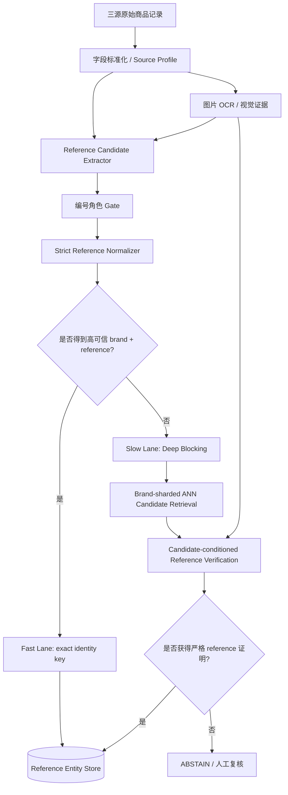

# DeepBlocker：把深度 Blocking 变成 precision-first 腕表 Reference 匹配系统的“只召回、不授权”候选层

- 分析人：b
- 调研项目：https://github.com/qcri/DeepBlocker
- 对应论文：Deep Learning for Blocking in Entity Matching: A Design Space Exploration（PVLDB 2021）
- 论文地址：https://vldb.org/pvldb/vol14/p2459-thirumuruganathan.pdf
- 来源清单：`奢侈品文章调研.md`
- 对应需求：https://app.notion.com/p/Spec-3bf7b2a8538b812fba00fb258024ff31

## 1. 为什么这次选择 DeepBlocker

当前需求有三个同时存在、但方向相反的约束：

1. 数据量达到 100 万～1000 万级，且持续增量；
2. 字段稀疏，reference 有时在结构化字段、有时埋在标题/描述/图片中；
3. **绝对不能误匹配，precision 优先到极致，允许漏匹配。**

如果所有记录都有可靠 reference，最优方案其实不是深度实体匹配，而是先得到可信的 `(brand_id, canonical_reference)`，然后做哈希索引/等值聚合。但现实中一定会存在一批：

- reference 字段为空；
- 标题中有多个“像 reference”的字符串；
- 同系列相邻型号字符串很接近；
- 字段脏、错位或平台自有 SKU 混入；
- reference 只出现在保卡、吊牌、表背图片中。

这批记录如果直接做全表 pairwise matching，在千万级规模不可行；如果只靠模糊字符串规则，又很容易漏掉真正候选。

DeepBlocker 最适合承担的就是这一层：

> **把千万级笛卡尔积压缩成很小的高召回候选集，但绝不能让 Blocking 分数本身成为自动匹配依据。**

这和此前 `b/parts-distributor-sku-classifier.md` 的结论是互补的：前一篇解决“这个编号到底是不是品牌 reference”的角色闸门；本篇解决“当直接 reference 证据不足时，如何在大规模数据中高召回地找到值得进一步验证的候选”。

---

## 2. DeepBlocker 的原始技术架构

DeepBlocker 把 DL-based blocking 抽象成三个模块：

```text
Raw Tuples
   │
   ▼
Word Embedding
   │
   ▼
Tuple Embedding
   │
   ▼
Vector Pairing
   │
   ▼
Candidate Set
```

论文将其设计空间进一步展开：

- Word Embedding：word / character；预训练 / 自训练；
- Tuple Embedding：普通 aggregation 或 self-supervised；
- Self-supervised：self-reproduction、cross-tuple training、triplet loss、hybrid；
- Vector Pairing：hash、cosine/euclidean + threshold/KNN、composite。

核心目标不是直接预测 match/no-match，而是在尽量保留真实匹配对的前提下，把候选集合 `C` 尽可能压小。

论文的评价指标也非常符合 Blocking 的定位：

- Recall：真实匹配对有多少进入候选集；
- Candidate Set Size / CSSR：候选集相对于全笛卡尔积有多大；
- Runtime。

这非常重要：**Blocking 的 precision 不等于最终实体匹配 precision。** Blocking 可以把很多 hard negative 也召回，只要后面的 verifier 能够拒绝它们。

---

## 3. 当前 GitHub 代码的真实执行链路

### 3.1 `DeepBlocker.block_datasets()`

`deep_blocker.py` 的主流程非常清晰：

```text
validate columns
  -> select cols_to_block
  -> fillna + cast str
  -> concatenate selected fields into _merged_text
  -> tuple_embedding_model.preprocess(all records)
  -> encode left table
  -> encode right table
  -> index right embeddings
  -> query left embeddings top-K
  -> convert neighbor matrix to candidate pair dataframe
```

这说明 DeepBlocker 的架构边界做得不错：

- Tuple Embedding 负责“怎样把一条记录变成向量”；
- Vector Pairing 负责“怎样从向量中找候选”；
- 两者通过简单接口解耦。

这一点非常适合当前项目：我们完全可以保留这种模块边界，但替换内部实现。

### 3.2 字段拼接方式

当前代码会把 `cols_to_block` 里的所有字段直接字符串拼接：

```text
title + manufacturer + price + ... -> _merged_text
```

它的好处是 schema-agnostic，坏处是所有字段被视为同等语义。

对于腕表场景，这是一个危险默认值：

- `reference=126334` 只有一个短 token；
- 标题可能有几十个营销词；
- 平台 SKU、库存编号、尺寸、年份等可能占据更多 token；
- 同系列不同 reference 的标题正文可能高度相似。

所以原始“直接拼字段”的输入形式不应照搬。

### 3.3 SIF：比普通平均更稳的 tuple embedding

`tuple_embedding_models.py` 中的 `SIFEmbedding` 使用 FastText token embedding，并根据 token 频率做 Smooth Inverse Frequency 加权：常见词权重低，稀有词权重高；最后可去除第一主成分。

这对商品标题有直觉上的价值：

- “正品”“二手”“男表”“自动机械”等高频词会被降低影响；
- 型号、系列名、特殊材质等低频 token 会得到更高权重。

但它仍然是“自然语言 token 权重”逻辑，不能解决 reference 的严格身份语义：`126334` 和 `126333` 在语义空间中可能非常接近，但业务上必须是两个不同实体。

因此 SIF 可以帮助 Blocking，却不适合直接做身份判定。

### 3.4 AutoEncoder：self-reproduction

`AutoEncoderTupleEmbedding` 的处理是：

```text
raw tuple
  -> SIF 300D
  -> AutoEncoder
       encoder: 300 -> 300 -> 150
       decoder: 150 -> 300 -> 300
  -> 取 encoder 的 150D 表示作为 tuple embedding
```

训练目标是 MSE reconstruction，不需要人工 match 标签。

论文结果中 AutoEncoder 在 structured / dirty 数据上表现最好或接近最好，而且训练成本较低。对于当前三源数据，这个思想有现实价值：

> 可以利用海量未标注商品记录训练一个“商品 tuple representation”，再把少量人工标签集中用于安全验证层，而不是花在 Blocking 本身。

### 3.5 CTT：自动生成正负 pair 的 cross-tuple training

代码里的 `generate_synthetic_training_data()` 自动构造训练对：

- 正样本：从同一 tuple 中随机删除最多一定比例 token；
- 负样本：随机选择另一条 tuple；
- 默认每条 tuple 生成 5 个正例，正负比例 1:1；
- 最大 token 删除比例默认 0.4。

随后 CTT 使用 Siamese summarizer：

```text
left embedding  ─┐
                 ├─ shared MLP -> abs(left-right) -> linear -> sigmoid
right embedding ─┘
```

这个 self-supervised 方法不需要真实 pair label，是 DeepBlocker 最有意思的设计之一。

但腕表场景不能直接照搬“随机删除 token”增强，因为如果被删掉的刚好是 reference，训练会错误地把：

```text
Rolex Datejust 126334
```

和

```text
Rolex Datejust
```

强行当成同一语义正例；更严重的是，如果模型学到“系列语义比 reference 更重要”，就会把 `126334`、`126333` 等相邻 reference 拉近。

因此当前项目需要 **reference-preserving augmentation**，而不是普通 token dropout。

### 3.6 Hybrid

论文中的 Hybrid 先通过 AutoEncoder 学 in-tuple 表示，再通过 CTT 学 cross-tuple 信息。论文实验中 Hybrid 在 textual data 上表现最好，而 AutoEncoder 在 structured / dirty 上整体更稳。

这个结果对三源腕表很有启发：

- 结构化字段较多的来源可以偏 AutoEncoder/结构化 encoder；
- 标题/描述很长的来源可以引入 cross-tuple 训练；
- 不必让所有来源强行使用同一个表示策略。

---

## 4. 代码审查：DeepBlocker 仓库不能直接用于千万级生产

这一部分比论文结论更重要，因为如果直接 `pip install requirements && main.py`，会踩到几个结构性问题。

### 4.1 `ExactTopKVectorPairing` 实际仍然是 O(N×M)

`vector_pairing_models.py` 中：

```python
all_pair_cosine_similarity_matrix = 1 - distance.cdist(
    embedding_matrix_for_querying,
    self.embedding_matrix_for_indexing,
    metric="cosine"
)
```

随后对整张相似度矩阵 `argsort` 取 Top-K。

这意味着当前开源代码会显式构造 `N_left × N_right` 矩阵。

例如两边各 100 万条记录时：

```text
1e6 × 1e6 = 1e12 个相似度
```

无论内存还是计算量都不可接受，更不用说 1000 万级。

论文运行实验时使用过 FAISS GPU 做向量 pairing，并报告 Top-K 检索；但当前 GitHub 代码并没有把 FAISS pairing 实现放进 `vector_pairing_models.py`。

**结论：只复用接口，不复用 ExactTopK 实现。**

生产应替换为：

- FAISS HNSW / IVF-PQ；或
- 其他支持增量的 ANN index。

### 4.2 当前候选集输出使用 DataFrame 行号，不是业务 `id`

`topK_neighbors_to_candidate_set()` 把：

```python
topK_df.index -> ltable_id
neighbor position -> rtable_id
```

也就是说候选 pair 实际是两张 DataFrame 的**位置索引**，不是原始业务 ID。

虽然 `DeepBlocker.validate_columns()` 强制要求存在 `id` 字段，但后续候选输出没有真正使用该字段。

这对研究脚本没问题，对增量生产系统很危险：

- 数据重排后行号会变化；
- 分片后 index 不是全局唯一；
- 过滤/重放批次后可能错误映射记录。

生产必须使用稳定主键：

```text
(source, source_item_id)
```

并让 ANN index 内部 vector id 与稳定记录 ID 显式映射。

### 4.3 CTT 训练出的模型在当前 `get_tuple_embedding()` 中没有真正生效

当前 `CTTTupleEmbedding.preprocess()` 会训练 `self.ctt_model`，但是 `get_tuple_embedding()` 返回的是：

```python
self.sif_embedding_model.get_tuple_embedding(...)
```

并没有调用：

```python
self.ctt_model.get_tuple_embedding(...)
```

因此按当前代码路径，CTT summarizer 的训练结果不会进入最终候选向量。

这很可能是研究代码接线遗漏。至少在生产复现论文前，必须加入单元测试验证：

```text
training before/after embedding must differ
CTT output dimension must equal expected summarizer dimension
```

### 4.4 Hybrid 当前实现存在明显的输入维度不一致风险

配置中：

```text
EMB_DIMENSION_SIZE = 300
AE_EMB_DIMENSION_SIZE = 150
```

AutoEncoder encoder 最终输出 150D。

但 `HybridTupleEmbedding` 创建 CTT trainer 时，`input_dimension` 仍设置为 `EMB_DIMENSION_SIZE = 300`；同时实际送入 CTT 的 left/right embedding 来自 AutoEncoder，已经是 150D。

因此当前 Hybrid 训练路径在维度上并不一致，不应直接作为论文结果的可运行复现。

### 4.5 GPU 推理路径也需要重新整理

训练器会把模型 `.to(cuda)`，但 tuple embedding 的推理函数中又直接从 CPU tensor 调 `encoder()`，并 `.numpy()`。

生产实现必须统一：

```text
input.to(device)
model.to(device)
output.detach().cpu().numpy()
```

否则 GPU 环境容易出现 device mismatch。

### 4.6 依赖和工程形态偏研究原型

仓库依赖只有 FastText、NumPy、Pandas、SciPy、sklearn、Torch/TorchText 等，缺少：

- ANN index 持久化；
- 增量索引；
- 模型版本；
- 数据 lineage；
- 分片；
- 服务化；
- 监控；
- candidate audit；
- review queue。

因此 DeepBlocker 对当前需求最值得复用的是**抽象与训练思想**，不是仓库本身。

---

## 5. 对当前 Spec 的关键架构判断

### 5.1 DeepBlocker 只能是 Recall Layer，不能是 Match Authority

当前业务定义：

> 同一个商品 = 同一 reference number / 型号。

因此最终自动合并的必要条件应该始终是：

```text
两个记录都获得可信的 canonical reference
AND brand 一致
AND strict canonical reference 完全一致
AND 不存在冲突证据
```

Dense embedding、图片相似度、标题相似度、ANN rank 都不能替代 reference。

推荐的原则是：

```text
Blocking can propose.
Reference evidence must prove.
Any conflict can veto.
```

### 5.2 两条数据通路，而不是所有数据都跑 DeepBlocker



Fast Lane 是主路径；DeepBlocker 是补救路径。

这样能同时满足：

- 大部分高质量记录 O(1) key lookup；
- 少量困难记录才付 ANN + verifier 成本；
- embedding 再相似也不会直接制造误合并。

---

## 6. Fast Lane：reference exact-key 聚合

建议统一实体键：

```text
identity_key = brand_id + ":" + strict_reference
```

例如：

```text
ROLEX:126334
OMEGA:310.30.42.50.01.001
```

只有满足以下全部条件才允许自动进入 Fast Lane：

1. `brand_id` 已规范化且无歧义；
2. reference candidate 来源可信；
3. 编号角色不是平台 SKU / 店铺 SKU / 序列号 / 配件兼容型号；
4. strict normalization 只做可逆/低风险规范化；
5. 同一记录内部没有两个互相冲突的高可信 reference；
6. 图片 OCR、结构化字段、标题如果同时有证据，不能发生矛盾。

如果任一点失败，宁可转 Slow Lane 或 ABSTAIN。

---

## 7. Slow Lane：将 DeepBlocker 改造成腕表专用 Candidate Retrieval

### 7.1 不要再用“裸字段拼接”，改成 typed serialization

建议把每条记录序列化成带字段标签的文本：

```text
[BRAND] rolex
[SOURCE] xxxxx
[TITLE] 劳力士 日志型 41mm 蓝盘 自动机械
[SERIES] datejust
[REF_CAND] 126334
[YEAR] 2021
[MATERIAL] steel
[OCR] 126334 ...
```

并且对字段做显式权重/多塔处理，而不是所有词平均。

推荐至少拆成三路 embedding：

```text
E_ref_text   reference candidate / OCR reference 相关字符表示
E_semantic   title + series + attributes 语义表示
E_visual     图片表示（可选）
```

最后用于 Blocking 的向量可以是拼接或加权融合，但 `E_ref_text` 不应被长标题淹没。

### 7.2 reference 应优先 character/subword 表示

腕表 reference 的核心信息不是自然语言语义，而是字符身份：

```text
126334 != 126333
116500LN != 116500
IW371605 != IW371606
```

因此对 reference span 建议单独做：

- character n-gram；
- byte/character encoder；
- 精确 token hash feature；
- edit distance 只用于召回，不用于最终授权。

Dense semantic embedding 可以告诉我们“这两条很像”，但 reference encoder 必须保留细粒度字符差异。

### 7.3 把 DeepBlocker 的 synthetic training 改成 reference-preserving augmentation

原版正样本通过随机删 token 生成。当前领域应改为：

#### 可以删除/扰动

- “正品”“二手”“95新”等营销词；
- 标点；
- 非身份字段顺序；
- 同义材质/尺寸表达；
- source-specific 前后缀；
- 多余空格、大小写、Unicode 形态。

#### 绝不能随机删除/修改

- 已确认的 reference token；
- brand token；
- 明确区分变体的尺寸/材质 suffix（如果品牌 reference 规则依赖它）。

推荐正样本来源从弱到强分三类：

```text
P1: 同一条 record 的安全增强
P2: 同一 source 的重复 listing 且 strict reference 已确认一致
P3: 跨 source 且 strict reference 已确认一致
```

只有这些才作为 contrastive positive。

### 7.4 hard negative 必须来自“相似但 reference 不同”的邻型号

原 DeepBlocker 用随机 tuple 作为负例，在腕表域太简单。

真正危险的是：

```text
same brand
same series
same size
same dial appearance
reference only differs by one or two chars
```

因此需要专门采样：

```text
N1: 同品牌同系列、不同 reference
N2: reference edit distance 很小但不相等
N3: 配件标题包含目标腕表 reference，但商品本身是表带/盒证
N4: 平台 SKU 形态很像 reference
N5: 同 reference family 的不同材质/尺寸变体
```

这些 hard negatives 的用途是：

- 让 Blocking 向量不要把所有同系列记录都挤在一起；
- 更重要的是构建 verifier 的挑战集。

但要注意：即使 hard negative 被 Blocking 召回也不算系统失败；只要最终 verifier 拒绝即可。

---

## 8. ANN 层：替换 DeepBlocker 的 ExactTopK

### 8.1 为什么必须 ANN

在 1000 万级记录上，不应构造任意形式的全量 pair matrix。

推荐按 brand + source 建立分片索引：

```text
brand=ROLEX / source=A
brand=ROLEX / source=B
brand=ROLEX / source=C
brand=OMEGA / source=A
...
```

当来源 A 的一条记录查询时，只搜索来源 B/C 对应品牌分片，天然减少无意义候选。

若品牌本身都不确定，则先走 brand normalization / brand candidate，再进入有限多个 brand shard，不能全库搜索。

### 8.2 索引建议

第一版建议：

```text
小品牌 / 小分片：HNSW
超大分片：IVF + PQ 或 HNSW + 压缩
```

如果使用 384D float16：

```text
10,000,000 × 384 × 2 bytes ≈ 7.68 GB
```

仅原始 embedding 已经可控，但 ANN graph / IVF 元数据还会增加额外开销，所以按品牌分片更容易运维。

如果大多数记录都能走 Fast Lane，那么甚至不需要为全部 1000 万记录建高成本 dense index：只对 Slow Lane 记录和 reference entity prototype 建索引即可。

### 8.3 不建议持久化所有 Top-K 边

如果 1000 万记录全部保留 `K=50`：

```text
10,000,000 × 50 = 500,000,000 candidate edges
```

这会很快变成新的存储负担。

更好的方式是：

```text
query -> stream candidates -> verify -> persist only audit summary / accepted evidence / unresolved review items
```

批量回算时，候选边可以写临时 parquet，再按任务生命周期清理。

---

## 9. 更适合当前业务的改进：从“record-to-record”升级为“record-to-reference-entity” Blocking

这是我认为最值得直接落地的架构变化。

随着 Fast Lane 不断把高可信记录归入：

```text
(brand_id, canonical_reference)
```

系统实际上已经拥有一个 reference entity catalog。

与其让一条困难记录在几百万条历史 listing 中找邻居，不如给每个 reference entity 构建一个 prototype：

```json
{
  "brand_id": "ROLEX",
  "reference": "126334",
  "title_prototypes": [...],
  "attribute_summary": {...},
  "ocr_patterns": [...],
  "visual_prototypes": [...],
  "blocking_embedding": [...]
}
```

然后做：

```text
ambiguous record -> ANN search reference entity prototypes -> top-K reference hypotheses
```

好处：

1. 索引规模从“商品记录数”降到“reference 实体数”；
2. 多来源噪声被 entity prototype 平滑；
3. verifier 可以直接拿候选 reference 反查原记录：
   - 标题里是否真的存在该 reference 的合法变体？
   - OCR 是否出现？
   - 品牌规则是否允许？
4. 不会因为某条历史脏 listing 本身错误而把新记录带偏。

最关键的是：

> **ANN 只产生 reference hypothesis，不直接把 hypothesis 写成 canonical reference。**

必须在原始记录中找到独立的 reference 证据才能接受。

---

## 10. Candidate-conditioned Reference Verification

Slow Lane 的核心不是“再跑一个相似度模型”，而是利用候选集缩小后做强验证。

例如 ANN 返回：

```text
ROLEX:126334
ROLEX:126333
ROLEX:126300
```

此时 verifier 可以对原始标题/描述/OCR 执行候选条件化验证：

```text
1. 枚举该品牌允许的 reference 表达变体
2. 在结构化字段、标题 span、描述 span、OCR 中做严格查找
3. 判断该 token 的角色是否为 BRAND_REFERENCE
4. 检查是否存在另一高可信冲突 reference
5. 检查是否是“适配/兼容/表带适用”等 accessory context
```

只有发现独立硬证据时才输出：

```text
VERIFIED_REFERENCE = 126334
```

否则：

```text
ABSTAIN
```

这比“向量最近邻直接继承 reference”安全得多。

---

## 11. 图片在该架构中的正确位置

需求明确有图片可用。图片建议承担两种职责：

### 11.1 OCR：高价值证据

优先识别：

- 保卡；
- 吊牌；
- 表背；
- 包装标签；
- 机芯/证书中的 reference 文本。

OCR 结果不能直接全量信任，仍要走：

```text
OCR candidate -> role gate -> brand-aware strict normalizer -> conflict check
```

但如果结构化字段缺失，OCR 是最可能补回“真正 reference 证据”的渠道。

### 11.2 Visual embedding：只能用于候选召回或冲突提示

图片向量适合：

- 找外观近似的 reference entity；
- 在文字极少时补 Blocking recall；
- 发现明显冲突，例如文本说某系列而图片视觉完全不符。

不适合：

- 因为两只表看起来一样就自动认定同 reference。

同系列不同 reference 很可能外观极近，因此视觉相似度绝不能越权。

---

## 12. 推荐的数据模型

### 12.1 `product_record`

```text
record_id
source
source_item_id
raw_title
raw_description
raw_attributes_json
brand_id
created_at
updated_at
```

### 12.2 `reference_evidence`

```text
evidence_id
record_id
raw_token
normalized_token
source_type       # structured/title/description/ocr
source_field
span_start
span_end
role
role_score
extractor_version
normalizer_version
is_conflicting
```

### 12.3 `reference_entity`

```text
entity_id
brand_id
canonical_reference
status
prototype_version
created_at
updated_at
UNIQUE(brand_id, canonical_reference)
```

### 12.4 `entity_membership`

```text
entity_id
record_id
decision_type     # FAST_EXACT / SLOW_VERIFIED / MANUAL
proof_version
created_at
```

### 12.5 `blocking_vector`

```text
record_or_entity_id
index_scope
embedding_version
vector_id
indexed_at
```

### 12.6 `decision_audit`

```text
decision_id
record_id
candidate_entity_id
block_rank
block_score
reference_proof
negative_evidence
result             # ACCEPT / REJECT / ABSTAIN
policy_version
created_at
```

保留这些字段的目的不是“可解释性包装”，而是为了发生误匹配时能够完整重放：

```text
当时用了什么原始数据 -> 抽到了什么 token -> 哪个模型/规则 -> 为什么进入候选 -> 为什么最终放行
```

---

## 13. 在线/增量处理流程

建议把每条新增商品做成一个事件：

```text
RAW_PRODUCT_UPSERTED
  -> normalize
  -> extract reference evidence
  -> role gate
  -> strict normalize
  -> fast exact match?
       yes -> link entity
       no  -> blocking encode
             -> query reference entity ANN
             -> candidate-conditioned verifier
             -> verified?
                  yes -> link
                  no  -> abstain/review
```

伪代码：

```python
def resolve_record(record):
    normalized = normalize_source_record(record)
    evidences = extract_reference_evidence(normalized)
    safe_refs = reference_role_gate(evidences)

    exact = select_strict_reference(normalized.brand_id, safe_refs)
    if exact.is_verified:
        return link_by_identity_key(
            brand_id=normalized.brand_id,
            reference=exact.canonical_reference,
            decision_type="FAST_EXACT",
        )

    query_vec = blocking_encoder.encode(normalized, evidences)
    candidates = ann.search(
        shard=normalized.brand_id,
        vector=query_vec,
        top_k=K,
    )

    for entity in candidates:
        proof = verify_reference_hypothesis(
            record=normalized,
            entity=entity,
            evidences=evidences,
        )
        if proof.strict_reference_proven and not proof.has_conflict:
            return link(entity, proof, decision_type="SLOW_VERIFIED")

    return abstain(record, candidates)
```

关键点：**没有“embedding_score > threshold => match”这一条。**

---

## 14. K 值不应该固定全局 50

DeepBlocker README 示例使用 `K=50`，论文实验里不同数据集的合理 K 差异很大。

当前项目更适合按 brand / source pair / 数据质量分别调 K：

```text
K = f(brand_volume, source_pair, missingness, evaluation_recall)
```

例如：

- 小众品牌实体数很少：K=10 足够；
- 劳力士等大品牌且标题信息稀疏：K 可能需要更大；
- 如果标题已经出现两个高质量 reference candidate，甚至不需要 dense ANN，可直接在 reference catalog 中做候选 lookup。

K 的优化目标也不应是最终 precision，而是：

> 在可接受 candidate size 下，让“后续能够被硬证据验证的真实 reference”尽可能进入 Top-K。

---

## 15. 评测体系必须拆成 Blocking 与 End-to-End 两层

### 15.1 Blocking 层

重点指标：

```text
Reference Entity Recall@K
Mean / P95 candidates per record
ANN latency P50/P95/P99
Index build time
Incremental add latency
```

对 Slow Lane 黄金集应重点看：

```text
真实 reference entity 是否进入 Top-K
```

不是看 top-1 accuracy。

### 15.2 最终匹配层

重点指标：

```text
Auto-link precision
False merge count
Abstain rate
Manual-review yield
Conflict detection recall
```

在 precision-first 场景，我建议测试门槛直接写成：

```text
Challenge Set false accepts = 0
```

并额外报告 precision 的统计置信下界，不要因为测试集上“刚好 100%”就认为可以无条件放行。

---

## 16. 几百对人工黄金标签应该怎么花

不建议把几百对标签主要拿去训练 Blocking。

DeepBlocker 的价值之一就是 Blocking 可以 self-supervised / pseudo-supervised。

人工标签更应该集中在：

### 16.1 100～150 对：reference 抽取/角色难例

覆盖：

- 结构化 reference 正确/错误；
- 平台 SKU；
- 店铺 SKU；
- 序列号；
- 配件兼容 reference；
- 标题多个型号。

### 16.2 150～250 对：同系列 hard negative

专门找：

```text
外观几乎一样
标题几乎一样
品牌系列一样
reference 不同
```

这是 precision-first 系统最重要的挑战集。

### 16.3 50～100 对：图片/OCR 难例

覆盖：

- OCR 漏字符；
- `0/O`、`1/I`；
- 小数点/斜杠；
- 保卡和表本体不一致；
- 图片里有多个编号。

### 16.4 持续回流 review queue

人工复核结果不要只做一次性标签，应写回：

```text
reference pattern rules
role model
hard-negative pool
blocking training pool
policy regression set
```

---

## 17. 推荐的 MVP 实施顺序

### Phase 0：先把 Hard Rule 打牢

1. 三来源 Source Profile；
2. Brand canonicalization；
3. Reference Candidate Extractor；
4. 编号角色 Gate；
5. Strict Reference Normalizer；
6. `(brand_id, strict_reference)` Fast Lane；
7. 审计表和 ABSTAIN。

这一步就应该能覆盖大量商品，而且天然 precision 高。

### Phase 1：DeepBlocker 风格 Slow Lane

1. 构造 typed record serialization；
2. 用 Fast Lane 高可信同 reference 跨源 pair 作为 pseudo-positive；
3. 用相邻 reference 构造 hard negative；
4. 训练轻量 blocking encoder；
5. FAISS/HNSW 按品牌建 ANN；
6. 只返回 candidate entities，不自动合并。

### Phase 2：Candidate-conditioned verifier

1. 候选 reference 反查原始文本/OCR；
2. reference pattern validator；
3. accessory context veto；
4. multi-evidence conflict detector；
5. 满足全部 hard proof 才允许 `SLOW_VERIFIED`。

### Phase 3：Reference Entity Prototype Index

将 record-to-record ANN 逐步升级为：

```text
record -> canonical reference entity
```

减少索引量和脏数据传播。

### Phase 4：图片增强

1. OCR first；
2. 视觉 embedding 作为 secondary blocker；
3. 图文冲突 veto；
4. 永不使用 visual-only auto-link。

---

## 18. 与 DeepBlocker 原论文设计的对应关系

| DeepBlocker 模块 | 原实现 | 当前需求改造 |
|---|---|---|
| Word Embedding | FastText word embedding | semantic encoder + reference char/subword encoder |
| Tuple Embedding | SIF / AutoEncoder / CTT / Hybrid | typed multi-field encoder + reference-preserving self-supervision |
| Self-supervised positive | token deletion | 只删除非身份 token；同 strict reference 跨源 pseudo-positive |
| Negative | 随机 tuple | 同品牌同系列不同 reference hard negative |
| Vector Pairing | Exact cosine Top-K（论文另用 FAISS） | brand-sharded ANN / reference-entity ANN |
| Candidate Set | record-record pair | record-reference-entity hypotheses |
| Matcher | 论文范围外 | strict reference verifier + conflict veto + abstain |
| Final authority | 不负责 | 只有 canonical reference 硬证据有 authority |

---

## 19. 最终建议

DeepBlocker **值得借鉴，但不值得直接部署**。

最值得保留的三个思想：

1. **Blocking 和 Matching 必须分层。** Blocking 只负责高召回压缩搜索空间；
2. **Tuple embedding 可以自监督训练。** 海量未标注商品本身就是训练资源；
3. **Embedding 与非 DL 规则应该互补。** 对当前需求而言，DL 更应与 strict reference rule 做 union/级联，而不是替代规则。

最需要改掉的三个部分：

1. 当前仓库 `ExactTopK` 的 O(N×M) 全矩阵实现；
2. 普通 token dropout / 随机负例，不适合 reference-sensitive 商品；
3. 用 embedding 相似度直接做 match 的任何冲动。

我建议最终生产架构明确写成：

```text
High-confidence reference
    -> exact identity key
    -> auto-link

Low-confidence / missing reference
    -> DeepBlocker-style ANN
    -> candidate reference hypotheses
    -> search for independent strict reference proof
    -> proof exists: auto-link
    -> proof missing/conflicting: ABSTAIN
```

这套架构的核心不是“让模型更聪明地猜哪个商品是同一个”，而是：

> **用模型把搜索范围缩到足够小，再用不可模糊的 reference 证据决定是否允许建立身份关系。**

对于“绝对不能误匹配、允许漏匹配”的 Spec，这是 DeepBlocker 最安全、也最能真正落地的用法。

---

## 20. 参考源码与论文

- DeepBlocker README：
  https://github.com/qcri/DeepBlocker/blob/main/README.md
- 主流程：
  https://github.com/qcri/DeepBlocker/blob/main/deep_blocker.py
- Tuple Embedding 实现：
  https://github.com/qcri/DeepBlocker/blob/main/tuple_embedding_models.py
- DL 模型：
  https://github.com/qcri/DeepBlocker/blob/main/dl_models.py
- Vector Pairing：
  https://github.com/qcri/DeepBlocker/blob/main/vector_pairing_models.py
- Blocking 工具：
  https://github.com/qcri/DeepBlocker/blob/main/blocking_utils.py
- 配置：
  https://github.com/qcri/DeepBlocker/blob/main/configurations.py
- 原论文：
  https://vldb.org/pvldb/vol14/p2459-thirumuruganathan.pdf
