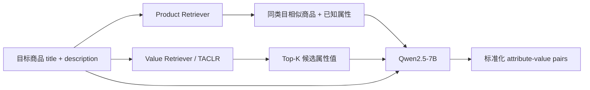
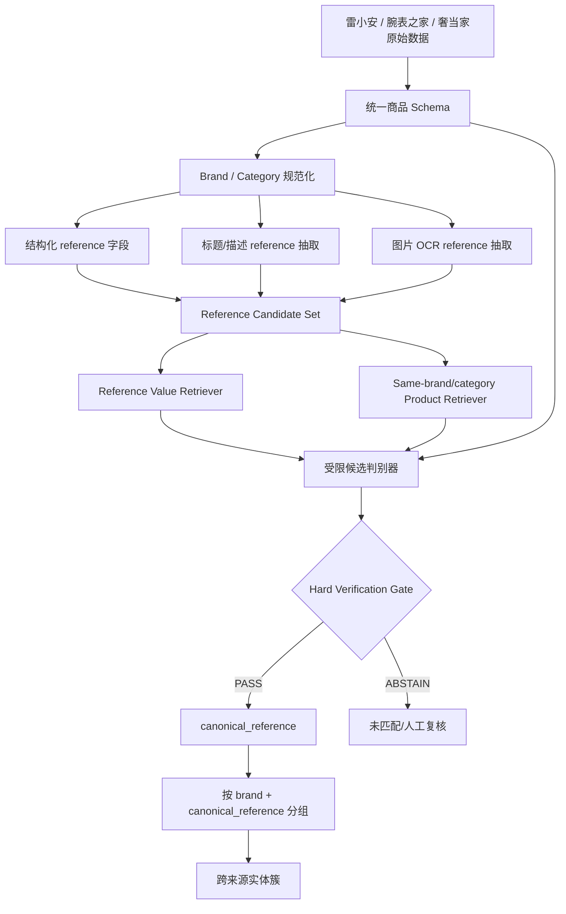
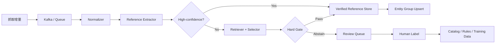

# Multi-Value-Product Retrieval-Augmented Generation for Industrial Product Attribute Value Identification

> 分析人：b  
> 论文：Huike Zou et al., EMNLP 2025 Industry Track  
> ACL Anthology：https://aclanthology.org/2025.emnlp-industry.147/  
> PDF：https://aclanthology.org/2025.emnlp-industry.147.pdf  
> 对应需求：Notion「调研计划 Spec：跨源二奢/腕表商品实体匹配系统（雷小安 × 腕表之家 × 奢当家）」

## 1. 为什么选这篇

当前需求的真实难点并不是一般意义上的 pairwise entity matching，而是：从 100 万～1000 万级、字段高度稀疏、持续增量的二奢商品中，先尽可能可靠地得到 **canonical reference number / 型号**，然后只在 reference 足够确定时进行跨源归并。

MVP-RAG 与这个问题高度相似：论文处理的就是二手电商闲鱼上的 Product Attribute Value Identification（PAVI），输入是噪声很大的商品标题/描述，目标是从动态属性体系中识别标准化属性值。论文使用闲鱼大规模工业数据，并已经上线到真实系统、日处理百万级 listing，因此比只在小型公开 EM 数据集上验证的方法更有生产参考价值。

但本需求有一个比论文更苛刻的约束：**precision 极端优先，不能误匹配，宁可漏匹配**。因此不能照搬论文“RAG + LLM 直接生成属性”的最终决策方式，而应该把 MVP-RAG 改造成：

> **多层检索负责缩小 reference 候选空间；LLM/小模型只负责候选排序与证据解释；最终自动匹配由确定性 reference 校验和拒识机制收口。**

---

## 2. MVP-RAG 原论文技术实现

### 2.1 论文试图解决的三个问题

论文把 PAVI 现有方案分成三类：

1. **两阶段抽取 + 标准化**：先从文本抽非标准属性值，再映射到 taxonomy，容易产生级联错误；第一步没抽出来，第二步永远无法补救。
2. **分类式**：每个属性值是一个 label，对不断新增的 OOD value 不友好。
3. **生成式**：可以生成新值，但 hallucination 和输出不稳定。
4. **纯检索式**：能把输出限制在值库，但阈值难设，对 taxonomy 动态变化也不够灵活。

MVP-RAG 的核心是把“检索商品”和“检索属性值”两个层级一起放进 prompt，再由 LLM 做最终选择/生成。

### 2.2 总体架构

原论文的 pipeline 可以概括成：



它和普通 Product-RAG 的最大区别是：普通 RAG 只检索“相似商品”，MVP-RAG 同时检索“相似商品”和“候选标准值”。后者把自由生成任务部分转化成了一个受候选集约束的 classification-like 任务。

### 2.3 Attribute Value Retrieval

论文使用 TACLR 作为属性值召回器。

- Query：`title + description`
- Corpus：属性 taxonomy 中的标准值
- 为了利用 taxonomy 上下文，每个 value 被写成类似：
  - `a <category> with <attribute> being <value>`
- 使用 TACLR encoder 对 query 和 value 编码
- 只在商品所属 category 下计算相似度
- 取 Top-K 标准值作为候选

这个设计对 reference number 很重要，因为 reference 本质上就是一个“超大规模、长尾、持续增长”的标准属性值集合。

### 2.4 Product Retrieval

论文使用 **BGE-base** 为商品生成 embedding，并使用 cosine similarity 检索相似商品。

关键限制是：**只在相同 category 内检索**。

相似商品的作用不是直接投票，而是作为 few-shot context，让 LLM 看到“相似商品长什么样、其标准属性是什么”。这对二奢尤其适合，因为卖家标题可能只写简称、俗称、系列名，而历史商品中可能存在更完整的标准描述。

### 2.5 Generation Module

论文使用 **Qwen2.5-7B-Instruct**，输入 prompt 由五部分组成：

1. Task definition
2. Note / 规则说明
3. 同类目相似商品及其属性
4. 当前商品信息
5. 每个属性的候选标准值

训练方式是 full parameter fine-tuning：

- 3 epochs
- batch size = 16
- AdamW
- max learning rate = `2e-5`
- 1% warmup
- cosine learning rate scheduler
- prompt prefix 不计 loss，只对特殊 token 和最终输出 token 计算 next-token loss

论文 prompt 还明确允许：候选中没有值时可以生成新值，但建议尽量不要这么做；无法识别则返回 `None`。

### 2.6 数据规模与工业可扩展性

论文的 Xianyu-PAVI 数据中包含：

- 8,803 个商品类目
- 26,645 个 category-attribute pair
- 约 630 万个 category-attribute-value triple
- train 809,528 个商品
- valid 81,699 个商品
- test 85,024 个商品

论文称该系统已经部署在闲鱼真实线上环境，**每天处理数百万商品 listing**。这说明“类目内向量召回 + 值召回 + LLM 生成”的架构在百万级日增量场景有实际工程可行性。

### 2.7 效果与最有参考价值的实验结论

在 Xianyu-PAVI 上：

| 方法 | Precision | Recall | F1 |
|---|---:|---:|---:|
| Qwen2.5 zero-shot | 42.7 | 55.7 | 48.4 |
| Qwen2.5 few-shot | 45.8 | 58.6 | 51.4 |
| Qwen2.5 Product-RAG | 58.3 | 69.1 | 63.2 |
| Qwen2.5 fine-tune | 84.5 | 79.1 | 81.7 |
| TACLR | 85.4 | 87.1 | 86.2 |
| **MVP-RAG** | **93.8** | **85.3** | **89.5** |

对当前 Spec 最重要的不是 F1，而是下面几个规律：

1. **先检索标准值，再让模型选，比纯生成安全得多。**
2. Attribute candidate 数越多，真实值 coverage 会提高，但 **precision 整体下降**；论文中 F1 在候选数约 6 时达到峰值。这说明候选空间不能无限放大。
3. 当真实值出现在 candidate set 中时，最终 F1 明显更高，所以召回器质量极其关键。
4. 相似商品的属性如果被污染，会反向误导模型。论文实验中，对于 brand/model 这类明确属性，当 4 个召回商品中错误信息占比超过约 75% 后，MVP-RAG 有概率输出错误值。
5. 论文最终 precision 93.8% 对普通属性抽取很好，但离“绝对不能误匹配”还非常远；因此 **论文模型不能直接作为自动实体合并器**。

---

## 3. 对当前 Spec 的核心改造：Reference-RAG + Hard Gate

当前 Spec 定义“同一个商品”为 **同一 reference number / 型号**。因此我建议不要训练一个“是否同商品”的黑盒 pairwise matcher，而把问题拆成：

1. **reference 候选发现**
2. **reference 规范化与归一**
3. **reference 证据校验**
4. **只有通过硬校验才 group-by reference**

模型只参与 1～3，最终第 4 步不由模型自由决定。

### 3.1 推荐总体架构



这套架构继承 MVP-RAG 的多层检索，但把最终输出由“生成属性值”改成“受限选择 + 硬验证”。

---

## 4. 数据层设计

### 4.1 原始商品统一表

建议统一成以下核心字段：

```sql
product_raw(
  source              STRING,   -- leixiaoan / xiaohong? / watch之家 / shedangjia
  source_product_id   STRING,
  title               STRING,
  description         STRING,
  structured_brand    STRING,
  structured_reference STRING,
  category            STRING,
  images              ARRAY<STRING>,
  raw_json             JSON,
  crawled_at           TIMESTAMP,
  updated_at           TIMESTAMP
)
```

### 4.2 Reference evidence 表

不要只保存最终 reference，要保存完整证据链：

```sql
reference_evidence(
  source,
  source_product_id,
  evidence_type,       -- structured / title_regex / title_model / ocr / rag
  raw_value,
  normalized_value,
  span_text,
  image_id,
  confidence,
  extractor_version,
  created_at
)
```

这样每个自动 match 都可以解释成“为什么认为它是这个 reference”，便于审计和回滚。

### 4.3 Canonical reference 字典

```sql
reference_catalog(
  brand_id,
  canonical_reference,
  family,
  aliases,
  normalized_forms,
  valid_patterns,
  source_count,
  trusted_source_count,
  status,              -- active / suspect / deprecated
  version
)
```

reference catalog 是整个系统最关键的资产。最初可以由三个来源的高置信结构化 reference 字段去重构建，再逐渐补充品牌官网/人工审核结果。

---

## 5. Reference 规范化

腕表 reference 的危险点在于：连字符、点号、空格、大小写、斜杠、Unicode 字符、前后缀，以及“型号”和“平台 SKU/库存号”长得很像。

建议规范化函数只做 **可逆、低风险变换**：

```python
def normalize_reference(x: str) -> str:
    x = unicode_nfkc(x)
    x = x.upper().strip()
    x = normalize_dash(x)
    x = collapse_spaces(x)
    x = remove_spaces_around_safe_separators(x)
    return x
```

不建议一开始就粗暴删除所有 `- / .`，因为这些符号在部分品牌中可能区分真实型号。

同时保留多个 comparison form：

- `display_form`：人类可读
- `strict_form`：仅做大小写/Unicode/空格归一
- `compact_form`：供召回使用，可弱化部分标点

**最终 hard match 应优先使用 strict_form。** compact_form 只能用于 candidate retrieval，不能直接判同。

---

## 6. Reference 候选抽取：三路证据

### 6.1 路径 A：结构化字段

如果平台存在独立 reference/model 字段，这是最高优先级输入，但仍不能无条件相信，因为平台字段可能被卖家填成 SKU、系列或错误值。

处理：

1. role classifier 判断它更像：
   - 品牌 reference
   - 平台 SKU
   - 店铺库存号
   - 序列号
   - 尺寸/年份
   - unknown identifier
2. 只有 role=`brand_reference` 才进入高置信候选。

### 6.2 路径 B：标题/描述抽取

不要只做一个通用 NER。推荐“规则 + 字典召回 + 小模型”的组合：

- regex 发现字母数字混合 identifier span
- brand-specific pattern 过滤明显不可能的格式
- Reference Retriever 在该品牌 reference catalog 中召回 Top-K
- 小模型判断候选 reference 是否真正描述当前售卖主体

特别要识别这些负语境：

- `适配 XXX`
- `适用于 XXX`
- `同款 XXX`
- `配 XXX`
- `表带 / 表盒 / 保卡 / 配件` 中出现的主表 reference

这些字符串即使精确命中 reference，也不能说明当前 listing 卖的是那只表。

### 6.3 路径 C：图片 OCR

图片只作为独立证据，不作为“看起来很像”的视觉匹配器。

优先 OCR 的图像区域：

- 表背刻字
- 保卡
- 吊牌
- 证书
- 盒贴

OCR 结果再进入同一套 reference normalization + catalog retrieval。

为了控制成本，图片 OCR 不必对所有 listing 全量执行。建议仅对：

- 文本无 reference
- 文本候选冲突
- 高价值品牌 hard case
- 人工复核队列

执行 OCR。

---

## 7. 把 MVP-RAG 改成 Reference 候选检索器

### 7.1 Value Retriever：从“属性值”换成“reference catalog”

MVP-RAG 原文把属性值写成带 category/attribute 上下文的自然语言。这里可改成：

```text
A {brand} watch in family {family} with reference number {reference}
```

输入 query：

```text
brand={brand}
category={category}
title={title}
description={description}
extracted_identifier={identifier_spans}
```

检索范围必须先按 `brand_id` 限定，再按 family/category 做可选缩小。

可直接从 BGE / E5 / bge-m3 起步，也可复现 TACLR 风格 contrastive retriever。

### 7.2 Product Retriever：只做 evidence augmentation

相似商品检索限定：

- same brand
- same broad category（watch / bag / accessory）
- 尽可能 same family

向量索引可以用 Faiss / Milvus / pgvector / Elasticsearch dense_vector。

**关键规则：相似商品的 reference 永远不是硬证据。**

原因是 MVP-RAG 自己的实验已经显示，相似商品标签污染会反向误导生成器。对于当前 precision-first 场景，相似商品只能帮助理解简称、系列和上下文，不能替代目标 listing 自身证据。

### 7.3 Top-K 不宜过大

论文发现增加候选值数量虽然提高 coverage，但 precision 会下降，且 F1 在约 K=6 后不再获益。

当前需求更重 precision，因此建议：

- 默认 `K=3`
- hard case 可扩到 `K=5~6`
- K>6 不自动决策，只进入 review

---

## 8. 受限判别器：禁止自由生成 reference

MVP-RAG 原论文允许候选集合之外生成 OOD value，这对属性补全是优势，但对“绝不误匹配”的 reference matching 是风险。

生产上建议把输出 schema 限制为：

```json
{
  "decision": "SELECT | UNKNOWN | CONFLICT",
  "candidate_reference": "candidate_1 | candidate_2 | candidate_3 | null",
  "evidence": [
    {"type": "structured", "span": "..."},
    {"type": "title", "span": "..."},
    {"type": "ocr", "span": "..."}
  ],
  "negative_context": false
}
```

模型 **不得输出 candidate set 之外的 reference 作为自动结果**。

如果模型发现一个新的 OOD reference：

1. 可以把它写入 `proposed_reference`；
2. 进入人工审核；
3. 审核通过后加入 reference catalog；
4. 后续商品才可自动使用。

这样既保留 OOD 扩展能力，又不会把幻觉直接变成实体合并错误。

---

## 9. Hard Verification Gate：真正保证 precision 的地方

这是 MVP-RAG 原论文没有、但当前需求必须增加的层。

建议自动放行必须满足：

### Rule 1：品牌一致

`canonical_brand(product) == catalog.brand_id`

若品牌未知或冲突，直接 abstain。

### Rule 2：reference 必须来自可定位证据

至少存在一条 evidence 可以定位到：

- 结构化字段原值
- title/description 原始 span
- 图片 OCR 原始 span

不能只有“模型推理说它像某型号”。

### Rule 3：Role 必须是主商品 reference

reference span 若出现在：

- 兼容型号
- 配件说明
- 表带适配
- 赠品
- 对比款

则否决。

### Rule 4：冲突即拒识

如果不同独立证据产生不同 canonical reference：

```text
structured_ref != title_ref
或
text_ref != ocr_ref
```

不做多数投票，直接 `CONFLICT -> review`。

### Rule 5：自动 match 使用 strict canonical equality

```text
brand_id 相同
AND canonical_reference.strict_form 完全一致
```

不允许用 embedding similarity、编辑距离、视觉相似度直接做最终实体合并。

### Rule 6：弱归一结果只用于召回

如果两个 reference 只有 compact_form 相同，但 strict_form 不同，例如标点差异可能具有语义，则必须经过 brand-specific normalization rule 或人工验证后才能等价。

---

## 10. 最终不需要 O(N²) Pairwise Matching

当 canonical reference 已经可靠后，不应该再做三源全量笛卡尔积。

直接：

```sql
SELECT
  brand_id,
  canonical_reference,
  collect_list(struct(source, source_product_id)) AS members
FROM product_reference_verified
WHERE verification_status = 'PASS'
GROUP BY brand_id, canonical_reference;
```

百万～千万级数据的主要计算量变成：

- O(N) 规范化/抽取
- ANN reference retrieval
- 少量 unresolved item 的 LLM/OCR
- 最终 hash/group-by

而不是 O(N²) pair comparison。

---

## 11. 建议的线上分层策略

### Tier 0：零模型快速路径

满足：

- trusted structured reference
- brand 已知
- reference 在 catalog 中
- 无任何冲突证据

直接 PASS。

这是成本最低、precision 最高的路径，应覆盖尽可能多的数据。

### Tier 1：文本规则 + catalog exact/alias

标题中抽到 reference，经过 brand-specific pattern + catalog strict mapping，可定位原始 span，无负语境。

通过则 PASS。

### Tier 2：Reference-RAG 受限选择

当文本中有多个 identifier 或格式不标准：

- reference retriever Top-3
- same-brand product retriever Top-N
- selector 输出 SELECT/UNKNOWN/CONFLICT
- 再进入 hard gate

只有 hard gate PASS 才自动归并。

### Tier 3：OCR / 多模态补证

文本缺失或冲突时，对表背/保卡等图像 OCR。

OCR 证据用于：

- 与文本 reference 一致 -> 增强可信度
- 与文本冲突 -> 拒识
- 单独出现 -> 可进入高置信候选，但建议初期人工验证后逐步放开

### Tier 4：人工复核

包括：

- OOD reference
- 多候选近邻
- 新品牌
- 文本/图片冲突
- 配件语境
- catalog 中存在多个高度相似 reference

人工结果回流 reference catalog 和 hard-negative 数据集。

---

## 12. 几百对黄金标签应该怎么用

不建议把几百对标签主要用来训练一个 pairwise matcher。更高收益的用法是：

### 12.1 建立 hard-negative benchmark

刻意采集：

- 同品牌、同系列、不同 reference
- reference 只差 1 个字符
- reference 只差后缀
- 主表 vs 表带/配件
- 标题出现“适配某 reference”
- 错填结构化 reference
- OCR 易混字符 `0/O, 1/I, 5/S, 8/B`

这些才是真正会制造 catastrophic false positive 的样本。

### 12.2 校准自动放行阈值

输出不要只评 F1，要按路径单独统计：

- Precision@Tier0
- Precision@Tier1
- Precision@Tier2
- Coverage / auto-match rate
- Abstain rate
- False merge count

目标不是最大 F1，而是在 0 或极低 false merge 下逐步扩大 coverage。

### 12.3 Active Learning

人工只标：

- 模型 candidate margin 最小
- hard gate 冲突
- 新 reference
- 新格式
- 新来源/新品牌

这样几百条标签能最大化价值。

---

## 13. Precision-first 评测标准

“绝对不能误匹配”不能只靠平均模型指标证明。建议上线门槛：

1. **自动合并集 precision 单独评估**，不要和人工 review 混算。
2. 至少建立品牌分层的 adversarial holdout。
3. 每个自动路径维护 FP 审计样本。
4. 新规则/新模型用 shadow 模式跑一段时间，不直接影响实体簇。
5. 每个 match 保存 decision trace，支持回滚。
6. reference catalog 版本化，实体簇记录 `catalog_version` 与 `extractor_version`。

对于最严谨的自动路径，应优先使用可证明的 deterministic rule，而不是声称一个 99.x% 模型就等于“不会错”。

---

## 14. 增量更新架构

推荐事件流：



技术选型可以很务实：

- 批处理：Spark / DuckDB / ClickHouse
- 流式：Kafka + Flink / Kafka Streams
- OLTP 元数据：PostgreSQL
- 大规模查询：ClickHouse
- 向量索引：Faiss（离线）或 Milvus / Elasticsearch / pgvector（在线）
- LLM serving：vLLM
- OCR：PaddleOCR / EasyOCR / 商用 OCR 均可，重点是证据可回溯

---

## 15. 最小可落地版本（MVP）

### Phase 0：先做 deterministic baseline

1. 三源统一 schema
2. 品牌 normalization
3. 收集高置信 structured reference，建立初版 catalog
4. reference strict normalization
5. `brand + strict_reference` group-by
6. 全部冲突不合并

这一步往往已经能拿到一批非常高 precision 的跨源实体簇。

### Phase 1：标题 reference extraction

加入：

- identifier regex
- reference catalog lookup
- brand-specific patterns
- compatibility/accessory negative rules

目标：扩大 coverage，不改变最终 strict equality 的 match 规则。

### Phase 2：Reference-RAG

加入：

- BGE reference retriever
- same-brand/category product retriever
- Qwen2.5 受限 selector（优先 LoRA/SFT，不必一开始 full FT）
- Top-K=3 起步
- SELECT/UNKNOWN/CONFLICT schema

### Phase 3：OCR 与主动学习

只对 unresolved 队列做 OCR；收集人工 hard case，继续补 catalog、规则与 selector。

---

## 16. 一个可以直接实现的决策函数

```python
from dataclasses import dataclass
from typing import Optional, List

@dataclass
class Evidence:
    kind: str
    raw: str
    canonical: Optional[str]
    role: str
    negative_context: bool


def verify_reference(product, evidences: List[Evidence], brand_id: str):
    valid = [
        e for e in evidences
        if e.canonical
        and e.role == "brand_reference"
        and not e.negative_context
    ]

    if not brand_id or not valid:
        return {"status": "ABSTAIN", "reason": "NO_TRUSTED_EVIDENCE"}

    refs = {e.canonical for e in valid}

    # precision-first：出现冲突不做投票
    if len(refs) != 1:
        return {"status": "ABSTAIN", "reason": "REFERENCE_CONFLICT"}

    ref = next(iter(refs))

    if not catalog_exists(brand_id, ref):
        return {
            "status": "ABSTAIN",
            "reason": "OOD_REFERENCE",
            "proposed_reference": ref,
        }

    if not brand_reference_compatible(brand_id, ref):
        return {"status": "ABSTAIN", "reason": "BRAND_REF_CONFLICT"}

    return {
        "status": "PASS",
        "brand_id": brand_id,
        "canonical_reference": ref,
    }
```

真正的实体聚类只消费 `status=PASS` 的记录。

---

## 17. 为什么这个方案比直接训练实体匹配模型更适合当前需求

### 17.1 业务定义本身就是 reference equality

既然 ground truth 定义明确为“同一 reference”，就不应该让模型学习一个更模糊的“商品相似度”。

### 17.2 同系列不同 reference 是最危险 hard negative

腕表外观高度相似，图片/文本 embedding 很容易把相邻 reference 拉得很近。把多模态相似度作为最终 match signal 会与 precision-first 目标冲突。

### 17.3 Reference-RAG 把模型放在正确的位置

模型擅长：

- 处理脏标题
- 识别简称
- 从上下文判断 identifier 角色
- 在少量候选里消歧

模型不应该负责：

- 在没有明确 reference 证据时“猜一个型号”
- 用视觉相似度越过 reference 定义直接判同款
- 在冲突证据下强制二选一

### 17.4 可审计、可回滚

每个 match 都能追溯到原始 reference span / OCR / structured field，而不是一个不可解释的 pair score。

---

## 18. 对 MVP-RAG 的最终评价

MVP-RAG 最值得复用的不是“Qwen2.5-7B 生成属性”本身，而是它证明了两个工程事实：

1. **商品级 RAG + 标准值级 RAG 同时使用，比只检索相似商品可靠得多。**
2. 在二手电商真实噪声和百万级流量下，这种多层检索架构可以生产化运行。

但它的 93.8% precision 仍然不满足本需求的“误匹配近乎不可接受”。因此直接落地时应做一个关键反转：

> 从“检索增强生成”改成“检索增强受限判别”，再由 deterministic hard gate 决定能否进入 canonical reference 分组。

如果只做一版最小系统，我会优先实现：

> **品牌规范化 → reference catalog → 多证据抽取 → strict canonical reference 校验 → conflict abstain → group-by brand+reference**

然后再把 MVP-RAG 式的多层检索加在“无法确定 reference”的长尾区域，而不是让它接管全部商品。

这条路线最符合当前 Spec 的三个核心条件：**千万级可扩展、字段稀疏可补全、precision 极端优先。**
