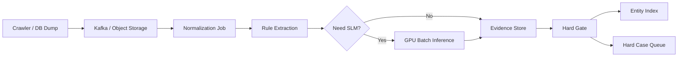

# Progressive Fine-Tuning for Cost-Effective Structured Attribute Generation in E-commerce

> 分析人：b  
> 论文：Lakshman Kolasani, Fatemeh Taheri Dezaki, ACL 2026 Industry Track  
> ACL Anthology：https://aclanthology.org/2026.acl-industry.40/  
> PDF：https://aclanthology.org/2026.acl-industry.40.pdf  
> 对应需求：Notion「调研计划 Spec：跨源二奢/腕表商品实体匹配系统（雷小安 × 腕表之家 × 奢当家）」

## 1. 本次选择与排重

在分析前先检查了 `奢侈品调研/b/` 已有结果。此前已经分析过的条目包括：Ameli、AnyMatch、Confidence Classifiers、DeepBlocker、Ditto、End-to-end multi-modal product matching、7B LLM Entity Matching、selective entity matching、GraLMatch、LATEX-Numeric、Large Scale Generative Multimodal Attribute Extraction、MVP-RAG、Tailoring entity resolution、TransClean、Using LLMs for Extraction and Normalization、parts-distributor-sku-classifier、pyJedAI 等。

本篇 **Progressive Fine-Tuning for Cost-Effective Structured Attribute Generation in E-commerce** 尚未分析，因此满足“每次分析前排除已分析文章”的要求。

这篇论文不是一个 pairwise entity matching 模型，它研究的是：在大规模电商商品录入系统中，如何把昂贵的大模型能力逐步迁移到更便宜的小模型，并利用生产数据持续找出当前模型的薄弱样本，进行参数高效的渐进式微调。

它与当前 Spec 的连接点非常直接：

- 当前数据量是 100 万～1000 万级，并且会持续增量；
- reference number / 型号有时有结构化字段，有时埋在标题、描述、图片中；
- 系统不适合长期对所有商品调用昂贵大模型；
- 可接受几百对人工黄金标签，但不希望持续做大规模人工标注；
- 真正需要模型解决的是 **reference 抽取、规范化、角色判断和边界样本拒识**，最终是否合并应该由硬规则控制。

因此本文最值得复用的不是它的“商品属性生成”任务本身，而是这套闭环：

> **当前模型推理 → 找出当前模型失败最多的样本 → 只训练这些新难例 → 从上一轮 checkpoint 继续 LoRA → 固定基准评测 → 部署 → 用新线上失败样本进入下一轮。**

对当前项目，我建议把它改造成 **Progressive Reference Extraction + Deterministic Match Gate**。

---

## 2. 原论文技术实现

### 2.1 原论文任务

输入是商品的多模态信息：

- 商品图片；
- 商品文本描述；
- 商品类目对应的 attribute schema。

输出为一组结构化属性：

```json
{
  "brand": "xyz",
  "color": "red",
  "material": "steel"
}
```

论文强调输出必须满足预定义 schema，包括 allowed values、格式和字段约束。

其生产场景平均每件商品要生成 50+ 个结构化属性，因此原系统核心矛盾是：大模型效果好，但在百万级请求上延迟和成本太高。

### 2.2 Completeness 指标

论文定义：

```text
Completeness(y)
= 有效且非空的属性数 / 当前类目要求生成的属性总数
```

这里的 `valid` 指的是满足 schema，而不是必须和某一个 ground truth 字符串 exact match。

例如 catalog 中颜色为 `Dark Blue`，模型输出 `Navy`，如果二者都是 schema 中允许的颜色，仍然算 complete。

这非常适合“辅助商品录入”，但 **不适合直接作为当前 reference matching 的 acceptance metric**。

因为当前需求里：

> reference `126610LN` 与 `126610LV` 即使都合法，也绝不能互换；合法但不同的 reference 就是错误。

所以论文的训练闭环可以迁移，论文的 completeness 定义不能直接迁移。

### 2.3 Completeness-Deficit Guided Curation

论文最关键的创新是用生产 catalog 作为隐式反馈源，不需要每一轮重新人工标注。

对同一个商品 `x`：

```text
Gap(x) = C_catalog(x) - C_model(x)
```

其中：

- `C_catalog(x)`：已有生产 catalog 的属性完整度；
- `C_model(x)`：当前模型生成结果的完整度。

每一轮选择 Gap 最大的 `k` 个商品：

```text
S_t = TopK_x [C_catalog(x) - C_M(t-1)(x)]
```

直觉是：

- catalog 明明有很多字段；
- 当前模型却没有生成出来；
- 这说明该商品很可能包含当前模型尚未学会的模式；
- 优先训练这类样本，比随机取样更有效。

本质上这是一种 **面向当前模型弱点的主动数据选择**。

### 2.4 Progressive Training 与 Cumulative Training

论文比较两种训练方式。

#### Cumulative Training

每轮从原始 base model `M0` 重新开始，把此前所有样本累计起来：

```text
M_t = FineTune(M0, S1 ∪ S2 ∪ ... ∪ St)
```

#### Progressive Training

每轮只训练本轮新选出的难例，但从上一轮 checkpoint 继续：

```text
M_t = FineTune(M_(t-1), St)
```

论文认为 Progressive 的优势是：

- 已学会的模式不需要从头再学；
- 每轮训练都集中在当前模型还不会的 hard cases；
- 固定训练预算下，小数据集可以获得更多有效优化；
- checkpoint 本身携带了此前轮次学习到的能力。

### 2.5 LoRA 配置

论文使用 LoRA 做参数高效微调：

- Base SLM：Amazon Nova 2 Lite；
- LoRA rank：32；
- 每轮新训练样本：`k = 1,000`；
- 每轮 validation：100；
- 每轮训练 100 steps；
- learning rate：`1e-5`；
- global batch size：32；
- sequence length：8192；
- 训练硬件：4 × NVIDIA A100；
- 属性生成分为 `B = 4` 批，减少一次生成过长上下文造成的完整度下降。

论文方法本身是 model-agnostic，只要底座支持 LoRA 即可。

### 2.6 数据与评测

论文使用真实生产商品录入数据：

- 多模态输入：image + text；
- 平均 50+ 属性；
- 离线 benchmark 约 1,000 商品；
- 覆盖 1,000+ 类目；
- 长尾分布；
- text+image：37.6%；
- text-only：45.9%；
- image-only：16.5%。

线上还做了真实 A/B test。

### 2.7 结果

论文中：

| 模型 | Completeness |
|---|---:|
| Claude Sonnet 4.5 | 70.40% |
| Nova 2 Lite base | 66.03% |
| Nova 2 Lite iter 1 | 71.09% |
| Progressive iter 2 | **74.20%** |
| Cumulative iter 2 | 73.72% |

另外：

- Progressive iter 2 只训练本轮 1K 新样本；
- Cumulative iter 2 从 base 重新训练累计 2K；
- extended experiment 中 cumulative 到 5 轮反而下降到 72.4%；
- Progressive 的 correct completeness 从 17.70% 提升到 20.50%；
- 相比 Claude Sonnet 4.5，最终 SLM 推理成本降低约 98%；
- p90 latency 降低约 70%；
- 线上 user acceptance rate 为 86.4%，Claude 为 88.3%。

最值得注意的不是成本数字，而是论文暴露出的一个风险：

> **离线 Progressive 模型 74.2% 高于 Claude 70.4%，但上线后 production completeness 59.1% 低于 Claude 63.0%。**

作者明确把这个反转归因于 distribution shift；而且 Progressive 实验只做了两轮，长周期是否产生偏差累积仍是 open question。

这恰好说明当前二奢项目不能只做“线上失败样本不断续训”，必须额外加入：

- 固定黄金集；
- replay / anchor 样本；
- 品牌级切片评测；
- 自动回滚；
- 硬规则不随模型版本变化。

---

## 3. 当前 Spec 与原论文最重要的差异

当前 Spec 的目标不是“尽可能多生成属性”，而是：

> 从雷小安、腕表之家、奢当家中识别 **同一 reference number / 型号** 的记录，并且绝对不能误匹配。

这使目标函数发生根本变化。

### 3.1 不能优化“生成得更多”

原论文希望模型尽量多填字段。

当前项目应该优化：

```text
Reference Precision >> Reference Recall
Auto-Match Precision >> Auto-Match Coverage
```

宁愿输出：

```json
{"reference": null, "decision": "ABSTAIN"}
```

也不能把：

```text
Rolex 126610LN
```

错误抽成：

```text
126610LV
```

### 3.2 模型不能拥有最终 merge 权限

论文模型直接生成属性供用户确认。

当前系统里模型只能：

- 找 reference 候选；
- 标记字符串在文本中的 span；
- 判断编号角色；
- 规范化格式；
- 给出 evidence type；
- 输出置信度或拒识。

最终跨源 merge 必须由确定性 gate 完成。

### 3.3 “同款相似”不是正证据

两只腕表可以：

- 品牌相同；
- 系列相同；
- 外观几乎一样；
- 图片 embedding 极近；

但 reference 仍然不同。

因此：

> 图像、标题语义、embedding、LLM 都可以辅助发现 reference，但不能覆盖 reference exact equality。

---

## 4. 推荐直接落地：Progressive Reference Extraction + Deterministic Match Gate

## 4.1 总体架构

```mermaid
flowchart TD
    A[雷小安 / 腕表之家 / 奢当家增量数据] --> B[Raw Ingestion]
    B --> C[统一 Product Schema]

    C --> D[Brand Canonicalization]
    D --> E1[结构化 reference 字段]
    D --> E2[Regex / 字典候选抽取]
    D --> E3[SLM Reference Extractor]
    D --> E4[图片 OCR / VLM 辅助]

    E1 --> F[Reference Evidence Store]
    E2 --> F
    E3 --> F
    E4 --> F

    F --> G[Reference Canonicalizer]
    G --> H{Deterministic Hard Gate}

    H -->|PASS| I[verified canonical_reference]
    H -->|ABSTAIN| J[unresolved / 人工复核]
    H -->|REJECT| K[冲突/非本商品型号]

    I --> L[brand_id + canonical_reference]
    L --> M[跨源实体组]

    J --> N[Hard Case Queue]
    K --> N
    N --> O[少量人工 / 高可信弱标签]
    O --> P[Progressive Curator]
    P --> Q[LoRA Round t]
    Q --> R[固定黄金集 + 回放集评测]
    R -->|通过| S[部署 Extractor v(t)]
    R -->|失败| T[回滚]
    S --> E3
```

这个设计把机器学习风险局限在“抽取层”，实体归并层保持可解释和确定性。

---

## 5. 数据模型

### 5.1 product_raw

```sql
CREATE TABLE product_raw (
    source              VARCHAR,
    source_product_id   VARCHAR,
    title               TEXT,
    description         TEXT,
    structured_brand    VARCHAR,
    structured_reference VARCHAR,
    category            VARCHAR,
    image_urls          JSON,
    raw_json             JSON,
    crawled_at           TIMESTAMP,
    updated_at           TIMESTAMP,
    PRIMARY KEY (source, source_product_id)
);
```

所有模型升级前都保留 raw 数据，任何抽取结果必须可重算。

### 5.2 reference_evidence

```sql
CREATE TABLE reference_evidence (
    source                VARCHAR,
    source_product_id     VARCHAR,
    evidence_id           VARCHAR,
    extractor_type        VARCHAR,
    -- structured_field / regex / slm / ocr / vlm / human

    raw_value             VARCHAR,
    normalized_value      VARCHAR,
    text_span             TEXT,
    image_id              VARCHAR,

    role                  VARCHAR,
    -- product_reference / compatible_reference / platform_sku /
    -- seller_sku / serial_number / accessory_reference / unknown

    confidence            DOUBLE,
    extractor_version     VARCHAR,
    created_at            TIMESTAMP,

    PRIMARY KEY (source, source_product_id, evidence_id)
);
```

这里最关键的是 `role`。

很多误匹配并不是“抽错字符串”，而是 **抽到了正确字符串，但它不是当前商品自己的 reference**。

例如：

```text
适配 Rolex 126610LN 的表带
```

字符串 `126610LN` 完全正确，但售卖商品是表带，不是 Rolex 126610LN 腕表。

所以 reference extraction 必须升级为：

> **候选字符串抽取 + 编号角色分类。**

### 5.3 reference_catalog

```sql
CREATE TABLE reference_catalog (
    brand_id              VARCHAR,
    canonical_reference   VARCHAR,
    normalized_key        VARCHAR,
    aliases               JSON,
    pattern_version       VARCHAR,
    source_provenance     JSON,
    status                VARCHAR,
    PRIMARY KEY (brand_id, canonical_reference)
);
```

`aliases` 只保存“可逆的格式别名”：

```text
126610-LN
126610 LN
126610LN
```

不能把语义近似型号放进 alias。

### 5.4 product_reference_decision

```sql
CREATE TABLE product_reference_decision (
    source                VARCHAR,
    source_product_id     VARCHAR,
    brand_id              VARCHAR,
    canonical_reference   VARCHAR,
    decision              VARCHAR,
    -- PASS / ABSTAIN / REJECT

    decision_reason       VARCHAR,
    evidence_ids          JSON,
    gate_version          VARCHAR,
    extractor_version     VARCHAR,
    decided_at            TIMESTAMP,
    PRIMARY KEY (source, source_product_id)
);
```

最终所有自动实体匹配都应该能够回答：

```text
这条商品为什么被识别成这个 reference？
用了哪几个证据？
哪个模型版本？
哪个规则版本？
```

---

## 6. Reference Canonicalization：一定要品牌内处理

不能建立一个全局“去掉符号然后比较”的 canonicalizer。

推荐：

```python
def canonicalize(brand_id, raw_ref):
    s = unicode_nfkc(raw_ref)
    s = normalize_fullwidth(s)
    s = upper_ascii(s)
    s = trim_whitespace(s)

    rule = BRAND_RULES[brand_id]
    return rule.normalize(s)
```

每个品牌自己定义允许的格式变化。

例如安全转换可以包括：

- 大小写统一；
- 全角转半角；
- 明确允许的空格删除；
- 明确允许的连字符格式统一；
- Unicode 兼容字符统一。

高风险转换不要自动做：

- 删除所有 `/`；
- 删除所有 `.`；
- 删除前导 0；
- 任意去掉字母后缀；
- 模糊编辑距离纠错。

尤其腕表 reference 中一个字母后缀经常代表完全不同款式。

因此建议 canonicalization 函数返回：

```json
{
  "canonical": "126610LN",
  "transformations": ["upper", "remove_allowed_space"],
  "safe": true
}
```

任何需要 fuzzy 修复的结果一律 `ABSTAIN`。

---

## 7. Inference Pipeline

## 7.1 Layer 0：结构化字段优先

如果某来源已经有独立 reference 字段：

1. 先做字段级质量审计；
2. 统计品牌内 pattern；
3. 检查是否混入 source SKU；
4. 通过后作为最高优先级 evidence。

但不能因为“字段名叫型号”就天然可信。

建议抽样检查：

```text
structured_reference_precision_by_source_brand
```

只有通过品牌级精度门槛后，字段才允许进入自动 PASS 规则。

## 7.2 Layer 1：Regex + Dictionary

先用低成本规则抽候选：

```python
candidates = brand_specific_regex(title + " " + description)
```

然后查 `reference_catalog`：

```python
known = [c for c in candidates if catalog.contains(brand_id, c)]
```

规则层只负责 candidate discovery，不直接做匹配。

## 7.3 Layer 2：SLM Reference Extractor

只有下面情况才调用模型：

- 没有结构化 reference；
- regex 找到多个候选；
- 标题中编号和平台 SKU 混在一起；
- 出现“适配 / compatible / for / 适用于”等关系词；
- reference 是自然语言别名或被特殊符号拆开；
- 来源发生 schema 变化。

模型输出必须是受约束 JSON：

```json
{
  "brand": "ROLEX",
  "candidates": [
    {
      "raw": "126610LN",
      "span": "劳力士潜航者 126610LN 黑水鬼",
      "role": "product_reference",
      "normalized": "126610LN",
      "evidence": "title"
    }
  ],
  "decision": "EXTRACTED"
}
```

禁止自由输出一个“猜测的 reference”。

要求：

- `raw` 必须可回溯到输入 span，除非来自显式字典 alias；
- `normalized` 必须由 deterministic canonicalizer 产生，而不是模型生成；
- 模型只预测 span 与 role；
- 如果没有明确证据，返回 `ABSTAIN`。

这会显著降低 hallucination。

## 7.4 Layer 3：OCR / VLM 只做独立佐证

图片优先使用：

- 表背；
- 保卡；
- 吊牌；
- 包装标签；
- 证书。

流程：

```text
image
 -> OCR
 -> candidate string
 -> brand-specific canonicalizer
 -> catalog membership check
 -> evidence store
```

不要让 VLM 直接看表盘外观后“猜型号”。

视觉相似可以作为：

- 冲突报警；
- 人工复核排序；
- OCR 图片优先级。

但不应该成为自动 PASS 的唯一正证据。

---

## 8. Deterministic Hard Gate

这是整个方案里最重要的一层。

### 8.1 推荐 PASS 条件

可以定义几个非常保守的自动放行路径。

#### Path A：双方可信结构化字段 exact match

```text
same canonical brand
AND source A trusted structured_reference = R
AND source B trusted structured_reference = R
AND no conflict evidence
```

#### Path B：可信结构化字段 + 独立文本证据

```text
same canonical brand
AND source A trusted structured_reference = R
AND source B title span explicitly contains R
AND role = product_reference
AND canonicalized(R) exact equal
AND no conflict
```

#### Path C：文本 + OCR 双证据

只在没有可信结构化字段时：

```text
same canonical brand
AND title extractor => R
AND OCR from back/card/tag => R
AND role(product text) = product_reference
AND canonical exact equal
AND R exists in trusted reference catalog
AND no other incompatible reference appears
```

这条路径可以一开始关闭，积累足够黄金数据后再开启。

### 8.2 必须 ABSTAIN 的情况

```text
1. 同商品出现两个不同 product_reference 候选
2. reference 只来自模型生成，输入中不存在证据
3. 只有视觉 embedding 相似
4. reference 不在可信 catalog，且没有高可信结构化字段
5. 短编号高度歧义
6. 品牌不确定
7. 出现 accessory / compatible / 适配语义且 role 不确定
8. OCR 与文本 reference 冲突
9. canonicalization 需要 fuzzy edit
10. 新品牌 / 新来源发生明显分布漂移
```

### 8.3 图片只能 VETO，不要 OVERRIDE

例如：

```text
文本：126610LN
OCR：126610LV
```

正确处理：

```text
ABSTAIN: evidence_conflict
```

而不是让某个 multimodal classifier 决定其中一个。

---

## 9. 把论文的 Completeness Gap 改造成 Reference Deficit

原论文：

```text
Gap = catalog completeness - model completeness
```

当前项目建议定义多个难例分数。

## 9.1 Extraction Deficit

对已经存在可信 reference 的商品：

```text
reference_deficit =
    1, if trusted_reference exists but model failed to extract exact reference
    0, otherwise
```

## 9.2 Conflict Score

```text
conflict_score =
    count(distinct normalized product_reference evidence)
```

越多越值得进入下一轮训练或人工复核。

## 9.3 Role Confusion Score

重点抽取：

```text
compatible_reference
platform_sku
seller_sku
serial_number
accessory_reference
```

被模型误判为 `product_reference` 的样本。

这类 negative 对 precision 最重要。

## 9.4 Boundary Hardness

构造同品牌近邻 reference hard negatives：

```text
126610LN vs 126610LV
116500LN vs 126500LN
5711/1A vs 5711/1R
```

训练时优先选择仅差 1～2 个字符、但语义完全不同的型号。

这比随机 negative 有价值很多。

## 9.5 推荐 Curator 评分

```python
score = (
    5.0 * is_false_positive
  + 4.0 * role_confusion
  + 3.0 * evidence_conflict
  + 2.0 * trusted_ref_missed
  + 1.5 * near_reference_negative
  + 1.0 * new_source_or_brand
)
```

每一轮只从最高分样本里抽训练数据。

这就是对论文 Completeness-Deficit Guided Curation 的 precision-first 改写。

---

## 10. Progressive Fine-Tuning 在当前项目里的正确用法

不建议训练“两个 listing 是否匹配”的 pairwise classifier。

建议训练一个 **Reference Evidence Extractor**。

### 10.1 训练目标

输入：

```text
source
brand
category
title
description
可选 OCR 文本
```

输出：

```json
{
  "spans": [
    {
      "text": "126610LN",
      "role": "product_reference"
    },
    {
      "text": "LX12345",
      "role": "platform_sku"
    }
  ]
}
```

模型不负责 canonical reference 最终字符串。

### 10.2 底座选择

不必绑定论文的 Nova 2 Lite。

可以选择当前基础设施更容易部署的 3B～8B instruct model，例如：

- 支持 LoRA；
- 中英混合 tokenization 良好；
- 能稳定输出 JSON；
- 可本地批量推理；
- 单条成本远低于大闭源模型。

大模型只用于：

- 初期 teacher；
- 极少量人工复核辅助；
- 生成训练解释但不生成最终自动标签。

### 10.3 每轮数据组成

原论文每轮完全训练新的 top-k hard examples。

当前项目为了防止长期漂移，建议不要 100% 照搬。

每轮：

```text
70% 当前新 hard cases
20% anchor replay
10% random production slice
```

其中：

#### hard cases

当前版本最容易错的样本。

#### anchor replay

固定保留：

- 高频品牌；
- 历史已解决错误；
- accessory / compatibility negative；
- 容易混淆的 reference pair；
- 三个来源的代表性 schema。

#### random production slice

防止 curator 只看异常样本，导致训练分布越来越偏。

这一步是针对论文自己承认的 distribution shift / iterative bias 风险做的必要改造。

### 10.4 推荐第一版 LoRA 参数

可以从论文参数附近开始：

```yaml
lora_rank: 32
learning_rate: 1e-5
sequence_length: 2048-4096
batch_size_global: 32
new_hard_samples_per_round: 500-2000
```

当前任务只做 reference span + role，不需要原论文 8192 token 长上下文，也不需要一次生成 50+ 属性，因此一般可把 sequence length 明显缩短。

这会进一步降低训练和推理成本。

### 10.5 Progressive checkpoint

```text
M0
 ↓ LoRA round 1
M1
 ↓ round 2 hard cases + replay
M2
 ↓ round 3
M3
```

每轮都保留：

```text
model_version
training_data_snapshot
reference_catalog_version
brand_rule_version
gold_eval_result
production_slice_result
```

任何指标下降都能完整回滚。

---

## 11. 训练标签怎么来

当前 Spec 只愿意人工标几百对，不能依赖大规模人工标注。

可以把标签拆成三层。

## 11.1 Tier 1：强标签

来源：

- 人工黄金标签；
- 已通过审计的结构化 reference 字段；
- 官方/可信 reference catalog 显式映射；
- 文本 exact span + 可信结构化字段一致。

可用于训练正例。

## 11.2 Tier 2：弱标签

例如：

```text
标题出现 reference R
结构化字段也是 R
品牌一致
无兼容/适配语义
```

这类可大规模自动生成训练样本。

但应单独保存 `label_quality=weak`，不要混成黄金标签。

## 11.3 Tier 3：禁止自动正标签

下面只能做人工或 negative：

- LLM 自己猜出的 reference；
- 只有图像相似；
- OCR 单独识别；
- fuzzy matched 型号；
- 第三方不可信 catalog；
- 多个 reference 冲突。

---

## 12. 黄金集设计：几百对够训练，但不够证明“绝不误匹配”

这是当前 Spec 最容易被忽略的一点。

假设自动 PASS 测试中一个错误都没出现。

对于 `n` 个独立测试样本，单侧 95% 置信下界近似满足：

```text
p_lower = 0.05^(1/n)
```

所以：

- 300 个全对，95% 下界约只有 **99.0%**；
- 想证明 precision 至少 99.9%，零错误也需要约 **2,995** 个 PASS 样本；
- 想证明 precision 至少 99.99%，零错误需要约 **29,956** 个 PASS 样本。

因此“几百对黄金标签”适合：

- 微调；
- 选阈值；
- 找主要错误模式；

但不够统计上证明 ultra-high precision。

推荐把人工预算分成：

```text
A. 300-500 条训练 / hard case gold
B. 持续累积的 blind PASS audit
C. 每个品牌/来源单独抽样
```

系统上线后需要持续 audit，而不是一次评测结束。

---

## 13. 评测指标要从 F1 改成 Precision-First

### 13.1 Reference Extraction

至少看：

```text
Exact Reference Precision
Exact Reference Recall
Role Classification Precision
Abstain Rate
Conflict Rate
```

其中最重要的是：

```text
P(reference | model says product_reference)
```

### 13.2 Auto Match

```text
AutoMatchPrecision
AutoMatchCoverage
FalseMergeCount
UnresolvedRate
```

核心看：

```text
false merge = 0
```

而不是 F1 最大。

### 13.3 切片评测

至少按以下维度切：

- source；
- brand；
- category；
- text-only / image-only / text+image；
- known reference / new reference；
- accessory / watch；
- reference 长度；
- 多 reference 冲突；
- 新增时间窗口。

### 13.4 近邻 reference 专门集

建立一套 adversarial benchmark：

```text
同品牌
同系列
编辑距离极小
图片极相似
reference 不同
```

这是最能检验 false positive 的集合。

---

## 14. 百万～千万级工程架构

当前规模不需要 pairwise 笛卡尔积。

如果最终 key 是：

```text
brand_id + canonical_reference
```

那么一旦 reference 被可靠抽出，归并成本接近线性。

### 14.1 Batch + Incremental



### 14.2 推理只处理增量和 unresolved

不要每轮全量跑 1000 万商品。

保存：

```text
input_hash
extractor_version
rule_version
catalog_version
```

只有以下情况重算：

```text
1. 商品内容变化
2. extractor 升级且该商品过去 unresolved
3. brand rule 更新
4. reference catalog 新增值可能命中过去 unresolved
```

### 14.3 两级成本控制

#### cheap path

```text
structured field
regex
canonicalizer
catalog lookup
```

大部分商品应在这里结束。

#### expensive path

只有 unresolved 进入：

```text
SLM
OCR
人工
```

如果 80%-95% 商品能由规则层解决，模型推理成本会比“全量 LLM matching”低一个数量级以上。

---

## 15. Entity Index：不要存 pairwise match，存 canonical key

最终实体表：

```sql
CREATE TABLE entity_member (
    brand_id              VARCHAR,
    canonical_reference   VARCHAR,
    source                VARCHAR,
    source_product_id     VARCHAR,
    decision_version      VARCHAR,
    joined_at             TIMESTAMP,
    PRIMARY KEY (
        brand_id,
        canonical_reference,
        source,
        source_product_id
    )
);
```

查询同 reference：

```sql
SELECT *
FROM entity_member
WHERE brand_id = ?
  AND canonical_reference = ?;
```

这样不需要保存：

```text
A matches B
B matches C
A matches C
```

三条 pairwise edge。

直接把它们都挂到同一个 canonical reference entity 下。

这也避免错误 pairwise edge 产生传递污染。

---

## 16. 版本化与回滚

必须同时版本化：

```text
extractor_version
canonicalizer_version
gate_version
reference_catalog_version
ocr_version
```

因为某次误合并可能不是模型问题，而是：

- 新 canonicalization 规则过度归一；
- catalog alias 配错；
- OCR 新版本误识别；
- gate 新开了一条过宽 PASS 路径。

建议 `decision_reason` 使用稳定枚举：

```text
PASS_STRUCTURED_EXACT
PASS_STRUCTURED_TEXT_DOUBLE_EVIDENCE
PASS_TEXT_OCR_DOUBLE_EVIDENCE
ABSTAIN_REFERENCE_CONFLICT
ABSTAIN_ROLE_AMBIGUOUS
ABSTAIN_UNKNOWN_REFERENCE
ABSTAIN_FUZZY_ONLY
REJECT_ACCESSORY_COMPATIBILITY
```

方便线上统计每一种路径的真实 precision。

---

## 17. Progressive Training Pipeline 伪代码

```python
model = load_base_model()

for round_id in range(1, N + 1):
    production = sample_recent_production()

    inference = run_reference_extractor(model, production)

    hard_cases = rank_by_precision_first_hardness(
        inference,
        trusted_structured_refs=True,
        include_conflicts=True,
        include_role_errors=True,
        include_near_ref_negatives=True,
    )

    new_samples = hard_cases[:K]
    replay = sample_anchor_replay()
    random_slice = sample_random_production()

    train_set = mix(
        new_samples,
        replay,
        random_slice,
        ratio=(0.7, 0.2, 0.1),
    )

    model_candidate = lora_finetune(
        init=model,
        train_set=train_set,
    )

    gold_metrics = evaluate(model_candidate, FIXED_GOLD_SET)
    drift_metrics = evaluate(model_candidate, RECENT_BLIND_SET)
    adversarial_metrics = evaluate(model_candidate, NEAR_REF_SET)

    if pass_precision_gates(
        gold_metrics,
        drift_metrics,
        adversarial_metrics,
    ):
        deploy(model_candidate)
        model = model_candidate
    else:
        reject_checkpoint(model_candidate)
```

与原论文最大的差异：

1. 原论文主要挑 missing attribute；当前挑 false-positive / role-conflict / near-reference；
2. 原论文 progressive 每轮只用新 hard sample；当前加入 anchor replay；
3. 原论文主要看 completeness；当前 gate 主要看 precision；
4. 原论文模型输出直接供商品录入；当前模型不能直接 merge。

---

## 18. 第一版不用训练模型也可以先上线

推荐先做 deterministic baseline。

### MVP-0

```text
1. 统一三个来源 schema
2. brand canonicalization
3. 统计每品牌 reference 格式
4. 审计结构化 reference 字段
5. 建 reference_catalog
6. 标题 regex 候选抽取
7. 编号 role 规则
8. canonical exact equality
9. conservative hard gate
10. unresolved 全部不匹配
```

这一版就能得到一个可测的超高精度 baseline。

### MVP-1

加入：

```text
SLM span + role extractor
```

只用于填补 MVP-0 unresolved。

### MVP-2

加入：

```text
OCR independent evidence
```

仍然不改变 hard gate 的 reference exact 条件。

### MVP-3

上线 progressive training loop：

```text
生产 hard case
 -> 少量人工
 -> LoRA round
 -> gold/drift/adversarial gate
 -> deploy
```

---

## 19. 推荐实施顺序

### Phase 1：数据审计

输出：

```text
每来源 reference 字段覆盖率
每品牌 reference pattern
平台 SKU / 商品型号混淆率
accessory 占比
同商品多 reference 冲突率
```

这一阶段决定自动匹配上限。

### Phase 2：Deterministic Gate

先只开启最安全的：

```text
trusted structured exact match
```

测 precision。

然后逐条添加 PASS path，每加一条都单独评估。

### Phase 3：SLM Extractor

用 300-500 条人工 hard case + 大量弱标签训练第一版。

重点标：

```text
product_reference
platform_sku
seller_sku
serial_number
compatible_reference
accessory_reference
```

### Phase 4：Progressive Loop

按周或按累计 hard case 数触发，而不是无条件每天训练。

例如：

```text
hard_case_queue >= 1000
或
某品牌 unresolved rate 明显上升
或
新来源 schema 发布
```

### Phase 5：扩大 PASS Coverage

不是降低阈值，而是增加“独立证据路径”。

例如从：

```text
structured exact only
```

扩展到：

```text
structured + text
text + OCR
```

这样 coverage 提升时 precision 更可控。

---

## 20. 对原论文的关键批判

### 20.1 Completeness 不是 correctness

原论文自己也必须额外做人审 correct completeness。

这说明 schema-valid generation 对 high precision identifier extraction 不够。

当前系统应该直接用 exact reference precision。

### 20.2 离线效果好不代表线上好

原论文线上出现排序反转：

```text
offline:
Progressive > Claude

production:
Progressive < Claude
```

这对当前持续爬取系统非常重要，因为来源网页、标题模板、品牌分布会不断变化。

所以必须保留 rolling production benchmark。

### 20.3 Progressive 只有两轮验证

不能假设无限轮 checkpoint 续训一定越来越好。

建议：

- replay；
- 每 5～10 轮和 base/recent checkpoint 做对照；
- 监控 catastrophic specialization；
- 必要时从稳定 checkpoint 分叉，而不是永远串行续训。

### 20.4 隐式 catalog feedback 可能有噪声

原论文把已发布 catalog 当 proxy label。

当前项目中 source structured reference 也可能错。

因此所有来源字段必须先做：

```text
source × brand quality audit
```

只有达到高精度的字段才允许成为 teacher label。

---

## 21. 最终建议

针对当前 Spec，最推荐的不是直接复制某个通用 entity matching 模型，而是做一个 **identifier-first 的实体解析系统**：

```text
                      ┌───────────────┐
                      │ Product Raw   │
                      └───────┬───────┘
                              │
                    ┌─────────▼─────────┐
                    │ Reference Evidence │
                    │ extraction         │
                    └─────────┬─────────┘
                              │
              ┌───────────────▼────────────────┐
              │ Progressive Reference Extractor │
              │ 只负责 span + role              │
              └───────────────┬────────────────┘
                              │
                    ┌─────────▼─────────┐
                    │ Canonicalizer     │
                    │ deterministic     │
                    └─────────┬─────────┘
                              │
                    ┌─────────▼─────────┐
                    │ Hard Match Gate   │
                    │ precision-first   │
                    └──────┬─────┬──────┘
                           │     │
                       PASS│     │ABSTAIN
                           │     │
               ┌───────────▼┐   ┌▼────────────┐
               │ group-by   │   │ hard cases  │
               │ brand+ref  │   │ / human     │
               └────────────┘   └──────┬──────┘
                                       │
                                       └─> next LoRA round
```

一句话总结：

> **把这篇论文的“progressive fine-tuning”用于持续提升 reference 抽取器，而不是用于直接决定 entity match；真正的自动合并仍由 brand + canonical reference exact equality + 多证据 hard gate 决定。**

这能同时满足：

- 100 万～1000 万级可扩展；
- 持续增量；
- 字段稀疏；
- 可利用图片；
- 少量人工标注；
- 推理成本可控；
- 模型可持续学习；
- 最重要的：把 false positive 风险锁在确定性的自动放行边界之外。

---

## 22. 可以直接开工的最小任务拆分

### 数据任务

- [ ] 建 `product_raw`
- [ ] 建 `reference_evidence`
- [ ] 建 `reference_catalog`
- [ ] 建 `product_reference_decision`
- [ ] 统计 source × brand 的结构化 reference precision

### 规则任务

- [ ] Brand canonicalization
- [ ] 每品牌 reference regex
- [ ] safe canonicalization
- [ ] compatibility / accessory role 规则
- [ ] conflict detector

### 模型任务

- [ ] 标 300-500 个 span + role hard cases
- [ ] 构造 trusted weak labels
- [ ] 训练 LoRA round 1
- [ ] 建固定 gold benchmark
- [ ] 建 near-reference adversarial set

### 服务任务

- [ ] rule-first extraction API
- [ ] unresolved GPU batch queue
- [ ] deterministic gate service
- [ ] entity index
- [ ] decision audit API

### 持续学习任务

- [ ] hard-case scoring
- [ ] replay pool
- [ ] progressive checkpoint pipeline
- [ ] brand/source/drift dashboard
- [ ] fail gate + model rollback

先完成前两组任务，就已经可以上线一个非常保守但高精度的 reference matching baseline；模型与 progressive learning 应该用于后续提高 coverage，而不是一开始承担 correctness。