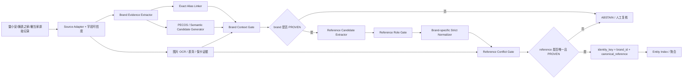

# Query Brand Entity Linking in E-Commerce Search：把“品牌实体链接 + 严格 reference key”落成 precision-first 三源二奢匹配系统

- 分析人：b
- 调研文章：Query Brand Entity Linking in E-Commerce Search
- 论文：https://arxiv.org/abs/2502.01555
- PECOS 官方实现：https://github.com/amzn/pecos
- 来源清单：`奢侈品文章调研.md`
- 对应需求：https://app.notion.com/p/Spec-3bf7b2a8538b812fba00fb258024ff31

## 1. 为什么选这篇文章

当前 Spec 的定义非常特殊：

- 数据来自雷小安、腕表之家、奢当家三个来源；
- 规模约 100 万～1000 万，并持续增量；
- “同一个商品”不是“视觉上像同一只表”，而是 **同一 reference number / 型号**；
- reference 可能存在独立字段，也可能埋在标题甚至图片中；
- **precision 优先到极致，允许漏匹配，但不能误匹配**。

在这种定义下，最终实体键其实很简单：

```text
identity_key = canonical_brand_id + canonical_reference
```

真正困难的不是最后的 pairwise matcher，而是如何可靠得到 `canonical_brand_id` 和 `canonical_reference`。

这篇文章正好解决前半部分：把跨语言、跨店铺、不同 surface form 的品牌统一到一个全局 brand entity namespace，并且特别讨论了：

1. exact lexical match 为什么 precision 高；
2. semantic / extreme classification 为什么能提高 coverage 但会损失 precision；
3. 多候选无法消歧时为什么应该 **不预测**；
4. 如何让 lexical 高精度支路优先于 semantic 支路；
5. 如何在巨大 label space 下做到低延迟实体链接。

这和当前需求最值得迁移的原则高度一致：

> **高召回模型只能负责“提出候选”，确定性证据负责“授权自动合并”；无法唯一确定时必须 ABSTAIN。**

因此，这篇文章不是拿来直接做“商品是否相同”的二分类器，而是应该被改造成当前系统最关键的上游组件之一：**Brand Entity Linker + Reference Identity Resolver**。

---

## 2. 原论文技术实现拆解

## 2.1 论文的核心建模：从字符串品牌到全局 brand entity

论文把品牌统一问题定义成 entity linking：

```text
raw query / text
    -> 识别品牌 mention
    -> 将 mention 映射到全局唯一 brand entity
```

全局 brand entity 的价值是：同一个品牌在不同语言、不同商店、不同缩写下仍然只对应一个稳定 ID。

这对于三源腕表数据尤其重要。例如同一品牌可能出现：

```text
Rolex
ROLEX
劳力士
劳力士 Rolex
rolex watch
```

如果 reference 只做字符串归一化而没有先绑定品牌，跨品牌撞号会成为非常危险的 false positive 来源。

因此当前系统必须先建立：

```text
brand_text -> brand_entity_id
```

再做：

```text
(brand_entity_id, reference) -> product identity
```

而不是全局直接用 reference 字符串聚合。

---

## 2.2 两阶段方案：NER + Exact Lexical Match + Context Filter

论文的第一条支路是典型两阶段架构：

```text
Query
  -> MetaTS-NER
  -> Brand Mention
  -> Mapper
  -> Candidate Brand Entities
  -> Product-Type Filtering
  -> Brand Entity Prediction / Abstain
```

### 第一步：Brand Mention Detection

论文使用 MetaTS-NER，一个基于 multilingual DistilBERT 的 token classification 模型，先识别文本中的品牌 mention。

其本质是：

```text
m = f_NER(q)
```

其中：

- `q`：原始输入；
- `m`：被识别出的品牌字符串。

迁移到腕表商品时，输入不应只包含标题，可组合：

```text
structured_brand + title + subtitle + category + seller_brand_field
```

但是结构化品牌字段和标题不能简单拼成一段让模型自行决定，因为来源字段可信度不同。生产实现应保留字段 provenance。

### 第二步：Exact Lexical Mapper

论文维护 `brand_name -> brand_entity` 字典，允许一个实体拥有多个 textual representations，并且针对 store-specific alias 把 store tag 作为字典 key 的一部分。

这点非常适合三源数据：

```text
(source, normalized_alias) -> brand_entity_id
```

例如：

```text
("leixiaoan", "劳力士") -> BRAND_ROLEX
("watchhome", "ROLEX") -> BRAND_ROLEX
("shedangjia", "劳力士ROLEX") -> BRAND_ROLEX
```

比全局模糊匹配更安全，因为：

- 可以表达某个平台特有的脏别名；
- 某个别名在 A 平台可信，不代表在 B 平台也可信；
- alias 的修正可以独立发布，不需要重训模型。

### 第三步：Context Filtering

论文发现一个 brand surface form 可能映射多个 brand entity，因此引入 product type 作为额外约束。

形式上：

```text
E = g(m)
e = h(E, query, product_type)
```

最关键的工程行为不是 product type 本身，而是：

> **经过额外上下文过滤后如果仍有多个候选，论文选择不做 brand entity prediction，以确保 high precision。**

这正是当前需求应该复制的 fail-closed 行为。

对于腕表，可把论文里的 product type filtering 扩展成：

```text
brand candidate
  + category == watch
  + source brand field
  + series/family
  + reference grammar
  + OCR brand evidence
  + seller/category constraints
```

只有约束后唯一候选才能进入 `PROVEN` 状态。

---

## 2.3 Semantic Matching：M2E-PECOS

Exact lexical matching 的问题是 alias 覆盖不足：缩写、拼写变化、跨语言表达会漏掉。

论文因此把 `brand mention -> brand entity` 建模成 Extreme Multi-Class Classification（XMC），使用 PECOS：

```text
Brand Mention
  -> text vectorization
  -> PECOS hierarchical classifier
  -> Top-K brand entities + relevance scores
```

论文选择 PECOS 的原因是 label space 很大且长尾明显；PECOS 使用层次 label tree，推理复杂度大致与 `log(label_count)` 相关，而不是对所有 label 全扫描。

PECOS 官方项目目前提供 X-Linear、XR-Transformer、HNSW 等模块。针对当前需求，最值得用的是 X-Linear：

- brand alias 本身很短；
- 字符/词 n-gram + TF-IDF 已经能表达大量拼写变体；
- 模型小、快、便于离线重训；
- 不需要为了 brand alias 任务先上大语言模型。

论文里的 M2E-PECOS 不是直接吃完整 query，而是先吃 NER 输出的 brand mention：

```text
(E, score) = g_M2E(m)
```

然后再用 context filter 做 disambiguation。

### 对当前需求的重要警告

论文实验明确表明：semantic matching 虽然 coverage 更高，但 precision 比 exact lexical matching 低。

因此对当前 Spec，PECOS **不能拥有自动合并权限**。

它应该只承担：

1. alias discovery；
2. 候选 brand entity 召回；
3. 人工复核排序；
4. 给 exact alias registry 生成待审核候选。

不能因为 PECOS Top-1 是某品牌，就允许该商品直接绑定 brand entity 并参与自动 reference 聚合。

---

## 2.4 End-to-End：Q2E-PECOS + NIL

论文进一步去掉 NER bottleneck，直接训练：

```text
raw query -> brand entity
```

即：

```text
(E, score) = g_Q2E(q)
```

并加入 `NIL` 类，表达“该输入没有品牌”。

这种 end-to-end 方案的优点是：

- 部署链路更短；
- 能识别一些隐式品牌表达；
- coverage 高；
- 适合巨大 label space。

但对当前需求，它依然只能作为辅助支路，因为“模型觉得像 Rolex”远远不够构成自动实体合并的硬证据。

当前任务的改造方式应该是：

```text
Q2E / semantic result
    -> candidate only
    -> must be confirmed by deterministic evidence
    -> otherwise ABSTAIN
```

---

## 2.5 Fusion：高精度支路优先

论文最终让 exact lexical 支路和 Q2E-PECOS 并行，在两者都有预测时优先 exact lexical 结果。

这是全篇最值得直接迁移的架构原则之一：

```text
High-precision deterministic branch > high-coverage semantic branch
```

当前系统甚至应该比论文更保守：

```text
exact / source-trusted evidence
        |
        +---- 有唯一结果 ----> PROVEN
        |
        +---- 无结果 --------> semantic branch 只提候选
                               |
                               +---- 经硬规则再次确认 -> PROVEN
                               +---- 否则 -> ABSTAIN
```

也就是说，semantic branch 不能“覆盖” deterministic branch，也不能单独把状态提升到自动合并可用级别。

---

## 2.6 论文数据构造：强标签 + 弱标签 + 字典增广

论文训练数据来自三类来源：

1. Brand2entity 字典：把品牌名作为 pseudo query；
2. Strongly-labeled：人工标注 query；
3. Weakly-labeled：从历史 query-product 交互自动构造。

这对当前系统也有参考价值。

可映射为：

```text
A. 人工确认 brand alias / reference
B. 三平台结构化高可信字段
C. 历史已确认聚合结果
D. OCR 与文本一致的高可信样本
```

但要注意：当前目标是极端 precision，弱标签只能用于 **召回模型训练**，不能当自动合并规则的真值来源。

---

## 2.7 结果里最值得关注的不是 Recall，而是 False Alarm

论文对 non-branded query 统计了 false alarm：

```text
NER + Exact Lexical Match      1.177%
NER + M2E-PECOS                3.267%
Q2E-PECOS w/o WL               4.037%
Q2E-PECOS w/ WL                6.550%
```

这证明一件对当前任务非常关键的事：

> **语义模型提高 coverage 时，false positive 往往也会一起上升。**

论文场景里 1%～6% 的 false alarm 可能仍可接受，但当前 Spec 明确“绝对不能误匹配”，因此即使 exact lexical branch 也不能原样照搬；还必须叠加：

- source trust；
- alias uniqueness；
- brand/category consistency；
- reference role；
- reference conflict check；
- evidence provenance；
- ABSTAIN。

---

## 3. 对当前 Spec 的核心迁移结论

## 3.1 系统不应该以 pairwise similarity 为中心

当“同一个商品”已经被定义为“同一个 reference number”时，最自然的架构不是：

```text
商品 A + 商品 B -> 模型 -> same / different
```

而是：

```text
商品记录
  -> canonical_brand_id
  -> canonical_reference
  -> deterministic identity_key
  -> group by identity_key
```

即：

```text
identity_key = hash(brand_entity_id + "\0" + reference_canonical)
```

这样 100 万～1000 万数据的核心复杂度从潜在的 pairwise `O(N²)`，退化成解析、索引和 group-by 的近似 `O(N)`。

ML/LLM 的作用应该集中在：

- 抽取；
- 候选生成；
- 冲突发现；
- 人工复核排序。

而不是拥有最终 identity authority。

---

## 3.2 Brand 必须成为 reference 的命名空间

禁止使用：

```text
reference_canonical -> entity
```

必须使用：

```text
(brand_entity_id, reference_canonical) -> entity
```

原因：

- 不同品牌可能出现相似/相同编号；
- 某些标题只出现短 reference 片段；
- 配件、表带、盒证等商品可能提到被适配腕表 reference；
- 平台货号也可能在字符串形态上接近官方型号。

品牌不是“加分特征”，而是 identity key 的强组成部分。

---

## 3.3 Semantic 模型只做候选，不做授权

建议内部把证据分成三个状态：

```text
PROVEN     可作为自动 identity key 的证据
ASSISTED   只有模型/弱证据支持，只可辅助
ABSTAIN    冲突、歧义或缺失
```

brand semantic prediction、LLM 归一化、图片视觉相似，都只能产生 `ASSISTED`。

只有满足确定性规则才能得到 `PROVEN`。

---

## 4. 建议直接落地的总体架构



这里有两个核心“闸门”：

1. `brand must be PROVEN`
2. `reference must be PROVEN and unique`

任意一步不满足，都不能进入自动实体聚合。

---

## 5. 建议的数据模型

## 5.1 brand_entity

```sql
CREATE TABLE brand_entity (
    brand_id            BIGSERIAL PRIMARY KEY,
    canonical_name      TEXT NOT NULL,
    parent_brand_id     BIGINT NULL,
    status              TEXT NOT NULL DEFAULT 'active',
    created_at          TIMESTAMPTZ NOT NULL DEFAULT now(),
    updated_at          TIMESTAMPTZ NOT NULL DEFAULT now()
);
```

不要直接用品牌名字当 key。名字会改、会有多语言，`brand_id` 才是稳定 identity。

---

## 5.2 brand_alias

```sql
CREATE TABLE brand_alias (
    alias_id            BIGSERIAL PRIMARY KEY,
    source              TEXT NULL,
    locale              TEXT NULL,
    alias_raw           TEXT NOT NULL,
    alias_normalized    TEXT NOT NULL,
    brand_id            BIGINT NOT NULL REFERENCES brand_entity(brand_id),
    evidence_type       TEXT NOT NULL,
    confidence_class    TEXT NOT NULL,
    reviewed            BOOLEAN NOT NULL DEFAULT false,
    valid_from          TIMESTAMPTZ NOT NULL DEFAULT now(),
    valid_to            TIMESTAMPTZ NULL
);

CREATE INDEX idx_brand_alias_lookup
ON brand_alias(source, alias_normalized)
WHERE valid_to IS NULL;
```

`source` 允许为空，表示全局 alias；也允许限定具体平台。

建议：

```text
confidence_class = TRUSTED / REVIEWED / DISCOVERED
```

只有 `TRUSTED` / `REVIEWED` exact alias 可以直接产生 `PROVEN` brand evidence。

PECOS 自动发现的新 alias 必须先进入 `DISCOVERED`，不能立即自动生效。

---

## 5.3 brand_context_rule

用于处理论文里的 product-type filtering，以及腕表特有的系列/类别约束：

```sql
CREATE TABLE brand_context_rule (
    brand_id            BIGINT NOT NULL,
    category            TEXT NULL,
    series              TEXT NULL,
    reference_regex     TEXT NULL,
    source              TEXT NULL,
    rule_version        INTEGER NOT NULL,
    is_positive         BOOLEAN NOT NULL,
    PRIMARY KEY (brand_id, rule_version, category, series, source)
);
```

这里的 rule 可以表达：

- 某 brand 只在特定 category 下允许；
- 某些 reference pattern 属于某 brand；
- 某平台的某 alias 只在腕表类有效；
- 子品牌和母品牌如何处理。

---

## 5.4 product_enrichment

每条原始商品都保留解析过程，而不是只存最终 key：

```sql
CREATE TABLE product_enrichment (
    source                  TEXT NOT NULL,
    source_product_id       TEXT NOT NULL,

    brand_id                BIGINT NULL,
    brand_state             TEXT NOT NULL,
    brand_evidence_json     JSONB NOT NULL,

    reference_raw           TEXT NULL,
    reference_canonical     TEXT NULL,
    reference_state         TEXT NOT NULL,
    reference_role          TEXT NULL,
    reference_evidence_json JSONB NOT NULL,

    identity_key            TEXT NULL,
    decision                TEXT NOT NULL,
    decision_reason         TEXT NOT NULL,

    parser_version          TEXT NOT NULL,
    rule_version            TEXT NOT NULL,
    model_version           TEXT NULL,

    created_at              TIMESTAMPTZ NOT NULL DEFAULT now(),
    updated_at              TIMESTAMPTZ NOT NULL DEFAULT now(),

    PRIMARY KEY (source, source_product_id)
);
```

`decision` 建议只允许：

```text
AUTO_ACCEPT
ABSTAIN
REVIEWED_ACCEPT
REVIEWED_REJECT
```

必须保留 `decision_reason`，方便后来追查任何误匹配。

---

## 6. Brand Entity Linker 的具体实现

## 6.1 Step 1：字段级 evidence extraction

不要先把所有字段拼接。

先独立生成证据：

```python
BrandEvidence(
    value="劳力士",
    source_field="brand",
    evidence_type="STRUCTURED_FIELD",
    trust="HIGH",
)

BrandEvidence(
    value="ROLEX",
    source_field="title",
    evidence_type="TITLE_MENTION",
    trust="MEDIUM",
)
```

来源字段应有预先配置：

```yaml
leixiaoan:
  brand_field:
    trust: high
  title:
    trust: medium

watchhome:
  brand_field:
    trust: high
  title:
    trust: medium

shedangjia:
  seller_brand:
    trust: medium
  title:
    trust: medium
```

真实字段名按抓取数据调整。

---

## 6.2 Step 2：Exact Alias Branch

推荐查找顺序：

```text
1. (source, alias_normalized)
2. (NULL, alias_normalized)  # global alias
3. source-specific context rule
```

若唯一映射到一个 `brand_id`，再过 context gate。

若 alias 对应多个 brand：

```text
不要选最高频
不要选编辑距离最近
不要让 LLM 猜

=> 进入 disambiguation
```

---

## 6.3 Step 3：Context Gate

依次检查：

```text
category
product_type
series/family
source-specific rule
reference grammar
OCR brand
```

只有过滤后剩一个 brand 时才能 `PROVEN`。

若仍多于一个：

```text
brand_state = ABSTAIN
```

这是直接复制论文“歧义不预测”的安全设计。

---

## 6.4 Step 4：Semantic Candidate Branch

只有 exact alias 没结果时才调用。

### 初始版本可以不急着上大模型

直接使用：

```text
char 2-5 gram
word 1-2 gram
TF-IDF
PECOS X-Linear
```

输入：

```text
normalized brand mention
```

输出：

```json
[
  {"brand_id": 101, "score": 0.91},
  {"brand_id": 205, "score": 0.63},
  {"brand_id": 331, "score": 0.42}
]
```

但是这些都只是 `ASSISTED`。

### semantic 结果如何升级为 PROVEN

至少满足一种额外硬证据：

```text
A. 结构化 brand 字段与候选 brand 的已审核 alias exact 一致
B. OCR 出现该 brand 的已审核 alias，并与 title 候选一致
C. reference 明确符合唯一 brand 的高精度 grammar / whitelist
D. 人工审核通过并写回 alias registry
```

如果没有硬证据，就一直 `ABSTAIN`。

---

## 6.5 不建议直接把 LLM 用作 Brand Authority

LLM 可以做：

- 提取可能的品牌 mention；
- 解释为何某 alias 可能属于某品牌；
- 生成 alias 审核候选；
- 识别多语言变体。

但禁止：

```text
LLM says brand=Rolex
=> 自动 brand_id=ROLEX
=> 直接参与实体合并
```

理由很简单：当前系统的损失函数不是平均 F1，而是极端 asymmetric loss：一次 false positive 的代价远高于一次漏匹配。

---

## 7. Reference Pipeline：真正决定商品 identity 的一层

## 7.1 候选提取不要只输出一个字符串

建议输出候选数组：

```json
[
  {
    "raw": "126610LN",
    "source": "structured_reference_field",
    "span": null,
    "role": "UNKNOWN",
    "trust": "HIGH"
  },
  {
    "raw": "126610 LN",
    "source": "title",
    "span": [12, 21],
    "role": "UNKNOWN",
    "trust": "MEDIUM"
  }
]
```

每个候选必须保留：

- 原始值；
- 来源字段；
- title span；
- OCR 图片 ID；
- extractor version；
- 后续 role 结果。

---

## 7.2 先做 Reference Role Gate

结合已有 `parts-distributor-sku-classifier` 调研的结论，候选编号至少分：

```text
BRAND_REFERENCE
PLATFORM_SKU
STORE_SKU
SERIAL_NUMBER
ACCESSORY_COMPAT_REF
UNKNOWN
```

只有 `BRAND_REFERENCE` 才有资格进入 identity key。

尤其要拒绝：

- “适用 126610LN 的表带”；
- “劳力士 126610LN 原装盒”；
- 店铺 SKU 恰好形似型号；
- 序列号；
- 平台内部 item number。

---

## 7.3 Normalization 必须 brand-specific，而不是暴力清洗

危险做法：

```python
re.sub(r"[^A-Z0-9]", "", ref)
```

因为斜杠、点、连字符、后缀字母在某些品牌里可能有语义。

推荐两层：

### Safe Global Normalization

只做几乎确定无语义损失的操作：

```text
Unicode NFKC
全角转半角
trim
uppercase ASCII letters
Unicode dash -> ASCII '-'
重复空白折叠
```

### Brand-specific Normalization

再根据 brand rule 决定：

```text
是否允许去空格
是否允许去点号
是否允许统一 slash
是否保留 leading zero
后缀字母是否必需
合法长度
合法 regex
```

每个 normalizer 必须版本化：

```text
rolex_ref_v3
omega_ref_v2
cartier_ref_v1
```

任何规则变更后可重跑历史记录并对 identity diff 做审计。

---

## 7.4 Conflict Gate 比“相似度分数”更重要

如果一条商品记录里出现：

```text
structured ref = A
标题 ref       = B
OCR ref        = A
```

不能用“2 比 1 多数票”自动认定 A。

应该输出：

```text
REFERENCE_CONFLICT
ABSTAIN
```

因为结构化字段可能是平台 SKU，标题 B 可能才是真型号；也可能 OCR 识别错。

当前需求允许漏匹配，因此 **冲突必须 fail closed**。

---

## 7.5 Reference Evidence Level

建议把 reference 证据离散成安全等级：

```text
R0 = 无候选
R1 = 单一弱文本候选
R2 = 单一高可信结构化候选
R3 = 结构化字段 + 标题一致
R4 = 文本 + OCR 一致
R5 = 结构化 + 标题 + OCR 一致
RX = 多候选冲突
```

初期自动接受可以只开放：

```text
R3 / R4 / R5
```

等审计数据足够后，再评估是否开放部分 `R2`。

不要一开始为了 coverage 放宽到 R1。

---

## 8. 最终 Match Decision：确定性状态机

推荐把最终逻辑写成明确状态机，不藏在模型 score 里。

```python
from dataclasses import dataclass
from enum import Enum

class Decision(str, Enum):
    AUTO_ACCEPT = "AUTO_ACCEPT"
    ABSTAIN = "ABSTAIN"

@dataclass
class Resolution:
    brand_id: int | None
    brand_state: str
    reference: str | None
    reference_state: str
    reference_role: str | None
    conflict: bool


def decide(r: Resolution) -> tuple[Decision, str, str | None]:
    if r.brand_state != "PROVEN":
        return Decision.ABSTAIN, "BRAND_NOT_PROVEN", None

    if r.reference_state != "PROVEN":
        return Decision.ABSTAIN, "REFERENCE_NOT_PROVEN", None

    if r.reference_role != "BRAND_REFERENCE":
        return Decision.ABSTAIN, "REFERENCE_ROLE_NOT_ALLOWED", None

    if r.conflict:
        return Decision.ABSTAIN, "EVIDENCE_CONFLICT", None

    identity_key = f"{r.brand_id}:{r.reference}"
    return Decision.AUTO_ACCEPT, "STRICT_IDENTITY_KEY", identity_key
```

关键点：

> 模型分数不直接出现在最终授权条件中。

模型只参与生成 `brand_state/reference_state` 所需的中间证据；真正的自动接受必须由显式规则完成。

---

## 9. Entity Index：不需要做千万级 pairwise join

当每条记录得到：

```text
brand_id
reference_canonical
identity_key
```

直接维护：

```sql
CREATE TABLE reference_entity (
    identity_key           TEXT PRIMARY KEY,
    brand_id               BIGINT NOT NULL,
    reference_canonical    TEXT NOT NULL,
    entity_id              BIGSERIAL UNIQUE,
    first_seen_at          TIMESTAMPTZ NOT NULL DEFAULT now(),
    last_seen_at           TIMESTAMPTZ NOT NULL DEFAULT now()
);

CREATE UNIQUE INDEX uq_reference_entity
ON reference_entity(brand_id, reference_canonical);
```

商品记录只要 `AUTO_ACCEPT`：

```text
upsert (brand_id, reference)
-> 获取 entity_id
-> 写 product_entity_link
```

这样新增数据是常数级索引查找，而不是再跑全量 matcher。

---

## 10. 图片应该怎么用

Spec 明确“有图片可用”，但图片不能替代 reference 硬定义。

推荐图片承担两个角色：

### 10.1 OCR Evidence

优先识别：

- 保卡；
- 吊牌；
- 表背；
- 证书；
- 盒标。

OCR 输出 reference candidate，再进入同一套 role / normalization / conflict pipeline。

### 10.2 Conflict Veto

如果文本说 Rolex，但图片 OCR / logo 强烈指向另一品牌：

```text
不要自动改成另一品牌
=> 标记 BRAND_CONFLICT
=> ABSTAIN
```

视觉模型适合否决和人工复核排序，不适合越过 reference 定义直接判“同一商品”。

---

## 11. PECOS 在当前系统中的正确位置

建议把 PECOS 单独做成 `brand-candidate-service`：

```text
POST /brand/candidates
{
  "source": "watchhome",
  "text": "劳力士 rolex"
}
```

输出：

```json
{
  "model_version": "brand-pecos-2026-08-01",
  "candidates": [
    {"brand_id": 101, "score": 0.94},
    {"brand_id": 205, "score": 0.51}
  ]
}
```

上游 `brand-resolver` 再把候选与 exact alias、category、reference grammar、OCR evidence 合并。

### 为什么拆服务

- semantic 模型可以独立升级；
- exact rule 不跟模型耦合；
- 容易 A/B 和 shadow；
- 模型挂掉时系统仍可以只靠 deterministic branch 继续跑；
- 安全权限边界清晰：candidate service 无权写 identity link。

---

## 12. 初期是否一定要上 PECOS

不一定。

如果当前品牌实体只有几千～几万，第一阶段可以先做：

```text
exact alias registry
+ PostgreSQL trigram / Elasticsearch candidate search
+ 人工审核 alias
```

先把 deterministic 主链跑通。

只有当：

- alias 数量很大；
- 多语言明显；
- 新平台不断增加；
- 模糊候选检索延迟/质量开始成为瓶颈；

再引入 PECOS。

论文最大的价值不是“必须使用 PECOS”，而是给出一个经过工业验证的架构模式：

```text
exact high-precision branch
+
semantic high-coverage branch
+
context disambiguation
+
abstention
```

---

## 13. 100 万～1000 万数据的工程实现

## 13.1 首次 Backfill

不需要复杂在线系统即可处理。

可用：

```text
Parquet / object storage
+ Polars / Spark
+ PostgreSQL brand/reference dictionaries
```

处理链：

```text
source partition
  -> parse
  -> brand resolve
  -> reference resolve
  -> decision
  -> identity group
  -> write enriched parquet / DB
```

10M 级记录对列式 batch 引擎不是特殊规模。

真正要避免的是千万数据互相做全笛卡尔积。

---

## 13.2 增量更新

每条新记录独立解析：

```text
new product
  -> enrich
  -> identity_key
  -> indexed upsert
```

因此增量路径不需要重新扫描历史全量。

如果有 Kafka/Flink 基础设施，可以流式；没有也完全可以每 5～30 分钟按增量批次跑。

不要为了“持续增量”一开始就上复杂流计算。

---

## 13.3 幂等

以：

```text
(source, source_product_id, source_updated_at)
```

作为输入版本。

输出必须记录：

```text
parser_version
rule_version
model_version
```

同版本重复执行结果必须一致。

---

## 14. 人工黄金标签怎么花最值

Spec 允许几百对人工标注。不要随机抽几百对。

随机样本会被大量 easy negative / easy positive 占满，对“绝不能误匹配”帮助很小。

建议构造 **hard-case gold set**：

### 14.1 Hard Positive

同 reference 但文本差异大：

- 中文 / 英文品牌；
- reference 有空格/点/横线差异；
- 一边结构化字段有 reference，一边只在标题；
- OCR 才能补足 reference；
- 来源字段缺失。

### 14.2 Hard Negative

重点多于 positive：

- 同品牌、相邻 reference；
- 同系列不同后缀；
- 编辑距离 1 的型号；
- 配件标题出现被兼容表款 reference；
- 同品牌平台 SKU 类似 official reference；
- structured ref 与 title ref 冲突；
- parent brand / sub-brand 混淆；
- 图片相似但 reference 不同。

建议第一轮约：

```text
150 hard positive
300 hard negative
50 ambiguous / should-abstain
```

比随机 500 对更有价值。

---

## 15. 评估指标必须改成 selective / precision-first

不要只看 F1。

至少报告：

```text
auto_accept_precision
coverage
abstain_rate
brand_proven_precision
reference_proven_precision
hard_negative_false_accept_rate
conflict_leak_rate
```

其中最核心：

```text
auto_accept_precision
hard_negative_false_accept_rate
```

### 一个统计现实

“几百条样本上 0 个 false positive”并不能数学上证明生产环境绝对 0 错误。

因此安全性必须来自两部分：

1. **结构性 invariants**：brand + reference + role + conflict gate；
2. **统计验证**：hard-case test + shadow audit + 持续抽检。

不能单靠模型 confidence calibration 宣称“零误匹配”。

---

## 16. 上线策略

## Phase 0：只产 enrichment，不产自动链接

先输出：

```text
brand_id
reference
identity_key candidate
decision_reason
```

不改现有业务实体。

人工看 1～2 周。

---

## Phase 1：只开放最强证据

自动接受条件建议：

```text
brand_state == PROVEN
reference_state in {R3, R4, R5}
reference_role == BRAND_REFERENCE
no conflict
```

其他全部 ABSTAIN。

---

## Phase 2：按品牌逐步放宽

不要全局一次调阈值。

不同品牌的 reference grammar 和数据质量不同，应按品牌分别开放：

```text
Rolex R2 allowed? yes/no
Omega R2 allowed? yes/no
Cartier R2 allowed? yes/no
```

每个品牌有独立 acceptance policy。

---

## Phase 3：引入 semantic alias discovery

PECOS / embedding 只给人工审核队列提供：

```text
unknown alias -> top-k brand candidates
```

审核通过后写回 `brand_alias`，然后 deterministic branch 自然提升 coverage。

这是比“不断降低模型阈值”更安全的增长方式。

---

## 17. 推荐的代码目录

```text
luxury-identity/
├── adapters/
│   ├── leixiaoan.py
│   ├── watchhome.py
│   └── shedangjia.py
├── brand/
│   ├── evidence.py
│   ├── exact_alias.py
│   ├── context_gate.py
│   ├── semantic_candidates.py
│   └── resolver.py
├── reference/
│   ├── extractor.py
│   ├── role_classifier.py
│   ├── normalizers/
│   │   ├── default.py
│   │   ├── rolex.py
│   │   ├── omega.py
│   │   └── cartier.py
│   ├── conflict_gate.py
│   └── resolver.py
├── image/
│   ├── ocr.py
│   └── evidence.py
├── identity/
│   ├── decision.py
│   ├── key.py
│   └── index.py
├── review/
│   ├── queue.py
│   └── feedback.py
├── batch/
│   ├── backfill.py
│   └── incremental.py
└── tests/
    ├── hard_positive/
    ├── hard_negative/
    └── ambiguity/
```

这个拆法有一个重要安全优势：

```text
semantic_candidates.py
```

和：

```text
identity/decision.py
```

是物理分离的模块，避免未来开发人员误把某个模型 score 直接接成自动 match。

---

## 18. 建议的核心接口

### Brand Resolver

```python
@dataclass
class BrandResolution:
    brand_id: int | None
    state: Literal["PROVEN", "ASSISTED", "ABSTAIN"]
    evidence: list[dict]
    candidates: list[dict]
    reason: str
```

### Reference Resolver

```python
@dataclass
class ReferenceResolution:
    canonical: str | None
    state: Literal["PROVEN", "ASSISTED", "ABSTAIN"]
    role: str | None
    evidence_level: str
    conflict: bool
    evidence: list[dict]
    reason: str
```

### Identity Resolver

```python
@dataclass
class IdentityResolution:
    entity_key: str | None
    decision: Literal["AUTO_ACCEPT", "ABSTAIN"]
    reason: str
```

接口本身就强迫系统表达“不知道”。

---

## 19. 监控与审计

必须每天/每批统计：

```text
AUTO_ACCEPT count
ABSTAIN count
brand alias hit rate
semantic candidate invocation rate
reference conflict rate
unknown role rate
per-brand auto accept rate
per-source auto accept rate
```

重点报警：

```text
某品牌 auto_accept 突增
某来源 conflict rate 突变
某 parser version 导致 identity key 大规模变化
同一 source_product_id identity_key 发生改变
一个 entity 突然吸收大量异常商品
```

最后一条非常重要：即使规则没报错，异常大的 entity cluster 也可能是 reference 被错误过度归一化造成的。

---

## 20. 对论文方案的取舍总结

| 论文组件 | 当前需求是否采用 | 用法 |
|---|---:|---|
| Global Brand Entity Namespace | 是，强烈建议 | brand_id 作为 reference namespace |
| NER Mention Detection | 是 | 从标题等字段抽品牌候选 |
| Exact Lexical Match | 是，主路径 | 只使用已审核 alias |
| Store-specific Alias | 是，强烈建议 | 三来源分别维护 alias |
| Product-Type Filtering | 是，扩展 | category/series/reference grammar/OCR context gate |
| PECOS Semantic Matching | 是，但降权 | 候选召回、alias discovery、review ranking |
| End-to-End Q2E | 可选 | 辅助候选，不直接授权 |
| NIL / Abstain | 是，必须 | 无法唯一确定则拒识 |
| Fusion | 是，但更保守 | deterministic 绝对优先，semantic 无独立授权权 |
| 模型 Top-1 直接写实体 | 否 | precision 不满足要求 |

---

## 21. 可以直接落地的最小方案

如果现在就开始做，不需要先训练复杂模型。

### 第 1 周

1. 建 `brand_entity / brand_alias`；
2. 从三个来源已有结构化品牌字段生成 alias；
3. 人工审核 top 品牌；
4. 实现 `brand_id + reference` identity key；
5. reference 先只接受最高可信独立字段；
6. 所有冲突 ABSTAIN。

### 第 2 周

1. 加标题 reference extractor；
2. 加 reference role gate；
3. 加品牌级 strict normalizer；
4. 构造 500 条 hard-case gold set；
5. shadow backfill 全量。

### 第 3 周

1. 加 OCR；
2. 加 conflict matrix；
3. 开放 R3/R4/R5 自动接受；
4. 对所有 AUTO_ACCEPT 做高比例人工审计。

### 第 4 周以后

1. 引入 PECOS 做 unknown alias 候选；
2. 审核后回写 alias registry；
3. 按品牌逐步扩大 coverage；
4. 始终保持 identity decision 的 deterministic gate 不变。

---

## 22. 最终推荐

这篇文章最适合当前项目的，不是“用 PECOS 替换现有 matcher”，而是一套架构思想：

> **先建立全局 canonical entity namespace；exact 高精度支路优先；semantic 支路负责补召回；上下文做消歧；仍不唯一时主动拒识。**

把它迁移到三源二奢/腕表后，应进一步收紧为：

```text
商品记录
 -> canonical brand entity
 -> trustworthy brand reference
 -> brand-specific strict normalization
 -> conflict-free evidence
 -> deterministic identity_key
 -> indexed aggregation
```

也就是说，最终系统的核心不是“更强的相似度模型”，而是一个 **可证明来源、可拒识、可审计、fail-closed 的 identity resolution pipeline**。

对于“同一个商品 = 同 reference”且 precision 极端优先的 Spec，这比直接上 LLM/多模态 pairwise matching 更容易落地，也更符合风险约束。

---

## 参考资料

1. Query Brand Entity Linking in E-Commerce Search：<https://arxiv.org/abs/2502.01555>
2. PECOS 官方实现：<https://github.com/amzn/pecos>
3. 当前需求 Spec：<https://app.notion.com/p/Spec-3bf7b2a8538b812fba00fb258024ff31>
4. 调研清单：`my-doc/奢侈品文章调研.md`
