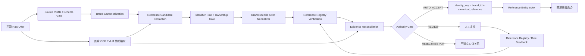

# Tailoring entity resolution for matching product offers：从 Product Code 抽取到 precision-first 腕表 Reference Authority Pipeline

- 分析人：b
- 论文：Hanna Köpcke, Andreas Thor, Stefan Thomas, Erhard Rahm, *Tailoring entity resolution for matching product offers*, EDBT 2012
- 论文链接：https://dbs.uni-leipzig.de/files/research/publications/2012-3/pdf/edbt2012_final.pdf
- 公开镜像：https://www.openproceedings.org/2012/conf/edbt/KopckeTTR12.pdf
- 来源清单：`奢侈品文章调研.md`
- 对应需求：https://app.notion.com/p/Spec-3bf7b2a8538b812fba00fb258024ff31

## 1. 为什么选这篇论文

当前需求的定义非常特殊：**“同一个商品”就是“同一 reference number / 型号”**，而且要求 **precision 优先到极致，绝对不能误匹配，允许漏匹配**。

这意味着真正的核心问题并不是传统 entity matching 里的“两个商品标题有多相似”，而是：

1. 如何从字段稀疏、来源异构的商品记录中可靠抽出 reference；
2. 如何确认抽出的编号确实是“当前售卖商品自己的 reference”；
3. 如何避免把平台 SKU、店铺货号、序列号、配件兼容型号当成 reference；
4. 如何在 reference 证据冲突、缺失、模糊时 **拒识**，而不是强行给出匹配结果。

这篇 2012 年论文虽然年代较早，但它抓住了一个至今仍然非常关键的工程问题：**product code extraction + code ownership verification 应该发生在 product matching 之前。**

论文还直接讨论了一个和二奢/腕表高度同构的陷阱：配件商品标题里可能出现目标商品的 product code，例如“适用于 Sony NP-FF51 的电池”，如果只因为标题出现 `NP-FF51` 就把它当作当前商品型号，会造成严重误匹配。

对于当前腕表场景，这类高危数据包括：

- “适用 Rolex 126610LN 的表带”；
- “兼容 AP 15500 的表膜”；
- “某型号原装盒/说明书/保卡”；
- “适配 XXX reference 的配件”；
- 一条商品描述里同时列多个可兼容 reference。

因此，这篇论文最大的价值不是照搬它的 SVM，而是把系统边界重新定义为：

> **先建立可信的 Reference Claim，再基于可信 reference 做确定性聚合；不要让模糊文本相似度直接拥有“合并实体”的权限。**

---

## 2. 原论文技术实现与架构拆解

## 2.1 原问题定义

论文研究的是多个电商来源中的商品 offer matching：判断两个商品记录是否表示同一个现实商品。

原始商品记录通常只有少量字段：

- title；
- description；
- manufacturer；
- price；
- 可能有 UPC。

作者指出，电商数据比常见的论文/书目实体匹配困难得多，因为：

- 同一商品的标题差异非常大；
- 商品存在大量“非常像但并不是同一个”的变体；
- 字段经常缺失或错误；
- 重要属性经常埋在自由文本；
- accessories 会在标题中列出大量“被适配商品”的型号。

这个问题结构与当前三源二奢数据高度一致。

---

## 2.2 原系统是三阶段流水线

论文整体流程可以概括成：

```text
Product Offers
    |
    v
Pre-processing
    |- Manufacturer Cleaning
    |- Product Categorization
    `- Product Code Extraction
    |
    v
Training
    |- Select Match / Non-match Training Pairs
    |- Compute Multiple Matcher Features
    `- Train SVM, optionally per category
    |
    v
Application
    |- Blocking by Manufacturer + Category
    |- Compute Similarities
    `- SVM -> Match / Non-match
```

它不是“直接把 title 输入模型”，而是把大量精力放在 preprocessing 上。这一点对当前需求非常值得继承。

### Manufacturer Cleaning

原论文会将制造商名称做规范化，包括：

- 字符串相似度；
- synonym list；
- 已有 manufacturer 字典；
- 当 manufacturer 字段缺失时，从 title/description 中反查品牌。

这对应当前系统里的 **Brand Canonicalization**。

### Product Categorization

论文使用改造过的 Naive Bayes 将商品划入 category。然后只让同 manufacturer、同 category 的商品参与比较。

这里的目的有两个：

1. blocking，降低计算量；
2. 不同品类使用不同 matching strategy，提高精度。

对腕表系统而言，category 可以被更严格的 domain/profile 取代，例如：

```text
WATCH
WATCH_ACCESSORY
BAG
JEWELRY
BOX_PAPER
STRAP
OTHER
```

特别是 `WATCH_ACCESSORY / BOX_PAPER / STRAP` 应作为高风险类型，因为其中出现的 reference 很可能不是“当前商品自己的 reference”。

---

## 2.3 Product Code Extraction 是论文的核心

论文把 product code 定义为 manufacturer-specific identifier，通常由字母、数字、特殊字符和空格组成，并经常埋在 title/description 里。

它的抽取流程可以重写为下面的伪代码：

```python
def extract_product_code(offer, manufacturer):
    text = remove_common_features(offer.text)
    tokens = tokenize(text)
    tokens = remove_stopwords_and_generic_tokens(tokens, manufacturer)

    candidates = generate_consecutive_token_spans(tokens, max_tokens=3)
    candidates = keep_code_like_patterns(candidates)

    verified = []
    for candidate in candidates:
        score = external_manufacturer_association(candidate, manufacturer)
        if score >= threshold:
            verified.append((candidate, score))

    return best_candidate(verified)
```

### Step 1：先移除“看起来像编号但不是编号”的 common features

论文会先去掉：

- 尺寸；
- 重量；
- 电压；
- 电量；
- 颜色等。

目的非常重要：**先消灭伪 identifier，再从剩余文本找 product code。**

迁移到腕表时应该重点移除/标记：

- 表径 `40mm / 41 mm / 36MM`；
- 年份 `2021 / 2022`；
- 成色 `95新 / 99新`；
- 材质缩写；
- 价格；
- 机芯频率/动力储存等规格；
- 平台自有商品编号。

不能让这些 token 进入 reference 候选池。

### Step 2：tokenize + 高频词过滤

论文使用 manufacturer-conditioned token frequency：

令：

```text
N(t, m) = manufacturer m 的商品中包含 token t 的 offer 数量
N(t)    = 所有 manufacturer 商品中包含 token t 的 offer 数量
```

只保留：

```text
N(t, m) / N(t) > threshold
```

论文实验中使用 50%。

直觉是：真正 manufacturer-specific 的 product code 更倾向于和某个 manufacturer 强关联，而 `for / battery / camera / black` 等通用词会跨 manufacturer 大量出现。

这非常适合迁移为腕表的 **brand association prior**，但只能作为候选排序特征，不能成为自动合并权限。

### Step 3：生成最多三个连续 token 的 candidate span

论文不是只看单 token，而是允许最多 3 个相邻 token 构成 product code，因为真实型号可能包含空格或分隔形式。

腕表同样需要支持：

```text
126610 LN
116 500 LN
IW 371604
03.9300.3620/51.I001
```

但这里必须特别谨慎：**不能把所有空格都无条件删除。** 是否允许空格、点、斜杠、连字符等价，应该由品牌级 grammar 决定。

### Step 4：regex/type pattern 筛选

论文维护人工 regex，优先保留同时包含字母和数字、符合 manufacturer 常见编码结构的 candidate。

这个设计非常实用，因为 reference 本质上是一个领域 identifier，不是普通自然语言。

腕表场景应维护：

```yaml
brand_reference_grammars:
  - brand_id: ...
    allowed_patterns:
      - ...
    forbidden_patterns:
      - ...
    normalization_rules:
      - ...
```

### Step 5：外部验证 candidate 是否属于 manufacturer

原论文最有价值的一步是：**抽出 candidate 后不立即相信，而是再次验证它是否属于当前 manufacturer。**

论文当时通过搜索引擎验证：搜索 candidate，看返回结果中有多大比例同时出现当前 manufacturer。

例如一条标题同时出现配件自身型号和“适配对象”的 Sony 型号时，外部搜索结果可以帮助判断哪个 code 真正属于当前 manufacturer。

这个思想应保留，但 2026 年的生产系统不应该在在线链路中依赖搜索引擎；应该改造成内部 Reference Registry / Evidence Store，后文会给出实现。

---

## 2.4 原匹配模型

在抽取 product code 后，原系统仍然采用传统 supervised matching：

- title TF/IDF；
- title trigram/Jaccard；
- description 相似度；
- product code matcher；
- SVM 分类。

它支持：

- 一个全局统一模型；
- 每个 category 单独训练模型。

论文发现 category-specific strategy 通常更好。

这个结论可以迁移，但当前 Spec 下不能让这类 probabilistic classifier 成为最终 authority，因为需求的“同一商品”已经被明确限定成“同一 reference”。

更合适的角色是：

- title/image 模型用于 **抽取、排序、否决、复核**；
- 最终自动链接由 reference authority gate 决定。

---

## 2.5 原 blocking 方式

论文只比较：

```text
same cleaned manufacturer
AND
same category
```

的商品对。

这比全量笛卡尔积高效，但当前需求可以进一步优化：

一旦商品被解析成可信：

```text
(brand_id, canonical_reference)
```

就完全不需要做 pairwise blocking + pairwise similarity。

直接做：

```text
identity_key = brand_id + canonical_reference
```

的索引聚合即可。

因此，对于 100 万～1000 万数据，主链路可从传统 ER 的近似 `O(N × candidates)` 简化为接近 `O(N)` 的解析 + `O(log M)`/hash lookup。

---

## 2.6 论文实验结果说明了什么

论文使用 **102,182** 条真实电商 offer，覆盖 **71** 个 category。

几个值得关注的数据：

- 非配件商品中，平均约 **85%** 可以抽到 product code；
- 配件商品中只有约 **34%** 可以抽到；
- web verification 对抽取质量有明显帮助，某些情况下可提升约 20%；
- 抽出的 product code 平均 precision 约 **79%**；
- mobile phone 类别的 product-code extraction F1 可达到约 **89%**；
- 加入 product code matcher 后，非配件类别平均 matching F1 可提升到约 **55%**；
- mobile phone matching F1 最好约 **73%**；
- 使用人工 reference mapping 而非 UPC mapping 后，相机类别的 matching F1 可达到约 **81%**。

论文还发现 UPC 本身也会有异常：

- 同一个商品可能有不同 UPC；
- 不同商品也可能错误共享 UPC。

这对于当前需求的启示非常明确：

> **任何“看起来是唯一 ID”的字段，都不能因为名字像 ID 就无条件视为真值。必须对字段语义、来源和具体 identifier 类型做验证。**

同时，论文的 79% product-code precision 对当前 Spec 来说远远不够，因此只能借鉴它的 **候选生成和二次验证架构**，不能照搬最终决策。

---

# 3. 对当前 Spec 的核心迁移结论

## 3.1 当前任务应该从 Pairwise Matching 改造成 Reference Resolution

传统思路是：

```text
offer A + offer B
    -> 多字段相似度
    -> 模型预测 match/non-match
```

当前需求更适合：

```text
Offer
  -> Reference Claims
  -> Reference Ownership Verification
  -> Canonical Reference
  -> Reference Authority Gate
  -> identity_key
```

只有得到高置信、可解释、无冲突的 reference 后才允许自动建立实体链接。

也就是说：

> **当前系统最重要的模型不是 matcher，而是 reference resolver。**

---

## 3.2 “编号出现了”与“编号属于当前商品”必须拆成两个问题

建议把 reference pipeline 明确拆成：

```text
Detection: 文本/图片里出现了哪些像 reference 的字符串？
Role:      这个字符串是什么编号角色？
Ownership: 它属于当前售卖商品，还是兼容对象/配件对象？
Authority: 这个 reference 是否已获得足够可信的确认？
Identity:  是否可以用它自动建立商品实体关系？
```

任何一步不确定都应该 `ABSTAIN`。

---

## 3.3 Accessory Trap 必须是一等公民

论文中最值得当前项目直接继承的异常处理是 accessory trap。

腕表场景建议至少定义：

```text
OWN_REFERENCE          当前商品自己的品牌 reference
COMPATIBLE_REFERENCE   配件所适配商品的 reference
MENTIONED_REFERENCE    文本只是提及的 reference
PLATFORM_SKU           平台自有货号
STORE_SKU              门店/商家 SKU
SERIAL_NUMBER          单品序列号/机芯号等
UNKNOWN_IDENTIFIER     无法判定
```

只有 `OWN_REFERENCE` 才能继续走自动实体匹配。

---

# 4. 建议直接落地：Reference Authority Pipeline



这里最关键的原则是：

> **模型可以产生候选和否决，但不能绕过 Authority Gate 直接合并。**

---

# 5. 数据模型设计

## 5.1 raw_offer

```sql
raw_offer(
    source              text,
    source_item_id      text,
    fetched_at          timestamptz,
    title               text,
    description         text,
    structured_payload  jsonb,
    image_urls           jsonb,
    raw_hash             text,
    primary key(source, source_item_id)
)
```

保留原始 payload，确保后续 extractor 升级后可重跑。

---

## 5.2 reference_claim

每一次“这里可能有 reference”的判断都应该保留 provenance，而不是只保存最终字符串。

```sql
reference_claim(
    claim_id                 bigint primary key,
    source                   text,
    source_item_id           text,
    brand_id                 bigint,

    raw_value                text,
    surface_normalized       text,
    canonical_candidate      text,

    source_field             text,
    span_start               int,
    span_end                 int,
    extractor_name           text,
    extractor_version        text,

    identifier_role          text,
    ownership                text,

    evidence_tier            text,
    positive_signals         jsonb,
    negative_signals         jsonb,
    conflict_signals         jsonb,

    registry_status          text,
    final_claim_status       text,
    created_at               timestamptz
)
```

建议 `final_claim_status`：

```text
ACCEPTED
REVIEW
REJECTED
ABSTAIN
```

---

## 5.3 reference_registry

这是替代论文“实时搜索引擎验证”的核心资产。

```sql
reference_registry(
    brand_id                 bigint,
    canonical_reference      text,
    display_reference        text,
    grammar_version          text,
    authority_level          text,
    status                   text,
    first_seen_at            timestamptz,
    last_verified_at         timestamptz,
    evidence_summary         jsonb,
    primary key(brand_id, canonical_reference)
)
```

其中 `authority_level` 可以是：

```text
A_OFFICIAL_OR_CURATED
B_MULTI_SOURCE_CONFIRMED
C_HUMAN_CONFIRMED
D_UNVERIFIED
```

只有允许的 authority level 才能参与自动合并。

---

## 5.4 item_identity_link

```sql
item_identity_link(
    source               text,
    source_item_id       text,
    brand_id             bigint,
    canonical_reference  text,
    identity_key         text,
    decision             text,
    decision_reason      jsonb,
    resolver_version     text,
    linked_at            timestamptz,
    primary key(source, source_item_id)
)
```

`identity_key` 推荐：

```text
sha256(brand_id + "\x1f" + canonical_reference)
```

虽然 Spec 把“同一 reference”作为同商品定义，但生产系统仍建议把 brand 作为命名空间。不同品牌可能出现形态相同甚至文本完全相同的 reference；多加 brand 约束只会牺牲少量 recall，却能显著降低跨品牌 false positive，符合当前 precision-first 目标。

---

# 6. Reference Candidate Extraction：如何实现

## 6.1 Source Profile 优先于通用模型

三个来源的数据 schema 不同，应分别维护配置：

```yaml
source: leidian_xxx
trusted_reference_fields:
  - ...
platform_sku_fields:
  - ...
serial_fields:
  - ...
possible_reference_fields:
  - title
  - description
negative_context_keywords:
  - 适用
  - 兼容
  - 表带
  - 配件
  - 盒
  - 说明书
```

原则：

> **来源字段语义是一级证据，不要让通用模型覆盖明确的 schema 语义。**

如果一个字段在某平台明确是“商品货号”，即使字符串特别像 Rolex reference，也直接标为 `PLATFORM_SKU`。

---

## 6.2 候选来源分层

按强度从高到低：

### Tier A：可信结构化 reference 字段

```text
字段明确叫 reference/ref/型号
+ 已通过来源抽样验证
```

### Tier B：强上下文 span

例如：

```text
Ref. 126610LN
Reference: 15500ST.OO.1220ST.01
型号：IW371604
```

### Tier C：品牌 grammar 命中的自由文本 token

只是“像 reference”，没有明确上下文。

### Tier D：OCR / VLM 候选

来自：

- 表背；
- 吊牌；
- 保卡；
- 盒标；
- 商品图片中的标签。

图片证据应该保留 crop/box/source image，不能只保存 OCR 结果。

---

## 6.3 品牌级 grammar，而不是一个大 regex

建议创建版本化规则：

```yaml
brand_id: rolex
version: 3
candidate_patterns:
  - "..."
normalization:
  preserve_suffix: true
  allow_space_removal: false
  allow_hyphen_equivalence: false
forbidden_context:
  - "适用"
  - "兼容"
```

重点不是这里具体写什么 regex，而是：

1. grammar 必须品牌隔离；
2. grammar 必须版本化；
3. normalization 必须是 **白名单等价变换**；
4. 不允许为了提高 recall 做“猜测性纠错”。

例如 OCR 读到：

```text
12661OLN
```

即使模型认为 `O -> 0` 很可能正确，也不能自动改成 `126610LN` 后直接合并。

正确做法是：

```text
OCR_CANDIDATE = 12661OLN
POSSIBLE_NEIGHBOR = 126610LN
DECISION = REVIEW / require another independent evidence
```

---

# 7. Identifier Role + Ownership Gate

这是对论文 accessory-product 问题的直接工程化。

## 7.1 规则优先

下面上下文命中时，reference 默认不是 OWN：

```text
适用 / 兼容 / 支持 / for / fits / compatible with / replacement for
```

高风险商品词：

```text
表带 / 表扣 / 表膜 / 外壳 / 盒 / 说明书 / 保卡套 / 工具 / 配件
```

例子：

```text
“鳄鱼皮表带 适用 Rolex 126610LN”
```

应该生成：

```json
{
  "raw_value": "126610LN",
  "identifier_role": "BRAND_REFERENCE",
  "ownership": "COMPATIBLE_REFERENCE",
  "final_claim_status": "REJECTED_FOR_IDENTITY"
}
```

注意 `identifier_role` 仍可能是合法品牌 reference，但 ownership 不是当前商品。

这两个字段不能合并成一个分类标签。

---

## 7.2 多 reference 一律进入歧义处理

如果一条记录出现：

```text
126610LN / 126610LV / 124060
```

默认：

```text
ABSTAIN
```

除非能够用明确字段关系证明其中一个是 OWN、其他是 compatibility mention。

对于 precision-first 系统，不应使用“取出现次数最多”“取第一个”“取最像品牌格式的”这种启发式直接授权。

---

## 7.3 小模型可以用于 Role Ranking，但不能授权

如果规则不足，可以训练一个轻量 classifier：

输入特征：

- candidate 字符形态；
- candidate 左右各 30~80 字符 context；
- source；
- source field；
- brand；
- product category；
- candidate 与品牌 grammar 的匹配特征；
- 附近是否有 `Ref/型号/适用/兼容`；
- 同条记录候选数量。

输出：

```text
OWN_REFERENCE
COMPATIBLE_REFERENCE
PLATFORM_SKU
STORE_SKU
SERIAL_NUMBER
UNKNOWN
```

但线上规则应是：

```text
模型预测 OWN_REFERENCE -> 只是 +1 supporting evidence
模型预测其他角色       -> 可以作为 veto / review signal
```

模型不能单独让记录进入 `AUTO_ACCEPT`。

---

# 8. 把论文的 Web Verification 改造成内部 Reference Verification

论文的思想是：candidate 出现后，再检查它是不是和当前 manufacturer 强关联。

生产系统可以用三层替代方案。

## 8.1 Reference Registry exact lookup

优先检查：

```text
(brand_id, strict_normalized_reference)
```

是否存在于已确认 registry。

如果存在，且当前 claim 无冲突，才具备进入 Authority Gate 的资格。

---

## 8.2 独立来源一致性

对于 registry 中不存在的新 reference，不要因为两个文本相似就自动注册。

可以收集支持证据：

```text
来源 A 的可信结构化 reference 字段
来源 B 的强上下文 reference
图片 OCR 中同一 reference
人工确认
外部官方/高可信 catalog 导入
```

只有满足预定义规则才升级 authority level。

注意“两个来源都从同一上游复制了错误标题”并不真正独立，所以 source independence 不能只按网站域名判断，最好结合：

- 不同数据生成机制；
- 不同字段类型；
- 文本 vs 图片；
- 人工/官方 catalog。

---

## 8.3 Brand Association Prior

论文的 `N(t,m)/N(t)` 可以保留下来，作为异常检测特征：

```text
brand_assoc(ref, brand)
  = 出现该 ref 的记录中属于 brand 的比例
```

例如某 candidate 在历史数据中：

```text
Rolex: 2%
Omega: 97%
```

当前记录却被识别为 Rolex，那么这是强 conflict signal。

但是它只能否决/报警，不能因为 100% 和 Rolex 共现就自动证明 reference 正确。

---

# 9. Strict Normalization：宁可漏，不可“聪明过头”

普通 entity matching 经常用 aggressive normalization：

```text
lowercase
remove punctuation
remove spaces
fuzzy edit distance
```

当前系统不能这么做，因为型号只差一个字符就可能是完全不同商品。

建议维护两个值：

```text
surface_normalized
canonical_reference
```

### surface_normalized

只做无风险的展示级清洗：

- Unicode normalize；
- trim；
- 全角转半角；
- 明确安全的大小写标准化。

### canonical_reference

只执行品牌 grammar 明确白名单允许的等价变换。

如果没有品牌级证据证明：

```text
ABC-123 == ABC123
```

就不要自动去掉 `-`。

同理：

```text
O <-> 0
I <-> 1
B <-> 8
S <-> 5
```

只能产生候选纠错建议，不能直接改变 identity。

---

# 10. Authority Gate：真正决定是否自动匹配

建议最终逻辑是 **fail-closed**：

```python
def decide_identity(claims, brand):
    if brand.status != "CONFIRMED":
        return ABSTAIN("brand_not_confirmed")

    own = [c for c in claims if c.ownership == "OWN_REFERENCE"]

    if len(own) != 1:
        return ABSTAIN("zero_or_multiple_own_reference")

    c = own[0]

    if c.identifier_role != "BRAND_REFERENCE":
        return ABSTAIN("identifier_role_not_reference")

    if c.conflict_signals:
        return ABSTAIN("conflict_detected")

    if not brand_grammar_accepts(c):
        return ABSTAIN("grammar_not_verified")

    registry = lookup_reference_registry(brand.id, c.canonical_candidate)

    if registry is None:
        return REVIEW("unknown_reference")

    if registry.authority_level not in AUTO_ACCEPT_LEVELS:
        return REVIEW("insufficient_reference_authority")

    if c.evidence_tier not in AUTO_ACCEPT_EVIDENCE_TIERS:
        return REVIEW("weak_record_evidence")

    return AUTO_ACCEPT(
        identity_key=(brand.id, registry.canonical_reference)
    )
```

这个规则的结果是：

- **已知可信 reference + 当前商品强证据**：自动聚合；
- **新 reference**：先 review/注册，再用于后续自动聚合；
- **多个 reference**：拒识；
- **兼容/配件 reference**：拒识；
- **品牌冲突**：拒识；
- **OCR 模糊纠错**：拒识；
- **只有相似度、没有 reference authority**：拒识。

这正好利用了需求“允许漏匹配”的条件。

---

# 11. 图片如何使用：独立证据，而不是越权 matcher

当前数据有图片，最合适的使用方式不是“视觉上像同一只表所以自动合并”。

图片更适合做：

1. OCR reference；
2. OCR brand；
3. 识别图片类型：表背 / 保卡 / 吊牌 / 盒标；
4. 发现文本和图片 reference 冲突；
5. 给人工复核提供证据。

推荐证据关系：

```text
结构化字段 Ref = 126610LN
图片保卡 OCR     = 126610LN
标题强上下文      = 126610LN
=> 三路一致，强正证据
```

反例：

```text
结构化字段 Ref = 126610LN
标题            = 126610LN
图片保卡 OCR     = 126610LV
=> CONFLICT，禁止自动合并
```

即：**图片更适合做 consistency check / veto，而不是 fuzzy visual identity authority。**

---

# 12. 100 万～1000 万规模的工程架构

由于最终 identity 退化成 `(brand_id, canonical_reference)`，系统没有必要做千万级全量 pairwise compare。

推荐：

```text
                  +-------------------+
Sources ----------> Raw Ingestion     |
                  +---------+---------+
                            |
                            v
                  +-------------------+
                  | Resolver Workers  |
                  | stateless/idempot |
                  +---------+---------+
                            |
              +-------------+--------------+
              |                            |
              v                            v
   +---------------------+       +----------------------+
   | Reference Registry  |       | Reference Claims     |
   | PostgreSQL          |       | PostgreSQL/Parquet   |
   +----------+----------+       +----------+-----------+
              |                             |
              +-------------+---------------+
                            v
                  +-------------------+
                  | Authority Gate    |
                  +---------+---------+
                            |
                            v
                  +-------------------+
                  | Entity Index      |
                  | unique(brand,ref) |
                  +-------------------+
```

## 12.1 存储建议

1000 万规模并不需要为了规模本身引入过重基础设施：

- Raw 数据：对象存储 + Parquet，或已有数据仓库；
- Registry / claims / accepted links：PostgreSQL；
- 大规模分析指标：ClickHouse 可选；
- 图片/OCR：异步任务队列，只有文本证据不足的记录才升级处理。

核心表加：

```sql
unique(brand_id, canonical_reference)
```

和：

```sql
index(source, source_item_id)
```

即可支撑大部分在线 lookup。

## 12.2 增量更新

每条数据维护：

```text
raw_hash
source_updated_at
resolver_version
registry_version
```

当：

- 原始商品变化；
- extractor/grammar 升级；
- registry authority 变化；

才重新 resolve。

这样无需每天重跑全部 1000 万商品。

## 12.3 幂等

同一：

```text
(source, source_item_id, raw_hash, resolver_version)
```

只产生一次 resolve 结果。

任何自动链接都必须有 `decision_reason`，方便之后追溯是哪条规则导致合并。

---

# 13. 几百对黄金标签应该怎么花

当前 Spec 可接受人工标注几百对。不要把这些样本平均随机抽来训练一个通用 pairwise matcher，价值太低。

建议把人工预算集中到 **最可能制造 false positive 的 hard cases**。

例如 400 条：

```text
120 条：同品牌、同系列、reference 仅差 1~2 字符
100 条：配件/表带/盒证中出现目标手表 reference
 70 条：同一记录出现多个 reference
 50 条：平台 SKU / 店铺 SKU 长得很像品牌 reference
 40 条：OCR O/0、I/1、B/8 等混淆
 20 条：跨品牌相同/近似 identifier
```

真正需要的标签不仅是 pair match/non-match，还应包括：

```text
candidate span
identifier role
ownership
canonical reference
final auto-link eligibility
```

这样一条标签可以同时优化多个流水线环节。

---

# 14. 为什么“几百条零错误”仍不能统计证明绝对安全

如果自动接受样本全部正确，样本量仍然决定可证明的 precision 下界。

以单侧 95% 置信、观测到 0 个错误为例，若想证明真实 precision 至少约 99.9%，粗略需要接近 3000 个独立自动接受样本仍然 0 error；几百条零错误只能支持更弱的统计下界。

所以“绝对不能误匹配”不能只靠 offline accuracy statement，必须主要靠：

1. 确定性安全约束；
2. fail-closed；
3. unknown reference 不自动注册；
4. multiple/conflicting evidence 一律 abstain；
5. shadow mode + 持续抽检；
6. 对每个自动接受 rule 单独测 precision，而不是只看整体 F1。

---

# 15. 必须构建的 Hard-Negative Regression Suite

建议把以下案例做成永远不能回归的测试集。

## 15.1 一字符差异

```text
ABC1234  vs ABC1235
126610LN vs 126610LV
```

即使 title/image 非常相似，也不能同实体。

## 15.2 分隔符差异但 grammar 未确认

```text
AB-123
AB123
```

不能默认等价。

## 15.3 配件引用

```text
“表带 适用 126610LN”
```

reference 合法，但 ownership 错误。

## 15.4 多型号兼容列表

```text
“适用 116500LN / 126500LN / 126503”
```

必须全部作为 compatibility references。

## 15.5 平台 SKU

平台内部编号正好符合某品牌 reference grammar，也不能越权。

## 15.6 Serial Number

单品序列号不能当 reference 聚类，否则会造成反向问题：同 reference 的记录被错误拆散或序列号碰撞产生异常。

## 15.7 OCR 自动纠错

```text
O -> 0
I -> 1
```

任何会改变 identifier identity 的 OCR correction 默认不能直接 AUTO_ACCEPT。

---

# 16. 建议的 API 形态

```http
POST /v1/reference/resolve
```

输入：

```json
{
  "source": "watch_platform_x",
  "source_item_id": "123",
  "title": "...",
  "description": "...",
  "structured": {},
  "image_evidence": []
}
```

输出：

```json
{
  "brand": {
    "brand_id": 12,
    "status": "CONFIRMED"
  },
  "claims": [
    {
      "raw_value": "126610LN",
      "canonical_candidate": "126610LN",
      "role": "BRAND_REFERENCE",
      "ownership": "OWN_REFERENCE",
      "source_field": "title",
      "evidence_tier": "B",
      "registry_status": "KNOWN_A"
    }
  ],
  "decision": "AUTO_ACCEPT",
  "identity_key": "...",
  "reason_codes": [
    "single_own_reference",
    "brand_confirmed",
    "grammar_verified",
    "registry_authoritative",
    "no_conflict"
  ],
  "resolver_version": "2026-08-18.1"
}
```

对外永远返回 reason code，方便回溯和抽检。

---

# 17. 可直接落地的代码模块划分

```text
reference_resolver/
  source_profiles/
    leidian.yaml
    xxxxx.yaml
    xxxxx.yaml

  brand/
    canonicalizer.py
    dictionary.py

  candidate/
    field_extractor.py
    context_extractor.py
    regex_extractor.py
    ocr_extractor.py

  identifier/
    role_rules.py
    ownership_rules.py
    role_model.py

  normalize/
    unicode.py
    brand_grammars.py
    strict_normalizer.py

  registry/
    repository.py
    verifier.py
    authority.py

  decision/
    conflict_detector.py
    authority_gate.py
    reason_codes.py

  review/
    queue.py
    feedback.py

  tests/
    hard_negative_cases/
```

`authority_gate.py` 应保持非常小、确定性、可审计；不要把最终决策散落到若干模型服务中。

---

# 18. 分阶段上线方案

## Phase 0：只上线最安全规则

目标不是 coverage，而是找到一个极高 precision 的自动接受子集。

只接受：

```text
brand confirmed
+ trusted structured reference / 强上下文 reference
+ registry authoritative exact match
+ single OWN reference
+ no conflict
```

其余全部 REVIEW/ABSTAIN。

这一步就能先产出可用结果。

## Phase 1：建立 Brand Grammar + Reference Registry

人工把高频品牌 reference 规则、合法结构和已确认 reference 逐步沉淀。

这个资产会比单次训练的 matcher 更稳定、更可解释。

## Phase 2：加入 OCR 作为独立验证证据

优先处理：

- 保卡；
- 吊牌；
- 表背；
- 盒标。

仍然不允许 OCR fuzzy correction 直接授权。

## Phase 3：训练 Role/Ownership 模型

用人工 hard cases 提高：

- accessory reference 检出；
- 平台 SKU 排除；
- 多 reference 场景识别。

模型先 shadow，主要做 veto/ranking。

## Phase 4：逐 rule 扩大自动接受 coverage

不是简单调低一个 global threshold，而是逐条 enable 新规则，例如：

```text
rule_A precision verified -> enable
rule_B still has FP       -> review only
```

每个 rule 独立统计：

```text
auto_accept_count
review_count
false_positive_count
precision
coverage
brand/source/category distribution
```

---

# 19. 关键监控指标

当前系统不要把 F1 当第一指标。

优先：

```text
Auto-Accept Precision
False Positive Count
FP per 1M accepted links
Abstain Rate
Review Rate
Reference Extraction Precision
OWN_REFERENCE Precision
Conflict Rate
Unknown Reference Rate
```

辅助：

```text
Coverage
Recall
Latency
OCR invocation rate
Registry hit rate
```

线上 alert 最应该看：

```text
任何确认的 false positive
```

因为它意味着某个 safety gate 有漏洞。

---

# 20. 与原论文的取舍

## 直接保留

1. 大量 preprocessing 在匹配前完成；
2. 品牌/manufacturer 规范化；
3. category/domain 隔离；
4. 从自由文本抽取 product code；
5. 抽取后做第二次 ownership/manufacturer verification；
6. 特别处理 accessory product；
7. 不信任看起来唯一的 UPC/ID 字段。

## 不直接采用

1. **79% precision 的 code extraction 不能用于自动链接**；
2. 在线搜索引擎验证不可作为生产核心依赖；
3. SVM pairwise classifier 不应成为最终合并 authority；
4. title/description fuzzy similarity 不应覆盖 reference 冲突；
5. aggressive normalization 不适合 identifier identity。

## 现代化后的核心

```text
论文：
Product Code -> Feature -> SVM Match

当前建议：
Reference Candidate
  -> Role/Ownership
  -> Strict Normalization
  -> Registry Verification
  -> Conflict Gate
  -> Deterministic Authority Gate
  -> Exact Entity Key
```

---

# 21. 最终建议

这篇论文给当前项目最重要的启示不是某个具体模型，而是一个安全架构原则：

> **identifier extraction 和 identifier ownership verification 是两步；只有“确定属于当前商品的可信 reference”才能成为实体身份键。**

基于当前 Spec，我建议不要优先建设一个复杂的跨源 pairwise multimodal matcher，而是先落地 **Reference Authority Pipeline**：

1. 三源字段语义 profile；
2. brand canonicalization；
3. source-aware reference candidate extraction；
4. identifier role + ownership gate；
5. brand-specific strict normalization；
6. authoritative reference registry；
7. conflict detector；
8. fail-closed authority gate；
9. `(brand_id, canonical_reference)` 精确索引聚合；
10. 图片 OCR 和小模型只做辅助证据/否决；
11. unknown/new reference 默认人工确认后再进入 registry。

这套方案的优势是：

- 与“同商品 = 同 reference”定义完全一致；
- 不需要千万级全量 pairwise 比较；
- 能显式处理配件兼容型号这一类最危险的 false positive；
- 模型出错不会直接变成错误实体合并；
- 每一次自动合并都有可解释 provenance 和 reason code；
- 可以从一个非常窄但极安全的自动接受集合开始，再逐步扩 coverage。

如果目标真的是“宁漏勿错”，这比把重点放在通用 embedding / LLM similarity 上更接近可以直接生产落地的设计。
