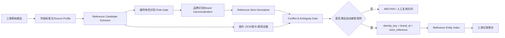

# parts-distributor-sku-classifier：从“编号角色识别”构建 precision-first 腕表 Reference 匹配系统

- 分析人：b
- 调研项目：https://github.com/pcbng/parts-distributor-sku-classifier
- 来源清单：`奢侈品文章调研.md`
- 对应需求：https://app.notion.com/p/Spec-3bf7b2a8538b812fba00fb258024ff31

## 1. 为什么选这个项目

当前需求把“同一个商品”定义为“同一 reference number / 型号”，同时明确 **绝对不能误匹配，precision 优先，允许漏匹配**。在这种约束下，最危险的问题并不是字符串相似度不足，而是：**把一个“长得像型号”的平台货号、店铺 SKU、内部 ID、序列号、配件兼容型号误当成品牌 reference。**

`parts-distributor-sku-classifier` 正好研究了这个前置问题。项目用字符级 LSTM 把电子元件编号分成三类：

1. Manufacturer Part Number（制造商型号）
2. Mouser SKU（分销商货号）
3. Digi-Key SKU（分销商货号）

它最值得迁移到腕表/二奢系统的不是 LSTM 本身，而是一个架构原则：

> **先判定“这个编号是什么角色”，再讨论它能否参与实体匹配。**

对于雷小安、腕表之家、奢当家三源数据，这一层应该放在 reference 抽取和实体聚合之间，作为强制安全闸门。

---

## 2. 原项目技术实现拆解

### 2.1 数据与训练流程

项目的原始训练数据只有两个核心字段：`partnum` 和 `class`。三类标签分别对应 MPN、Mouser SKU、Digi-Key SKU。

项目先取样本数最少类别的数量作为上限，每类截取相同数量。代码中最小类别为 **4,711** 条，因此平衡后约 14,133 条数据。随后按约 80%/20% 随机拆成训练和验证集合；一次 notebook 输出中训练集为 11,344 条，验证集为 2,789 条。

这个处理很适合说明“编号形态分类”是可以靠字符模式学习的，但对生产系统有两个明显不足：

- 随机 row split 没有按“底层真实商品/reference family”分组，可能让非常相近的编号家族同时出现在 train/val；
- 它优化的是整体分类准确率，而当前需求真正关心的是 **BRAND_REFERENCE 正类的 precision 和最终自动合并的 precision**。

### 2.2 字符级表示

项目没有把编号当自然语言词语，而是直接做字符序列建模：

1. 收集训练集中出现过的所有字符；
2. 每个字符映射为整数 ID；
3. 用 0 作为 padding/序列终止；
4. 所有编号 pad 到统一长度；
5. 通过 Embedding 把字符 ID 映射到稠密向量。

这个选择非常合理。reference/SKU 的信号主要来自：

- 字符长度；
- 数字/字母比例；
- 分隔符位置；
- 固定前后缀；
- 某些位置的字符组合。

这些本质上是 character-level pattern，不需要完整语义模型。

### 2.3 模型结构

原项目网络很小：

```text
Character IDs
  -> Embedding(dim=32)
  -> LSTM(hidden=32, dropout=0.2, recurrent_dropout=0.2)
  -> Dense(3, softmax)
```

训练配置：

- batch size：32
- optimizer：Adam
- loss：categorical cross entropy
- epoch：7

一次 notebook 输出中的验证准确率约 **98.49%**。按真实类别拆分时：

- MPN：96.19%
- Mouser SKU：99.26%
- Digi-Key SKU：100%

### 2.4 最有价值的失败分析

项目第二部分画了类别间混淆，最关键的一点是：**MPN 会被误判为分销商 SKU。** 其中示例输出约有：

- 3.050% 的 MPN 被判为 Mouser SKU；
- 0.763% 的 MPN 被判为 Digi-Key SKU。

作者进一步逐字符观察模型概率，发现某些少见标点出现后会导致模型置信度快速偏向错误类别，并明确讨论了“模型应该能够说 I don't know”的问题。

这对当前需求非常重要：**普通 softmax 分类器即使总体 accuracy 很高，也不等于适合 zero-false-positive 的自动匹配系统。必须提供 UNKNOWN / ABSTAIN，并且让模型只能作为证据之一。**

### 2.5 工程形态

项目保存了：

- 模型结构 JSON；
- 模型权重 HDF5；
- 字符字典；
- 清洗后的训练数据。

说明其基本思想可以独立封装成推理服务。不过原项目是 2018 年的 notebook/旧 Keras 风格，适合作为算法原型，不适合直接作为当前生产代码。

另外，part 1 训练时使用 `categorical_crossentropy`，part 2 reload 后 compile 使用了 `binary_crossentropy`；虽然 reload 阶段并不继续训练，这仍体现出 notebook 偏探索性质，不能照搬为生产评估基线。

---

## 3. 对当前需求最重要的迁移结论

### 3.1 不要让“模型判定它像 reference”成为自动合并理由

当前系统应把编号角色分成至少 6 类：

```text
BRAND_REFERENCE       品牌官方 reference / 型号
PLATFORM_SKU          平台自有货号
STORE_SKU             商家/门店 SKU
SERIAL_NUMBER         单品序列号/机芯号等
ACCESSORY_COMPAT_REF  配件描述中的兼容表款 reference
UNKNOWN               无法确定
```

角色模型的主要职责应该是 **veto（否决）**，而不是 authority（授权）。

即：

- 高置信判为 `PLATFORM_SKU / STORE_SKU / SERIAL_NUMBER / ACCESSORY_COMPAT_REF`：禁止进入自动匹配；
- 判为 `BRAND_REFERENCE`：仍然不能直接合并，还需通过来源、品牌、规范化、唯一性和冲突检测；
- `UNKNOWN`：默认拒识/人工复核。

这样即使角色模型偶尔误判，也不会一层错误直接造成实体错误合并。

### 3.2 “precision-first”应设计成 fail-closed

当前需求可以接受漏匹配，因此系统应该采用 fail-closed：

> 任意关键证据缺失、冲突、歧义，都输出 ABSTAIN，不自动建立实体关系。

这和传统追求 F1 的 entity matching 系统正好相反。

---

## 4. 建议直接落地的总体架构



核心思想是：**不做千万级 pairwise 相似度比较，而是先把每条记录解析成可信的 `(brand_id, canonical_reference)`，再用确定性 key 聚合。**

在“同一个商品 = 同 reference”的定义下，只要 reference 抽取足够可信，后面的匹配实际上可以退化为 O(N) 的解析 + 索引聚合，而不是 O(N²) 的实体相似度计算。

---

## 5. 关键模块设计

### 5.1 Source Profile：先利用来源结构化信息

为三个来源分别维护版本化配置：

```yaml
source: xxx
trusted_reference_fields: [...]
platform_sku_fields: [...]
store_sku_fields: [...]
serial_fields: [...]
reference_context_keywords: [...]
known_sku_regexes: [...]
```

原则：**字段语义比模型猜测更可靠。**

例如某字段在平台 schema 中明确是“商品货号/内部 ID”，就直接标为负角色，不应再让模型把它猜成 reference。

每个来源还应通过人工抽样计算字段可信度：

- reference 字段真实 precision；
- 标题中 reference 的出现率；
- 平台 SKU 的常见格式；
- 是否会把多个兼容型号写在标题中。

### 5.2 Reference Candidate Extractor

按证据强度从高到低抽取：

1. 结构化 reference/型号字段；
2. 标题中带强上下文的 span，如 `型号/Ref/Reference` 后面的 token；
3. 描述中强上下文 span；
4. 图片 OCR（保卡、吊牌、表背等）；
5. 自由文本中无上下文的“像型号字符串”只作为候选，不可自动接受。

每个候选必须保留 provenance：

```json
{
  "raw_token": "...",
  "source_field": "title",
  "span_start": 12,
  "span_end": 21,
  "extractor": "title_context_v3",
  "evidence_tier": "B"
}
```

不要只保存最后的 reference 字符串，否则之后无法解释错误。

### 5.3 编号角色识别：迁移原项目的核心思想

第一版不建议直接训练 LSTM。对于只有几百条人工标签的场景，更实用的是：

**Rule + char n-gram 小模型 + abstain**

推荐特征：

- 原始字符 n-gram（2~5 gram）；
- 长度；
- 数字/字母/符号比例；
- 前后缀；
- `- / . _ 空格` 的位置；
- 来源 source；
- 来源字段 field；
- 前后上下文词；
- 是否命中平台 SKU regex；
- 是否命中已知品牌 reference pattern。

模型可先使用 Logistic Regression / LightGBM；数据量增大后再换小型 CharCNN/Transformer。原项目已经证明字符形态足以提供很强信号，没有必要一开始就上大语言模型。

模型输出不要强制六选一，而是：

```text
class probabilities + reject score
```

只有当负角色置信度非常高时才自动 veto；正向 `BRAND_REFERENCE` 仍必须经过后续硬规则。

### 5.4 Reference 规范化：严格规范化和召回规范化必须分开

这是最容易制造误匹配的地方。

建议保存两种 canonical form：

#### strict_reference

只能做低风险变换：

- Unicode NFKC；
- 英文字母 uppercase；
- 去首尾空格；
- 连续空白折叠；
- 统一视觉等价 dash；
- 删除 zero-width 字符。

**不能默认：**

- 删除所有 `- / .`；
- 把 `O` 自动改成 `0`；
- 把 `I/L` 自动改成 `1`；
- 任意截断前后缀。

这些“看起来合理”的操作在零误匹配场景里都可能把两个真实不同 reference 合并。

#### compact_reference

可以更激进（例如去部分分隔符），但 **只用于候选检索/人工复核，不允许直接生成实体 key。**

如果某品牌确认 `AB-123` 与 `AB123` 官方等价，应把这个规则写成 **brand-specific、可版本化、带测试用例** 的 normalizer，而不是全局替换。

### 5.5 Brand Gate

即使 reference 字符串一致，也建议自动匹配至少要求品牌一致。

自动接受条件：

```text
brand_left == brand_right
AND strict_reference_left == strict_reference_right
```

如果某条记录缺品牌：

- 若 reference 在可信 registry 中只属于唯一品牌，可以进入高置信候选；
- 否则 ABSTAIN。

品牌冲突时必须 veto，不能让图片相似度、标题相似度把冲突“投票覆盖”。

### 5.6 多 reference / 配件场景必须拒识

高风险 hard cases：

- 标题出现两个或多个 reference；
- “适配 XXX/YYY 型号”的表带、表盒、配件；
- 标题同时写当前款与上一代型号；
- 商家 SKU 中嵌入品牌 reference；
- 序列号与 reference 字符形态接近。

规则：

```text
if unique_valid_reference_candidates != 1:
    ABSTAIN
```

配件/兼容语义需要单独识别成 `ACCESSORY_COMPAT_REF`，否则“表带适配 126xxx”会被错误聚合到腕表实体。

### 5.7 图片只做“加强证据/冲突否决”，不做主键

图片对同系列相邻 reference 很难做到零误匹配，因此不建议用 CLIP/视觉相似度直接决定实体相等。

最实用的图片能力是 OCR：

- 保卡 reference；
- 吊牌 reference；
- 表背刻字；
- 商品标签。

策略：

- OCR 与文本 reference 一致：提升证据等级；
- OCR 高置信给出不同 reference：ABSTAIN；
- OCR 不清晰或没有编号：忽略，不降低文本结果；
- 不自动做 O/0、I/1 等 OCR 纠错后再合并。

---

## 6. 自动接受规则（建议首版）

下面是一套可以直接上线 A/B shadow run 的保守规则。

### Tier A：可自动建立实体

满足全部：

1. 品牌已高置信 canonicalize；
2. 只有一个有效 reference 候选；
3. reference 来自可信结构化字段，或来自强上下文标题且命中品牌规则/registry；
4. role gate 没有 SKU/serial/accessory 负证据；
5. strict normalization 后得到唯一值；
6. 没有其它字段/图片 OCR 给出冲突 reference；
7. 与已有实体的 `brand_id + strict_reference` 完全一致。

### Tier B：只进入复核队列

例如：

- reference 只在标题自由文本中出现；
- 品牌缺失但可能推断；
- 使用了 compact_reference 才能对齐；
- OCR 与文本只“近似一致”；
- 多候选中模型明显偏向一个。

### Tier C：禁止匹配

- 明确平台/店铺 SKU；
- 序列号；
- 配件兼容型号；
- 品牌冲突；
- 多 reference 无法确定当前商品；
- 任何强冲突证据。

---

## 7. 实体索引设计：避免 pairwise matching

推荐把“实体”定义成 reference identity：

```text
identity_key = SHA256(brand_id + "\x1f" + strict_reference)
```

表结构示意：

```sql
CREATE TABLE product_reference_resolution (
    source              text NOT NULL,
    source_product_id   text NOT NULL,
    brand_id            bigint,
    raw_reference       text,
    strict_reference    text,
    compact_reference   text,
    role                text,
    role_score          double precision,
    evidence_tier       text,
    decision            text NOT NULL, -- ACCEPT / ABSTAIN / REJECT
    decision_reason     text,
    extractor_version   text NOT NULL,
    normalizer_version  text NOT NULL,
    updated_at          timestamptz NOT NULL,
    PRIMARY KEY (source, source_product_id)
);

CREATE INDEX idx_reference_accept
ON product_reference_resolution (brand_id, strict_reference)
WHERE decision = 'ACCEPT';
```

实体表：

```sql
CREATE TABLE reference_entity (
    entity_id           uuid PRIMARY KEY,
    brand_id            bigint NOT NULL,
    strict_reference    text NOT NULL,
    created_at          timestamptz NOT NULL,
    UNIQUE (brand_id, strict_reference)
);
```

这样 100 万~1000 万规模下匹配成本主要是：

- 每条记录一次抽取/分类；
- 一次 B-Tree/Hash 索引查询或 upsert。

不需要跨三源产生海量笛卡尔候选对。

---

## 8. 推理核心伪代码

```python
def resolve_product(record, source_profile):
    brand = canonicalize_brand(record, source_profile)
    if not brand.is_high_confidence:
        return abstain("brand_uncertain")

    candidates = extract_reference_candidates(record, source_profile)
    candidates = [attach_role_prediction(c, record) for c in candidates]

    # 强负证据先否决
    candidates = [
        c for c in candidates
        if c.role not in {
            "PLATFORM_SKU",
            "STORE_SKU",
            "SERIAL_NUMBER",
            "ACCESSORY_COMPAT_REF",
        }
    ]

    verified = []
    for c in candidates:
        strict = strict_normalize(c.raw_token, brand.id)
        if positive_reference_proof(c, strict, brand, source_profile):
            verified.append((c, strict))

    verified = deduplicate_exact(verified)
    if len(verified) != 1:
        return abstain("reference_ambiguous_or_missing")

    candidate, strict_ref = verified[0]

    if has_reference_conflict(record, strict_ref, brand):
        return abstain("conflicting_reference_evidence")

    return accept(
        identity_key=hash_identity(brand.id, strict_ref),
        brand_id=brand.id,
        strict_reference=strict_ref,
        evidence=candidate.provenance,
    )
```

这里最重要的不是分类模型精度，而是 `positive_reference_proof()` 和 `has_reference_conflict()`：自动合并必须有正向证明，任何冲突都 fail closed。

---

## 9. 人工标注如何用在刀刃上

需求允许几百对黄金标签，不建议随机抽几百条。应专门标 hard negatives：

1. 平台 SKU 很像品牌 reference；
2. SKU 内嵌真实 reference；
3. 同系列相邻 reference，只差 1~2 个字符；
4. 标题出现多个型号；
5. 配件适配型号；
6. 序列号/机芯号与 reference 混淆；
7. OCR 的 O/0、I/1、B/8 混淆；
8. 不同品牌出现相同/近似 reference；
9. 新来源/新品牌的未知格式；
10. 历史规则曾经误判的案例。

建议 300~500 条初始黄金集分配：

- 40% hard negative；
- 25% 标题抽取歧义；
- 15% SKU/serial role；
- 10% OCR；
- 10% 正常高置信正样本。

模型训练可额外利用弱标注大样本：明确的 SKU 字段天然可以产生大量负类样本；可信 reference 字段可以产生正类种子。

---

## 10. 评估指标必须改变

不要以 accuracy/F1 作为上线门槛。至少跟踪：

```text
Reference Extraction Precision
BRAND_REFERENCE Role Precision
Auto-Accept Match Precision
Auto-Accept Coverage
False Positives per Million Accepted Links
Abstain Rate
Conflict Rate by Source / Brand
```

验证集不能只随机切分，应至少增加：

- 按 reference family/group 切分；
- 按时间切分，模拟增量数据；
- leave-one-brand-out / 新品牌测试；
- leave-one-source-pattern-out；
- hard-negative 专项集。

另外，“零误匹配”无法用几百条样本统计证明。几百条黄金数据更适合找边界和校准规则；真正把线上风险压低，应依靠 **确定性 exact key + fail-closed + 强负证据 + 持续抽样审计**，而不是宣称某个模型达到 99.x% 就足够。

---

## 11. 增量更新与 1000 万规模实现

首版不需要复杂在线 ANN/vector DB。

推荐：

- PostgreSQL：reference resolution + entity index；
- 对象存储/现有数仓：原始商品与图片；
- Python batch worker：文本抽取、角色分类、normalization；
- OCR worker：只处理需要图片证据的记录；
- Kafka/消息队列：如果三个采集源已经有增量事件，则按事件触发；否则定时 micro-batch 即可。

### 初始全量

按 source 分片扫描 1000 万记录，完成：

```text
parse -> role gate -> normalize -> resolve -> bulk upsert
```

这是 O(N) 流程，适合并行 worker。

### 后续增量

每条记录用 `(source, source_product_id)` 幂等更新。保存：

- `extractor_version`
- `role_model_version`
- `normalizer_version`

规则升级后，不必重跑全部数据，只重跑受对应品牌/source/version 影响的记录。

---

## 12. 推荐的落地顺序

### Phase 1：规则优先基线（先拿到最安全的一批）

1. 建三个 source profile；
2. 明确所有结构化 reference/SKU/serial 字段；
3. 实现 strict normalizer；
4. 用 `(brand, strict_reference)` 直接聚合 Tier A；
5. 全量输出 ABSTAIN 原因分布。

这一阶段甚至不需要模型，就可以快速得到一批极高 precision 的覆盖。

### Phase 2：编号角色模型

1. 用结构化 SKU 字段生成大量弱监督负样本；
2. 人工标 300~500 个 hard cases；
3. 训练 char n-gram / LightGBM 基线；
4. 模型只做 veto 和风险分；
5. 对阈值做 precision-first 校准。

### Phase 3：标题 reference 抽取

扩大覆盖：

- 强上下文规则；
- brand-specific reference pattern；
- 多候选拒识；
- registry 校验。

### Phase 4：图片 OCR

只处理：

- 文本没有 reference；
- 文本 reference 证据等级不足；
- 需要冲突校验的高价值记录。

避免对所有图片无差别跑昂贵视觉模型。

### Phase 5：持续风险闭环

每天/每批次：

- 抽样自动 ACCEPT；
- 高优先级检查新格式、新品牌、规则边界；
- 新发现 false positive 立即加入 hard-negative regression suite；
- 任何 source schema 改动默认降级为 ABSTAIN，直到重新验证。

---

## 13. 最终建议

这个项目不能直接拿来做三源腕表实体匹配，但它非常适合成为当前架构中的 **Reference Role Gate** 思想来源。

建议不要走“文本/图片算相似度 -> 相似就合并”的常规路线，而是：

> **来源字段语义 -> reference 候选抽取 -> 编号角色识别 -> 品牌校验 -> 严格规范化 -> 冲突否决 -> exact identity key -> 聚合。**

其中机器学习只负责扩大识别能力和发现风险，**最终自动合并权必须掌握在确定性规则和可解释证据链手里。**

对于“同 reference 即同商品、绝不能误匹配、允许漏”的 Spec，这比通用 entity matching 二分类器更直接，也更容易在 1000 万规模稳定落地。
