# product-matching-rag：把“向量召回 + LLM 判别”改造成 Reference 证据恢复层，而不是最终实体裁判

- 分析人：b
- 调研项目：https://github.com/Abhisheksasidharann/product-matching-rag
- 项目代码快照：`419e3ee7248a1eb9f44bcdb35e98d892936c1ae9`
- 来源清单：`奢侈品文章调研.md`
- 对应需求：`调研计划 Spec：跨源二奢/腕表商品实体匹配系统（雷小安 × 腕表之家 × 奢当家）`
- 调研日期：2026-08-18

## 1. 结论先行

`product-matching-rag` 与当前需求的表面形态非常接近：都是从大规模、字段稀疏、跨来源电商商品里做高精度匹配。项目采用：

```text
文本规范化
  -> SentenceTransformer embedding
  -> FAISS Top-K 召回
  -> LLM 严格判断是否同一商品
  -> TP/FP/FN/TN 评估
```

这个架构最值得借鉴的是：**把便宜、宽松的召回和昂贵、严格的判别分开。**

但对当前 Spec 不能原样照搬。当前需求有一个比普通 product matching 更强的业务定义：

> “同一个商品” = **同一 reference number / 型号**，并且 precision 优先到极致，允许漏匹配。

因此最终自动建立实体关系的权限不应交给 embedding，也不应交给 LLM。建议把原项目重构为：

```text
Reference 硬证据通道             Reference 恢复通道
--------------------             --------------------
可信结构化 reference             无/脏/埋在标题或图片中的 reference
    |                                  |
严格规范化                             候选抽取
    |                                  |
冲突检查                               Reference Registry 检索
    |                                  |
brand + strict_reference              LLM 只做候选选择/证据解释
    |                                  |
确定性 identity_key                   Deterministic Verifier
    |                                  |
自动归组 <------------------------- 只有通过硬校验才回到左侧

任何不确定、冲突、无法验证的记录 -> ABSTAIN / 人工复核
```

**核心改造：RAG 的目标不再是“猜两个商品是不是一样”，而是“帮助恢复这条记录真正对应的 reference，并提供可机器验证的证据”。**

一旦得到了可信 `(brand_id, strict_reference)`，后续跨源匹配不需要再做 pairwise 相似度判断，直接按确定性 key 聚合即可。这既更符合业务定义，也能把 100 万～1000 万级任务从大规模两两匹配问题，转化成 O(N) 解析 + 索引查找问题。

---

## 2. 分析前排重检查

本次分析前先检查了 `奢侈品调研/b/product-matching-rag.md`，目标文件不存在，因此该项目尚未由 b 给出过分析结果，不与此前结果重复。

`奢侈品文章调研.md` 对该项目的推荐理由是：项目使用向量召回、属性信息和严格 LLM 判别，并显式处理相近变体误匹配，适合作为“召回 → 严格判别 → FP/FN 评测”的工程原型。

这个判断是成立的，但后面会说明：它当前的“100% precision”评测还不能作为当前零误匹配要求的证据，且 LLM 在当前业务里应该降权为**证据恢复器**，而不是 match authority。

---

## 3. 原项目真实技术架构

README 给出的主流程为：

```text
[WDC Corpus 1.3M+ Offers]
       |
       +-- filter_clusters.py
       |
       +-- build_catalog_split.py
       |      +-- catalog_a.jsonl
       |      +-- catalog_b.jsonl
       |
       +-- normalize_offers.py
       |
       +-- sample_catalog.py
       |
       +-- build_embeddings.py
       |      +-- FAISS IndexFlatIP
       |      +-- ID Map JSON
       |
       +-- retrieve.py
       |
       +-- match_with_llm.py
              +-- llm_match_results.jsonl
```

对应源码非常小，主要脚本包括：

```text
scripts/
├── build_catalog_split.py
├── normalize_offers.py
├── sample_catalog.py
├── build_embeddings.py
├── retrieve.py
├── match_with_llm.py
├── filter_clusters.py
├── scan_offdomain.py
├── check_vehicle_fps.py
└── verify_outputs.py
```

这不是完整生产服务，而是一个端到端研究/工程原型。优点是路径清晰，适合快速验证“召回层 + 判别层”是否有效；缺点是很多数据结构和评测假设不能直接扩展到千万级线上系统。

---

## 4. 数据拆分：如何构造候选目录和 query

### 4.1 `build_catalog_split.py`

代码对 WDC corpus 做两遍流式扫描：

1. 第一遍用 `Counter` 统计每个 `cluster_id` 的样本数；
2. 第二遍：
   - cluster 只有 1 个 offer -> `singletons.jsonl`
   - 每个 cluster 第一条 offer -> `catalog_a.jsonl`
   - 该 cluster 后续 offer -> `catalog_b.jsonl`

因此同一个 ground-truth cluster 被拆到 A/B 两侧，可以模拟跨 catalog 匹配。

这里有一个命名/注释层面的轻微不一致：有些注释把 A 称 catalog/anchor、B 称 query，而真正 `retrieve.py` / `match_with_llm.py` 运行时是 **A 作为 query，B 作为 FAISS index candidate**。不影响核心逻辑，但生产工程中应把 `query_catalog` / `candidate_catalog` 的角色明确下来，避免后续评测混淆。

### 4.2 对当前三源系统的启示

雷小安、腕表之家、奢当家并不应该通过随机切一个 A/B 来模拟，而应该保留真实 source boundary：

```text
source = leixiaoan
source = xxxxx-watch-site
source = luxury-platform
```

评估至少分别做：

```text
雷小安 -> 腕表之家
雷小安 -> 奢当家
腕表之家 -> 奢当家
```

同时还要做全局三源 identity 聚合测试，特别观察“一条错边把整个 cluster 污染”的风险。

但生产系统的实体主键应独立于 pair：

```text
identity_key = hash(brand_id + strict_reference)
```

这样第三个来源加入时不需要重新比较所有历史 pair。

---

## 5. 规范化：原项目做了什么，以及为什么对 Reference 不够

`normalize_offers.py` 主要做：

- 车辆/房地产等 off-domain regex 拒绝；
- price 转 float；
- 标题前缀重复品牌删除；
- 将 `brand + title + description[:200]` 拼成 `composite_text`；
- 无文本记录拒绝。

其典型输出字段为：

```json
{
  "id": "...",
  "cluster_id": "...",
  "brand": "...",
  "title": "...",
  "description": "...",
  "price": 1234.0,
  "priceCurrency": "...",
  "composite_text": "brand | title | desc..."
}
```

对于普通 semantic product retrieval，这是合理的；但腕表 reference 属于**标识符型字段**，不应该混在自然语言 composite text 里只靠 embedding 学。

当前系统应把规范化拆成两类：

### 5.1 文本召回规范化

可以做相对宽松的变换，用于找候选：

```text
lower/upper normalize
空白折叠
部分标点归一
同义品牌词
系列别名
字符 n-gram
```

允许有损，因为它只有召回权限。

### 5.2 身份严格规范化 `strict_reference`

必须极度保守，只做低风险等价变换，例如：

```text
Unicode NFKC
英文字母 uppercase
首尾空格删除
连续空白折叠
zero-width 字符删除
视觉等价 dash 统一
```

全局默认禁止：

```text
删除所有 - / .
O -> 0
I/L -> 1
随意去前缀/后缀
只保留数字
截短 reference
```

例如两个相邻腕表 reference 可能只差一个后缀或一位数字。对自然语言相似度而言它们几乎相同，对业务 identity 而言却必须完全不同。

若某品牌官方确认 `AB-123` 和 `AB123` 是同一个 reference，应该写成：

```text
brand-specific equivalence rule
+ rule_version
+ regression tests
+ audit record
```

而不是全局启用“去横线”。

---

## 6. Embedding 和 FAISS：原项目实现细节

`build_embeddings.py`：

```python
model = SentenceTransformer("all-MiniLM-L6-v2")
embeddings = model.encode(
    texts,
    batch_size=64,
    normalize_embeddings=True,
)

index = faiss.IndexFlatIP(dim)
index.add(embeddings.astype(np.float32))
```

因为向量被 L2 normalize，`IndexFlatIP` 的 inner product 等价于 cosine similarity。

它同时构建一个 JSON `id_map`，每个向量保存：

```text
id
cluster_id
title
composite_text
brand
price
priceCurrency
```

`retrieve.py` 再对 query 生成同模型 embedding，取 Top-10。

### 6.1 这个设计的优点

- 简单；
- exact vector search，实验复现容易；
- Top-K 和下游 LLM 解耦；
- embedding 只负责“可能相似”，不直接输出实体关系；
- 对标题差异很大的同商品有召回能力。

### 6.2 千万级不能直接照搬 `IndexFlatIP`

`IndexFlatIP` 是 exact search，单次检索计算量近似：

```text
O(N * d)
```

1000 万商品时，如果每个增量商品都直接对全库做 exact dense vector scan，吞吐和成本都不理想。

另外原脚本存在明显的单机内存假设：

1. `build_embeddings.py` 先把所有 `texts` 放进 Python list；
2. 再一次性得到 embeddings；
3. `id_map` 把较丰富 metadata 全部写进一个 JSON；
4. 检索时整个 `id_map` 一次性加载内存。

以常见 384 维 float32 向量估算：

```text
10,000,000 * 384 * 4 bytes ~= 15.4 GB
```

这还只是裸向量，不含 Python object、JSON metadata、索引额外空间和文本。

更重要的是：**当前需求根本不应该给 1000 万 offer 都建“最终匹配向量库”。**

建议向量库只存：

- unresolved / abstain 记录；或
- 更小的 `Reference Registry`（唯一 reference 及其别名/系列/品牌描述）。

如果 unique reference 只有 offer 数量的很小一部分，RAG 检索空间会从千万级 offer 降到 reference catalogue 级别。

若 unresolved 仍很大，再按品牌/品类分片，使用 HNSW / IVF-PQ 等 ANN；但 ANN 只影响恢复率，不拥有自动 identity 权限，因此少召回一些是可接受的。

---

## 7. 原项目为什么需要 LLM

README 给出的典型例子很正确：

```text
8GB RAM module
64GB RAM module
```

dense embedding 可能高度相似，但它们显然不是同一 variant。LLM 能读取属性差异，作为第二阶段 filter。

`match_with_llm.py` 把 FAISS Top-10 中前 5 个发给 LLM，系统 prompt 定义：

```text
same product = 客户认为可互换的同一商品
不同颜色/尺寸/包装数量 != same product
不同卖家/不同价格但相同 SKU = same product
```

LLM 返回：

```json
{
  "match_found": true,
  "matched_candidate": 1,
  "confidence": "high",
  "evidence": "..."
}
```

这个设计说明项目真正做的是 **LLM re-ranker / discriminator**，而不是经典意义的“把外部知识检索进生成答案”的 RAG。

---

## 8. 对当前 Spec，LLM 必须降权

当前业务定义不是“客户觉得可互换”，而是：

```text
same entity <=> same reference number
```

因此原 prompt 的 semantic authority 太大。

例如两只同系列、同尺寸、同材质、外观近乎相同的腕表，只要 reference 不同，就不能合并。LLM 即使给出 `confidence=high` 也不能越过 reference 规则。

而且当前代码里 `confidence` 只是记录，并**没有参与 gate**：只要 `match_found=true` 且 candidate rank 合法，就会作为 match 计算。

生产设计应改成：

> LLM 只能回答“哪个候选 reference 被当前记录的证据支持”，不能回答“这两条商品记录应该不应该合并”。

推荐输出 schema：

```json
{
  "status": "SUPPORTED | CONFLICT | ABSTAIN",
  "candidate_reference_id": "ref-registry-id-or-null",
  "evidence": [
    {
      "field": "title",
      "raw_span": "Ref. 126334",
      "normalized_span": "126334"
    }
  ],
  "conflicts": [],
  "reason_code": "EXPLICIT_REF_CONTEXT"
}
```

然后由独立 deterministic verifier 检查：

```text
candidate 是否真的来自候选集合
证据 span 是否真实存在于输入
strict normalization 后是否等于候选 reference
brand 是否一致
是否存在第二个冲突 reference
编号角色是否确认为 BRAND_REFERENCE
来源 field 是否有自动接受权限
```

任何一条失败：

```text
ABSTAIN
```

这样即使 LLM hallucinate，也很难直接形成 false merge。

---

## 9. 一个重要发现：原项目“100% Precision”评测不能直接外推

README 声称 50-query 端到端实验：

```text
Precision = 1.0
Recall = 0.87
F1 = 0.93
```

这个结果可以证明“小样本里没观察到 FP”，但不能证明 production 级零误匹配。

更关键的是，源码评测设计有结构性偏差。

### 9.1 Query 被限制为“索引里一定存在同 cluster 样本”

`sample_catalog.py` 先从 B 中抽样；`retrieve.py` / `match_with_llm.py` 构建：

```python
indexed_clusters = set(entry["cluster_id"] for entry in id_map)
```

处理 A query 时：

```python
if query_cluster not in indexed_clusters:
    continue
```

因此被评估的 query 都已知在整个索引中存在至少一个同 cluster 记录。

这意味着评测中几乎没有真正业务意义上的：

> “这个商品在候选目录里根本没有匹配，模型应该稳定输出 no-match”

也就是缺少真实 open-world negatives。

### 9.2 `TN` 的定义会把 Retrieval Miss 当 True Negative

代码定义：

```python
gt_has_match = any(c["cluster_id"] == query_cluster for c in candidates)
```

这里的 `candidates` 只是 Top-10。

如果真实匹配确实存在于整个 FAISS index 中，但没有被召回到 Top-10，则：

```text
gt_has_match = False
```

随后 LLM 输出 no-match 会进入：

```text
TN += 1
```

但从端到端系统语义来看，这不是 true negative，而是 **retrieval false negative / pipeline miss**。

因此当前 `tp/fp/fn/tn` 混合了：

- candidate retrieval 是否成功；
- LLM 在可见 Top-K 上是否判对。

同时它的 recall：

```python
recall = tp / (tp + fn)
```

不会把这种被计成 TN 的 retrieval miss 算进 FN，因而并不是严格的 full-pipeline recall。

### 9.3 50 个样本远不足以证明极低 FP 率

即使假设 50 个自动接受决策全部正确，有限样本下也只能说明“观察到 0 error”，无法说明真实 precision 接近 100% 到当前业务需要的程度。

粗略使用 zero-failure rule：如果希望在 95% 置信水平把 false-positive rate 上界压到约：

```text
1e-2 -> 约 300 个零失败样本
1e-3 -> 约 3,000 个
1e-4 -> 约 30,000 个
1e-5 -> 约 300,000 个
```

这是 `3/n` 量级的近似，还没有考虑样本相关性、品牌分层和分布漂移。

所以当前项目的结果很适合作为“可行性 demo”，但不能作为“绝对不能误匹配”的验收方法。

---

## 10. 建议直接落地的总体架构

```mermaid
flowchart LR
    A[雷小安/腕表之家/奢当家 Raw Offer] --> B[Source Adapter + Provenance]
    B --> C[Brand Canonicalizer]
    B --> D[Reference Candidate Extractor]
    IMG[图片] --> OCR[OCR/图像证据抽取]
    OCR --> D

    D --> E[Identifier Role Gate]
    E --> F[Strict Reference Normalizer]
    C --> G[Deterministic Accept Gate]
    F --> G

    G -->|可信且唯一| H[identity_key = brand_id + strict_reference]
    H --> I[Reference Entity Index]
    I --> J[跨源 offer 归组]

    G -->|缺失/冲突/低置信| K[Unresolved Queue]
    K --> L[Reference Registry Hybrid Retrieval]
    L --> M[LLM Evidence Selector]
    M --> N[Deterministic Verifier]
    N -->|通过| H
    N -->|失败| O[ABSTAIN / 人工复核]
```



这里保留了 `product-matching-rag` 的核心结构：

```text
retrieval -> strict second stage
```

但把“strict second stage”进一步拆成：

```text
LLM evidence selector -> deterministic verifier
```

LLM 没有写 identity 的权限。

---

## 11. 第一条通道：可信 Reference 直接确定性归组

对每条商品记录，不先找另一条商品做比较，而是先解析：

```json
{
  "brand_id": "rolex",
  "reference_raw": "126334",
  "strict_reference": "126334",
  "reference_role": "BRAND_REFERENCE",
  "evidence_tier": "A",
  "conflict": false
}
```

然后：

```text
identity_key = SHA256(brand_id + "\0" + strict_reference)
```

或者数据库中直接建立唯一键：

```sql
UNIQUE (brand_id, strict_reference)
```

跨来源的全部记录只要通过同一严格规则，就自然归到同一个 `reference_entity_id`。

这条路径的复杂度近似 O(N)，不需要千万级 pairwise comparison。

---

## 12. Source Profile：来源字段语义优先于模型猜测

对三个来源分别建立版本化配置：

```yaml
source: leixiaoan
version: 3
trusted_reference_fields:
  - reference_no
platform_sku_fields:
  - item_id
  - spu_id
serial_fields:
  - serial_no
reference_context_keywords:
  - 型号
  - reference
  - ref
known_platform_sku_patterns:
  - "..."
```

原因是：

> 字段 schema 明确说“这是平台货号”，比任何模型说“这个字符串长得像型号”都更可信。

因此 Reference Candidate Extractor 应按证据等级工作：

```text
Tier A: 结构化 reference 字段
Tier B: 标题中带“型号 / Ref / Reference”等强上下文
Tier C: 描述中的强上下文
Tier D: 图片 OCR 中的型号候选
Tier E: 无上下文、仅形态像 reference 的 token
```

Tier E 默认不能直接自动归组。

---

## 13. Identifier Role Gate：先判断编号“是什么”，再匹配

二奢数据中最危险的误匹配之一是把错误类型编号当成 reference，例如：

```text
PLATFORM_SKU
STORE_SKU
SERIAL_NUMBER
INVENTORY_ID
ACCESSORY_COMPAT_REFERENCE
BRAND_REFERENCE
UNKNOWN
```

`product-matching-rag` 没有这一层，它把商品文本整体 embedding。

当前系统必须先做 role gate：

```text
PLATFORM_SKU / STORE_SKU / SERIAL_NUMBER / COMPAT_REF
    -> veto

BRAND_REFERENCE
    -> 继续后续 strict validation

UNKNOWN
    -> abstain
```

模型只建议 role，来源 schema 和硬规则拥有更高优先级。

---

## 14. Reference Registry：把 RAG 检索目标从“1000 万商品”换成“参考号目录”

这是最值得直接落地的架构变化。

原项目检索对象是 `catalog_b` 中的商品 offer：

```text
query offer -> Top-K offer
```

当前业务最终只关心 reference，因此可以建立：

```text
Reference Registry
------------------
reference_id
brand_id
canonical_reference
known_aliases
series
model_name
brand_specific_patterns
valid_from/to (可选)
source_of_truth
rule_version
```

RAG 变成：

```text
脏商品记录
  -> 抽取若干 reference-like token
  -> 在同品牌 Reference Registry 中 hybrid retrieve
  -> Top-K candidate references
  -> LLM/规则选择哪个候选真的被原始证据支持
```

优势：

1. 检索空间远小于商品 offer 数；
2. 候选结果就是业务真正关心的 reference；
3. 可以给每个 reference 存官方/人工确认 alias；
4. 新增 100 万 offer 不需要把 100 万向量都放到最终 identity 检索库；
5. 更容易做 brand partition；
6. LLM 不再需要从相似商品间“猜”，只需在有限 reference 候选中做证据对齐。

---

## 15. Hybrid Retrieval：Reference 不应只用 dense embedding

reference 属于字符型 identifier，纯 semantic embedding 往往不是最合适的第一选择。

建议候选召回融合：

```text
1. exact strict match
2. exact alias match
3. brand-specific normalized match
4. character n-gram / trigram
5. BM25 / lexical
6. dense embedding（标题/系列语义）
7. OCR token fuzzy candidate（只召回）
```

例如：

```text
126334
126 334
Ref.126334
126334-0001
```

字符/规则检索往往比句向量更可控。

最终 Top-K 可以做 RRF 或手工 rank fusion，但无论 rank 多高，都没有自动 identity 权限。

---

## 16. 图片应该怎么用

Spec 明确有图片，而原项目完全是文本流程。

腕表图片最有价值的不是“视觉长得像不像”，而是**恢复硬标识符证据**：

```text
保卡
吊牌
表背
证书
盒标
机芯/壳号区域
```

推荐图片链路：

```text
image quality gate
  -> document / dial / caseback region detector（可选）
  -> OCR
  -> reference-like token detector
  -> identifier role gate
  -> brand-specific reference validation
```

视觉 embedding 只适合：

- 给人工复核排序；
- 发现文本和图片明显冲突；
- 在 reference 缺失时帮助选候选系列。

不能因为“两张表看起来一样”就自动合并，因为同系列不同 reference 可能视觉几乎一致。

---

## 17. Deterministic Accept Gate：唯一有自动合并权限的组件

建议自动接受至少同时满足：

```text
A. brand_id 已高置信 canonicalize
B. 只有一个有效 BRAND_REFERENCE 候选
C. strict_reference 非空且通过品牌 grammar/registry 检查
D. 没有第二个冲突 reference
E. 没有 PLATFORM_SKU / SERIAL / COMPAT_REF 冲突
F. evidence tier 在该 source 的自动放行白名单
G. 若走 LLM/RAG 恢复路径，LLM 输出已经被 deterministic verifier 逐字段复核
H. normalizer/rule_version 可追踪
```

伪代码：

```python
def resolve_identity(offer):
    brand = resolve_brand(offer)
    evidences = extract_reference_evidence(offer)
    candidates = classify_identifier_roles(evidences)

    trusted = [x for x in candidates if x.role == "BRAND_REFERENCE"]

    result = strict_resolve(brand, trusted)
    if result.is_unique and not result.has_conflict:
        return ACCEPT(identity_key(brand.id, result.strict_ref))

    recovered = recovery_rag(offer, brand, candidates)
    verified = deterministic_verify(offer, recovered)

    if verified.accept:
        return ACCEPT(identity_key(brand.id, verified.strict_ref))

    return ABSTAIN(verified.reason)
```

这是 fail-closed，而不是 fail-open。

---

## 18. 建议数据模型

### 18.1 `raw_offer`

```text
source
source_record_id
crawl_time
raw_payload_uri
raw_hash
schema_version
```

唯一键：

```text
(source, source_record_id, raw_hash)
```

用于增量幂等和历史追溯。

### 18.2 `reference_evidence`

```text
offer_id
evidence_id
channel              structured/title/description/ocr
source_field
raw_span
raw_token
strict_candidate
role
role_score
ocr_score
extractor_version
created_at
```

### 18.3 `reference_registry`

```text
reference_id
brand_id
canonical_reference
strict_reference
aliases
series
status
rule_version
provenance
```

唯一键：

```text
(brand_id, strict_reference)
```

### 18.4 `identity_assignment`

```text
offer_id
reference_id
decision              ACCEPT/ABSTAIN/REVIEW
policy_version
decision_reason
evidence_ids
assigned_at
```

### 18.5 `review_task`

```text
offer_id
candidate_reference_ids
reason_code
priority
review_result
reviewer
```

### 18.6 `audit_event`

记录：

```text
谁/哪个模型/哪个规则
在什么版本
因为哪些 evidence
把 offer 归到哪个 reference
```

“绝不能误匹配”场景下，可解释性和可回滚性不是附加功能，而是核心能力。

---

## 19. 100 万～1000 万级持续增量实现建议

不需要一开始就把整套系统做成超复杂分布式 ER 平台。

推荐拆成：

```text
Raw Storage:        Object Storage / 原始数据库
Metadata DB:        PostgreSQL（或同类关系型数据库）
Exact Entity Index: UNIQUE(brand_id, strict_reference)
Event/Queue:        Kafka / Pulsar / SQS / Redis Stream 等任选
Worker:
  - brand resolver
  - reference extractor
  - OCR worker
  - recovery retriever
  - verifier
Review UI:          人工复核
Vector/Lexical:
  - 先对 Reference Registry 建索引
  - unresolved 数量大时再引入独立 ANN 服务
```

### 19.1 增量写入

新 offer 到达：

```text
1. raw offer 幂等 upsert
2. 运行 source adapter
3. 抽 reference evidence
4. strict gate
5. 成功 -> exact identity upsert
6. 失败 -> unresolved queue
7. 需要时才 OCR / RAG / LLM
```

绝大多数拥有明确 reference 字段的记录不需要 LLM。

### 19.2 规则/模型升级

不要全库无差别重跑。

每个 assignment 存：

```text
extractor_version
normalizer_version
policy_version
```

升级后优先重跑：

```text
ABSTAIN
低 evidence tier
历史人工错误样本
受新 brand rule 影响的记录
```

已稳定 ACCEPT 的记录只有在规则语义变更时重审。

---

## 20. `product-matching-rag` 原代码哪些可以直接借，哪些不能

| 模块 | 是否借鉴 | 当前建议 |
|---|---|---|
| 流式读取 JSONL | 可以 | 保留流式思路，但生产写数据库/队列 |
| “召回 + 严格二阶段” | 强烈借鉴 | 作为总体骨架 |
| SentenceTransformer | 可选 | 用于 unresolved/语义辅助，不做 identity |
| FAISS | 可选 | Reference Registry 或 unresolved 候选检索 |
| IndexFlatIP | 仅实验 | 千万级改 ANN/分片，或缩小索引目标 |
| rich ID map JSON | 不建议生产 | metadata 放 KV/DB，不全量 JSON 常驻内存 |
| Top-K -> LLM | 借鉴但降权 | 改成候选 reference -> LLM evidence selector |
| LLM `match_found` | 不可作为最终判据 | 只能建议，后接 deterministic verifier |
| LLM confidence | 不可信任为唯一门槛 | 只能作为 review 排序信号 |
| cluster_id 评测 | 可作为研究基线 | 当前业务改用 reference ground truth |
| 50-query 100% precision | 只能作 demo | 不能作为生产验收 |
| singleton filtering | 评测可用 | 生产不能删除，真实 no-match 是重要样本 |

---

## 21. 评测必须重做成 precision-first / abstention-first

当前需求不应该主要看：

```text
F1
Accuracy
平均 similarity
```

应该看：

### 21.1 核心指标

```text
Auto-Accept Precision
False Merge Count
Auto-Accept Coverage
Abstain Rate
Reference Extraction Precision
Reference Resolution Coverage
```

其中最重要的是：

```text
P(correct reference | system auto-accepted)
```

### 21.2 Candidate Retrieval 单独评估

```text
Reference Recall@K
```

这个指标可以低一些，因为允许漏匹配，但需要知道恢复通道覆盖率。

### 21.3 LLM 不直接评“match accuracy”

改评：

```text
Evidence selection accuracy
Unsupported candidate selection rate
Hallucinated evidence rate
Conflict detection recall
```

### 21.4 Hard Negative 集合必须人为加强

黄金样本不要随机抽几百对就结束，而要集中在最容易产生 FP 的边界：

```text
同品牌、同系列、reference 只差 1 个字符
同 reference 主体、不同 suffix
平台 SKU 与品牌 reference 形态相似
序列号看起来像 reference
配件标题包含“适配某 reference”
标题出现多个 reference
OCR O/0、I/1、S/5 混淆
品牌缺失但 reference 字符串碰撞
图片高度相似但 reference 不同
不同来源字段语义不一致
```

模型通过普通随机负例没有意义，必须通过这些 hard negatives。

---

## 22. 几百条人工标注应该怎么花

Spec 允许几百对人工黄金标签。建议不要主要拿去微调一个“大一统 matcher”，而是分配为：

```text
约 100：reference 抽取/编号角色边界样本
约 100：same-series adjacent-reference hard negatives
约 50：OCR 型号混淆
约 50：平台 SKU/内部货号/序列号负例
约 50：多 reference/配件兼容场景
约 50：品牌缺失/别名/跨源 schema 冲突
```

主要用途：

1. 定义和验证 acceptance policy；
2. 找最危险的 false-positive pattern；
3. 校准来源字段可信度；
4. 训练小型 role classifier / extractor；
5. 建 regression test suite。

之后生产上线后持续抽样自动 ACCEPT 结果做盲审，扩展统计置信度。

---

## 23. 上线策略：Shadow -> Allowlist -> 扩覆盖

### Phase 0：数据审计

每个来源抽样：

```text
reference 字段真实含义
品牌字段覆盖率
标题 reference 出现率
平台 SKU 格式
序列号格式
配件占比
图片 OCR 可读率
```

产出 Source Profile。

### Phase 1：只上线确定性通道

自动接受范围只包括：

```text
trusted source reference field
+ trusted brand
+ strict reference validator
+ no conflict
```

先获取一个非常干净的实体底座。

### Phase 2：Reference Registry + lexical recovery

先不上 LLM：

```text
exact alias
char n-gram
brand-specific normalization
```

只扩大可恢复 reference 的 coverage。

### Phase 3：LLM evidence selector，Shadow 模式

LLM 输出不影响线上实体，只记录：

```text
候选 reference
证据 span
conflict
```

人工审计它是否有稳定的 hard-case 提升。

### Phase 4：极窄 Allowlist 自动回流

只允许已经证明安全的路径进入 ACCEPT，例如：

```text
同 brand
唯一候选
LLM SUPPORTED
literal evidence span 可验证
strict ref exact
无冲突
来源字段白名单
```

其余仍 review。

### Phase 5：逐品牌、逐来源扩覆盖

不要全局一次调一个 threshold。每个品牌、来源、证据路径分别看 precision 和 coverage。

---

## 24. 一个更贴近生产的 Reference Recovery API

### Request

```json
{
  "offer_id": "lx-123",
  "source": "leixiaoan",
  "brand": "ROLEX",
  "title": "劳力士日志型 126334 ...",
  "description": "...",
  "structured_fields": {
    "model": ""
  },
  "ocr_tokens": ["126334"]
}
```

### Retrieval output

```json
{
  "candidates": [
    {
      "reference_id": "ref-rolex-126334",
      "strict_reference": "126334",
      "retrieval_reasons": ["title_exact", "ocr_exact"],
      "score": 1.0
    },
    {
      "reference_id": "ref-rolex-126333",
      "strict_reference": "126333",
      "retrieval_reasons": ["char_ngram"],
      "score": 0.91
    }
  ]
}
```

### LLM output

```json
{
  "status": "SUPPORTED",
  "candidate_reference_id": "ref-rolex-126334",
  "evidence": [
    {"channel": "title", "span": "126334"},
    {"channel": "ocr", "span": "126334"}
  ]
}
```

### Deterministic verifier

```text
brand candidate == ROLEX                PASS
candidate in retrieved set              PASS
title literal normalized span == 126334 PASS
OCR normalized span == 126334           PASS
second conflicting ref                  NONE
role == BRAND_REFERENCE                 PASS
policy path allowed                     PASS
```

最终才生成：

```text
identity_key = ROLEX|126334
```

---

## 25. 失败模式和对应保护

### 25.1 相邻型号 embedding 很近

保护：

```text
embedding only retrieves
strict_reference decides
```

### 25.2 LLM 被相似标题诱导

保护：

```text
LLM cannot write identity
must cite machine-verifiable reference evidence
```

### 25.3 标题写“适配 126334”但卖的是表带

保护：

```text
identifier role = ACCESSORY_COMPAT_REFERENCE
product_type gate
-> veto
```

### 25.4 OCR 把 `0` 看成 `O`

保护：

```text
禁止全局 O->0 自动修复
只作为多个候选召回
需要文本或品牌 grammar 二次确认
```

### 25.5 同一个标题出现两个 reference

保护：

```text
multiple valid reference candidates -> ABSTAIN
```

### 25.6 平台 SKU 和某品牌 reference 恰好相同

保护：

```text
source field semantics + role gate > string equality
```

### 25.7 新品牌/新 reference 分布漂移

保护：

```text
未知 grammar -> abstain
不因 embedding/LLM high confidence 自动放行
```

---

## 26. 对“绝对不能误匹配”的现实解释

任何基于有限样本和机器学习的系统都无法数学意义上证明未来永远 0 FP。

工程上能做的是：

1. 把自动合并权限限制到少数可验证硬证据路径；
2. 默认拒识；
3. 所有软模型只能提议，不能授权；
4. 保存完整 provenance；
5. 用 hard-negative regression 持续阻断已知风险；
6. 对自动接受结果持续盲审；
7. 按品牌/来源做 precision 监控；
8. 一旦出现 FP，可以按 `policy_version / rule_version` 快速找到所有受影响 assignment 并回滚。

这比“把 LLM threshold 调高到 0.99”可靠得多。

---

## 27. 最终建议

`product-matching-rag` **值得参考，但不建议直接作为最终匹配器落地。**

最值得保留的三点：

1. **Candidate Retrieval 与最终严格判断分层；**
2. **主动研究相近 variant 的 false positive；**
3. **让昂贵模型只处理 Top-K，而不是全量 pair。**

需要彻底修改的三点：

1. 最终语义从“LLM 判断 same product”改成“确定性 same reference”；
2. RAG 检索对象从“全量商品 offer”优先改成“Reference Registry”；
3. LLM 从 match authority 降为 evidence selector，并后接 deterministic verifier。

推荐最终生产路径：

```text
Source-aware Reference Extraction
  -> Identifier Role Gate
  -> Brand Canonicalization
  -> Strict Reference Normalization
  -> Deterministic Accept Gate
  -> (brand_id, strict_reference) Exact Identity Index

无法确定的尾部：
  -> Hybrid Reference Retrieval
  -> LLM Evidence Selection
  -> Deterministic Verification
  -> ACCEPT or ABSTAIN
```

在当前“same reference 即 same product”的定义下，这条路线比一般的 dense product matching 更简单，也更安全：**模型负责把脏数据变成可信 reference，数据库负责匹配。**

---

## 28. 参考代码与来源

- 调研清单：`WorkerXu/my-doc/奢侈品文章调研.md`
- 需求：Notion `调研计划 Spec：跨源二奢/腕表商品实体匹配系统（雷小安 × 腕表之家 × 奢当家）`
- 项目：https://github.com/Abhisheksasidharann/product-matching-rag
- README：https://github.com/Abhisheksasidharann/product-matching-rag/blob/main/README.md
- 数据拆分：https://github.com/Abhisheksasidharann/product-matching-rag/blob/main/scripts/build_catalog_split.py
- 规范化：https://github.com/Abhisheksasidharann/product-matching-rag/blob/main/scripts/normalize_offers.py
- 抽样：https://github.com/Abhisheksasidharann/product-matching-rag/blob/main/scripts/sample_catalog.py
- Embedding / FAISS：https://github.com/Abhisheksasidharann/product-matching-rag/blob/main/scripts/build_embeddings.py
- Retrieval：https://github.com/Abhisheksasidharann/product-matching-rag/blob/main/scripts/retrieve.py
- LLM Matching：https://github.com/Abhisheksasidharann/product-matching-rag/blob/main/scripts/match_with_llm.py
