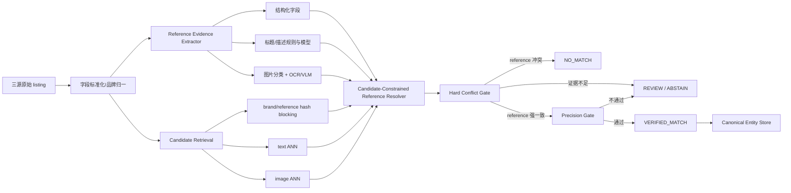

# Ameli：Enhancing Multimodal Entity Linking with Fine-Grained Attributes

> 分析人：c  
> 目标需求：跨源二奢/腕表商品实体匹配（雷小安 × 腕表之家 × 奢当家）  
> 核心约束：同一个商品定义为**同一 reference number / 型号**；100 万–1000 万级持续增量；字段稀疏；图片可用；**precision 极端优先，绝不能误匹配，允许漏匹配**。

## 1. 选题与去重

本次从 `奢侈品文章调研.md` 中选择：

- 论文：**Ameli: Enhancing Multimodal Entity Linking with Fine-Grained Attributes**
- EACL 2024：https://aclanthology.org/2024.eacl-long.172/
- arXiv v2：https://arxiv.org/html/2305.14725v2
- 官方代码（原链接会重定向到当前仓库）：https://github.com/PLUM-Lab/Ameli

执行前检查了 `奢侈品调研/`：当前已有 `a/DeepBlocker.md` 与 `b/parts-distributor-sku-classifier.md`，没有 `c/`，因此 c 尚无历史分析，不存在重复分析。

选择 Ameli 的原因是它和本需求的结构高度相似：都是在**大量“看起来很像”的商品候选中，利用文本、图片和细粒度属性做实体判定**。论文甚至把 `Model Number` 明确列为重点属性之一。更重要的是，它把系统拆成 `Candidate Retrieval -> Attribute Extraction -> Entity Disambiguation`，这一分层非常适合改造成“高召回候选 + reference 硬证据收口”的 precision-first 架构。

---

## 2. Ameli 在解决什么问题

Ameli 构建了一个电商多模态实体链接任务：输入是一段提及某商品的文本和若干图片，目标是在一个商品 KB 中找到唯一目标商品。arXiv v2 的 KB 包含 34,690 个商品实体、177,873 张实体图片和 798,216 条属性；mention 侧有 16,735 条文本 mention 和 30,472 张图片。

论文最关键的观察不是“图片 + 文本能提高分数”，而是：**真正区分近邻商品变体的，经常是少数几个细粒度属性**。例如同一产品族的颜色、容量、内存、型号等。最终版本实验中：

- 不使用属性时，其 T+V disambiguation F1 为 52.53；
- 使用系统抽取属性后为 60.30；
- 使用人工 Gold Attribute 后为 73.08；
- End-to-End F1 从无属性的 44.85 提高到系统属性的 51.54。

这说明属性质量直接决定近邻实体的消歧上限。对腕表来说，这个结论更强：**reference 本身不是普通属性，而应提升为身份主键级证据**。

---

## 3. 论文与代码的技术实现拆解

### 3.1 总体两阶段结构

论文按两个主阶段处理：

1. **Candidate Retrieval**：从整个 KB 中先召回 Top-K 候选。
2. **Entity Disambiguation**：在 K 个候选中进一步利用属性、文本和图片判别唯一实体。

代码也保持了类似边界：

- `candidate_retrieval.py`：配置检索模型、Top-K、文本/图片 encoder、是否复用预计算 embedding 等；
- `retrieval/`：数据、模型、训练、搜索和评估；
- `attribute/`：属性提取、融合、清洗；
- `entity_disambiguation_v2.py` + `disambiguation/`：候选消歧、训练、推理、后处理。

这个工程拆分值得直接参考，因为它允许我们把“召回”与“最终自动匹配”设置成完全不同的风险目标：**召回追求不漏；最终放行追求不误。**

### 3.2 Candidate Retrieval：SBERT + CLIP + 缓存

Ameli 的候选召回同时使用文本和图片。

文本侧：

- 使用 SBERT 编码 review/mention 文本与 entity 文本；
- entity 文本不只放标题，而是把 title、description、attributes 拼入；
- 以 cosine similarity 作为文本相似度；
- 使用 InfoNCE 微调，使正实体相似度高于负实体；
- entity embedding 可以预先计算并缓存。

图片侧：

- 使用 CLIP 编码 mention 图片和 entity 图片；
- 同样用 InfoNCE 微调；
- 一个 mention 与一个实体可能有多张图片，论文采用图片集合间**最大 pairwise cosine**作为实体级图片相似度。

最终召回分数为文本与图片分数的加权和，再取 Top-K。v2 中微调后的 T+V 在 Recall@10 / @20 / @100 达到 85.84 / 90.26 / 95.11。

代码 `candidate_retrieval.py` 中能看到以下工程化入口：

- `--use_precomputed_embeddings`：显式支持预计算 embedding；
- `--top_k`：控制召回规模；
- `--bi_encoder_checkpoint` / `--image_encoder_checkpoint`：文本与图片 encoder 可替换；
- `--img_fuse_mode=max`：与论文的多图最大相似度策略一致；
- `--text_base`：可调整 entity 文本来源。

**对 100 万–1000 万数据，最值得借鉴的是“离线预计算实体表示 + 在线只算新增 listing 表示”，而不是具体 SBERT/CLIP 型号。**

### 3.3 Attribute Extraction：候选约束，而不是自由生成

这是 Ameli 最值得迁移到腕表场景的部分。

论文对 mention 的属性提取用了四条路径：

1. OCR：从图片中识别文字；
2. String Match：将文本中出现的值与 Top-K 候选实体的属性值直接对齐；
3. ChatGPT：把属性抽取改写成**多项选择题**，选项只来自 Top-K 候选的属性值；
4. GPT-2：对其他属性做生成式补充。

之后还有一个非常重要的限制：**只保留能够与 Top-K 某个候选实体属性值对齐的抽取结果**，再用这些 System Attribute 过滤候选。

代码证据很明确：

- `attribute/extractor/chatgpt_extractor.py` 会把 `candidate_attribute_value_list` 构造成 A-J 多选项，temperature=0；
- 解码后还会调用候选属性列表做二次校验，输出不是候选值时可直接变成空；
- `attribute/extractor/ocr_extractor.py` 用 EasyOCR 读取图中文字，并保存 OCR confidence；
- OCR 提取值随后仍通过 `compare_with_gold(..., candidate_attribute_list)` 一类逻辑与候选属性对齐；
- `attribute/extractor/model_version_extractor.py` 会在 review 文本和 OCR 原始结果里搜索候选 model/version 字符串。

因此其本质是：

> **先把开放世界问题缩成小候选集，再在候选集内部做受约束属性识别。**

对腕表 reference，这比“让 LLM 从标题自由生成 reference”安全很多：候选 reference 可以先由品牌 reference 库/已有实体索引产生，LLM/VLM 只能在允许集合中选择，或者 `ABSTAIN`，不能发明新型号后直接触发自动合并。

### 3.4 Text Disambiguation：NLI 比普通语义相似更细

Ameli 的文本消歧不是只算标题 embedding 相似度，而是把 mention/review 与每个候选的 description / attribute 做 NLI：

- DeBERTa 分别编码 review-description、review-attribute 对；
- 多个属性的 contextual representation 拼接；
- MLP 输出 candidate 的 NLI score；
- 训练时在 K 个候选上做 cross-entropy。

这种设计解决的是“语义上很像，但某个关键属性矛盾”的问题。例如文字说 16GB，而候选是 32GB，普通 embedding 可能仍非常相似；NLI 更有机会识别 contradiction。

腕表场景可借鉴其思想，但**不应该让 NLI 分数拥有覆盖 reference 冲突的权力**。reference 不同必须是硬否决，而不是一个可被其他分数抵消的 feature。

### 3.5 Image Disambiguation：CLIP + Adapter + 对比学习

图片侧：

- CLIP 先输出通用视觉 embedding；
- 通过一个带 residual connection 的轻量 adapter 映射到任务空间；
- 使用 batch 内负样本做 contrastive loss；
- 消歧阶段选择最相似的 mention/entity 图片对参与判断。

这适合二奢商品，因为抓取图片可能同时包含正面、背面、盒证、吊牌、细节，直接平均多图会被无关图污染。论文错误分析也指出无关图片会伤害检索。

但腕表有更强的业务先验：图片不应只拿去做“整体相似度”。应该优先识别并分类：

- 表背 / 底盖；
- 保卡；
- 吊牌；
- 证书；
- 表盘；
- 正面商品图；
- 盒子/附件。

其中前四类更可能提供 reference 的 OCR 硬证据；整体外观图只适合做候选召回或冲突检测。

### 3.6 Ameli 的最终推理与本需求的根本冲突

Ameli 最终把三类分数线性加权：

- 文本 NLI score；
- 图片 cosine score；
- retrieval score；

然后选择最高分实体。属性过滤作为额外后处理。

这对论文的 top-1 entity linking 目标合理，但**不适合“绝不能误匹配”的线上系统**，原因是：

1. 它默认需要选一个 winner，没有天然的强 `ABSTAIN`；
2. 加权和允许“reference 冲突”被图片/文本高相似度补偿；
3. 相似外观恰好是腕表同系列不同 reference 的主要陷阱；
4. Top-1/微 F1 最优并不等于高 precision 区间最优。

因此对本需求应该保留 Ameli 的“召回和属性抽取”，**重写最终决策层**。

---

## 4. 面向腕表 reference 的可直接落地架构

### 4.1 核心原则

建议将系统目标改写为：

> **不是预测“最像哪个商品”，而是证明“这个 listing 的 reference 与某 canonical entity 的 reference 相同”；证明不足就拒识。**

实体定义改成：

```text
canonical_entity_id = hash(canonical_brand_id + canonical_reference)
```

同一个 reference 下可以挂多个来源、多个二手 listing、不同成色、年份、价格和图片；这些字段不是身份键。

### 4.2 总体架构



这里最重要的设计是：**Candidate Retrieval 永远不直接产生 MATCH。**

---

## 5. Reference Evidence Extractor

每个 listing 不要只保存一个 `reference` 字符串，而要保存一组带来源与置信度的证据。

建议结构：

```json
{
  "listing_id": "...",
  "evidences": [
    {
      "raw_value": "126610LN",
      "canonical_value": "126610LN",
      "channel": "structured_field",
      "role": "brand_reference",
      "confidence": 0.999,
      "source_field": "model_no",
      "image_id": null,
      "span": null,
      "extractor_version": "ref-v3"
    }
  ]
}
```

证据优先级建议：

1. 来源网站明确的 `reference/model/reference number` 结构化字段；
2. 品牌规则验证通过的标题/描述 reference；
3. 保卡/吊牌/证书/表背 OCR，且与候选 reference 完整对齐；
4. 候选约束的 LLM/VLM 选择结果；
5. 普通语义模型或图片相似度仅作为辅助，不作为 reference 身份证据。

### 5.1 Reference 规范化必须“保守”

不要做全局 `remove punctuation + remove spaces` 后就 exact match。部分品牌 reference 中的点号、斜杠、连字符、后缀可能具有语义。

建议采用：

```text
raw_reference
  -> Unicode/全半角归一
  -> 大小写归一
  -> 品牌识别
  -> brand-specific parser
  -> canonical_reference + parse_version + warnings
```

每个品牌维护明确规则与测试集。例如：

```python
def normalize_reference(brand, raw):
    x = unicode_nfkc(raw).upper().strip()
    if brand == "ROLEX":
        return rolex_parser(x)
    if brand == "OMEGA":
        return omega_parser(x)
    return conservative_generic_parser(x)
```

generic parser 宁可返回 `UNRESOLVED`，也不要激进删字符制造碰撞。

---

## 6. Candidate Retrieval：千万级不要先做全量 pairwise

三源 100 万–1000 万记录不能直接做笛卡尔积。建议按证据强弱分三条召回通道。

### 通道 A：reference hash blocking（主通道）

有可信 reference 时：

```text
key = canonical_brand_id + ":" + canonical_reference
```

直接查 hash/BTree/LSM 索引，复杂度接近 O(1) / O(logN)。大部分可自动匹配记录应在这一层完成候选定位，不需要向量模型。

### 通道 B：文本 ANN（只处理 unresolved）

reference 缺失或不确定时：

- 先按品牌分区；
- 文本 encoder 输入品牌、系列、标题、结构化属性；
- 使用 FAISS/HNSW/pgvector/Milvus 等 ANN；
- 只对 unresolved 子集产生 Top-K（如 20–100）候选。

### 通道 C：图片 ANN（辅助召回）

- 图片 embedding 离线预计算；
- 多图采用 max/top-m，而不是无脑平均；
- 先做图片类型过滤，避免盒子、购物袋、环境图污染；
- 图片 ANN 结果只用于补候选，不直接放行匹配。

Ameli 的 embedding cache 设计可直接借鉴：entity 侧预计算，新增 listing 只增量计算自己的 embedding。

---

## 7. Candidate-Constrained Reference Resolver：本方案最值得做的一层

对于每条 unresolved listing，假设候选召回得到了：

```text
候选 reference = [126610LN, 126610LV, 126610LV-0002, 116610LN, ...]
```

不要问模型：

> “这块表的型号是什么？”

而是问：

> “根据标题、结构化字段、OCR 结果和指定图片，这些候选中哪一个 reference 被证据明确支持？只能返回候选值或 ABSTAIN。”

输出协议必须受 schema 限制，例如：

```json
{
  "selected_reference": "126610LN | 126610LV | ... | ABSTAIN",
  "evidence": [
    {"channel": "ocr", "text": "126610LN", "image_id": "..."}
  ],
  "has_conflict": false
}
```

这就是 Ameli 的 ChatGPT multiple-choice attribute extraction 在腕表场景的强化版。

**模型输出不能直接变成真值**，后续还必须由 deterministic validator 检查：

- selected_reference 是否确实在候选集合；
- evidence 原文是否包含可验证 token；
- OCR 字符编辑距离是否满足品牌规则；
- 是否存在另一个强渠道明确给出不同 reference。

---

## 8. 最终决策层：Hard Gate + Abstention，而不是加权选 Top-1

建议输出三态：

```text
VERIFIED_MATCH
NO_MATCH
REVIEW / ABSTAIN
```

### 8.1 硬规则

#### 自动 VERIFIED_MATCH 的最低条件

满足：

1. `brand_id` 一致；
2. 至少存在一条**强 reference 证据**；
3. 双方最终 `canonical_reference` 完全一致；
4. 任意强渠道都没有检测到另一个冲突 reference；
5. identifier role 已确认是品牌 reference，而不是平台 SKU / 店铺货号 / 序列号 / 配件兼容型号；
6. 如果模型参与，只能辅助确认，不能覆盖 1–5。

#### 立即 NO_MATCH

以下任意成立：

- 品牌明确冲突；
- 双方存在高置信 reference 且 canonical 后不一致；
- 一侧正文/图片明确出现候选 A 的 reference，另一侧明确出现候选 B 的 reference；
- 商品被识别为表带/表盒/配件，而 reference 实际描述的是“适配腕表”。

#### REVIEW / ABSTAIN

- 只有视觉高度相似，没有 reference 证据；
- 只有系列名，没有具体 reference；
- OCR 模糊，1/I、0/O、5/S 等字符无法可靠消歧；
- 标题与图片 OCR 给出不同 reference；
- top1 与 top2 都能解释当前证据；
- 规范化需要应用未验证的新品牌规则。

### 8.2 伪代码

```python
def decide(listing, candidate):
    if listing.brand_id != candidate.brand_id:
        return NO_MATCH("BRAND_CONFLICT")

    a = strong_reference_set(listing)
    b = strong_reference_set(candidate)

    if has_internal_conflict(a) or has_internal_conflict(b):
        return REVIEW("REFERENCE_INTERNAL_CONFLICT")

    if a and b:
        if canonical(a) == canonical(b):
            if identifier_role_is_reference(listing, candidate):
                return VERIFIED_MATCH("REFERENCE_EXACT")
            return REVIEW("IDENTIFIER_ROLE_UNCERTAIN")
        return NO_MATCH("REFERENCE_CONFLICT")

    # reference 缺失时，文本/图像/NLI/ANN 都没有自动放行权
    return REVIEW("INSUFFICIENT_REFERENCE_EVIDENCE")
```

如果候选约束 OCR/LLM 后能够从原始内容中新提取出强 reference，则先写入 evidence store，再重新走同一套 deterministic decision；不要为模型单独开一条“捷径”。

---

## 9. 为什么图片只能做辅助证据

同系列腕表不同 reference 可能：

- 表壳、圈口、表盘布局几乎完全相同；
- 只差尺寸/材质/年份/机芯/细微刻字；
- 同款不同 reference 的官方图甚至可能肉眼难区分。

因此图片的合理角色是：

1. **候选召回**：帮助把可能的实体放入 Top-K；
2. **OCR 承载体**：从保卡、吊牌、表背提取 reference；
3. **冲突否决**：例如明显颜色/材质/表盘布局与候选不一致；
4. **人工复核排序**：让审核员先看最有价值图片。

不建议存在：

```text
image_similarity > 0.95 => MATCH
```

这样的规则。

---

## 10. 数据模型：推荐“listing -> canonical entity”，而不是全量 listing 两两匹配

如果最终业务定义是“同 reference”，最自然的数据模型不是存所有来源间 pair，而是把 listing 挂到 canonical entity。

### 10.1 表结构建议

```sql
canonical_product(
  entity_id,
  canonical_brand_id,
  canonical_reference,
  reference_rule_version,
  created_at,
  updated_at,
  UNIQUE(canonical_brand_id, canonical_reference)
)

listing(
  listing_id,
  source,
  source_item_id,
  brand_raw,
  canonical_brand_id,
  title,
  raw_payload_uri,
  extractor_version,
  created_at,
  updated_at
)

reference_evidence(
  evidence_id,
  listing_id,
  raw_value,
  canonical_value,
  identifier_role,
  channel,
  confidence,
  source_field,
  image_id,
  text_span,
  extractor_version,
  created_at
)

entity_link(
  listing_id,
  entity_id,
  status,
  reason_codes,
  evidence_snapshot_json,
  decision_version,
  created_at,
  updated_at
)
```

这样新增一个来源时，无需重新计算所有跨源 pair；只需把新增 listing 判到已有 canonical entity，或创建新的 reference entity。

### 10.2 必须保存 reason code

建议至少有：

```text
REF_EXACT_STRUCTURED
REF_EXACT_TITLE
REF_EXACT_OCR_CARD
REF_EXACT_OCR_CASEBACK
REF_CANDIDATE_CONSTRAINED
REF_CONFLICT
BRAND_CONFLICT
IDENTIFIER_ROLE_UNCERTAIN
ACCESSORY_REFERENCE_ONLY
OCR_AMBIGUOUS
LOW_MARGIN
INSUFFICIENT_REFERENCE_EVIDENCE
```

这对后续审计、人工标注和规则回放非常重要。

---

## 11. 几百对黄金标签应该怎么标，才真正服务 precision-first

不要随机抽几百对。随机负样本太容易，无法测出真实误匹配风险。

建议把黄金集重点放在 hard negatives：

- 同品牌、同系列、相邻 reference；
- reference 只差 1 个字符；
- 同外观不同尺寸；
- 同表壳不同材质；
- 同款新旧代 reference；
- 标题里出现“适配 XX 型号”的表带/配件；
- 店铺 SKU 与品牌 reference 长得很像；
- 图片 OCR 有 0/O、1/I、8/B 等混淆；
- 标题 reference 与保卡/表背 reference 冲突；
- 三个来源中一个来源字段污染。

标签除了 `same_reference`，还应记录：

```text
true_reference_a
true_reference_b
identifier_role
conflict_reason
strongest_evidence_channel
```

### 11.1 评估指标顺序

主指标：

1. `false_positive_count`；
2. `auto_match_precision`；
3. hard-negative precision；
4. 按品牌的 precision；
5. 按证据渠道的 precision。

其次才是：

- auto-match coverage；
- recall；
- review rate。

不要用 F1 作为第一优化目标。论文用 F1 合理，但本业务允许漏匹配且不能误匹配，风险函数完全不同。

上线阈值也不建议只看点估计。即使测试集“0 个 false positive”，也应结合样本量给置信区间，并保留 `ABSTAIN`。工程目标可以是“验证集零误匹配 + 严格拒识”，但不要声称从统计上保证真实世界绝对零错误。

---

## 12. 增量更新设计

数据持续新增时，流程应幂等：

```text
new listing
 -> normalize source fields
 -> extract reference evidence
 -> lookup canonical reference index
 -> unresolved 才跑 ANN candidate retrieval
 -> candidate-constrained extractor
 -> hard gate
 -> upsert entity_link
 -> save all evidence + model/rule version
```

关键点：

- 已有 canonical entity 的文本/图片 embedding 缓存，不重复算；
- 只为新增/变更 listing 算 embedding；
- extractor / normalizer 升级时，用 version 标记受影响数据，定向回放，不全量盲重跑；
- ANN 索引按品牌或大类分片；
- `brand + canonical_reference` 的确定性索引与向量索引分离；
- 自动 MATCH 写入前再次执行纯 deterministic validator。

---

## 13. 一个可以直接实施的 MVP 顺序

### 阶段 1：先做 deterministic reference baseline

- 品牌归一；
- 三源字段映射；
- 标题 reference 规则抽取；
- brand-specific conservative normalization；
- `brand + canonical_reference` exact join；
- 冲突直接 NO_MATCH；
- 全链路 evidence/reason code。

这个阶段就应能覆盖一批高置信记录，而且 precision 最容易控制。

### 阶段 2：加入图片 OCR

- 图片类型分类；
- 优先 OCR 保卡/吊牌/表背；
- OCR 结果与品牌 reference regex/字典校验；
- OCR 不直接 fuzzy-match 到实体，而是先生成候选，再做受限校验。

### 阶段 3：加入 Ameli 式 Candidate Retrieval

仅服务于 reference 缺失的 unresolved listing：

- 文本 ANN；
- 图片 ANN；
- Top-K 融合；
- 缓存 entity embedding。

这一步的 KPI 是 `candidate recall@K`，不是 match precision。

### 阶段 4：加入 Candidate-Constrained Resolver

- 从候选 entity 收集合法 reference 候选；
- 让 LLM/VLM/OCR 只在候选集内选择或 abstain；
- validator 把可验证的新 reference 证据写回；
- 再回到 deterministic hard gate。

### 阶段 5：Selective / calibration

如果后续希望在部分“没有直接 exact reference，但证据非常强”的场景继续扩大自动覆盖，可训练一个 verifier，但必须：

- 使用同系列不同 reference hard negatives；
- 输出 `MATCH / ABSTAIN` 而不是强制二分类；
- 阈值按品牌或数据分布校准；
- 任何 reference conflict 先于模型执行硬否决；
- 模型阈值只控制是否进入 REVIEW/进一步提取，不覆盖 reference identity rule。

---

## 14. 与 Ameli 的差异总结

| 维度 | Ameli | 本需求建议 |
|---|---|---|
| 实体定义 | 具体商品实体/variant | `brand + canonical reference` |
| 第一阶段 | 文本+图片 Top-K retrieval | reference hash 主召回 + ANN 补召回 |
| 属性 | 多个属性共同帮助消歧 | reference 是主身份键，其他属性辅助 |
| LLM | 从候选属性中多选 | 从候选 reference 中多选或 ABSTAIN |
| OCR | 通用图片文字抽取 | 优先保卡/表背/吊牌，结果进入 reference evidence |
| 最终融合 | 文本/图片/retrieval 加权 Top-1 | reference hard gate + abstention |
| 图片权限 | 可作为正向核心分数 | 召回/证据/冲突辅助，不单独授权 MATCH |
| 目标指标 | Recall/F1 | false positive / precision 优先 |
| 错误策略 | 尽量选出最可能实体 | 证明不足即拒识 |

---

## 15. 最终建议

Ameli **不适合原样直接部署**到当前腕表实体匹配需求；它最值得复用的是三个结构思想：

1. **Retrieval 与 Disambiguation 分离**：千万级先缩候选，不做全量 pairwise；
2. **细粒度属性优先于整体语义相似**：在本任务里把 `Model Number / Reference` 提升为身份主键级属性；
3. **Candidate-Constrained Attribute Extraction**：LLM/OCR/规则只能在候选属性空间里确认，显著降低自由生成和误抽取风险。

在此基础上，必须把论文的“加权 Top-1”改造成 **reference hard constraint + conflict veto + abstention**：

> **文本和图片负责“找到可能是谁”，reference 证据负责“证明就是谁”。**

对当前 Spec，最推荐的落地形态是：

```text
确定性 reference pipeline 作为主干
+ Ameli 式多模态候选召回作为 unresolved 补充
+ 候选约束 reference 抽取提高证据覆盖
+ 最终 deterministic hard gate 收口
```

这样既能适配 100 万–1000 万规模与持续增量，也符合“允许漏匹配、绝不能误匹配”的风险偏好，并且每一次自动合并都有可追溯的 reference 证据，而不是不可解释的综合相似度分数。

---

## 参考资料

- EACL 2024 论文页：https://aclanthology.org/2024.eacl-long.172/
- arXiv v2 全文：https://arxiv.org/html/2305.14725v2
- Ameli 当前代码仓库：https://github.com/PLUM-Lab/Ameli
- Candidate Retrieval 入口：https://github.com/PLUM-Lab/Ameli/blob/main/candidate_retrieval.py
- Entity Disambiguation 入口：https://github.com/PLUM-Lab/Ameli/blob/main/entity_disambiguation_v2.py
- ChatGPT 候选约束属性提取器：https://github.com/PLUM-Lab/Ameli/blob/main/attribute/extractor/chatgpt_extractor.py
- OCR 提取器：https://github.com/PLUM-Lab/Ameli/blob/main/attribute/extractor/ocr_extractor.py
- Model/version 提取器：https://github.com/PLUM-Lab/Ameli/blob/main/attribute/extractor/model_version_extractor.py
- 属性过滤后处理：https://github.com/PLUM-Lab/Ameli/blob/main/disambiguation/utils/post_process.py
