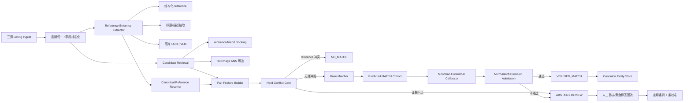

# Confidence Classifiers with Guaranteed Accuracy or Precision

> 分析人：c  
> 论文：Ulf Johansson, Cecilia Sönströd, Tuwe Löfström, Henrik Boström, **Confidence Classifiers with Guaranteed Accuracy or Precision**, PMLR 204, 2023  
> 论文主页：https://proceedings.mlr.press/v204/johansson23a.html  
> PDF：https://proceedings.mlr.press/v204/johansson23a/johansson23a.pdf  
> 目标需求：跨源二奢/腕表商品实体匹配（雷小安 × 腕表之家 × 奢当家）  
> 核心约束：同一个商品定义为**同一 reference number / 型号**；100 万–1000 万级、持续增量；字段稀疏；图片可用；**precision 极端优先，绝不能误匹配，允许漏匹配**。

## 1. 选题与去重

执行前检查 `奢侈品调研/c/`，c 已经分析过：

- `Ameli：Enhancing Multimodal Entity Linking with Fine-Grained Attributes.md`

本次选择的 **Confidence Classifiers with Guaranteed Accuracy or Precision** 尚未由 c 分析，因此不存在重复。

同时查看当前群内目录后，DeepBlocker、parts-distributor-sku-classifier、Ameli、TransClean 都已经有人覆盖。相比继续重复候选召回、编号角色识别或图清洗，本论文正好补上当前方案里最关键但容易被忽略的一层：

> **当上游模型给出“很像同一 reference”的高分时，怎样让系统有能力拒绝，并且让“自动放行集合”的 precision 可以被校准，而不是把模型分数误当成可信概率。**

这与需求的风险函数高度一致：我们不追求覆盖率最大化，而是愿意大量 `ABSTAIN / REVIEW`，只自动接受极少数能够证明风险足够低的匹配。

---

## 2. 论文真正解决的问题

普通二分类器会对每个样本都输出类别，例如：

```text
candidate pair -> MATCH / NO_MATCH
```

即使模型给出 `P(MATCH)=0.998`，这也不代表线上所有 0.998 分的 pair 真有 99.8% precision：

- 深度模型和树模型都可能过度自信；
- Platt scaling 等概率校准只是在总体上修正分数，不保证“只取最高分 Top 1%”时仍然准确；
- 数据漂移、品牌分布、来源差异、reference 格式变化会让高分区间首先失真；
- 当前业务最怕的恰好不是一般错误，而是**自动 MATCH 的 false positive**。

论文采用 `classification with reject option`：分类器可以选择“不预测”。它不再只问：

> 这个样本最可能是哪一类？

而是问：

> 如果我只接受一部分最可信预测，被接受集合的 accuracy / precision 能否被可靠估计？

论文核心结论是：用 conformal classifier 产生的 **confidence** 做拒识，比直接用原模型概率或 Platt 校准概率更适合估计高拒绝率下的 accuracy；进一步用 **Mondrian conformal** 按“预测正类”分组，可以把目标改成 precision。

对于腕表匹配，应把正类定义为：

```text
Y = 1  => candidate listing 与 canonical entity 属于同一 reference
Y = 0  => 不是同一 reference
```

这样我们关心的不是整体 accuracy，而是：

```text
Precision = TP / (TP + FP)
```

也就是所有系统自动声称 `MATCH` 的 pair 中，真正同 reference 的比例。

---

## 3. 技术实现原理

## 3.1 Inductive Conformal Classification（ICP）

论文使用 inductive conformal classifier。训练数据被拆为：

```text
Z_train = proper_training_set + calibration_set
```

流程是：

1. 用 `proper_training_set` 训练任意底层分类器 `h`；
2. 在 calibration set 上计算 nonconformity score；
3. 对新样本分别假设标签为 0 / 1，计算对应 nonconformity；
4. 将新样本的 nonconformity 与 calibration 分布比较，得到每个标签的 conformal p-value。

论文采用的 nonconformity 很简单：

```text
alpha(x, y) = 1 - P_h(y | x)
```

也就是说，如果底层模型认为标签 `y` 非常可能，则 `alpha` 小；反之则大。

这里非常重要的一点是：**conformal 层并不要求底层模型本身概率校准得完美。** 它使用的是 calibration 样本上“新样本有多异常”的相对排序。

生产实现可写成：

```python
# calibration
alpha_cal_y0 = [1 - model_prob_y0(x) for x in cal if taxonomy(x) == bucket]
alpha_cal_y1 = [1 - model_prob_y1(x) for x in cal if taxonomy(x) == bucket]

# inference for one pair
alpha_test_0 = 1 - p0
alpha_test_1 = 1 - p1

pval_0 = (1 + count(alpha_cal_y0 >= alpha_test_0)) / (len(alpha_cal_y0) + 1)
pval_1 = (1 + count(alpha_cal_y1 >= alpha_test_1)) / (len(alpha_cal_y1) + 1)
```

论文公式包含随机化 tie breaking；工程上如果业务偏保守，可以使用非随机的 `>=` 版本并固定策略，保证线上结果可复现。

### 复杂度

calibration score 可以提前排序，因此：

```text
单个 label p-value 查询 ~= O(log q)
```

其中 `q` 是 calibration bucket 大小。即使上游每天生成千万 candidate pair，conformal 层本身也不是性能瓶颈；真正昂贵的通常是候选生成、文本/图像 embedding 或 OCR。

---

## 3.2 Confidence 与 Credibility

对于每个测试样本，conformal classifier 会为每个类别产生一个 p-value。

设二分类 p-value 为：

```text
p_match, p_no_match
```

论文定义：

```text
predicted_label = argmax(p_match, p_no_match)
confidence      = 1 - second_largest_p_value
credibility     = largest_p_value
```

在二分类里，如果系统预测 MATCH：

```text
confidence = 1 - p_no_match
credibility = p_match
```

这两个量的含义不同：

- **confidence 高**：竞争标签 `NO_MATCH` 很难成立；
- **credibility 高**：当前 `MATCH` 本身不像 calibration 分布中的异常样本。

对本业务建议两个都保留：

```text
confidence  -> 用于自动放行集合的风险控制
credibility -> 用于 OOD / 新品牌 / 异常 reference 格式拒识
```

如果 `confidence` 很高但 `credibility` 很低，说明两个标签里 MATCH 只是“相对不那么差”，但样本本身可能完全偏离训练分布；这种 pair 不应该自动匹配。

---

## 3.3 从“单样本置信度”转成“接受集合的误差率”

论文最关键的思想不是给单条 pair 一个所谓“99.9% 概率”，而是把 confidence 解读成**集合性质**。

对于一个测试批次：

- 批次中共有 `n` 个预测；
- 设阈值为 `lambda`；
- 只接受 confidence >= `lambda` 的 `m` 个预测；

论文给出的预期错误率估计为：

```text
expected_error_rate = n * (1 - lambda) / m
```

因此 coverage 和 precision 可以直接做风险交换：

```text
阈值越高 -> m 越小 -> 自动放行更少 -> 风险更低
```

这比写死一个：

```python
if model_score > 0.995:
    match()
```

强得多，因为后者完全不知道 `0.995` 在当前批次、当前来源和当前数据分布下代表什么。

---

## 3.4 为什么要用 Mondrian conformal 才能针对 precision

标准 ICP 给的是整体 error / accuracy 的有效性。可当前需求只在乎：

```text
系统预测 MATCH 的那些记录里，FP 有多少？
```

论文用 Mondrian conformal classifier 解决：

```text
category / taxonomy = underlying_model_predicted_label
```

即把 calibration 数据按底层模型预测的类别分开。

对于 `predicted_label = MATCH` 这个 category，validity 只在该 category 内计算，因此直接对应：

```text
MATCH category error rate = FP / predicted_MATCH
MATCH category accuracy   = precision
```

因此可把自动放行层建成：

```text
Base Matcher
   -> predicted MATCH cohort
      -> Mondrian conformal confidence
         -> reject low confidence
            -> accepted MATCH set
```

论文实验也专门比较了：

- 原始未校准概率；
- Platt scaling；
- conformal confidence；

在高拒绝率下，普通概率经常系统性高估 precision；Mondrian conformal 的估计偏差明显更小。论文在 10 个二分类数据集、Decision Tree 和 Random Forest 上做 repeated hold-out；在不同 reject level 下，conformal 的 precision 估计整体没有明显系统性偏差，而未校准模型尤其容易出现“估计接近 100%，实际 precision 远低于此”的情况。

对腕表系统的启示非常直接：

> **不要把 LightGBM / XGBoost / cross-encoder / LLM 输出的高分当成自动合并许可。高分只能进入 conformal admission gate。**

---

## 4. 论文原方案不能原样上线的地方

## 4.1 最大限制：它不是单条 streaming 决策

论文明确指出，方法需要访问**一组 test instances**，不能直接按纯 streaming 单条预测来解释其集合保证。

本需求恰好要求持续增量，因此必须改成：

```text
continuous ingest
    -> micro batch
    -> batch-level conformal admission
```

推荐：

```text
实时抓取：持续
候选生成：实时/准实时
最终自动 MATCH：按微批次提交
```

微批可以是：

- 每 15 分钟；
- 每小时；
- 每累计 10k / 100k 个 predicted-positive candidate pair；

具体窗口取决于业务延迟要求。

这样每个批次可以先得到 `n_pos`，再根据 confidence 排序和目标 risk 计算真正要接受多少个 pair。

---

## 4.2 Exchangeability 在三来源系统里不能默认成立

Conformal guarantee 的基础是 calibration 与未来样本足够 exchangeable。

但三个来源存在明显分布差：

```text
雷小安      -> 字段结构 A / 标题模板 A / 图片风格 A
腕表之家    -> 字段结构 B / 型号字段覆盖 B
奢当家      -> 字段结构 C / 标题模板 C / OCR 质量 C
```

不同品牌也完全不同：

```text
Rolex reference 形态 != Omega != Cartier != AP
```

因此不能把所有样本塞进一个 calibration bucket 后宣称线上 precision 有保证。

生产上建议 taxonomy 至少考虑：

```text
predicted_label
× source_pair
× reference_evidence_regime
```

例如：

```text
MATCH | 雷小安->腕表之家 | structured_ref_exact
MATCH | 雷小安->奢当家   | title_extract_exact
MATCH | 腕表之家->奢当家 | OCR+title_agree
```

但只有几百条黄金标签时，bucket 也不能切得太碎。建议采用**分层回退**：

```text
L1: predicted_label
L2: predicted_label + evidence_regime
L3: predicted_label + source_pair + evidence_regime
```

只有 bucket calibration 样本数超过最小阈值才使用细粒度 bucket，否则回退上一级。

---

## 4.3 “统计保证”不等于“绝对零误匹配”

这是落地时必须讲清楚的边界。

论文能做的是统计意义上的 calibration / expected error control，不是数学上证明每一条自动 MATCH 都正确。

而用户需求写的是：

```text
绝对不能误匹配，允许漏匹配
```

所以正确架构不是：

```text
模型 + conformal -> 直接决定 reference
```

而应该是：

```text
reference 硬证据
    + hard conflict rules
    + conformal risk gate
    + abstention
```

**Conformal 只能作为最后一道统计风控门，不能取代 reference 一致性。**

如果两个候选已经有可信 reference 且 canonical 后不相等：

```text
无论模型 confidence 多高，都必须 NO_MATCH。
```

如果没有任何可信 reference：

```text
无论图片多像、文本 embedding 多高，都不应该直接自动 MATCH。
```

这点比论文算法本身更重要。

---

## 5. 推荐的直接落地架构

## 5.1 整体链路



在当前群内已有调研里，可以把几个方案拼成完整层次：

```text
Blocking / Retrieval          -> DeepBlocker 类方案
多模态属性/reference 辅助抽取 -> Ameli 类方案
最终自动放行风险控制          -> 本文 Conformal Reject Gate
合并后的跨源一致性审计        -> TransClean 类方案
```

本论文最适合作为**自动合并前最后一道 admission control**，而不是替代上游 matcher。

---

## 5.2 Canonical reference 必须先于模型决策

建议每条 listing 先生成一个证据集合，而不是直接得到单一字符串：

```json
{
  "listing_id": "...",
  "brand_id": "rolex",
  "reference_evidence": [
    {
      "value_raw": "126610LN",
      "value_canonical": "126610LN",
      "source": "structured_field",
      "confidence": 1.0
    },
    {
      "value_raw": "126610 ln",
      "value_canonical": "126610LN",
      "source": "title_regex",
      "confidence": 0.99
    },
    {
      "value_raw": "126610LN",
      "value_canonical": "126610LN",
      "source": "image_ocr_caseback",
      "confidence": 0.93
    }
  ]
}
```

Canonical resolver 的结果建议不是只有一个字符串，而是：

```text
reference_status = VERIFIED / CONFLICT / AMBIGUOUS / MISSING
canonical_reference
provenance_set
```

例如：

```text
structured == title == OCR -> VERIFIED
structured != title        -> CONFLICT
只有 LLM 自由生成           -> AMBIGUOUS
完全无型号                  -> MISSING
```

`CONFLICT` 和 `MISSING` 默认不能进入自动 MATCH。

---

## 5.3 Base Matcher 只负责排序，不负责最终放行

底层模型可以用非常普通、便宜、可解释的 GBDT；没有必要一开始就上大模型。

pair features 可以包含：

### Reference 证据

```text
canonical_ref_exact
normalized_ref_edit_distance
ref_source_A
ref_source_B
ref_evidence_count_A/B
structured_vs_title_agree_A/B
ocr_vs_text_agree_A/B
reference_conflict
```

### 品牌/系列

```text
brand_exact
series_exact
model_family_exact
```

### 文本

```text
title_token_jaccard
cross_encoder_score
model_number_token_overlap
```

### 图片

```text
clip_similarity
caseback_ocr_match
certificate_ocr_match
```

### 来源质量

```text
source_pair
field_completeness
historical_ref_accuracy_by_source
```

输出：

```text
base_score = P_model(MATCH)
```

但这个 `base_score` 只用于：

1. 产生 `predicted MATCH` cohort；
2. 构造 conformal nonconformity；
3. 排序疑难 pair；

不能直接触发 `VERIFIED_MATCH`。

---

## 6. Conformal Gate 的工程实现

## 6.1 数据切分

几百条黄金标签不要全部拿去训练模型。

建议第一版：

```text
60% proper train
40% calibration
```

如果黄金标签太少，甚至可以：

- 底层 matcher 大量使用弱监督 / 规则生成训练数据；
- **最干净的人工黄金标签优先保留给 calibration 和最终 validation。**

因为本业务最值钱的是“知道自动放行集合到底有多可信”，而不是把训练集 F1 再提高 1%。

生产中还需要保留完全独立的：

```text
gold_holdout
```

它只用于 release gate，绝不能参与模型或 conformal calibration。

---

## 6.2 校准对象

对于每个 calibration pair：

```python
p_no, p_match = model.predict_proba(x)
alpha_match = 1 - p_match
alpha_no    = 1 - p_no
```

再按 Mondrian taxonomy 存储。

建议表结构：

```sql
CREATE TABLE conformal_calibration (
    calibrator_version      STRING,
    taxonomy_key            STRING,
    predicted_label         INT,
    true_label              INT,
    alpha_match             DOUBLE,
    alpha_no_match          DOUBLE,
    source_pair             STRING,
    evidence_regime         STRING,
    created_at              TIMESTAMP
);
```

实际 serving 时可把每个 bucket 的排序数组序列化成：

```text
s3://.../calibration/v42/{bucket}/alpha_match.npy
s3://.../calibration/v42/{bucket}/alpha_no_match.npy
```

或者直接放 Redis / RocksDB / 内存。

---

## 6.3 单 pair conformal score

伪代码：

```python
def conformal_score(pair, calibrator):
    p_no, p_match = base_model.predict_proba(pair.features)

    bucket = choose_taxonomy_bucket(pair)
    cal = calibrator[bucket]

    alpha_no = 1.0 - p_no
    alpha_match = 1.0 - p_match

    pval_no = smoothed_tail_prob(cal.alpha_no, alpha_no)
    pval_match = smoothed_tail_prob(cal.alpha_match, alpha_match)

    if pval_match >= pval_no:
        pred = "MATCH"
        confidence = 1.0 - pval_no
        credibility = pval_match
    else:
        pred = "NO_MATCH"
        confidence = 1.0 - pval_match
        credibility = pval_no

    return pred, confidence, credibility, bucket
```

`smoothed_tail_prob`：

```python
def smoothed_tail_prob(sorted_alpha, alpha_test):
    # 找 >= alpha_test 的 calibration 数量
    idx = np.searchsorted(sorted_alpha, alpha_test, side="left")
    ge = len(sorted_alpha) - idx
    return (ge + 1.0) / (len(sorted_alpha) + 1.0)
```

---

## 6.4 微批次自动放行

论文的思想需要集合，因此最终 admission 按 micro-batch 做。

对当前批次先取：

```text
base/conformal predicted MATCH
AND hard_conflict = false
AND reference_status = VERIFIED
AND credibility >= credibility_floor
```

得到 `n_pos` 条。

按 confidence 从高到低排序：

```python
positives.sort(key=lambda x: x.confidence, reverse=True)
```

从 top-1 向下扩展接受集，对第 `k` 个阈值 `lambda_k`：

```text
estimated_fp_rate(k) = n_pos * (1 - lambda_k) / k
estimated_precision(k) = 1 - estimated_fp_rate(k)
```

目标如果设置为：

```text
precision_target = 0.9999
```

则只选择满足：

```text
estimated_precision(k) >= 0.9999
```

的最大前缀。

伪代码：

```python
def choose_accept_prefix(predicted_positive_pairs, target_precision):
    pairs = sorted(predicted_positive_pairs,
                   key=lambda x: x.confidence,
                   reverse=True)

    n = len(pairs)
    best_k = 0

    for k, pair in enumerate(pairs, start=1):
        lam = pair.confidence
        est_error = n * (1.0 - lam) / k
        est_precision = 1.0 - est_error

        if est_precision >= target_precision:
            best_k = k

    return pairs[:best_k], pairs[best_k:]
```

第二部分全部：

```text
ABSTAIN / REVIEW
```

**不要为了 coverage 降低 threshold。**

---

## 7. 对“绝不误匹配”的生产级加固

## 7.1 三态而不是二态

最终状态必须是：

```text
VERIFIED_MATCH
NO_MATCH
ABSTAIN
```

其中：

```text
NO_MATCH  !=  ABSTAIN
```

- `NO_MATCH`：有明确冲突证据，例如 reference 不同；
- `ABSTAIN`：不知道、证据不足、校准覆盖不足、OOD。

千万不要把 abstain 当 no-match 丢掉，因为后续新字段、新图片或人工标签可能让它转为 verified match。

---

## 7.2 Hard Conflict Gate 优先级最高

推荐硬规则：

```text
R1. canonical brand 不同 -> NO_MATCH
R2. 两侧都有 VERIFIED reference 且不相等 -> NO_MATCH
R3. 任一侧 reference evidence 内部冲突 -> ABSTAIN
R4. 候选 reference 只来自平台 SKU / 内部 ID -> ABSTAIN
R5. OCR 与结构化字段明确冲突 -> ABSTAIN
R6. 同系列但 reference 不同 -> NO_MATCH
```

任何模型分数都不能覆盖这些规则。

---

## 7.3 独立证据至少双路确认

如果目标真的接近“零误合并”，建议自动 MATCH 的业务 policy 比论文更严格：

### Tier A：最安全

```text
A 侧 trusted structured reference
==
B 侧 trusted structured reference
```

### Tier B：仍可自动

```text
structured reference
== title extractor
== candidate canonical reference
```

或：

```text
title extractor
== high-quality caseback/card OCR
== candidate canonical reference
```

### Tier C：禁止自动

```text
只有 embedding / 图片外观相似
只有 LLM 自由生成 reference
只有一个低置信 OCR
只有 series/model family 相同
```

Conformal gate 只允许在 Tier A/B 内进一步收紧，不用于把 Tier C 升级成自动匹配。

---

## 7.4 额外加一层“零 FP release gate”

Conformal calibration 不是“每条都绝对正确”的证明。

因此部署新模型 / 新 calibrator 前，独立 gold holdout 上建议要求：

```text
auto-match false positives == 0
```

并报告：

```text
accepted_count
precision
coverage
FP upper confidence bound
```

这里有一个现实约束：如果只有几百条人工标签，即使观测到 0 个 FP，也不足以证明真实 FP 率低到万分之一。

因此“绝不能误匹配”真正可实现的工程含义应该是：

1. 身份主键仍由 reference 硬证据定义；
2. 模型没有覆盖 reference 冲突的权限；
3. 自动区只保留高度可证明的极小集合；
4. 其余全部拒识；
5. 线上发现任何 FP，立即冻结对应 policy/calibrator bucket 并回放历史数据。

---

## 8. 持续增量与漂移处理

## 8.1 版本化

每个决策必须可重放：

```text
normalization_version
extractor_version
base_model_version
calibrator_version
policy_version
```

建议 `match_decision` 表：

```sql
CREATE TABLE match_decision (
    pair_id                  STRING,
    listing_id               STRING,
    canonical_entity_id      STRING,

    base_score               DOUBLE,
    conformal_confidence     DOUBLE,
    conformal_credibility    DOUBLE,
    taxonomy_key             STRING,
    estimated_batch_precision DOUBLE,

    hard_conflict            BOOLEAN,
    reference_status         STRING,
    decision                 STRING, -- VERIFIED_MATCH / NO_MATCH / ABSTAIN

    normalization_version    STRING,
    extractor_version        STRING,
    model_version            STRING,
    calibrator_version       STRING,
    policy_version           STRING,

    decision_at              TIMESTAMP
);
```

这样如果 normalization 规则更新，可以准确回放：

```text
哪些历史 MATCH 是旧规则产生的？
哪些 bucket 需要重新校准？
```

---

## 8.2 Drift Monitor

至少监控：

```text
每 source_pair 的 predicted positive rate
每 evidence_regime 的 confidence 分布
credibility 分布
reference missing rate
reference conflict rate
人工复核 FP rate
自动 MATCH coverage
```

触发条件例如：

```text
PSI / KS 明显漂移
credibility p50 急降
某来源 reference_missing 翻倍
任何 VERIFIED_MATCH 被人工判为 FP
```

触发后：

```text
暂停该 bucket 自动 MATCH
-> 全部 ABSTAIN
-> 收集人工标签
-> 重校准
```

这一点与 conformal 的 exchangeability 假设直接相关：数据分布明显变化时，不应继续沿用旧 guarantee。

---

## 8.3 Active Labeling

几百对黄金标签不要随机抽。

优先人工标：

```text
1. confidence 高但 credibility 低
2. reference 只差 1 个字符
3. 同系列不同 reference
4. 不同来源的格式冲突
5. 自动 gate 阈值附近
6. 新品牌 / 新来源 / 新模板
7. OCR 与标题冲突
```

这样新增标签对 calibrator 和 hard-negative matcher 都最有价值。

---

## 9. 推荐的第一版实现

## Phase 0：纯规则安全基线（1–3 天）

先不要训练任何复杂模型：

```text
品牌 canonicalization
reference normalization
trusted-field exact match
reference conflict hard reject
三态决策
审计日志
```

只有：

```text
brand exact + VERIFIED reference exact
```

自动合并。

这会漏很多，但最符合 precision-first。

---

## Phase 1：Candidate + Base Matcher（3–7 天）

加入：

```text
品牌内 candidate blocking
标题 reference extractor
图片 OCR
pair feature builder
LightGBM / XGBoost binary matcher
```

底层模型先解决排序和 hard-case 发现，不直接提升 auto-match 权限。

---

## Phase 2：Mondrian Conformal Admission（2–5 天）

加入：

```text
gold calibration set
nonconformity score store
Mondrian taxonomy
confidence / credibility
micro-batch precision admission
```

上线配置建议：

```yaml
auto_match:
  required_reference_status: VERIFIED
  require_no_hard_conflict: true
  min_credibility: 0.90
  target_precision: 0.9999
  min_calibration_bucket_size: 100
  unknown_bucket_action: ABSTAIN
```

这些值不是最终真值，应由 holdout 数据决定；其中最重要的是：

```text
unknown / insufficient calibration -> ABSTAIN
```

而不是回退成“相信原模型分数”。

---

## Phase 3：反馈闭环（持续）

```text
人工复核
-> 黄金标签
-> hard-negative 集
-> base matcher 重训
-> calibrator 重建
-> shadow evaluation
-> release gate
```

任何新版本必须在 shadow 模式跑一段时间，比较：

```text
coverage gain
FP count
confidence calibration
source/brand bucket stability
```

再提升成 production。

---

## 10. 与论文相比需要做的关键改造

| 论文 | 腕表落地版 |
|---|---|
| 普通二分类 benchmark | 同 reference / 非同 reference candidate pair |
| Decision Tree / Random Forest | 可换 LightGBM / XGBoost / cross-encoder，conformal 与模型解耦 |
| 标准/按预测类别 Mondrian | 按预测类别 + evidence regime + source pair 的分层 Mondrian |
| test set 批处理 | 持续 ingest + 微批 admission |
| confidence 控制 reject | confidence + credibility + hard reference gate |
| 目标 precision 校准 | 极端 precision 优先，unknown 一律 abstain |
| 统计保证 | 统计风控 + reference 硬证据 + 独立 holdout + 在线熔断 |

最值得迁移的不是论文里的 DT/RF，而是这个抽象：

```text
模型负责产生候选判断
风险控制层负责决定哪些判断有资格被自动执行
```

---

## 11. 关键风险与反例

### 反例 1：同系列极相似

```text
Rolex 126610LN
Rolex 126610LV
```

图片、标题语义、价格都可能高度相似。

正确处理：

```text
reference canonical 后不同 -> NO_MATCH
```

conformal 永不介入推翻。

### 反例 2：平台 SKU 被误当 reference

平台标题出现内部编号，两个来源字符串碰巧相似。

正确处理：

```text
identifier role 未确认 -> reference_status=AMBIGUOUS -> ABSTAIN
```

### 反例 3：模型 0.999 但新品牌 OOD

底层模型从没见过该品牌，却输出极高 MATCH score。

正确处理：

```text
credibility 低 / taxonomy bucket 无 calibration
-> ABSTAIN
```

### 反例 4：高拒绝率下概率校准失真

只取模型 top 1% 时，Platt calibration 可能依然过度自信。

正确处理：

```text
用 conformal confidence 对接受集合做风险控制
```

这正是本论文实验中重点展示的问题。

---

## 12. 最终建议

这篇论文不应该被理解为“有了 conformal，就可以让模型安全地猜 reference”。恰好相反，它最有价值的地方是提醒系统设计者：

> **模型分数不是自动执行权限，尤其是在只接受最高分小集合的 precision-first 场景。**

对当前 Spec，推荐最终责任边界为：

```text
Reference Extractor / Resolver
    负责找身份硬证据

Candidate Retrieval
    负责不漏掉可能同 reference 的对象

Base Matcher
    负责对疑难候选排序

Hard Conflict Gate
    负责禁止任何 reference 冲突被模型覆盖

Mondrian Conformal Gate
    负责对 predicted MATCH 集合做可校准拒识

Human Review
    负责所有证据不足和 OOD

Post-match Graph Audit
    负责已合并实体的跨源一致性检查
```

如果只选一个点立即落地，我建议先实现：

```text
Base Matcher 后增加三态决策 + Mondrian Conformal Reject Gate
```

但它的前提必须是：

```text
只有 reference_status=VERIFIED 且无 hard conflict 的 pair 才允许进入自动放行候选集。
```

这样可以把之前调研中的“高召回候选、多模态 reference 抽取、跨源图一致性”真正闭环成一个符合 `precision >> recall` 的生产系统。

---

## 13. 一页落地清单

### 必做

- [ ] `canonical_reference` + provenance 数据结构
- [ ] `VERIFIED / CONFLICT / AMBIGUOUS / MISSING` reference 状态
- [ ] `VERIFIED_MATCH / NO_MATCH / ABSTAIN` 三态决策
- [ ] hard conflict 永远优先于模型分数
- [ ] base matcher 与 auto-match 权限解耦
- [ ] 独立 calibration set
- [ ] predicted-MATCH Mondrian conformal calibrator
- [ ] confidence + credibility 双指标
- [ ] micro-batch admission，不按单条 streaming 解释集合保证
- [ ] source/evidence regime 分层 taxonomy + 小样本回退
- [ ] gold holdout release gate
- [ ] 任意线上 FP 触发 bucket 自动匹配熔断
- [ ] model/calibrator/policy/reference-normalization 全版本化

### 明确禁止

- [ ] 禁止 `model_score > threshold` 直接合并
- [ ] 禁止图片高相似覆盖 reference 冲突
- [ ] 禁止 LLM 自由生成 reference 后直接自动匹配
- [ ] 禁止 calibration bucket 样本不足时回退成相信原模型
- [ ] 禁止数据漂移后继续宣称旧 precision guarantee 有效
- [ ] 禁止把 `ABSTAIN` 当作 `NO_MATCH`
