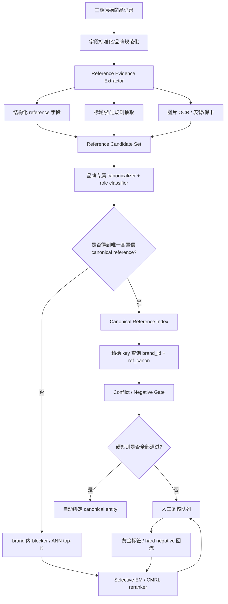

# Fine-tuning large language models with contrastive margin ranking loss for selective entity matching in product data integration

> 分析人：c  
> 对应需求：Notion《调研计划 Spec：跨源二奢/腕表商品实体匹配系统（雷小安 × 腕表之家 × 奢当家）》  
> 论文：Qian Ruan, Dachuan Shi, Thomas Bauernhansl, *Advanced Engineering Informatics*, 67 (2025), 103538  
> DOI：https://doi.org/10.1016/j.aei.2025.103538  
> 论文页面：https://www.sciencedirect.com/science/article/pii/S1474034625004318  
> 官方实现：https://github.com/quickhdsdc/LLM4EntityMatching  
> 官方代码许可：MIT

## 1. 为什么选这篇，以及与既有分析的排除关系

本次先检查了 `奢侈品调研/c/` 已有结果，c 已分析过：

- Ameli：Enhancing Multimodal Entity Linking with Fine-Grained Attributes
- Confidence Classifiers with Guaranteed Accuracy or Precision
- DeepBlocker
- Multi-Value-Product Retrieval-Augmented Generation for Industrial Product Attribute Value Identification
- TransClean：Finding False Positives in Multi-Source Entity Matching under Real-World Conditions via Transitive Consistency
- parts-distributor-sku-classifier
- pyJedAI

因此本次排除以上条目，选择尚未分析的 **Fine-tuning large language models with contrastive margin ranking loss for selective entity matching in product data integration**。

它和当前需求的契合点非常直接：论文研究的不是普通“相似商品检索”，而是 **在 blocker 已经召回了一组很相似的候选之后，如何避免把 hard negative 错判成 true positive**。腕表场景最危险的误匹配恰恰来自这类候选，例如同品牌、同系列、外观极像，只差一两个 reference 字符的型号。

Notion Spec 的硬约束是：

- 数据量 100 万–1000 万，持续增量；
- “同一个商品”严格定义为 **同一个 reference number / 型号**；
- 字段稀疏，reference 有时需要从标题甚至图片中抽取；
- **precision 极端优先，可以漏，绝不能错合并**；
- 可以使用图片；
- 可以人工标几百对黄金样本。

论文提出的 selective/listwise EM 比传统 pairwise EM 更适合处理“同系列近邻型号”，但 **不能原样直接上线**。论文默认最终仍会选一个 top-1 候选，而当前需求必须允许“没有任何候选值得自动接受”。因此最有价值的落地方向是：

> **借用论文的 listwise 候选竞争、hard-negative 训练和 Siamese embedding 架构；在其外面增加 reference 硬规则、abstain（拒识）和风险门控，使模型只能帮助消歧/否决，不能越过 reference 硬证据做自动合并。**

---

## 2. 论文解决的核心问题

传统 Entity Matching 常见流程：

```text
source record
   │
   ▼
blocking / retrieval
   │
   ├── candidate A
   ├── candidate B
   ├── candidate C
   └── ...
        │
        ▼
pairwise matcher(query, candidate_i)
        │
        ▼
yes / no independently
```

问题是 blocker 本身就是按相似度召回，所以 top-K 中天然会充满语义很近的 hard negatives。Pairwise matcher 每次只看到一个候选，不知道“旁边还有一个更像的”，容易出现多个候选都被判断为 yes。

论文把任务改成 selective EM：

```text
query + [candidate_1, ..., candidate_K]
                │
                ▼
        同一个候选集合内竞争
                │
                ▼
        选出最像 true match 的候选
```

核心变化不是模型变大，而是 **决策上下文从 pair 变成 candidate set**。对腕表很重要，因为 `126610LN`、`126610LV`、`116610LN` 这类 reference 之间，本来就应该在同一候选集里直接竞争，而不是分别独立做“像不像”。

论文还重编了标准 EM 数据集：

- 保留已有 true positive；
- 使用 `Linq-Embed-Mistral` 作为 blocker；
- FAISS 建索引；
- 每个 query 召回 `K=10`；
- 把 top-K 中非真值但高度相似的项显式作为 hard negatives。

这一步本身就很值得复用：当前腕表训练数据绝不能只随机采负例，否则模型会学会“劳力士 vs 欧米茄”这种无意义的简单边界，却学不会“同品牌同系列只差一个后缀”的真正生产难例。

---

## 3. Mistral4SelectEM 技术实现拆解

### 3.1 端到端结构

官方实现使用一个 LLM embedding backbone，论文主实验采用 `Linq-AI-Research/Linq-Embed-Mistral`。训练时把同一套 encoder 组织成 Siamese network：

```text
                  ┌──────────────────────────┐
query text ──────►│ shared embedding encoder │──────► E_q
                  └──────────────────────────┘

candidate 1 ─────►│ shared embedding encoder │──────► E_c1
candidate 2 ─────►│ shared embedding encoder │──────► E_c2
...
candidate K ─────►│ shared embedding encoder │──────► E_cK

score_i = cosine(E_q, E_ci)
```

代码位于：

- `tasks/SelectiveEntityMatching/selection_llm/modelling_llama.py`
- `tasks/SelectiveEntityMatching/selection_llm/model_finetuner.py`
- `tasks/SelectiveEntityMatching/selection_llm/data_preprocessor.py`
- `tasks/SelectiveEntityMatching/selection_llm/evaluater.py`

编码方式很简单：取最后一个有效 token 的 hidden state，再做 L2 normalize。

```python
hidden = model(...)[0]
embedding = last_token_embedding(hidden, attention_mask)
embedding = F.normalize(embedding, p=2, dim=1)
```

候选得分：

```python
similarities = torch.matmul(
    query_embedding.unsqueeze(1),
    candidate_embeddings.transpose(1, 2)
).squeeze(1)
```

因为向量已 L2 normalize，这个点积就是 cosine similarity。

### 3.2 为什么 Siamese 对 100 万–1000 万规模有价值

这比 cross-encoder 更适合当前需求：

- candidate embedding 可离线预计算；
- 同一 target record 不需要对每个 query 重跑大模型；
- top-K 后只做向量点积；
- 增量数据只需要计算新增记录向量；
- 可以直接接 FAISS / HNSW / IVF-PQ。

论文也做了 Siamese vs cross-encoder 对比，在难数据上 Siamese 更稳定。对当前系统而言，Siamese 的真正工程价值甚至大于论文中的精度收益，因为千万级增量匹配不可能长期依赖 `query × candidate` 的大模型 cross-encoding。

### 3.3 CMRL：专门把 true positive 和最难 negative 拉开

代码的核心损失由两部分组成。

第一部分是候选集合上的 cross entropy：

\[
p_j = \frac{\exp(s_j)}{\sum_k \exp(s_k)}
\]

\[
L_{CE} = -\sum_j y_j \log p_j
\]

第二部分是 Contrastive Margin Ranking Loss。对于 positive score `s_pos` 和 top-H hard negative `s_neg`：

\[
d = s_{neg} - s_{pos} + m
\]

只要 `s_pos` 没有至少比 hard negative 高一个 margin `m`，就产生 penalty：

\[
L_{margin} = \max(0, d)
\]

官方代码还给 hard negatives 做 softmax 权重，使最危险的 negative 权重更高：

```python
hard_negatives = torch.topk(negative_scores, H).values
differences = hard_negatives[:, None] - positive_scores[None, :] + margin
weights = softmax(differences)
loss_cl += sum(weights * relu(differences))
```

最终：

\[
L=(1-\alpha)L_{CE}+\alpha L_{CMRL}
\]

论文消融给出的较优参数是：

- `alpha = 0.6`
- `margin = 0.5`
- `H = 3`

值得注意的是，GitHub 当前 `EM_training_contrastive.py` 示例配置里 `top_k=1`，和论文消融中报告的 `H=3` 不一致。直接复现实验时应以论文参数重新 grid search，不能只照仓库默认值跑。

### 3.4 LoRA / 训练配置

官方训练代码没有全量 fine-tune 7B，而是 LoRA：

```text
base model: Linq-Embed-Mistral / SFR-Embedding-Mistral 等
LoRA r: 64
LoRA alpha: 64
LoRA dropout: 0.1
target_modules: all-linear
learning rate: 2e-4
batch size: 32
epoch: 10
fp16: true
gradient accumulation: 8
optimizer: paged_adamw_32bit
```

训练前调用 `prepare_model_for_kbit_training`，并开启 gradient checkpointing，说明这套代码本身就是按显存受限场景设计的。

推理阶段会把 LoRA merge 回 base model：

```python
model = PeftModelForFeatureExtraction.from_pretrained(...)
model = model.merge_and_unload()
```

因此部署时不需要一直保留两套权重结构。

### 3.5 论文指标的价值与局限

论文提出 MRRP（Mean Reciprocal Rank with Penalty），试图在 MRR 基础上同时惩罚：

- false positives；
- missed positives。

论文报告 Mistral4SelectEM 相比：

- baseline embedding，平均 MRRP 提升约 9.6%；
- 最佳 pairwise matcher，平均提升约 12.4%；
- 最佳 reranker，平均提升约 6.7%；
- 推理约 1.2s/query，为对比方法中最快。

这些结果说明 listwise 竞争确实有效，但当前 Spec 不应该直接把 MRRP 当主指标。我们的主指标应该是：

```text
Auto-Match Precision
False Merge Count
False Merge Rate
Coverage at target precision
Abstain Rate
Reference Extraction Precision
```

其中 **False Merge Count 必须单独作为一等指标**，不能被 F1/MRR 平均掉。

---

## 4. 官方实现中不能直接照搬的地方

### 4.1 最大问题：argmax 强制选一个

官方模型最后：

```python
predicted_labels = torch.argmax(softmax_similarities, dim=1)
```

这意味着只要给了候选，它一定会选一个。

这与需求“宁可漏，不可错”冲突。

例如：

```text
query: Rolex 126610LN
候选:
A: 126610LV
B: 116610LN
C: 126610LN compatible strap
```

即使三个都不是真表 reference 实体，argmax 仍会产生 top-1。

**上线必须增加 no-match / abstain。**

### 4.2 论文当前实现只天然支持单 positive

论文结论自己也指出，当前实现依赖 argmax，因此主要针对一个 query 对应一个 true positive 的情况。现实三源数据里，同一个 reference 可能有多条商品记录。

解决方案不是简单把 argmax 改成 multi-label，而是建议直接改变实体建模层级：

> **让 matcher 匹配“canonical reference entity”，而不是 raw product record。**

即：

```text
Rolex + 126610LN  -> canonical_entity_id = ref:rolex:126610ln

雷小安记录 ─┐
腕表之家记录 ─┼──► ref:rolex:126610ln
奢当家记录 ─┘
```

这样每条记录理论上只有一个目标实体，论文的 single-positive formulation 就重新成立，同时也更符合 Spec“同 reference 即同商品”的业务定义。

### 4.3 几百黄金标签无法统计证明“几乎零误匹配”

如果模型在 n 个自动接受样本里 0 个错误，经典 rule-of-three 给出的 95% 误差率上界约为 `3/n`。

- 300 个零错误，只能支持误差率上界约 1%；
- 3000 个零错误，上界约 0.1%；
- 若要用纯统计证明误差低于 0.01%，需要约 3 万个零错误样本。

所以“几百对人工标签”足够训练/校准模型，但 **不够让一个纯 ML matcher 获得‘绝不能错’的统计保证**。

这也是为什么最终方案必须让 reference 硬规则作为自动合并的事实依据，让模型只做候选竞争、消歧和否决。

---

## 5. 建议的生产架构：Reference-first Selective EM

### 5.1 总体结构



这里最关键的架构原则是：

> **自动合并通道和“模型建议通道”必须物理分开。**

模型可以把一个候选排到第一，但如果 reference 证据没有达到硬门槛，它只能进入 review，不可直接 merge。

---

## 6. 第一层：Reference Evidence Extractor

### 6.1 evidence 不是一个字符串，而是一组带来源的候选

不要把 `reference` 只设计为数据库一列。建议结构：

```json
{
  "record_id": "lx-123",
  "brand_id": "rolex",
  "reference_candidates": [
    {
      "raw": "126610LN",
      "canonical": "126610LN",
      "source": "structured_field",
      "confidence": 0.999,
      "role": "product_reference"
    },
    {
      "raw": "126610 LN",
      "canonical": "126610LN",
      "source": "title_regex",
      "confidence": 0.995,
      "role": "product_reference"
    },
    {
      "raw": "97200",
      "canonical": "97200",
      "source": "title_regex",
      "confidence": 0.41,
      "role": "accessory_or_part_number"
    }
  ]
}
```

必须保留：

- raw value；
- canonical value；
- evidence source；
- confidence；
- role；
- extractor_version。

这样才能审计为什么两条记录被合并。

### 6.2 推荐证据优先级

从强到弱：

```text
P0 可信结构化 reference 字段
P1 品牌官方格式 + 标题明确 reference 语境
P1 图片 OCR：表背/保卡/吊牌中明确 reference 区域
P2 标题中无语境的疑似编号
P3 描述中出现的疑似编号
P4 模型根据系列/外观推断的 reference
```

自动合并只允许 P0/P1，P2 以下最多用于召回。

### 6.3 brand-specific canonicalizer

不要做全局粗暴的“删除所有符号然后 uppercase”。

建议：

```python
def canonicalize_reference(brand, raw):
    s = unicode_normalize(raw)
    s = normalize_fullwidth(s)
    s = uppercase(s)

    if brand == "rolex":
        return rolex_parser(s)
    elif brand == "omega":
        return omega_parser(s)
    elif brand == "cartier":
        return cartier_parser(s)
    ...
```

原因是不同品牌的点号、斜杠、空格、后缀可能有语义。错误 canonicalization 本身就可能制造 false positive。

---

## 7. 第二层：Canonical Reference Entity，而非 record-to-record 全互比

建立独立实体表：

```sql
CREATE TABLE canonical_reference_entity (
    entity_id           BIGINT PRIMARY KEY,
    brand_id            BIGINT NOT NULL,
    reference_canonical VARCHAR(128) NOT NULL,
    collection_id       BIGINT NULL,
    status              VARCHAR(32) NOT NULL,
    created_at          TIMESTAMP NOT NULL,
    UNIQUE (brand_id, reference_canonical)
);
```

记录表只保存绑定：

```sql
CREATE TABLE product_entity_link (
    source_name          VARCHAR(32) NOT NULL,
    source_record_id     VARCHAR(128) NOT NULL,
    entity_id            BIGINT NULL,
    decision             VARCHAR(32) NOT NULL,
    decision_reason      VARCHAR(256),
    evidence_json        JSON,
    model_version        VARCHAR(64),
    policy_version       VARCHAR(64),
    created_at           TIMESTAMP NOT NULL,
    PRIMARY KEY (source_name, source_record_id)
);
```

好处：

1. 不需要雷小安 × 腕表之家 × 奢当家全量笛卡尔积；
2. 一个新记录只需决定“属于哪个 canonical reference entity”；
3. 同 reference 的多条记录自然聚合；
4. 可以显式维护 `unresolved`；
5. 论文的 listwise single-positive 假设更容易满足。

---

## 8. 第三层：候选生成不要让向量检索越过品牌/reference 约束

### 8.1 有高置信 reference 时

候选生成极其简单：

```python
key = (brand_id, reference_canonical)
entity = reference_index.get(key)
```

这是最应该走的主链路，复杂度近似 O(1)。

### 8.2 reference 不唯一或证据冲突时

才进入 blocker：

```text
brand exact filter
   ↓
category/watch-only filter
   ↓
collection / family optional filter
   ↓
lexical reference-near retrieval
   ↓
embedding ANN top-K
```

K 推荐先从 `10` 起步，和论文一致，但线上可按品牌密度调节。

### 8.3 hard negative 的生产构造

训练时 negative 不应随机采。优先构造：

```text
同品牌 + 同系列 + reference 编辑距离 1~2
同品牌 + 同前缀不同后缀
同品牌 + 新旧代替代 reference
同表款 + 不同尺寸
同表款 + 不同材质
同标题中包含 compatible/reference-for 的配件
表带/盒证/附件标题里出现主表 reference
平台 SKU 与品牌 reference 形态相似
OCR 单字符混淆：0/O、1/I、5/S、8/B
```

这些样本才是 CMRL 有意义的地方。

---

## 9. 第四层：把 Mistral4SelectEM 改造成“候选消歧器”，而不是最终裁判

### 9.1 输入表示

论文把 entity attributes 拼接为字符串。腕表建议做结构化 serialization：

```text
brand: Rolex
reference_evidence: 126610LN | title | P1
collection: Submariner
model_name: Submariner Date
case_size: 41mm
material: Oystersteel
color: black
source: leixiaoan
raw_title: 劳力士潜航者型 126610LN 黑水鬼 41mm
```

候选 canonical entity：

```text
brand: Rolex
reference: 126610LN
collection: Submariner
known_aliases: 126610 LN | 126610-LN
case_size: 41mm
material: Oystersteel
```

### 9.2 训练方式

训练 sample：

```json
{
  "query": "...",
  "candidates": ["...126610LN...", "...126610LV...", "...116610LN..."],
  "labels": [1, 0, 0]
}
```

建议第一版直接 fork 官方：

```text
quickhdsdc/LLM4EntityMatching
└── tasks/SelectiveEntityMatching/selection_llm
```

改动点：

1. 替换 `task_data_loader` 为腕表数据 loader；
2. 替换 `data_preprocessor.py` 中通用 instruction/entity serialization；
3. hard negative 由腕表 reference 规则生成；
4. `H` 从论文最优 `3` 起试，不照仓库默认 `1`；
5. 增加 abstain head / policy，不直接用 argmax 自动匹配。

### 9.3 最重要的改造：abstain gate

至少增加三个分数：

```text
s1 = top-1 score
s2 = top-2 score
margin = s1 - s2
```

模型层只给：

```python
model_accept = (
    s1 >= T_score
    and (s1 - s2) >= T_margin
)
```

但真正自动合并还必须经过硬 policy：

```python
auto_merge = (
    model_accept
    and brand_exact
    and canonical_reference_exact
    and reference_evidence_level in {P0, P1}
    and not has_reference_conflict
    and not looks_like_accessory
)
```

**只要 reference 不 exact，就算模型 0.9999 也不能 auto merge。**

模型高分但 ref 不一致时，应解释为“非常相似的 hard negative”，正是论文要解决的场景。

---

## 10. 建议的 Decision Policy

定义四种决策，不要二分类：

```text
AUTO_MATCH
REVIEW
NO_MATCH
UNRESOLVED
```

### 10.1 AUTO_MATCH

必须同时满足：

```text
1. brand canonical 一致
2. 得到唯一 canonical reference
3. 两边 canonical reference 完全一致
4. reference 至少有一侧 P0，另一侧 >= P1；
   或两侧均为相互独立的 P1 证据
5. 无高置信冲突 reference
6. 不是 accessory / compatible item
7. selective model 不提出强冲突
8. policy/version 可审计
```

注意第 7 条是 **negative gate**：模型可以否决，不能放宽规则。

### 10.2 REVIEW

典型情况：

- 标题出现两个不同 reference；
- OCR 与标题冲突；
- 只有 P2/P3 reference；
- top1/top2 太接近；
- 同品牌同系列近邻型号；
- 疑似配件；
- 模型与规则冲突。

### 10.3 NO_MATCH

只要存在确定性冲突：

```text
brand conflict
canonical reference conflict
商品类型冲突（整表 vs 表带/盒证）
```

即可直接 no-match，不必浪费大模型算力。

### 10.4 UNRESOLVED

reference 缺失且没有足够证据时，不要强行匹配。

这是 precision-first 系统最重要的合法状态。

---

## 11. 图片应该怎么接入，而不是直接做视觉“像不像”

图片有价值，但不能直接替代 reference。

推荐图片链路：

```text
image
  │
  ├── OCR：表背 / 保卡 / 吊牌 reference
  │
  ├── logo / brand 辅助识别
  │
  ├── watch-vs-accessory 分类
  │
  └── visual embedding（只用于 unresolved 的候选召回）
```

图片最适合提升 **reference evidence**，而不是直接输出 `same_product=true`。

例如：

```text
标题：劳力士黑水鬼 全套
OCR：126610LN
结构化 reference：空
```

OCR 把没有 reference 的记录升级为 P1 证据后，就能进入 exact-reference 主链路。

反例：两块黑水鬼视觉几乎一样，但 reference 不同，视觉模型越强反而越容易产生错误合并。因此图片 embedding 在 policy 上只能召回/复核，不能覆盖 reference conflict。

---

## 12. 几百个人工标签应该怎么花

不要平均随机标。

建议 300–500 对黄金标签分配：

```text
40% 同品牌同系列近邻 reference hard negatives
20% 标题/描述中多编号、配件、compatible 场景
15% OCR 单字符错误/低清图片
10% reference 格式差异但实际同 reference 的 positives
10% 跨平台字段极稀疏 positives
5% 完全随机 sanity check
```

另外可以大量自动生成弱监督 positives/negatives：

### 高精度 weak positive

```text
两来源 brand exact
+ 独立可信结构化 reference exact
+ 非 accessory
```

### 高价值 weak hard negative

```text
brand exact
+ collection exact
+ reference !=
+ reference string similarity 很高
```

人工只需要集中检查边界最危险的部分。

---

## 13. 训练/验证集切分必须防止 reference 泄漏

不要普通 random pair split。

正确方式至少按 reference family / canonical entity 分组切：

```text
train references
valid references
holdout references
```

否则同一个 reference 的近重复标题可能同时出现在 train/test，测试精度会虚高。

更严格可做：

```text
A. seen-brand / unseen-reference
B. seen-brand / new-series
C. source-shift：训练雷小安+腕表之家，测试奢当家
D. time-shift：旧批次训练，新增批次测试
```

当前系统是持续增量，time-shift 必须有。

---

## 14. 线上索引与千万级规模设计

### 14.1 主索引

真正生产主索引应是 KV / B-Tree，而不是 ANN：

```text
(brand_id, reference_canonical) -> canonical_entity_id
```

可用：

- PostgreSQL unique index；
- RocksDB；
- Redis/KeyDB 缓存；
- ClickHouse dictionary（分析侧）。

### 14.2 ANN 只服务 unresolved tail

只有 reference 缺失/冲突的少数记录进入 ANN。

如果把 10M 商品都保存 4096 维 FP16 embedding，仅裸向量约：

```text
10,000,000 × 4096 × 2 bytes ≈ 81.9 GB
```

这还不含索引额外开销。

所以不建议“全部商品先大向量化再解决一切”。更合理：

```text
exact reference 主链路覆盖大部分
unresolved tail 才建 embedding
```

若 unresolved 比例仍大，再考虑：

- 小型 768/1024 维 encoder；
- PCA；
- FP16/int8；
- IVF-PQ；
- 每品牌独立 index shard。

### 14.3 增量处理

每条新增记录：

```python
def ingest(record):
    normalized = normalize(record)
    evidence = extract_reference_evidence(normalized)

    if evidence.has_unique_trusted_reference():
        key = (evidence.brand_id, evidence.canonical_reference)
        entity = ref_index.get_or_create(key)
        return policy_attach(record, entity, evidence)

    candidates = blocker.retrieve(normalized, top_k=10)
    ranked = selective_model.rank(normalized, candidates)
    return route_to_review(record, ranked, evidence)
```

这里没有任何全量重跑需求。

---

## 15. 建议的服务拆分

```text
1. ingest-service
   - 接三源增量
   - schema normalization

2. brand-normalizer
   - 品牌 alias -> brand_id

3. reference-extractor
   - structured field
   - regex/parser
   - title/description
   - OCR
   - evidence grading

4. reference-catalog
   - canonical reference entity
   - UNIQUE(brand, reference)

5. blocker-service
   - unresolved 才调用
   - lexical + ANN

6. selective-em-service
   - Siamese embedding
   - CMRL fine-tuned model
   - top1/top2/margin

7. decision-policy-service
   - 所有 AUTO_MATCH 硬门禁
   - rule versioning

8. review-service
   - 人工确认
   - hard-negative 回流

9. audit/event-log
   - 每一次 merge 可重放
   - 保存 extractor/model/policy 版本
```

`decision-policy-service` 必须独立于模型服务。否则后续模型版本升级时很容易误把“模型置信度高”当成新的业务真值。

---

## 16. 可直接从官方仓库复用的部分

官方仓库 MIT，可以直接 fork。

### 16.1 直接复用

```text
EM_training_contrastive.py
- 训练入口
- LoRA 参数
- checkpoint/evaluation 框架

tasks/SelectiveEntityMatching/selection_llm/modelling_llama.py
- Siamese query/candidate 编码
- last-token embedding
- cosine score
- CMRL

tasks/SelectiveEntityMatching/selection_llm/model_finetuner.py
- PEFT/LoRA
- gradient checkpoint
- SFTTrainer

data_preprocessor.py
- candidate set 格式
- train 时 hard-negative sampling 框架
```

### 16.2 需要重写

```text
data loader
- 改成三源腕表 schema

entity serialization
- 加 brand/reference/evidence role

negative sampler
- 改成同品牌近邻 reference hard negatives

evaluator
- 不以 MRRP/F1 为主
- 改成 false merge / precision@auto / coverage

inference decision
- 删除“argmax 就等于 match”的逻辑
- 增加 abstain + policy gate
```

### 16.3 建议修正的实现细节

官方 `evaluater.py` 的 retrieval 实现本质上围绕固定 `num_neg+1` 候选做选择；K=10 时近似一轮完成。生产环境建议简化成：

```python
q = encoder(query)
C = precomputed_candidate_embeddings
scores = q @ C.T
rank = argsort(scores, descending=True)
```

由于 Siamese candidate embedding 可预计算，没必要在每次请求中重复 encode 全部 candidate。

---

## 17. 一个可直接落地的 Python 决策骨架

```python
from dataclasses import dataclass
from enum import Enum

class Decision(str, Enum):
    AUTO_MATCH = "AUTO_MATCH"
    REVIEW = "REVIEW"
    NO_MATCH = "NO_MATCH"
    UNRESOLVED = "UNRESOLVED"

@dataclass
class RefEvidence:
    brand_id: str | None
    reference: str | None
    level: str | None          # P0/P1/P2/P3/P4
    role: str | None           # product_reference/accessory/sku/unknown
    conflicts: list[str]


def decide(query_ev, entity, selector_score=None, selector_margin=None):
    if query_ev.brand_id is None:
        return Decision.UNRESOLVED

    if query_ev.role in {"accessory", "compatible_part", "seller_sku"}:
        return Decision.NO_MATCH

    if query_ev.conflicts:
        return Decision.REVIEW

    if query_ev.reference is None:
        return Decision.UNRESOLVED

    if query_ev.brand_id != entity.brand_id:
        return Decision.NO_MATCH

    if query_ev.reference != entity.reference:
        return Decision.NO_MATCH

    if query_ev.level not in {"P0", "P1"}:
        return Decision.REVIEW

    # model 只能做 negative gate
    if selector_score is not None and selector_score < SCORE_GATE:
        return Decision.REVIEW

    if selector_margin is not None and selector_margin < MARGIN_GATE:
        return Decision.REVIEW

    return Decision.AUTO_MATCH
```

这个设计故意没有：

```python
if selector_score > 0.99:
    return AUTO_MATCH
```

因为那会让模型越过 reference truth definition。

---

## 18. MVP 落地顺序

### Phase 1：不用 LLM 也先建立正确骨架

目标：先证明 reference-first pipeline 能覆盖多少数据。

实现：

1. 三源 schema normalize；
2. brand canonicalization；
3. reference evidence 表；
4. Top 20 品牌 parser；
5. `UNIQUE(brand_id, reference_canonical)` canonical entity；
6. exact reference 自动聚合；
7. 冲突全部 review。

输出：

```text
reference extraction coverage
P0/P1 coverage
exact auto-match coverage
manual review rate
false merge count
```

### Phase 2：引入 blocker + hard-negative dataset

对 unresolved：

1. 同品牌召回；
2. reference string 近邻召回；
3. text embedding top-K；
4. 构造真正 hard negatives；
5. 人工标 300–500 对。

### Phase 3：fork Mistral4SelectEM

1. 定制 serialization；
2. LoRA fine-tune；
3. `H=1/3/5`、margin、alpha grid search；
4. 评估 top1/top2 margin；
5. 模型只作为 review ranker / negative gate。

### Phase 4：图片 OCR 加证据

先 OCR，不急着做视觉 same-product classifier。

重点区域：

- 表背；
- 保卡；
- 吊牌；
- 证书；
- 商品详情图上的 reference 文本。

### Phase 5：阈值校准与 shadow mode

上线前先 shadow：

```text
模型产生建议
但不真正 merge
与人工/现有规则结果比对
```

稳定后才逐步开放 AUTO_MATCH。

---

## 19. 建议验收指标

### 数据层

```text
Brand normalization precision >= 99.99%
Reference P0/P1 extraction precision >= 99.9%（按品牌单独统计）
Reference conflict detect recall >= 99%
```

### 自动匹配层

第一优先级：

```text
False Merge Count = 0
```

同时统计：

```text
Auto-Match Precision
Auto-Match Coverage
Review Rate
Unresolved Rate
```

不要设置“为了 coverage 必须达到 X%”这种会倒逼误匹配的 KPI。

### selective model 层

单独看：

```text
Recall@10 blocker
Top-1 Accuracy on hard negatives
Top1-Top2 margin distribution
False-positive rate on same-series near-reference set
Cross-source time-shift performance
```

模型指标是辅助指标，不能替代 end-to-end false merge。

---

## 20. 这篇论文对当前需求最值得拿走的三点

### 20.1 从 pairwise 改成 candidate-set competition

对同系列近邻型号，必须让候选彼此竞争，而不是独立判断 yes/no。

### 20.2 hard negative 必须成为训练数据中心

随机 negative 对这个业务价值很低。真正要学习的是：

```text
126610LN vs 126610LV
116500LN vs 126500LN
表本体 vs 标题含同 reference 的表带/配件
OCR 0/O 混淆
```

CMRL 正好针对“positive 和最难 negative 要拉开安全 margin”。

### 20.3 Siamese embedding 很适合大规模增量

candidate 可预计算，训练也可以 LoRA，容易接现有 ANN 基础设施。相比 cross-encoder，它更符合千万级工程约束。

---

## 21. 最终建议

**推荐采用论文的训练思想和 Siamese/CMRL 实现，但不要采用论文的最终 argmax 决策语义。**

针对当前“同商品=同 reference、precision 极端优先”的 Spec，我建议系统最终收敛为：

```text
Reference-first
+ Canonical Reference Entity
+ Exact Key 主链路
+ Hard-negative Blocker
+ CMRL Selective EM 做候选竞争
+ Model-as-negative-gate
+ Abstain / Review
+ 全链路审计
```

最关键的产品原则是：

> **模型负责回答“这些很像的候选里哪个最值得看”，reference 规则负责回答“是否允许自动合并”。**

如果 reference 不一致，任何语义、图片或 LLM 高分都不能把它变成同一个商品；如果 reference 缺失，系统应优先输出 `UNRESOLVED/REVIEW`，而不是强行猜测。这一点既保留了 Mistral4SelectEM 在 hard-negative 场景中的技术价值，又真正满足了当前业务“宁可漏，不可错”的约束。