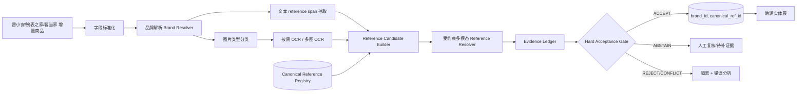

# PAM：Understanding Product Images in Cross Product Category Attribute Extraction

> 分析人：c  
> 目标需求：跨源二奢/腕表商品实体匹配（雷小安 × 腕表之家 × 奢当家）  
> 核心约束：同一个商品定义为**同一 reference number / 型号**；100 万–1000 万级持续增量；字段稀疏；reference 可能只出现在标题或图片中；图片可用；**precision 极端优先，绝不能误匹配，允许漏匹配**。

## 1. 选题与去重

本次从 `奢侈品文章调研.md` 中选择：

- 论文：**PAM: Understanding Product Images in Cross Product Category Attribute Extraction**
- KDD 2021 / arXiv：https://arxiv.org/abs/2106.04630
- PDF：https://arxiv.org/pdf/2106.04630
- DOI：https://doi.org/10.1145/3447548.3467164

执行前检查了 `奢侈品调研/c/`，c 已经分析过：Ameli、AnyMatch、Confidence Classifiers、DeepBlocker、End-to-end multi-modal product matching、Selective Entity Matching、GraLMatch、Multi-Value-Product RAG、Tailoring entity resolution、TransClean、parts-distributor-sku-classifier、pyJedAI。目录中没有 PAM，因此本次不重复。

选择 PAM 的原因不是它可以直接当“同 reference matcher”，而是它非常贴近本需求真正困难的前半段：**reference number 经常不在干净结构化字段里，而是埋在标题、详情、保卡、吊牌、表背等图像文字里；要先从多模态噪声中提取出可信 reference，实体匹配才能变成一个高精度、低成本的问题。**

PAM 的核心设计是把文本、OCR、图像区域和“按产品类别动态变化的候选词表”送入一个统一的多模态 Transformer，再以受约束的 token selection 生成属性值。它给当前需求最重要的启发是：

> **不要让模型在开放世界里自由“猜型号”；先把可能的 reference 限制到品牌/系列对应的 canonical reference 候选集合，再让文本、OCR、图片只负责提供和交叉验证证据。最终自动合并仍由可解释的 reference 硬规则收口。**

---

## 2. PAM 在解决什么问题

PAM 研究的是跨商品类别的多模态属性抽取。输入包含：

1. 商品类别；
2. 商品标题/文本 profile；
3. 商品图片；
4. 图片 OCR 文字与区域；
5. 目标属性（例如 Brand、Item Form）。

输出是目标属性值。

论文观察到，商品网页缺失的属性值中，有一部分其实只存在于图片里；图片不仅提供视觉外观，还包含大量排版后的文字。因此它把“图片”拆成了两种完全不同的证据：

- **视觉区域特征**：形状、外观、局部对象；
- **OCR 文本特征**：图片中真正写出来的品牌、规格、标签文字。

这对腕表比普通电商更重要。腕表 reference 很可能存在于：

- 表背刻字；
- 保卡；
- 吊牌；
- 证书；
- 包装标签；
- 商家水印/详情图中的型号表格；
- 标题或详情页正文。

而且“长得很像”并不能证明 reference 相同，同系列不同 reference 的外观甚至几乎一致。因此当前需求中应把 PAM 的不同模态重新分级：

- OCR/显式文本中的 reference：可成为**身份强证据**；
- 纯视觉相似度：只能作为**辅助/冲突证据**，绝不能单独触发自动匹配。

---

## 3. PAM 的技术实现与架构拆解

## 3.1 总体架构：单个 Multi-Modal Transformer 完成编码与自回归解码

PAM 使用 sequence-to-sequence 生成框架，但 encoder 和 decoder 并不是两个独立模型，而是在同一个 Transformer 内通过 attention mask 分隔编码和解码区域。

不同模态先各自转成同维度向量，然后拼成一个序列：

```text
Product Text tokens
        │ BERT
        ▼
 text embeddings ─────────┐
                          │
Product Image             │
   ├─ Faster R-CNN ───────┤ object ROI + bbox
   └─ OCR Engine ─────────┤ OCR text + bbox + local visual feature
                          │
Previous decoded tokens ──┤
                          ▼
                Multi-Modal Transformer
                          │
                          ▼
                 decoder state z_t
                          │
           ┌──────────────┼──────────────┐
           ▼              ▼              ▼
       text token      OCR token     dynamic vocab
         scores          scores          scores
           └──────────────┼──────────────┘
                          ▼
                  choose next token
```

关键点不是“用了 Transformer”，而是**所有模态在统一注意力空间里相互看见**。标题中的一个词可以直接 attend 到 OCR 中的刻字、OCR 的空间位置以及图像局部区域。

对腕表 reference 抽取，可借鉴这种“证据统一编码”，但没有必要原样复刻 2021 年的模型。生产系统更适合把它重构成可解释的多阶段 pipeline：先独立抽取每个证据，再做受约束融合。原因是当前目标不是最大 F1，而是极端 precision 和可审计。

## 3.2 文本模态：BERT 编码商品 profile

论文实现中，商品文本进入 BERT 的前 3 层，训练时参数继续 fine-tune。文本 token 产生的 contextual embedding 会参与多模态 Transformer，并且在输出阶段还可以作为 pointer 候选直接被复制。

这相当于同时保留了两种能力：

- 理解上下文：判断一个类似型号的字符串究竟是不是当前商品属性；
- 精确复制：如果正确值就在标题中，不必重新生成。

对 reference number，第二点尤其重要。reference 往往是 `126610LN`、`116500LN`、`IW371604` 一类字母数字混合串，生成模型很容易发生一个字符的幻觉；**复制原始 span 比自由生成安全得多**。

因此在落地版本中，文本抽取器应优先返回：

```json
{
  "raw_span": "126610LN",
  "normalized": "126610LN",
  "source": "title",
  "char_start": 18,
  "char_end": 26,
  "context": "劳力士 GMT-Master II 126610LN ...",
  "role": "candidate_reference"
}
```

模型只负责判断 span 的“角色”和可信度，不负责凭空创造一个新 reference。

## 3.3 图像模态：Faster R-CNN ROI + bounding box

PAM 使用 Faster R-CNN（ResNet-101 backbone，Visual Genome 预训练）抽取对象区域，每个区域有：

- ROI visual feature；
- 4 维 bounding box 坐标。

坐标和视觉特征经过 projection + layer normalization 后进入 Transformer。训练中还会微调 Faster R-CNN 的最终全连接层。

原论文需要图像 object feature，是因为诸如 `Item Form` 这类属性确实可能由瓶子、棒状物、包装形态决定。

但本需求不能照搬这个权重逻辑：

- 腕表同一系列不同 reference 外形相似；
- 图片可能经过裁剪、转拍、加水印；
- 同 reference 可能换表带、角度、光照和配件；
- 视觉近似是“像”，不是“身份相同”。

因此纯视觉模型在本方案里只做两件事：

1. **图片类型分类**：表盘 / 表背 / 保卡 / 吊牌 / 证书 / 盒证 / 其他，决定 OCR 优先级；
2. **冲突发现**：当文本说某 reference，但图片外观或品牌 logo 与该 reference 明显不兼容时，触发人工复核。

不允许出现 `visual_similarity > 0.98 => 自动同款` 这样的规则。

## 3.4 OCR 模态：不只是文字，还融合位置和局部视觉

PAM 的 OCR 模态比“跑一次 OCR 得到字符串”更完整。论文对每个 OCR token 同时构造：

- OCR 文本；
- fastText embedding；
- PHOC character-level feature，用于提升字符级鲁棒性；
- OCR bounding box；
- OCR 区域对应的 Faster R-CNN visual feature。

最后把这些 feature 投影到同维度后相加并 layer norm。

作者还比较过 Amazon OCR 与 Mask TextSpotter；后者对非规则排版（例如圆弧文字）更友好。

这和腕表非常同构：表背刻字经常沿圆周分布，普通横向 OCR 容易识别错误。生产方案应支持：

- 文本检测与文字识别分离；
- 0°/90°/180°/270° 多方向 OCR；
- 表背圆环/弧形文字展开后再 OCR；
- 保卡、吊牌、证书使用文档 OCR；
- 对 `0/O`、`1/I/l`、`5/S`、`8/B` 等易混淆字符保留 top-k OCR hypothesis，而不是直接把 top-1 当真。

一个 OCR observation 不应只是字符串，而应保留：

```json
{
  "image_id": "...",
  "image_type": "caseback",
  "raw_text": "12661OLN",
  "bbox": [0.18, 0.61, 0.54, 0.73],
  "ocr_confidence": 0.91,
  "alternatives": ["126610LN", "12661OLN"],
  "engine": "ocr-v3",
  "crop_hash": "..."
}
```

这样 reference resolver 才能结合品牌 reference 字典判断 `O` 实际上更可能是 `0`。

## 3.5 Pointer + Dynamic Vocabulary：PAM 最值得迁移的部分

PAM 的解码 token 不只来自普通语言模型词表，而是三个来源：

1. 商品文本 token；
2. OCR token；
3. 外部预定义 attribute vocabulary。

每一步 decoder state `z_t` 分别对三组候选打分，然后在三组候选的并集中选最高分。

更重要的是，多类别版本不使用一个全局固定词表，而是为每个 `(product category, attribute type)` 建立**动态 vocabulary**。例如不同商品类别的品牌、规格值空间不同，类别信息本身就是强 prior。

映射到腕表需求，应把：

```text
(product category, attribute type) dynamic vocabulary
```

替换为：

```text
(brand_id, optional_collection_id, attribute=reference) canonical reference vocabulary
```

例如先确定品牌是 Rolex，就只允许 resolver 查询 Rolex 的 reference；若系列也有把握，再进一步缩到 Submariner / GMT-Master / Daytona 等系列范围。

这会把一个开放式抽取问题改写成受限检索：

```text
“这段 title/OCR 里出现的字符串，最可能对应 Rolex reference 库中的哪一个？”
```

而不是：

```text
“请模型生成这个商品的 reference。”
```

两者对 false positive 的风险完全不同。

## 3.6 Domain-specific token selection：编辑距离只能用于“找候选”，不能用于“放行”

PAM 发现通用 embedding 很难理解电商领域里的特殊词，因此在 token score 中额外加入 candidate token 与已知属性 vocabulary 的 edit-distance similarity。论文中用 FuzzyWuzzy ratio，权重 `lambda=0.05`。

这对 OCR reference 修复很有价值。例如：

```text
OCR:  12661OLN
库中: 126610LN
```

编辑距离可以把正确 canonical reference 拉进候选集。

但在当前需求里必须增加一道安全边界：

> **edit distance / fuzzy match 只能做 candidate generation，不能作为最终 same-reference 证据。**

原因是腕表相邻 reference 本身经常只差一个字符。把 `116500LN` fuzzy 到 `126500LN` 在“召回”阶段很好，在“自动合并”阶段却是灾难。

因此所有 fuzzy correction 都必须带来源和歧义信息：

```json
{
  "raw": "12661OLN",
  "candidate_refs": [
    {"ref": "126610LN", "edit": 0.94},
    {"ref": "126610LV", "edit": 0.82}
  ],
  "decision": "ABSTAIN"
}
```

只有额外的 title、结构化字段、另一张图片 OCR 等独立证据把候选唯一化后，才允许进入自动匹配。

## 3.7 多任务与 category conditioning

PAM 为了让模型理解不同类别下属性值分布不同，设计了两种多任务方式，其中一种把产品类别直接前缀到 decoder target sequence，例如先输出 category 再输出 attribute value；另一个方向是用 `<CLS>` 表示做类别预测，并联合 attribute generation loss 与 category classification loss。

其工程思想是：**让上游类别信息进入属性抽取过程，而不是先后两个完全无关的模型。**

对腕表可以替换成：

- brand prediction；
- collection/family prediction；
- reference extraction。

但由于 precision-first，推理时应优先使用**已知的结构化品牌**或高置信品牌解析结果，而不是让 reference extractor 自己猜品牌。PAM 也观察到，推理时用已知真实 category 替代模型预测 category 会提高 precision。

这说明当前方案更应该采用：

```text
brand 作为硬路由键 -> brand-specific reference resolver
```

而不是一个全局大模型直接输出任意品牌任意 reference。

## 3.8 训练配置与实验结果给我们的信号

论文实现参数包括：

- 4 层 Transformer；
- 12 attention heads；
- embedding 维度 768；
- batch size 128；
- Adam；
- base learning rate `1e-4`；
- 24,000 iterations；
- max decoding steps 10；
- edit-distance lambda 0.05。

数据覆盖 14 个商品类别，共 61,308 个样本。完整 PAM 在论文某组消融中达到约：

- Precision 91.3%；
- Recall 75.3%；
- F1 82.5%。

去掉 OCR 后为：

- Precision 82.0%；
- Recall 69.4%；
- F1 75.1%。

去掉 image object feature 后仍有：

- Precision 88.7%；
- Recall 72.1%；
- F1 79.5%。

这组结果对腕表需求最值得注意的不是绝对分数，而是：**OCR 的信息量明显高于纯视觉 object feature。** 对 reference number 这种本质上是文本标识符的属性，这种差距预计会更明显。

同时也必须明确：论文的 91.3% precision 对当前需求远远不够。因此 PAM 只能成为“reference evidence extractor”的设计参考，不能把其 classifier/generator 概率直接当自动匹配阈值。

---

## 4. 为什么不能把 PAM 原样当实体匹配器

PAM 的目标函数和当前需求有四个关键差异。

### 4.1 论文优化 F1/Recall，我们优化近乎零 false positive

PAM 允许通过多模态信息提升整体 F1；当前业务却宁可漏掉大量 match，也不能把不同 reference 合并。

因此模型 score 不能直接代表“是否自动放行”。

### 4.2 PAM 是属性生成，本需求需要 identity-grade canonicalization

品牌、Item Form 可以容忍一定自然语言归一化；reference 是身份主键。一个字符错了就可能从一个真实型号变成另一个真实型号。

必须保留：

```text
raw evidence -> normalization transform -> canonical reference -> provenance
```

整条链路，不能只保存最终字符串。

### 4.3 图片语义相似不等于 reference 相同

同系列变体的图像相似度通常很高，因此纯视觉相似度越强，反而越需要警惕“近邻变体误合并”。

### 4.4 生成式 vocabulary 对 identity key 仍然太宽松

PAM 的 dynamic vocabulary 可以让模型从外部词表生成属性值。对于 current Spec，最安全的版本不是“生成 reference token”，而是**从 canonical reference ID 集合里做 constrained selection + abstain**。

---

# 5. 面向 Spec 的直接落地方案：PAM-RefGuard

下面给出一个可以直接实现的改造版架构，核心思想是：

> **PAM 负责启发“多模态 reference 证据抽取与受约束候选选择”；实体合并本身改成 deterministic、可解释、可拒识的 Reference Guard。**

## 5.1 总体数据流



最关键的设计是：**不直接做三源记录两两匹配。**

如果“同商品”的定义已经明确为“同一 reference”，那么最优问题重写是：

```text
每条 listing -> 提取一个可信 canonical reference
```

然后实体分组只是：

```sql
GROUP BY brand_id, canonical_reference_id
```

这样从潜在 `O(N²)` pairwise matching 变成接近 `O(N)` 的 extraction + lookup。

## 5.2 Canonical Reference Registry：先建设型号主数据

建立品牌级 reference 主表：

```sql
CREATE TABLE canonical_reference (
    ref_id              BIGSERIAL PRIMARY KEY,
    brand_id            BIGINT NOT NULL,
    canonical_ref       VARCHAR(128) NOT NULL,
    collection_id       BIGINT NULL,
    status              VARCHAR(16) NOT NULL DEFAULT 'active',
    normalized_compact  VARCHAR(128) NOT NULL,
    UNIQUE (brand_id, normalized_compact)
);

CREATE TABLE reference_alias (
    brand_id            BIGINT NOT NULL,
    raw_alias           VARCHAR(128) NOT NULL,
    canonical_ref_id    BIGINT NOT NULL,
    alias_type          VARCHAR(32) NOT NULL,
    source              VARCHAR(64),
    UNIQUE (brand_id, raw_alias, canonical_ref_id)
);
```

`normalized_compact` 只做**确定性、不会改变身份的格式归一化**，例如：

- Unicode NFKC；
- 大小写统一；
- 全角/半角统一；
- 已确认无语义的空格、分隔符规则；
- 品牌级显式 alias 映射。

不要默认把所有 `-`、`.`、`/` 都无脑删除。某些品牌符号可能有语义，应采用 brand-specific normalizer。

## 5.3 Brand Resolver：先把候选空间切小

品牌解析优先级：

1. 平台结构化品牌字段；
2. 标题 dictionary exact/alias；
3. OCR logo/text；
4. 文本模型；
5. 视觉 logo model 仅做辅助。

输出不是一个字符串，而是：

```json
{
  "brand_id": 42,
  "confidence": 0.9996,
  "evidence": ["structured.brand", "title_alias"],
  "conflicts": []
}
```

若品牌不确定，**reference 解析直接降级为 ABSTAIN**，避免不同品牌存在相似编号格式时串库。

## 5.4 Text Reference Span Extractor：先找 span，再判角色

建议分两层：

### Layer A：高召回规则/字典找候选串

包括：

- 品牌级 reference regex；
- canonical registry 的 exact/alias trie；
- Aho-Corasick 多模式匹配；
- 字母数字混合串 heuristic；
- 标题分词后的相邻 token 拼接。

### Layer B：Reference Role Classifier

判断候选串是：

- `BRAND_REFERENCE`；
- `PLATFORM_SKU`；
- `SHOP_SKU`；
- `SERIAL_NUMBER`；
- `ACCESSORY_COMPATIBLE_REFERENCE`；
- `UNKNOWN_CODE`。

这一步可以使用小型 Transformer / cross-encoder，也可以先用规则。重点是避免：

```text
“适配 Rolex 126610LN 的表带”
```

把 `126610LN` 当成当前商品 reference。

训练 hard negative 必须大量包含“配件标题里出现被适配商品型号”的样本。

## 5.5 图片 OCR：只在有价值的图片上花成本

100 万–1000 万商品如果每张图都走昂贵 OCR，会浪费大量计算。建议两阶段：

### Stage 1：Image Type Router

用轻量视觉分类器把图片分成：

```text
watch_front
caseback
warranty_card
hang_tag
certificate
box
spec_sheet
other
```

### Stage 2：按类型设置 OCR 优先级

优先级建议：

```text
warranty_card > hang_tag > caseback > certificate > spec_sheet > watch_front > box > other
```

当结构化字段和标题已经得到唯一、高置信 canonical reference 时，图片 OCR 可以异步做“冲突检测”而非阻塞主链路；当文本没有 reference 时，再升级 OCR 资源。

OCR 结果必须缓存：

```text
cache_key = sha256(image_bytes) + ocr_model_version
```

同一张被不同平台转载的图片不重复算。

## 5.6 Candidate Builder：把 PAM dynamic vocabulary 改成品牌级 reference 检索

对每个 raw span 或 OCR hypothesis，从品牌 reference registry 中召回少量候选。

召回特征可以包括：

- exact normalized match；
- alias exact match；
- prefix/suffix pattern；
- edit distance；
- character n-gram；
- OCR confusion-aware distance；
- 系列先验。

例如：

```text
raw OCR: 12661OLN
brand: Rolex

candidate #1 126610LN
candidate #2 126610LV
candidate #3 126610
```

只保留 top 5～20 即可，后续不再面对整个 reference 空间。

注意：fuzzy score 在这里只表示“值得继续验证”，不等于同 reference。

## 5.7 Reference Resolver：多模态受约束打分，但显式保留证据来源

可以做一个轻量 cross-encoder/reranker，输入：

```text
listing text
OCR snippets + image type
candidate canonical reference
brand / collection
source platform
```

输出不是简单 `match_probability`，而是分解为：

```json
{
  "candidate_ref_id": 99182,
  "signals": {
    "structured_exact": 1,
    "title_exact": 1,
    "title_context_role": 0.998,
    "ocr_exact_card": 1,
    "ocr_exact_caseback": 0,
    "fuzzy_only": 0,
    "visual_compatible": 0.91,
    "accessory_risk": 0.002,
    "explicit_conflict": 0
  }
}
```

这比单一 embedding 相似度更容易定义安全规则。

## 5.8 Evidence Ledger：所有自动合并都必须可追溯

建议单独保存证据表：

```sql
CREATE TABLE reference_evidence (
    evidence_id          BIGSERIAL PRIMARY KEY,
    listing_id           BIGINT NOT NULL,
    candidate_ref_id     BIGINT NOT NULL,
    evidence_type        VARCHAR(64) NOT NULL,
    raw_value            TEXT,
    normalized_value     TEXT,
    confidence           DOUBLE PRECISION,
    image_id             BIGINT NULL,
    bbox                 JSONB NULL,
    extractor_version    VARCHAR(64) NOT NULL,
    created_at           TIMESTAMPTZ NOT NULL DEFAULT now()
);
```

这样每次匹配都能回答：

- 哪个字段/哪张图片证明了 reference？
- OCR 原始文字是什么？
- 做了哪些 normalization？
- 用的是哪个模型版本？
- 当时还有哪些冲突 candidate？

precision-first 系统如果没有这种 evidence provenance，出了误合并很难定位。

---

# 6. Hard Acceptance Gate：真正决定“能不能自动同款”的地方

当前 Spec 最重要的不是模型，而是 acceptance policy。

建议将最终状态设计为三态：

```text
ACCEPT   明确可自动归到 canonical reference
ABSTAIN  有候选但证据不足，保持独立/人工复核
REJECT   存在明确冲突，禁止与候选 reference 合并
```

## 6.1 推荐的自动 ACCEPT 规则

下面是一版偏保守但可直接落地的 v1。

### Rule A：结构化 reference 精确命中

满足全部条件：

- 品牌已确定；
- 平台结构化 reference 字段经 brand-specific normalizer 后唯一命中 canonical registry；
- 标题/其他结构化字段没有第二个冲突 reference；
- listing 不是配件/表带/盒证单卖。

则 ACCEPT。

### Rule B：标题强证据

- 品牌已确定；
- title 中存在唯一 reference span；
- role classifier = `BRAND_REFERENCE` 且置信很高；
- normalize 后 exact 命中一个 canonical reference；
- 无显式冲突 reference；
- 非配件。

则 ACCEPT。

### Rule C：文本 + 独立 OCR 双证据

- title/details 给出 canonical ref X；
- 保卡/吊牌/表背 OCR 独立得到同一个 X；
- 两个证据不是由同一原始文本转载产生；
- 无冲突。

则 ACCEPT，优先级高于纯文本。

### Rule D：OCR-only，但必须多证据一致

只有图片，没有文本 reference 时：

- 至少两个独立高价值 OCR 区域/图片得到相同 X；或
- 一个高置信保卡/吊牌 exact OCR + 品牌/系列强一致；
- X 是 registry 中 exact canonical；
- 没有其它同等强度候选。

否则 ABSTAIN。

## 6.2 一票否决规则

任意出现以下情况都不得自动 ACCEPT：

- 明确出现两个不同 canonical reference；
- title 的 reference 与结构化 reference 冲突；
- title 与保卡/表背 OCR 冲突；
- 商品被识别为表带、配件、盒证、贴膜等 accessory；
- reference 仅由 fuzzy edit-distance 修复得到，没有独立强证据；
- reference 只由纯视觉模型预测；
- 品牌不确定；
- OCR top-2 候选对应两个真实 reference 且分差过小；
- reference 不在已知 registry，而模型只是自由生成了一个“看起来像”的字符串。

## 6.3 为什么 visual match 只做 negative guard

可以利用图片判断：

```text
文本声称 Rolex，但图片明显不是 Rolex -> REJECT/REVIEW
```

但不要利用：

```text
两张表很像 -> ACCEPT
```

因为 current definition 是“同 reference”，不是“视觉相似”。

---

# 7. 实体匹配层：一旦 canonical reference 可信，问题就简单了

建议实体 ID 不是模型聚类出来，而是确定性的：

```text
entity_key = brand_id + canonical_reference_id
```

核心表：

```sql
CREATE TABLE listing_reference_decision (
    listing_id            BIGINT PRIMARY KEY,
    brand_id              BIGINT,
    canonical_ref_id      BIGINT,
    decision              VARCHAR(16) NOT NULL,
    decision_rule         VARCHAR(64),
    resolver_score        DOUBLE PRECISION,
    evidence_count        INT NOT NULL DEFAULT 0,
    conflict_count        INT NOT NULL DEFAULT 0,
    model_version         VARCHAR(64),
    decided_at            TIMESTAMPTZ NOT NULL DEFAULT now()
);

CREATE INDEX idx_listing_ref_accept
ON listing_reference_decision (brand_id, canonical_ref_id)
WHERE decision = 'ACCEPT';
```

跨源查询：

```sql
SELECT brand_id, canonical_ref_id,
       array_agg(listing_id) AS listings
FROM listing_reference_decision
WHERE decision = 'ACCEPT'
GROUP BY brand_id, canonical_ref_id;
```

因此三源同步后根本不需要构造海量 pair。

---

# 8. 100 万–1000 万级持续增量的工程架构

## 8.1 在线/离线拆分

建议：

```text
Kafka / CDC
  -> Normalizer
  -> Brand Resolver
  -> Fast Text Reference Extractor
  -> if unresolved: OCR Queue
  -> Candidate Builder
  -> Ref Resolver
  -> Hard Gate
  -> Reference Entity Store
```

其中：

- 文本规则、dictionary lookup 可以 CPU 实时跑；
- OCR 和 VLM/视觉分类走异步 GPU queue；
- 对已解析 listing，后续图片 OCR 可作为 conflict audit；
- 主流程不要因为某个昂贵模态阻塞所有数据。

## 8.2 分层成本策略

按难度分层：

### Tier 0：结构化 exact

最便宜。直接 brand + exact canonicalization。

### Tier 1：title exact

regex/trie/alias lookup。

### Tier 2：title 模型角色判别

解决 SKU、配件 compatible reference 等上下文。

### Tier 3：OCR

只对前面仍 unresolved 的 listing 或抽样审计执行。

### Tier 4：多模态模型 / 人工复核

仅处理 hard cases。

这样绝大多数流量不需要大模型。

## 8.3 增量更新

每条 listing 维护 fingerprint：

```text
hash(normalized_structured_fields + title + description + image_hashes)
```

fingerprint 不变则不重复解析。

reference registry 更新时，只重跑受到影响的：

- brand；
- alias；
- unresolved candidates；
- 旧 decision 依赖该 normalization rule 的 listing。

## 8.4 模型/规则版本化

每个 decision 记录：

```text
brand_resolver_version
text_extractor_version
ocr_version
reference_registry_version
normalizer_version
hard_gate_policy_version
```

这样线上发现错误后可以精确回滚或重算受影响数据，不必全库重跑。

---

# 9. 几百对黄金标签应该怎么花

Spec 允许人工标注几百对。这里不建议把这几百对主要用于训练一个 end-to-end matcher，因为样本太少且会被 easy negatives 浪费。

更高 ROI 的用法是构造 **precision-oriented hard-case benchmark**。

## 9.1 正样本

覆盖：

- 同 reference，不同平台写法；
- reference 只在标题；
- reference 只在保卡/表背；
- 标题 OCR 一致；
- 标点、空格、大小写差异；
- 不同拍摄角度/不同表带。

## 9.2 最重要的负样本

至少一半标签应给 hard negatives：

- 同品牌同系列、reference 只差 1 位；
- 外观几乎相同的相邻 reference；
- 配件标题包含兼容腕表 reference；
- 平台 SKU 看起来像型号；
- serial number 被误当 reference；
- OCR `0/O`、`1/I`、`5/S` 引发的“修复后撞到另一个真实 reference”；
- title 和图片冲突；
- 不同品牌相似编码格式；
- 商家把多个型号堆在标题中引流。

## 9.3 标签对象不只标 pair match

建议人工标注 schema：

```json
{
  "listing_id": "...",
  "brand": "Rolex",
  "true_reference": "126610LN",
  "reference_source": ["title", "warranty_card"],
  "is_accessory": false,
  "conflicting_reference": null,
  "extraction_error_type": null
}
```

这样同一份标签既能评估抽取，也能评估 final matching。

---

# 10. 评测：不要只看 F1

当前业务指标优先级建议：

1. **Accepted Precision**：自动 ACCEPT 中有多少确实是正确 reference；
2. **False Merge Count**：绝对数量，最好为 0；
3. **Conflict Escape Rate**：存在显式冲突却被放行的比例；
4. **Accepted Coverage**：多少 listing 能自动给出 reference；
5. Reference extraction recall；
6. OCR-only coverage；
7. 人工复核率；
8. 单 listing 平均推理成本。

需要注意一个统计事实：如果希望声称 99.99% precision，仅靠“几百条”黄金标签基本无法给出有说服力的统计保证。即使测试集一个 false positive 都没有，样本数太小时 precision 下界仍不够高。

因此 v1 应把目标写成：

```text
通过硬门禁把已知风险路径全部变成 ABSTAIN，
在持续人工审计的 accepted 流量中长期积累高置信证据，
再逐步证明极高 precision，而不是一次离线 F1 测试就宣称安全。
```

---

# 11. 最小可落地版本（MVP）

如果不想先做复杂多模态 Transformer，我建议按下面顺序落地，2～4 周即可得到可验证的主链路。

## Phase 1：Reference Registry + 文本 exact pipeline

实现：

- 品牌 canonicalization；
- brand-specific reference normalizer；
- reference registry；
- title/结构化字段 exact extraction；
- platform SKU / accessory 基础规则；
- Hard Gate；
- `(brand_id, ref_id)` 实体分组。

预期：precision 很高，coverage 可能偏低，但符合业务约束。

## Phase 2：OCR 增强

实现：

- 图片类型分类；
- 保卡/吊牌/表背 OCR；
- OCR alternative hypothesis；
- OCR 与 registry 的 constrained candidate；
- title/OCR conflict detection；
- OCR cache。

这一步直接吸收 PAM 最有价值的部分。

## Phase 3：Role Classifier + constrained reranker

实现：

- `reference / SKU / serial / accessory-compatible` 角色分类；
- 对 fuzzy/OCR candidate 做小型 cross-encoder rerank；
- 输出 `ABSTAIN`；
- 用几百黄金标签校准阈值。

## Phase 4：多模态冲突模型

只有当 Phase 1～3 已经证明视觉确实有额外价值时，再加入：

- logo/brand visual verification；
- watch family/collection visual compatibility；
- caseback OCR region detection；
- 视觉 contradiction score。

不要一开始就训练一个大而全的 end-to-end multimodal matcher。

---

# 12. 一版可直接编码的 decision pseudocode

```python
def resolve_listing(listing):
    brand = resolve_brand(listing)
    if not brand.is_high_confidence:
        return abstain("brand_uncertain")

    if is_accessory(listing):
        return abstain("accessory")

    evidences = []

    # 1. structured fields
    for raw in listing.structured_reference_fields:
        evidences += resolve_raw_reference(
            brand_id=brand.id,
            raw=raw,
            source="structured"
        )

    # 2. title/description spans
    for span in extract_reference_spans(listing.text):
        if classify_code_role(span, listing.text) == "BRAND_REFERENCE":
            evidences += resolve_raw_reference(
                brand_id=brand.id,
                raw=span.text,
                source="title"
            )

    # 3. async OCR evidence if needed / audit
    if not has_unique_strong_ref(evidences):
        for image in select_high_value_images(listing.images):
            for obs in run_or_get_cached_ocr(image):
                evidences += resolve_ocr_observation(brand.id, obs)

    candidates = aggregate_by_canonical_ref(evidences)

    # 4. explicit conflicts are fatal to auto-accept
    if has_explicit_ref_conflict(candidates):
        return reject("reference_conflict", candidates)

    if len(candidates) == 0:
        return abstain("no_reference")

    best = constrained_rerank(listing, candidates)

    # fuzzy-only never auto accepts
    if best.only_fuzzy_evidence:
        return abstain("fuzzy_only")

    # visual evidence may veto but cannot establish identity
    if visual_contradiction(listing, best.reference):
        return reject("visual_conflict", best)

    if passes_hard_acceptance_policy(best, evidences):
        return accept(best.reference, best.evidence_ids)

    return abstain("insufficient_independent_evidence")
```

这个流程的设计重点是：任何模型都没有最终“越权放行”的能力。

---

# 13. 与 PAM 的逐项映射

| PAM 组件 | 原论文用途 | 当前需求中的改造 |
|---|---|---|
| Product Text + BERT | 商品属性文本语义 | title/details 中 reference span + 上下文角色 |
| Faster R-CNN ROI | 视觉属性/对象信息 | 图片类型识别、品牌/系列冲突检测 |
| OCR + bbox + local visual | 图片文字属性 | 表背/保卡/吊牌 reference 强证据 |
| Dynamic Vocabulary | 类别相关属性值空间 | `brand/collection -> canonical reference registry` |
| Edit distance feature | 领域词汇候选纠错 | OCR typo candidate generation，禁止直接放行 |
| Pointer over text/OCR | 复制输入中的属性值 | 保留 exact raw reference span，避免生成幻觉 |
| Category conditioning | 跨商品类别消歧 | brand-first 路由、series-aware candidate narrowing |
| Multi-task category prediction | 提升类别感知 | brand/collection 辅助任务，但未知时 ABSTAIN |
| Autoregressive generation | 输出属性值 | 改成 constrained canonical reference selection |
| F1-driven evaluation | 属性抽取质量 | accepted precision / false merge / coverage |

---

# 14. 核心结论

PAM 对当前 Spec 的最大价值，不是“再上一个多模态 Transformer”，而是三条可以直接转化为生产架构的原则：

1. **图片里的 OCR 是独立信息源，不应该和纯视觉相似度混为一谈。** 对腕表 reference，OCR 的身份价值远高于图像外观相似度。
2. **输出空间应该动态受限。** PAM 用 category-specific vocabulary；当前系统应进一步收紧为 `brand/collection-specific canonical reference registry`，把开放生成改成受约束选择。
3. **多模态模型只负责聚合证据，最终自动匹配要有硬门禁和拒识。** fuzzy、embedding、视觉近似都可以帮忙召回或否决，但不应直接产生同 reference 结论。

因此我建议把整个需求定义成“**高精度 canonical reference resolution**”，而不是传统 pairwise entity matching：

```text
多源 listing
  -> reference evidence extraction
  -> canonical reference resolution
  -> hard acceptance / abstain
  -> group by (brand, canonical reference)
```

这样既能利用 PAM 的多模态优点，又能把“绝不能误匹配”的风险控制在一个可解释、可审计、可逐步收紧的规则层中；同时在 100 万–1000 万规模下避免全量 pairwise 比较，天然适合持续增量处理。
