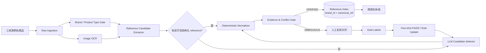

# Using LLMs for the Extraction and Normalization of Product Attribute Values

## 1. 调研对象与结论

本次选择清单中的论文 **Using LLMs for the Extraction and Normalization of Product Attribute Values**（Brinkmann, Baumann, Bizer，ADBIS 2024）及其官方开源项目 **WDC-PAVE** 进行深入分析。

- 论文/演示材料：<https://www.uni-mannheim.de/media/Einrichtungen/dws/Files_Research/Web-based_Systems/pub/ADBIS2024_Using_LLMs_for_the_Extraction_and_Normalization_of_Product_Attribute_Values.pdf>
- 论文 arXiv：<https://arxiv.org/abs/2403.02130>
- 官方代码：<https://github.com/wbsg-uni-mannheim/wdc-pave>
- 对应需求 Spec：<https://app.notion.com/p/3bf7b2a8538b812fba00fb258024ff31>

### 一句话结论

这篇工作的价值不在于“直接拿 GPT 做商品匹配”，而在于提供了一个非常适合本需求的 **结构化属性抽取 + 规范化 + few-shot 语义示例检索** 框架。对当前“雷小安 × 腕表之家 × 奢当家”的需求，最值得复用的是它的抽取器架构；但 **不能直接复用其生成式 normalization 结果作为自动合并依据**。

当前 Spec 把“同一个商品”定义为“同一 reference number / 型号”，且要求 precision 优先、绝不能误匹配。因此更安全的落地方式是：

> **LLM 只负责从稀疏/非结构化文本中识别“哪个原文片段是 reference”，最终 canonical reference 必须由可审计的确定性规则生成；自动匹配只允许 `(canonical_brand, canonical_reference)` 完全相等。**

这会把一个原本可能是千万级 pairwise entity matching 的问题，降维成“高精度 reference extraction + exact indexed lookup”，工程复杂度和误匹配风险都显著下降。

---

## 2. 论文解决了什么问题

WDC-PAVE 研究的是：从电商商品标题、描述中抽取属性值，并把属性值规范化为统一形式，以便商品比较和 faceted search。

论文给出的示例和当前腕表需求非常接近：

```text
Title: HP – 6280-59-B21 - 3TB 3G SATA 7.2K rpm

Part Number raw: 6280-59-B21
Part Number normalized: 628059B21
```

其中 `Part Number` 本质上就是我们这里的 reference / 型号类 identifier。

论文构建的 WDC-PAVE 数据集中包含：

- 565 个 product offers；
- 59 个网站；
- 4,687 个 attribute-value pairs；
- 37 种属性；
- 约 45% 属性值为 `n/a`，即字段稀疏非常明显。

这和三个二奢来源的现实问题相似：字段覆盖不同，reference 可能有独立字段，也可能隐藏在标题或描述中。

论文把任务拆成三种：

1. Attribute Value Extraction；
2. Attribute Value Extraction + Normalization；
3. Attribute Value Normalization。

论文实验中，带示例值和 few-shot demonstrations 的 GPT-4 在 extraction 上 F1 可达到约 90.54%，在 extraction + normalization 上约 91.32%；只做 normalization 时 string wrangling 可以接近 99% F1。

这里最重要的工程判断是：**即使 99% 也远远不够支持“自动合并绝不能错”**。所以这篇论文应作为“抽取技术参考”，不能把其 LLM normalization 直接当成最终实体主键。

---

## 3. 官方代码的技术实现拆解

### 3.1 代码结构

官方仓库不是只有 prompt 文本，而是一个完整实验框架，主要模块如下：

```text
wdc-pave/
├── data/                  # 原始/处理后的训练测试数据
├── preprocessing/         # 数据预处理
├── prompts/               # zero-shot / few-shot / normalization 各类实验
│   ├── 08_extraction_with_normalization/
│   ├── 09_normalization_single/
│   └── 10_normalization_multiple/
├── pieutils/
│   ├── search.py          # few-shot 示例语义检索，FAISS
│   ├── pieutils.py        # Pydantic schema、解析、normalization guideline
│   ├── normalization.py
│   ├── evaluation.py
│   └── preprocessing.py
├── scripts/               # 批量运行实验脚本
└── src/                   # 保存的 prompt 输出/模板
```

核心执行脚本之一：

`prompts/08_extraction_with_normalization/8_few_shot_extraction_with_normalization.py`

它的运行链路基本是：

```text
数据集
  ↓
按 category 加载 known attributes
  ↓
动态生成 Pydantic schema
  ↓
为训练样本建立语义向量索引
  ↓
针对当前商品检索 top-k 相似 demonstrations
  ↓
拼装 system + task + few-shot + 当前输入 prompt
  ↓
LLM(JSON 输出，temperature=0)
  ↓
JSON/Pydantic 校验
  ↓
评估 precision / recall / F1 / cost
```

### 3.2 结构化输出：动态 Pydantic Schema

官方代码会根据商品 category 和已知 attributes 动态生成 Pydantic model，例如：

```python
fields_spec = {
    attribute: (f'The {attribute} of a {category}.', Optional[str])
    for attribute in known_attributes[category]
}
```

随后把模型 schema 作为结构化任务约束交给 LLM。

这个设计非常适合当前需求，因为我们的输出不应该只是：

```json
{"reference": "126610LN"}
```

而应扩成一个可审计的 assertion：

```json
{
  "candidate_id": "c2",
  "reference_raw": "126610 LN",
  "role": "PRIMARY_PRODUCT_REFERENCE",
  "evidence_field": "title",
  "evidence_span": "劳力士 潜航者 126610 LN 黑盘",
  "brand_raw": "劳力士",
  "abstain": false,
  "reason_code": "EXPLICIT_REFERENCE_IN_TITLE"
}
```

Pydantic/JSON Schema 的价值不是“让输出好看”，而是让下游可以强制执行枚举、缺失值和拒识规则，避免自由文本直接进入匹配主链路。

### 3.3 Prompt 结构

官方 few-shot extraction + normalization prompt 大致由四部分组成：

```text
System Role
  "You are a world-class algorithm for extracting information in structured formats."

Task Description
  给出 extraction / normalization 指令及 normalization guidelines

Few-shot Demonstrations
  检索得到的相似商品输入输出示例

Current Product Input
  title / description
```

论文特别强调两点：

1. 示例值和 demonstrations 能显著提高效果；
2. **语义相似的 demonstration 比固定 demonstrations 更有效**。

对于当前腕表场景，这一点非常有用：reference 的格式高度品牌化，例如 Rolex、Omega、Cartier、AP、RM 的 reference 形态和标题习惯差异很大。与其塞一套全局 few-shot，不如先按品牌/品类分桶，再从黄金标注里检索最相似的 3–5 个示例。

### 3.4 Few-shot 示例检索：按类别分 FAISS 索引

`pieutils/search.py` 中的 `CategoryAwareSemanticSimilarityExampleSelector` 会为每个 category 单独建立 FAISS vector store：

```text
category A → FAISS A
category B → FAISS B
category C → FAISS C
```

向量由 embeddings 生成，运行时根据当前商品文本在对应 category 的索引里取 top-k demonstrations。

代码还支持：

```text
force_from_different_website = True
```

开启后会先取更多相似样本，再过滤掉同网站样本，只保留来自不同网站的 few-shot。

这个机制可以非常自然地改造成我们的：

```text
force_from_different_source = True
```

比如处理雷小安商品时，优先给模型展示腕表之家/奢当家的已标注例子，减少模型只记住某个来源标题模板的风险，并更真实地训练跨源抽取能力。

### 3.5 Normalization guidelines 是数据驱动的

官方实现不是把所有 normalization 规则硬编码到一个超长 prompt，而是维护 category/attribute 对应的 normalization instructions，再按当前任务动态拼装 guideline。

这个思想值得保留，但在本需求中要做一个关键调整：

- 论文：guideline 最终由 LLM 执行；
- 本项目：reference 的最终 normalization 应由 **deterministic normalizer** 执行。

原因很简单：生成式 normalization 可能出现“看起来合理”的字符修复，而 reference 每一位字符都可能决定是否为不同型号。

---

## 4. 为什么不能把论文方案原样用于当前 Spec

### 4.1 F1 很高不等于匹配 precision 足够高

论文目标是属性抽取 benchmark；当前系统目标是自动决定跨源是否属于同一 reference。

假设自动接受 100 万条匹配，即使错误率只有 0.1%，也可能产生约 1,000 个误合并，这和“绝对不能误匹配”完全冲突。

所以我们必须把 LLM 从“最终判断者”降级为“候选 reference 解释器”。

### 4.2 中文二奢标题不能照搬 whitespace split

官方 prompt 中有 `Split the product ... by whitespace` 之类设计，这对英文商品标题有意义，但中文标题经常没有天然空格，且卖家会把品牌、系列、年份、尺寸、型号、附件信息连续混排。

更合适的做法是先做：

```text
Unicode 规范化
→ 品牌识别
→ regex/identifier token candidate extraction
→ LLM 只从候选中选“真正属于当前商品的 reference”
```

### 4.3 “标题出现 reference”并不代表该 reference 属于售卖主体

典型风险：

```text
劳力士原装表带 适配 126610LN / 126610LV
```

如果只是做“抽取 Part Number”，模型很可能会正确抽出 `126610LN`，但在当前需求中，这反而会导致严重误合并。

因此输出 schema 必须多一个 `role`：

```text
PRIMARY_PRODUCT_REFERENCE
ACCESSORY_COMPATIBILITY_REFERENCE
SOURCE_SKU
STORE_INTERNAL_ID
SERIAL_NUMBER
UNKNOWN_IDENTIFIER
```

只有 `PRIMARY_PRODUCT_REFERENCE` 才允许进入 reference matching 主链路。

### 4.4 不能让 LLM 自由生成 canonical reference

比如原文是：

```text
126610 LN
```

规范成：

```text
126610LN
```

通常是安全的；但如果 LLM在脏文本中把：

```text
126610LV
```

“纠正”为：

```text
126610LN
```

就会把两个真实不同型号合并。

因此 canonicalization 必须只允许白名单内的 **可逆/无歧义变换**。

---

## 5. 针对当前 Spec 的直接落地架构

## 5.1 总体架构



核心原则：**匹配器本身不做 fuzzy matching。**

真正的困难全部前置到“reference 是否被正确识别”。一旦 reference 被 VERIFIED，匹配就是一个数据库 exact lookup。

---

## 5.2 分层 reference 抽取

建议按成本和可信度分四层处理。

### Tier 0：结构化字段

如果某来源已经有独立的型号/reference 字段：

1. 读取 raw value；
2. 校验品牌对应 grammar；
3. deterministic normalize；
4. 通过则直接成为高可信 assertion。

不调用 LLM。

### Tier 1：规则候选抽取

针对 title / description / OCR 文本先找所有“像 identifier”的 token，而不是直接让 LLM自由生成。

例如：

```text
126610LN
126610 LN
RM 11-03
WSSA0030
311.30.42.30.01.005
```

这里使用：

- 通用 alphanumeric identifier regex；
- 品牌专用 regex；
- 前缀词：`Ref`、`型号`、`参考号`、`Model`、`NO.` 等；
- 负向词：`货号`、`SKU`、`库存号`、`编号`、`适配`、`compatible` 等。

输出候选列表：

```json
[
  {"id":"c1","raw":"LX20250818","source":"title"},
  {"id":"c2","raw":"126610LN","source":"title"}
]
```

### Tier 2：LLM Candidate Selector

复用 WDC-PAVE 的 structured extraction + semantic few-shot 框架，但做成 **constrained selection**：

> 模型只能从 `candidate_refs` 中选，或者返回 `NONE`，禁止生成列表外的 reference。

推荐 schema：

```json
{
  "selected_candidate_id": "c2 | NONE",
  "role": "PRIMARY_PRODUCT_REFERENCE | ACCESSORY_COMPATIBILITY_REFERENCE | SOURCE_SKU | SERIAL_NUMBER | UNKNOWN_IDENTIFIER",
  "evidence_span": "string",
  "brand": "string | n/a",
  "abstain": true,
  "reason_code": "string"
}
```

这比论文原始“直接生成 Part Number”更适合 precision-first 场景，因为可以直接消灭一类 hallucinated reference。

### Tier 3：图片 OCR 辅助

图片只做两件事：

1. 对表背、保卡、吊牌、证书图片做 OCR，产生额外 reference candidates；
2. 验证文本提取的 reference 是否得到独立证据支持。

不建议用“图片看起来像同一款”直接触发自动匹配。视觉相似度很容易把同系列不同 reference 混在一起。

---

## 5.3 Reference Normalizer：必须确定性、可审计

建议实现一个品牌插件式 normalizer：

```python
class RefNormalizer(Protocol):
    def candidates(self, text: str) -> list[RefCandidate]: ...
    def validate(self, raw_ref: str) -> bool: ...
    def canonicalize(self, raw_ref: str) -> CanonicalRef: ...
```

全局仅做绝对安全变换：

```text
Unicode NFKC
全角 → 半角
ASCII 字母 uppercase
去首尾空格
合并明显的中间空格
```

品牌规则再决定是否允许：

```text
删除 '-' / '.' / '/' / 空格
```

**不能全局粗暴删除所有标点。** 某些品牌的 reference 结构可能依赖分段；必须先保留 raw_ref 和 transform trace。

建议结果同时保存：

```json
{
  "raw_ref": "126610 LN",
  "canonical_ref": "126610LN",
  "normalizer_version": "rolex-v3",
  "transform_trace": [
    "NFKC",
    "UPPERCASE",
    "REMOVE_SAFE_SPACE"
  ]
}
```

必须保留前导 0、字母后缀、颜色/材质相关后缀，禁止任何编辑距离纠错。

---

## 5.4 Evidence Gate：自动合并前的硬门禁

建议每个 reference assertion 都计算 evidence tier，而不是仅有一个 0–1 confidence。

### A 级证据

- 来源独立结构化 reference 字段；
- grammar 校验通过；
- 没有冲突 reference。

### B 级证据

- reference 原文明确出现在 title；
- deterministic candidate extractor 找到；
- LLM 从候选列表中选中同一 token；
- `role=PRIMARY_PRODUCT_REFERENCE`；
- brand grammar 校验通过。

### C 级证据

- 仅在 description 或 OCR 出现；
- 或文本语义存在兼容/配件歧义；
- 或多候选无法唯一选择。

### D 级证据

- LLM 自由推断出来但原文没有 literal span；
- grammar 不通过；
- reference 间存在冲突。

自动匹配建议：

```text
A-A：允许
A-B：允许
B-B：仅在无任何冲突、且品牌规则稳定后允许
C/D：不自动匹配
```

更保守的 MVP 可以只放行 A-A / A-B，先牺牲 recall。

---

## 5.5 匹配逻辑本身应极简

最终决策可以只有：

```python
def auto_match(left, right):
    return (
        left.assertion_status == "VERIFIED"
        and right.assertion_status == "VERIFIED"
        and left.role == "PRIMARY_PRODUCT_REFERENCE"
        and right.role == "PRIMARY_PRODUCT_REFERENCE"
        and left.brand_id == right.brand_id
        and left.canonical_ref == right.canonical_ref
        and not left.has_conflict
        and not right.has_conflict
    )
```

不要在这里增加：

```text
编辑距离 > 某阈值
embedding cosine > 某阈值
图片相似度 > 某阈值
LLM says same
```

它们只能用于“是否需要人工看”或“候选 reference 解释”，不能改变最终 exact equality 的硬规则。

---

## 6. 数据模型建议

### 6.1 product_item

```sql
CREATE TABLE product_item (
  id BIGSERIAL PRIMARY KEY,
  source SMALLINT NOT NULL,
  source_item_id TEXT NOT NULL,
  raw_brand TEXT,
  canonical_brand_id BIGINT,
  title TEXT,
  description TEXT,
  structured_reference TEXT,
  image_manifest JSONB,
  content_hash TEXT NOT NULL,
  source_updated_at TIMESTAMPTZ,
  processed_at TIMESTAMPTZ,
  UNIQUE(source, source_item_id)
);
```

### 6.2 reference_assertion

```sql
CREATE TABLE reference_assertion (
  id BIGSERIAL PRIMARY KEY,
  product_item_id BIGINT NOT NULL,
  raw_ref TEXT NOT NULL,
  canonical_ref TEXT,
  role TEXT NOT NULL,
  evidence_field TEXT NOT NULL,
  evidence_span TEXT,
  extractor TEXT NOT NULL,
  extractor_version TEXT NOT NULL,
  normalizer_version TEXT,
  grammar_valid BOOLEAN NOT NULL,
  evidence_tier CHAR(1) NOT NULL,
  status TEXT NOT NULL,
  has_conflict BOOLEAN NOT NULL DEFAULT FALSE,
  transform_trace JSONB,
  created_at TIMESTAMPTZ NOT NULL DEFAULT now()
);
```

### 6.3 reference_entity

```sql
CREATE TABLE reference_entity (
  id BIGSERIAL PRIMARY KEY,
  brand_id BIGINT NOT NULL,
  canonical_ref TEXT NOT NULL,
  created_at TIMESTAMPTZ NOT NULL DEFAULT now(),
  UNIQUE(brand_id, canonical_ref)
);
```

### 6.4 entity_member

```sql
CREATE TABLE entity_member (
  entity_id BIGINT NOT NULL,
  product_item_id BIGINT NOT NULL,
  assertion_id BIGINT NOT NULL,
  PRIMARY KEY(entity_id, product_item_id)
);
```

因为当前业务把“同一个商品”定义为同一 reference，所以 entity 实际上是 **reference-level entity**，不是“某一只物理二手表”的唯一实例。这一点要在数据模型层明确，避免后续把序列号/成色/年份等误当成 entity key。

---

## 7. 为什么这个架构能支撑 100 万–1000 万数据

如果做三源全量 pairwise compare，复杂度会快速爆炸。

本方案只做：

```text
每条商品：抽取一次 reference
        ↓
数据库 exact index lookup 一次
```

平均复杂度近似：

```text
O(N × extraction_cost) + O(N log M)
```

其中 `M` 是已存在 `(brand, canonical_ref)` key 数量。

数据库层只需要一个唯一索引：

```sql
CREATE UNIQUE INDEX ux_reference_entity
ON reference_entity(brand_id, canonical_ref);
```

千万商品级别使用 PostgreSQL 已经可以支撑这一主键/索引型工作负载，不必因为“entity matching”这个名字就上复杂向量数据库或图数据库。

FAISS 只用于几百/几千条黄金示例的 few-shot retrieval，不进入最终实体索引。

---

## 8. 增量更新设计

当前 Spec 明确有持续增量数据，因此必须让 extraction 可版本化和可重放。

建议事件流：

```text
crawl update
  ↓
upsert product_item
  ↓
比较 content_hash
  ↓ unchanged → skip
  ↓ changed
reference extraction job
  ↓
reference_assertion versioned write
  ↓
Evidence Gate
  ↓
attach / detach reference_entity
```

关键要求：

1. `source + source_item_id` 幂等；
2. 每次模型/规则输出记录版本；
3. reference 改变时必须能从旧 entity detach；
4. 规则升级时支持按品牌/来源批量 reprocess；
5. 保存 raw input + evidence span，方便线上误匹配审计。

推荐初始技术栈：

```text
Python + FastAPI
PostgreSQL
Redis Streams / Kafka（二选一，已有基础设施优先）
Celery / RQ / 自定义 Worker
对象存储保存图片
OCR 服务异步处理
FAISS 保存 few-shot gold examples
```

首版不需要 Spark；如果 1000 万历史商品要一次性 backfill，可再用 Ray/Spark 做批处理并行。

---

## 9. Few-shot 设计：复用 WDC-PAVE，但为 precision-first 改造

### 9.1 按品牌/品类建独立 demo index

建议 key：

```text
brand_id + product_type
```

例如：

```text
Rolex / Watch
Rolex / Accessory
Omega / Watch
Cartier / Watch
```

避免把不同品牌 reference 规则混在一个 prompt。

### 9.2 只取 3–5 个语义相似 demonstrations

论文结果显示，相似 demonstrations 有明显收益，而把 demonstrations 从较少数量继续增加的边际收益有限、成本却会上升。

因此生产建议：

```text
k = 3 ~ 5
```

并优先选 hard-case demonstrations，而不是普通简单例子。

### 9.3 强制跨 source 示例

把官方的：

```text
force_from_different_website
```

改成：

```text
force_from_different_source
```

当前处理雷小安时，优先展示腕表之家/奢当家的黄金样本，防止模型只学会来源模板。

### 9.4 few-shot 中必须加入 hard negatives

例如：

```text
Title:
劳力士 126610LN 黑水鬼 原装表带 适配 126610LV

候选：
126610LN
126610LV

Gold：
PRIMARY_PRODUCT_REFERENCE = 126610LN
ACCESSORY_COMPATIBILITY_REFERENCE = 126610LV
```

以及：

```text
Title:
劳力士原装橡胶表带 适配 126610LN

Gold：
selected_candidate_id = NONE
role = ACCESSORY
```

真正决定线上 precision 的通常就是这些 corner cases，而不是普通“标题里只有一个型号”的样本。

---

## 10. 黄金标签应该怎么标

用户可以接受人工标几百对，这已经足够做一个高精度 MVP，但建议标签不要只记录：

```text
pair A / pair B → same / not same
```

最好升级为 item-level reference annotation：

```json
{
  "brand": "Rolex",
  "reference_raw": "126610 LN",
  "canonical_reference": "126610LN",
  "evidence_span": "...",
  "role": "PRIMARY_PRODUCT_REFERENCE",
  "is_ambiguous": false
}
```

Pair label 可以由两个 item-level label 自动推导。

这样几百条标注可以同时训练/评估：

1. reference 抽取；
2. role 分类；
3. normalization 规则；
4. 最终 pair match。

### 推荐黄金集构成

不要随机均匀抽样，要故意放大高风险样本：

- 25%：同系列、reference 仅差 1–2 字符；
- 15%：配件/表带/盒证出现主表 reference；
- 15%：source SKU 与品牌 reference 混杂；
- 15%：reference 只在描述中；
- 10%：OCR 易错字符 `0/O`, `1/I`, `5/S`, `8/B`；
- 10%：多 reference 冲突；
- 10%：正常简单样本。

训练/测试切分建议按 `brand + source + time` 分层，不要纯随机 pair split，避免来源模板泄漏。

---

## 11. Precision-first 的上线指标

不要只看 F1。

必须分开看：

```text
reference extraction precision
reference extraction coverage
canonicalization exact accuracy
auto-match precision
auto-match coverage
manual-review rate
conflict rate
```

上线的第一优先级是：

```text
auto-match precision
```

允许 coverage 较低。

建议发布门槛：

1. 专门的 hard-negative 测试集 0 false positive；
2. 历史 accepted match 做人工抽检；
3. 新品牌默认不进入 B-B 自动放行，只允许 A 级证据或人工审核；
4. normalizer 新版本必须 regression test；
5. 任何 reference conflict 一律降级人工。

统计上无法通过有限测试证明“永远 0 错误”。例如 10,000 个独立接受样本中观测到 0 error，95% 置信下错误率上界仍大约是 0.03%。因此“绝对不能误匹配”应该落实为 **系统决策合同**：没有经过 VERIFIED reference + exact equality 的数据，永远不进入自动合并。

---

## 12. 可以直接实现的核心伪代码

```python
def process_product(item):
    brand = normalize_brand(item)

    # 1. 先拿结构化 reference
    candidates = []
    if item.structured_reference:
        candidates += extract_from_structured_field(item.structured_reference, brand)

    # 2. 标题/描述 deterministic candidate extraction
    candidates += extract_identifier_candidates(item.title, brand, field="title")
    candidates += extract_identifier_candidates(item.description, brand, field="description")

    # 3. OCR 作为辅助候选
    for text in item.ocr_texts:
        candidates += extract_identifier_candidates(text, brand, field="ocr")

    candidates = dedupe_candidates(candidates)

    # 4. 结构化字段存在且无冲突时可跳过 LLM
    assertion = high_trust_structured_assertion(candidates, brand)

    # 5. 否则 LLM 只能从已有 candidate 中选择，不能自由生成
    if assertion is None:
        demos = demo_index.search(
            brand=brand,
            text=item.title + " " + item.description,
            k=5,
            force_from_different_source=item.source,
        )
        assertion = llm_select_reference(
            item=item,
            candidates=candidates,
            demonstrations=demos,
        )

    # 6. 确定性 canonicalization
    if assertion and assertion.role == "PRIMARY_PRODUCT_REFERENCE":
        canonical = brand_normalizer(brand).canonicalize(assertion.raw_ref)
        assertion.canonical_ref = canonical.value
        assertion.transform_trace = canonical.trace
        assertion.grammar_valid = brand_normalizer(brand).validate(canonical.value)

    # 7. Evidence Gate
    assertion.status = evidence_gate(item, assertion, candidates)
    save_assertion(assertion)

    # 8. 只有 VERIFIED 才进入 exact reference entity
    if assertion.status == "VERIFIED":
        entity_id = upsert_reference_entity(brand.id, assertion.canonical_ref)
        attach_item(entity_id, item.id, assertion.id)
    else:
        enqueue_manual_review(item.id, assertion.id)
```

最终跨源查询：

```sql
SELECT e.id, e.brand_id, e.canonical_ref,
       array_agg(i.source) AS sources,
       array_agg(i.source_item_id) AS source_items
FROM reference_entity e
JOIN entity_member m ON m.entity_id = e.id
JOIN product_item i ON i.id = m.product_item_id
GROUP BY e.id
HAVING COUNT(DISTINCT i.source) >= 2;
```

这就是跨来源同 reference 商品组，不需要 N² pair inference。

---

## 13. Prompt 建议

比论文原始 prompt 更适合本需求的版本：

```text
SYSTEM
You extract the primary product reference number from second-hand luxury watch listings.
You must never invent a reference number.
You may only choose one candidate from candidate_refs or return NONE.
A reference mentioned only as compatibility information for an accessory is NOT the product's reference.
A store SKU, inventory number, serial number, order number, or listing ID is NOT a product reference.
When uncertain, return NONE.

INPUT
brand: Rolex
product_type: Watch
source: 雷小安
title: 劳力士潜航者黑水鬼 126610 LN 41mm 全套
candidate_refs:
- c1: 126610 LN

OUTPUT JSON SCHEMA
{
  "selected_candidate_id": "c1 | NONE",
  "role": "PRIMARY_PRODUCT_REFERENCE | ACCESSORY_COMPATIBILITY_REFERENCE | SOURCE_SKU | SERIAL_NUMBER | UNKNOWN_IDENTIFIER",
  "evidence_span": "string",
  "abstain": "boolean",
  "reason_code": "string"
}
```

配件样本：

```text
INPUT
product_type: Accessory
title: 劳力士原装表带 适配 126610LN
candidate_refs:
- c1: 126610LN

EXPECTED
{
  "selected_candidate_id": "NONE",
  "role": "ACCESSORY_COMPATIBILITY_REFERENCE",
  "evidence_span": "适配 126610LN",
  "abstain": true,
  "reason_code": "REFERENCE_BELONGS_TO_COMPATIBLE_WATCH_NOT_SOLD_ITEM"
}
```

模型温度固定为 0；但不要把 temperature=0 当成确定性保证，最终还是靠 candidate constraint + deterministic normalizer + evidence gate 收口。

---

## 14. MVP 实施顺序

### Phase 1：纯规则高精度基线

先不调用 LLM：

1. 三源 schema 对齐；
2. canonical brand；
3. 结构化 reference 读取；
4. 头部 10–20 个品牌 reference grammar；
5. exact `(brand, canonical_ref)` entity index；
6. 建 hard-negative 黄金集。

这一步就可能覆盖大量商品，而且风险最低。

### Phase 2：WDC-PAVE 式 structured LLM extractor

仅处理：

```text
结构化 reference 缺失
但 title / description 中存在多个 identifier candidates
```

实现：

- Pydantic/JSON Schema 输出；
- candidate constrained selection；
- FAISS semantic few-shot；
- `force_from_different_source`；
- role classification；
- abstain。

### Phase 3：OCR 证据

处理 reference 只在：

```text
表背
保卡
吊牌
证书
```

的场景。

OCR 只补充候选和冲突检测，不直接按图片相似度合并。

### Phase 4：持续学习

人工审核结果回流：

```text
review → gold annotation → demo FAISS → rule regression → extractor evaluation
```

新品牌先走人工/低覆盖模式，积累足够 gold 后再逐级开放自动放行。

---

## 15. 最终建议

从这篇论文/项目中，建议直接复用四个设计：

1. **动态结构化 schema**：不同品牌/品类可有不同 extractor schema；
2. **few-shot semantic retrieval**：按品牌/品类建 FAISS demonstration index；
3. **不同来源示例过滤**：把 `force_from_different_website` 改造成 `force_from_different_source`；
4. **抽取结果严格 JSON/Pydantic validation**：任何 malformed/缺字段输出直接 abstain。

但建议明确舍弃一个做法：

> **不要让 LLM 的自由 normalization 结果成为实体主键。**

对当前 Spec，最稳妥、也最可扩展的生产架构是：

```text
规则候选抽取
+ LLM constrained reference selection
+ deterministic brand-specific normalization
+ evidence tier / conflict gate
+ exact (brand, canonical_ref) index
+ ambiguity abstain / human review
```

这既保留了 WDC-PAVE 在稀疏字段、非结构化标题、少样本场景下的优势，又把最危险的生成式不确定性隔离在自动合并路径之外，符合当前系统“precision-first，宁可漏也不能错”的核心约束。