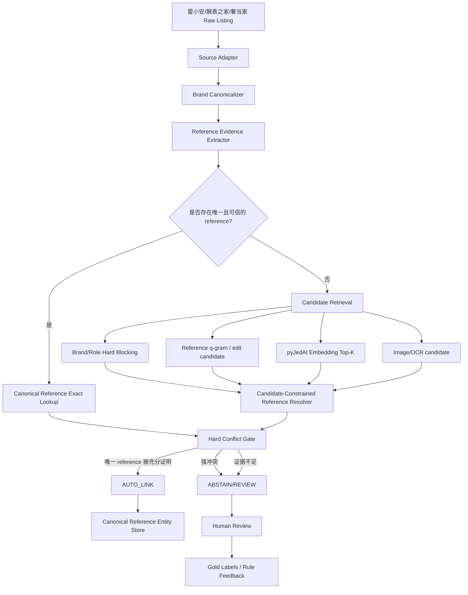

# pyJedAI：把通用 Entity Resolution 流水线改造成 Reference-First 高精度实体链接系统

> 分析人：c  
> 目标需求：跨源二奢/腕表商品实体匹配（雷小安 × 腕表之家 × 奢当家）  
> 核心约束：100 万–1000 万级持续增量；字段稀疏；reference 可能在结构化字段、标题或图片中；“同一个商品”定义为**同一 reference number / 型号**；**precision 极端优先，绝不能误匹配，允许漏匹配**。

## 0. 选题、去重与结论先行

本次从 `奢侈品文章调研.md` 选取：

- 项目：**pyJedAI**
- GitHub：https://github.com/AI-team-UoA/pyJedAI
- 文档：https://pyjedai.readthedocs.io/
- 论文/项目介绍：https://ceur-ws.org/Vol-3254/paper366.pdf
- 当前仓库 `main` 中 `pyproject.toml` 版本：`0.3.6`

执行前重新检查了 `奢侈品调研/c/`，c 已分析的只有：

1. `Ameli：Enhancing Multimodal Entity Linking with Fine-Grained Attributes.md`
2. `Confidence Classifiers with Guaranteed Accuracy or Precision.md`

因此 pyJedAI 没有被 c 分析过，满足去重要求。同时，群内其他成员已经覆盖 DeepBlocker、TransClean、parts-distributor-sku-classifier、Tailoring entity resolution 等方向，本次选 pyJedAI 可以补足“**如何把多种 Blocking / Matching / Clustering 方法组织成可比较、可落地的完整工程流水线**”这一层。

### 结论先行

pyJedAI **不应该作为当前需求的最终自动匹配器直接上线**，但非常适合承担两个角色：

1. **离线实验/Benchmark 框架**：快速比较 Blocking、Comparison Cleaning、Embedding Retrieval、字符串相似度等候选生成方法，在同一黄金集上观察候选召回率、候选规模和运行成本。
2. **架构参考实现**：复用其 `Data -> Block Building -> Cleaning -> Matching -> Clustering -> Evaluation` 的模块化边界，但把最终业务决策重写成 `Reference Evidence Resolver`。

当前需求最关键的重构是：

> 不要把问题建模为“1000 万商品两两判断是不是同一个”，而要建模为“每条 listing 链接到哪个 Canonical Reference Entity”。

即：

```text
传统：
listing A <-> listing B ?

推荐：
listing A -> Canonical Reference (brand=Rolex, ref=126610LN)
listing B -> Canonical Reference (brand=Rolex, ref=126610LN)
=> 按需求定义，两者属于同一商品实体
```

因此最终的系统原则应是：

> **pyJedAI/Embedding/相似度只负责“找候选”；只有经过规范化并被可靠证据证明的 reference 才能负责“自动放行”。任何冲突或证据不足都 ABSTAIN。**

这也和 c 前两次调研形成完整组合：

- Ameli：提供“候选召回 + 多模态/属性证据”的结构参考；
- Confidence Classifiers：提供“高 precision + reject/abstain”的风险控制思想；
- pyJedAI：提供“端到端 ER 流水线、候选算法组合与阶段评测”的工程骨架。

---

## 1. pyJedAI 在解决什么问题

pyJedAI 是一个 Python Entity Resolution / Link Discovery 框架，核心不是单一模型，而是把实体解析拆成多个可替换阶段。

从当前源码 `src/pyjedai/workflow.py` 可以看到，它直接组合了：

- `Data`
- `StandardBlocking`
- `BlockPurging`
- `BlockFiltering`
- 多种 `comparison_cleaning`
- `EntityMatching`
- `ConnectedComponentsClustering`
- `UniqueMappingClustering`
- `EmbeddingsNNBlockBuilding`
- `EJoin / TopKJoin`
- Progressive Matching
- Evaluation

其主流程可以抽象成：

```text
Data
  -> Block Building
  -> Block Cleaning
  -> Comparison Cleaning
  -> Entity Matching
  -> Clustering
  -> Evaluation
```

这个分层对当前项目很有价值，因为三源腕表匹配同样不应是一个“大模型一次输出 MATCH/NO_MATCH”的黑盒，而应该把风险拆开：

```text
候选召回风险 != reference 抽取风险 != 最终自动合并风险
```

每层都应有自己的指标和失败策略。

---

## 2. 当前源码的技术架构拆解

## 2.1 `Data`：统一两表 Clean-Clean ER / 单表 Dirty ER

`src/pyjedai/datamodel.py` 中的 `Data` 是所有步骤共享的数据模型。

核心接口大致为：

```python
Data(
    dataset_1,
    id_column_name_1,
    attributes_1=None,
    dataset_name_1=None,
    dataset_2=None,
    attributes_2=None,
    id_column_name_2=None,
    dataset_name_2=None,
    ground_truth=None,
)
```

行为包括：

- 一个数据集时视为 Dirty ER（单表去重）；
- 两个数据集时视为 Clean-Clean ER；
- NaN 填空字符串；
- 所有字段转成字符串；
- 建立业务 ID 与内部整数 ID 的双向映射；
- 可加载 ground truth；
- 后续每个 Blocking/Matching/Clustering 模块共享这个对象。

### 对三源腕表需求的关键启示

pyJedAI 原生的数据抽象本质上是“一表或两表”，当前需求却有三个来源，而且后续还可能增加来源。

最差做法是：

```text
雷小安 × 腕表之家
雷小安 × 奢当家
腕表之家 × 奢当家
```

每加一个来源都增加 pairwise 组合，而且全量历史数据反复比较。

更好的做法是把 `dataset_1` 固定为 **Canonical Reference Catalog**，把任意来源的新 listing 统一成 `dataset_2`：

```text
D1 = Canonical Reference Catalog
D2 = 本批次所有来源新增/更新 listing
```

这样 pyJedAI 的二表范式反而正好适合被改造成：

```text
listing -> reference entity
```

来源数量从系统复杂度中被拿掉，新平台接入只需要新增适配器。

---

## 2.2 Block Building：把笛卡尔积压缩成候选集

pyJedAI 的 Blocking 层支持传统 token/block 方法，也支持 embedding nearest-neighbor 方法。

它的意义是：如果有 N 条 listing 和 M 个 reference entity，不应该做 `N × M` 的昂贵验证，而是对每条 listing 只产生少量 candidate reference。

传统 Blocking 对本项目尤其适合做以下硬分桶：

```text
canonical_brand_id
reference_prefix / normalized token
product_type
series（若可信）
```

但需要注意：pyJedAI 的通用 blocking 仍然是“领域无关”的。我们不能把 `brand`、`reference`、`platform_sku`、标题里的适配型号全部当普通 token，否则会把**编号角色**混在一起。

本项目必须先增加一层 Domain Adapter：

```text
raw fields
 -> field role normalization
 -> reference evidence extraction
 -> blocking-safe search fields
 -> pyJedAI blocking
```

而不是让 pyJedAI 直接吃原始三源字段。

---

## 2.3 Block Cleaning / Comparison Cleaning：很有用，但目标应该改成“候选压缩”

`workflow.py` 把 `BlockPurging`、`BlockFiltering` 和多种 Comparison Cleaning 作为独立阶段。

这类算法的价值是：

- 删除过大的、几乎没有区分力的 block；
- 减少一个实体参与的重复 comparison；
- 根据共现/权重保留更有价值的 candidate edge；
- 在不做全量两两计算的前提下继续压缩候选。

例如“Rolex”这种 token 如果直接成 block，会覆盖大量实体，信息量极低；更细的 reference prefix、series、结构化型号 token 才有区分力。

但是当前业务不能把 comparison cleaning 当成最终匹配：

> 它优化的是“哪些 pair 值得下游比较”，不是“这个 pair 已经被证明相同”。

在 precision-first 体系里，Comparison Cleaning 最适合承担**成本控制层**。

---

## 2.4 `EmbeddingsNNBlockBuilding`：最适合疑难样本召回，但当前 FAISS 实现并非真正的大规模 ANN

`src/pyjedai/vector_based_blocking.py` 是本项目最值得深入看的部分。

当前实现支持：

- Word2Vec / FastText / GloVe（可选 gensim）；
- BERT / DistilBERT / RoBERTa / XLNet / ALBERT；
- SentenceTransformer：
  - `all-mpnet-base-v2`
  - `gtr-t5-large`
  - `all-distilroberta-v1`
  - `all-MiniLM-L12-v2`
- 自定义 word/sentence model；
- embedding 缓存到 `.npy`；
- CPU / CUDA / Apple MPS；
- Top-K neighbor retrieval；
- cosine / euclidean；
- 可在前一层 cleaned blocks 的 subset 上继续向量检索。

这非常适合处理：

- reference 没有明确字段；
- 标题写法差异大；
- OCR 有缺字符；
- 品牌/系列信息不完整；
- 需要先召回“可能是哪几个 reference”。

### 但是有一个非常重要的规模问题

当前 `_similarity_search_with_FAISS()` 代码创建的是：

```python
faiss.IndexFlatL2(dim)
```

对于 cosine，会做 L2 normalization，然后把 metric 调成 inner product。

`IndexFlat*` 是**精确扫描索引**，不是 IVF/HNSW/PQ 这类真正用于超大规模近似搜索的结构。

因此：

- 它不会像 DeepBlocker demo 那样创建完整 N×M dense matrix，内存行为已经好很多；
- 但 query 仍然需要对 flat index 做大规模精确向量扫描；
- 在 100 万–1000 万 listing 的生产吞吐要求下，不应把全量商品直接塞进默认 `IndexFlatL2` 后持续全扫。

生产环境建议保留 pyJedAI 的接口思想，替换索引实现：

```text
小 catalog / 离线实验：FAISS IndexFlat
更大 catalog：FAISS HNSW / IVF-Flat / IVF-PQ
在线服务：Milvus / Qdrant / OpenSearch kNN / 自建 FAISS shard
```

更重要的是，**索引对象应该是 Canonical Reference Catalog，而不是 1000 万历史 listing**。这样搜索空间本身会显著缩小。

### 第二个风险：字段被拼成一段文本

`EmbeddingsNNBlockBuilding` 会选择 attributes 后执行类似：

```python
dataset[attributes].apply(" ".join, axis=1)
```

然后再编码。

这适合通用语义检索，但会丢失字段角色。

对 reference-first 系统，必须把两类信息分开：

```text
严格字段：brand_id / canonical_ref / evidence_role
语义字段：title / description / series / OCR free text
```

语义字段可以进入 embedding；严格字段不能被 embedding 混合掉。

---

## 2.5 `EntityMatching`：可以做排序器，不能做最终自动放行器

`src/pyjedai/matching.py` 的 `EntityMatching` 支持：

- Levenshtein
- Jaro
- Cosine
- Jaccard
- Generalized Jaccard
- Dice
- Overlap Coefficient
- q-gram/tokenizer
- 向量相似度
- threshold

其基本决策方式是：

```text
similarity > threshold
=> 在 NetworkX Graph 中加入 edge
```

对普通实体匹配合理，但对本需求有根本缺陷：

### “相似”不是“reference 一致”

例如：

```text
126610LN
126610LV
```

从字符串、标题、图片、系列语义上都可能非常接近，但按用户定义，它们必须是两个不同实体。

因此：

- Levenshtein 高分只能说明“值得检查”；
- embedding 高分只能说明“值得召回”；
- 图片高相似只能说明“外观接近”；
- 任何这些分数都不能覆盖一个明确的 reference 冲突。

建议把 pyJedAI 的 Matching 输出改成：

```text
candidate_score / review_rank
```

而不是：

```text
verified_match
```

---

## 2.6 Clustering：pyJedAI 默认思路与本需求不匹配

pyJedAI 提供多种聚类器，但两种典型方法都不能直接用于当前生产决策。

### Connected Components Clustering

其实现会：

1. 可选删除低于 threshold 的 edge；
2. 对剩余图直接做 `networkx.connected_components()`；
3. 用传递闭包形成 cluster。

风险非常明显：

```text
A -- B  （正确）
B -- C  （错误）
=> A、B、C 被放进同一 connected component
```

在“绝不能误匹配”的业务里，一条 false-positive edge 不应该有能力污染整个实体簇。

### Unique Mapping Clustering

它按边权从高到低贪心选择，且一个实体匹配过后就不再参与其他匹配，本质上偏一对一。

但当前业务中同一个 reference 可以对应：

- 雷小安的多条二手 listing；
- 腕表之家的多条 listing；
- 奢当家的多条 listing；
- 不同年份/成色/卖家记录。

所以它也不符合当前“多 listing -> 一个 reference entity”的数据模型。

### 推荐替代：Reference-Centered Star Graph

不要让 listing 之间互相传递聚类，改成：

```text
                 listing A
                    |
listing B -- Canonical Reference -- listing C
                    |
                 listing D
```

所有归属都必须独立证明：

```text
listing -> reference
```

而不是：

```text
listing A ~ listing B
listing B ~ listing C
所以 A ~ C
```

这样任何单条误边的影响范围被限制在一个 listing，不会通过 transitivity 扩散。

---

## 2.7 Evaluation / Workflow：这是 pyJedAI 最值得直接复用的部分

`PYJEDAIWorkFlow` 会记录每一步的：

- Precision
- Recall
- F1
- Runtime
- Configuration

并可导出 DataFrame。

对当前项目，建议直接复用这种“逐阶段评测”，但把 KPI 改成符合业务风险的版本：

| 阶段 | 主指标 | 次指标 |
|---|---|---|
| Reference Extraction | extraction precision | coverage / conflict rate |
| Candidate Retrieval | true-reference Recall@K | candidates/listing / latency |
| Candidate Cleaning | true-reference retained recall | reduction ratio |
| Final Auto-Link | **precision / false-positive count** | auto-link coverage |
| Review | reviewer agreement | queue size / hard-negative category |

尤其不要用最终 F1 作为上线目标。

当前需求允许漏匹配，所以最终层宁可：

```text
Precision 极高 + Coverage 较低
```

也不要：

```text
F1 很高但仍有少量 False Positive
```

---

# 3. 将需求重新建模为 Canonical Reference Entity Linking

## 3.1 核心实体

建议定义：

```text
canonical_reference_id = hash(canonical_brand_id + canonical_reference)
```

不能只用 reference 字符串作为全局主键，因为不同品牌可能存在相同/相似编号空间。

Canonical Reference 表至少包含：

```sql
canonical_reference (
    id                  BIGINT PRIMARY KEY,
    brand_id            BIGINT NOT NULL,
    canonical_ref       VARCHAR NOT NULL,
    display_ref         VARCHAR,
    family              VARCHAR,
    model_name          VARCHAR,
    alias_set           JSONB,
    normalization_ver   VARCHAR NOT NULL,
    status              VARCHAR NOT NULL,
    UNIQUE (brand_id, canonical_ref)
)
```

这里的 `alias_set` 只能存**经过验证的等价写法**，不能由字符串相似度自动扩张。

---

## 3.2 Listing 不应该被物理 merge

建议保留三源原始记录，只建立可审计链接：

```sql
listing_reference_link (
    listing_id              VARCHAR PRIMARY KEY,
    canonical_reference_id  BIGINT,
    decision                VARCHAR NOT NULL,
    decision_reason         JSONB NOT NULL,
    evidence_bundle_hash    VARCHAR NOT NULL,
    resolver_version        VARCHAR NOT NULL,
    decided_at              TIMESTAMP NOT NULL
)
```

`decision` 只允许：

```text
AUTO_LINK
NO_LINK
ABSTAIN
REVIEW
```

好处：

- 不会因为一次错误把多个源数据不可逆合并；
- normalizer/model 升级后可以重放；
- 可追踪“为什么当时自动链接”；
- 人工修正只需改 link，不用拆物理大表。

---

# 4. Reference Evidence Layer：最终高 precision 的真正核心

pyJedAI 本身没有“reference 是身份主键”这个业务先验，所以必须额外实现证据层。

## 4.1 统一证据表

建议每一个抽取结果都保存成独立 evidence：

```sql
reference_evidence (
    evidence_id        BIGINT PRIMARY KEY,
    listing_id         VARCHAR NOT NULL,
    raw_value          VARCHAR NOT NULL,
    normalized_value   VARCHAR,
    brand_id           BIGINT,
    evidence_type      VARCHAR NOT NULL,
    evidence_role      VARCHAR NOT NULL,
    source_location    VARCHAR,
    extractor_name     VARCHAR NOT NULL,
    extractor_version  VARCHAR NOT NULL,
    confidence         DOUBLE PRECISION,
    validation_state   VARCHAR NOT NULL,
    metadata           JSONB
)
```

推荐的 `evidence_type`：

```text
STRUCTURED_FIELD
TITLE
DESCRIPTION
OCR_CASEBACK
OCR_CARD
OCR_TAG
OCR_BOX
VLM
CATALOG_LOOKUP
```

推荐的 `evidence_role`：

```text
BRAND_REFERENCE
PLATFORM_SKU
SELLER_SKU
SERIAL_NUMBER
ACCESSORY_COMPATIBLE_REFERENCE
UNKNOWN_IDENTIFIER
```

这一层尤其重要，因为“长得像型号的字符串”不一定就是当前商品 reference。

例如：

```text
适配 126610LN 表带
```

标题出现 `126610LN`，但售卖实体可能是表带而不是腕表本体。若不做 role classification，会产生灾难性的 false positive。

---

## 4.2 Reference Normalization 必须品牌感知、可逆、版本化

安全的 normalization 不是简单：

```python
re.sub(r'[^A-Z0-9]', '', value.upper())
```

因为某些品牌编号中分隔符、后缀、前导零可能具有业务意义。

建议：

```text
Unicode normalize
 -> 全半角统一
 -> 大小写统一
 -> 受控空格/连字符规范化
 -> brand-specific parser
 -> catalog existence validation
 -> canonical_ref
```

规则必须满足：

1. **品牌感知**：Rolex、Omega、Cartier 等可有独立 parser；
2. **保留 raw_value**：任何 canonical 化都能回溯原文；
3. **版本化**：`normalization_ver` 写入决策；
4. **禁止 fuzzy alias 自动入库**：相似编号不能自动认为等价；
5. **新增 alias 走人工/可信 catalog 审核**。

---

## 4.3 Reference Extractor 建议分四路

### 路 1：结构化字段

如果来源已有 `reference/model_no`：

```text
field -> normalize -> brand pattern validate -> catalog validate
```

这是最高优先级证据。

### 路 2：标题 / 描述

不要让 LLM 自由生成 reference，推荐：

```text
brand-specific regex / trie / catalog candidate scan
 -> identifier role classifier
 -> candidate-constrained resolver
```

尤其可以根据 reference catalog 构造 Aho-Corasick / Trie，直接在标题中搜 canonical reference 与已审核 alias，成本低、可解释。

### 路 3：图片 OCR

图片先分类：

```text
商品正面
表背/底盖
保卡
吊牌
证书
盒子
配件
其他
```

再 OCR，并把：

- 图像类型；
- OCR box；
- OCR confidence；
- 原始字符串；
- normalized reference；

全部保存在 evidence 中。

图片不是用来“看起来像同一款就放行”，而是用来寻找**可验证的 reference 文本证据**。

### 路 4：语义 / 图像检索

SentenceTransformer、CLIP/VLM 等只用于：

```text
reference 不明确时 -> 缩小候选范围
```

不能产生最终 AUTO_LINK。

---

# 5. pyJedAI 在新架构中的准确位置

推荐架构：



pyJedAI 只位于：

```text
Candidate Retrieval / Candidate Cleaning / Offline Evaluation
```

而不是 `AUTO_LINK` 决策核心。

---

# 6. 最终决策规则：禁止“加权平均覆盖硬冲突”

这是整个方案中最重要的一条。

不推荐：

```text
score = 0.4 * text_sim
      + 0.3 * image_sim
      + 0.2 * ref_sim
      + 0.1 * brand_sim

score > 0.95 => MATCH
```

因为如果：

```text
reference A != reference B
```

再高的图片/标题相似度都不应该补偿这个冲突。

推荐“规则门 + 证据等级 + reject”：

```python
def resolve(listing, candidates, evidence):
    if evidence.has_brand_conflict():
        return ABSTAIN

    strong_refs = evidence.valid_strong_brand_references()

    if len(strong_refs) > 1:
        # 同一 listing 出现多个互斥的强 reference
        return REVIEW

    if len(strong_refs) == 1:
        ref = strong_refs[0]
        entity = exact_lookup(listing.brand_id, ref)
        if entity and not evidence.has_conflicting_reference(ref):
            return AUTO_LINK(entity)

    # 仅有 embedding/image/title 相似度，永远不自动放行
    ranked = rank_candidates(candidates, evidence)
    if ranked:
        return REVIEW

    return ABSTAIN
```

### 推荐证据等级

#### A 级：可独立触发自动链接候选

例：

- 来源结构化 reference 字段，经品牌 parser + catalog 校验；
- 明确 reference 专用位置 OCR，且通过严格格式/catalog 校验；
- 两个独立可信来源得到完全相同 canonical reference。

但即使 A 级，只要出现另一个强冲突 reference，也必须降级 REVIEW/ABSTAIN。

#### B 级：需要交叉验证

例：

- 标题中识别出的 reference；
- 描述正文；
- OCR 普通商品图；
- 受候选集约束的 LLM/VLM 选择。

可采用：

```text
两个独立 B 级证据一致 + 无冲突
```

再进入极高阈值 precision gate。

#### C 级：只允许召回/排序

- embedding similarity；
- 图像视觉 similarity；
- title semantic similarity；
- edit distance；
- 同系列/同材质/同尺寸。

C 级绝不能单独触发 AUTO_LINK。

---

# 7. 如何直接用 pyJedAI 做离线基线

## 7.1 把 D1 设计为 reference catalog，D2 设计为 listing batch

示例：

```python
from pyjedai.datamodel import Data
from pyjedai.vector_based_blocking import EmbeddingsNNBlockBuilding

catalog_df = ...   # 一行一个 canonical reference
listing_df = ...   # 某个批次三源 listing

data = Data(
    dataset_1=catalog_df,
    id_column_name_1="reference_entity_id",
    attributes_1=["brand", "search_text"],
    dataset_name_1="reference_catalog",
    dataset_2=listing_df,
    id_column_name_2="listing_id",
    attributes_2=["brand", "search_text"],
    dataset_name_2="incoming_listings",
    ground_truth=gold_pairs,
)
```

其中 `search_text` 不要直接用所有字段拼接，建议预先构造：

```text
品牌 + 系列 + 标题去营销词 + OCR 文本 + 已识别 identifier token
```

平台 SKU、卖家内部 ID 等不应该进入 search_text，除非已经完成 role 标注。

---

## 7.2 强烈建议先按 canonical brand 分片

不要让 Rolex listing 去全 catalog 搜 Omega / Cartier。

先做：

```text
brand canonicalization
```

然后：

```python
for brand_id in brands:
    catalog_brand = catalog[catalog.brand_id == brand_id]
    listings_brand = listings[listings.brand_id == brand_id]
    # 在品牌分片内部跑 pyJedAI/FAISS
```

收益：

- 直接排除跨品牌 false candidate；
- 降低向量索引规模；
- 可以使用品牌专属 reference parser；
- 后续 threshold / Top-K 可以按品牌调优。

品牌本身不确定的 listing 应单独进入 `brand_unknown` 路径，不要跨全库自动链接。

---

## 7.3 Embedding Top-K 示例

```python
blocker = EmbeddingsNNBlockBuilding(
    vectorizer="sminilm",
    similarity_search="faiss",
)

blocks = blocker.build_blocks(
    data,
    top_k=30,
    attributes_1=["search_text"],
    attributes_2=["search_text"],
    similarity_distance="cosine",
    save_embeddings=True,
)

candidate_pairs = blocker.export_to_df(blocks)
```

这个输出的语义只能是：

```text
listing L 值得检查 reference R
```

不能解释成：

```text
listing L 已经属于 reference R
```

---

# 8. 生产规模下需要对 pyJedAI 做的四个关键改造

## 8.1 改造一：把 `IndexFlat` 换成真正可扩展索引

建议抽象一个接口：

```python
class CandidateIndex:
    def build(reference_embeddings): ...
    def upsert(reference_entity): ...
    def search(listing_embedding, top_k): ...
```

实现可以是：

```text
FaissHNSWIndex
FaissIVFPQIndex
QdrantIndex
MilvusIndex
OpenSearchKNNIndex
```

pyJedAI 保留用于实验，在线服务不必依赖其内部 `IndexFlatL2`。

---

## 8.2 改造二：禁止把所有字段直接 join 成文本

新增领域结构：

```python
@dataclass
class ListingFeatures:
    brand_id: str
    title_search_text: str
    canonical_ref_candidates: list[str]
    platform_skus: list[str]
    seller_skus: list[str]
    ocr_tokens: list[str]
    image_embedding: Optional[list[float]]
```

其中：

- `canonical_ref_candidates` 用于硬规则/候选约束；
- `title_search_text` 才进入 text embedding；
- `platform_skus` 与 reference 完全隔离；
- image embedding 只参与 candidate retrieval。

---

## 8.3 改造三：跳过通用 Clustering，改成 Reference Resolver

生产流程不再调用：

```python
ConnectedComponentsClustering
UniqueMappingClustering
```

而增加：

```python
class ReferenceResolver:
    def resolve(
        listing,
        evidence_bundle,
        candidate_references,
    ) -> Decision:
        ...
```

Decision 必须携带：

```json
{
  "state": "AUTO_LINK",
  "canonical_reference_id": 123,
  "rule": "STRUCTURED_REF_EXACT",
  "evidence_ids": [1001, 1002],
  "normalizer_version": "rolex-v4",
  "resolver_version": "2026-08-a",
  "conflicts": []
}
```

做到每一条自动链接都能解释和审计。

---

## 8.4 改造四：在线系统不要直接依赖 pandas + NetworkX 全量图

pyJedAI 是非常好的研究/实验框架，但它大量使用：

- pandas DataFrame；
- Python dict/set；
- NetworkX Graph；
- 本地 `.npy` embedding；
- Python 进程内 workflow。

这些对离线实验非常方便，但 100 万–1000 万持续增量场景下，不适合作为整个在线数据面的唯一存储和计算抽象。

推荐：

```text
pyJedAI = Offline Lab / Benchmark Harness
Production = 独立可扩展服务
```

生产组件可以是：

```text
Raw Store/Object Storage
        |
Ingestion Queue (Kafka/Pulsar 可选)
        |
Normalization + Evidence Workers
        |
PostgreSQL: canonical reference + decision state
        |
Exact Reference Index / Brand Shard
        |
ANN Candidate Service
        |
Reference Resolver
        |
Audit / Review Queue
```

pyJedAI 用来决定“哪一种候选算法值得生产化”，而不是承担全部在线流量。

---

# 9. 推荐的生产数据流

## 9.1 Fast Path：明确 reference

适用：结构化字段可靠，或标题中有明确且唯一 reference。

```text
listing
 -> brand normalize
 -> reference extract
 -> canonicalize
 -> exact lookup (brand_id, canonical_ref)
 -> conflict check
 -> AUTO_LINK / ABSTAIN
```

这一条路径应该覆盖尽可能多的数据，因为它：

- 快；
- 成本低；
- 可解释；
- precision 最容易控制。

---

## 9.2 Slow Path：reference 缺失/含糊

```text
listing
 -> brand shard
 -> q-gram / edit candidate
 -> pyJedAI text embedding candidate
 -> OCR/VLM evidence
 -> candidate-constrained resolver
 -> hard conflict gate
 -> REVIEW / ABSTAIN / 极少量 AUTO_LINK
```

这里 embedding 的目标是让人工或规则只面对：

```text
5~30 个 reference candidate
```

而不是全 catalog。

Top-K 的具体值必须通过黄金集按品牌调优，不应该全局拍脑袋固定。

---

# 10. Reference Candidate Retrieval 的推荐三路召回

建议对疑难 listing 取候选并集：

## 10.1 Route A：Identifier-aware Retrieval

输入：

- 标题中疑似编号；
- OCR 疑似编号；
- 结构化但格式异常的 reference。

方法：

- char q-gram；
- edit distance；
- prefix/suffix；
- O/0、I/1 等 OCR confusion-aware 查询。

但输出仅为 candidate，不能因为编辑距离很近就自动认为是同一 reference。

---

## 10.2 Route B：Text Embedding Retrieval

用 pyJedAI `EmbeddingsNNBlockBuilding` 作为 benchmark：

```text
brand + clean title + series + OCR text
 -> sentence embedding
 -> Top-K canonical reference profiles
```

Canonical reference profile 可以包含：

```text
brand
canonical ref
model name
series
known aliases
short description
```

这一路对 reference 完全缺失的记录最有价值。

---

## 10.3 Route C：Image Retrieval

pyJedAI 本身不是多模态框架，因此图片检索应独立实现：

```text
image -> CLIP/VLM embedding -> reference image catalog Top-K
```

然后只把结果作为 candidate source：

```json
{
  "candidate_reference_id": 123,
  "sources": ["TEXT_ANN", "IMAGE_ANN"],
  "scores": {...}
}
```

图片候选和文本候选重合，可以提升**候选排序**，但仍不能覆盖 reference 冲突。

---

# 11. Hard Conflict Gate：比任何相似度模型都重要

最终 gate 至少应检查：

```text
1. brand 是否冲突
2. 是否存在两个不同的已验证 reference
3. 标题 reference 与结构化 reference 是否冲突
4. OCR reference 与结构化/title reference 是否冲突
5. candidate 是否只是配件适配 reference
6. 当前编号是否可能是 platform SKU / seller SKU / serial
7. canonical reference 是否存在于可信 catalog
8. alias 是否来自已审核 alias table
```

建议采用“冲突优先”逻辑：

```text
有一条强冲突证据
> 多条弱相似证据
```

即：

```python
if strong_conflict:
    return REVIEW_OR_ABSTAIN
```

而不是把负面证据放入一个加权 score 后被其他 feature 抵消。

---

# 12. 人工黄金集应该怎样标，才能真正支持这个系统

用户允许人工标几百对，这些标注不应只随机抽样。

需要专门构造 Hard Negative：

### 12.1 相邻 reference

```text
126610LN vs 126610LV
同系列、同尺寸、外观高度相似，但 reference 不同
```

### 12.2 OCR 易混字符

```text
O / 0
I / 1 / l
S / 5
B / 8
```

### 12.3 配件陷阱

```text
适配 XXX reference 的表带/表盒/镜面/配件
```

### 12.4 平台 SKU 陷阱

平台自有货号长得像 reference。

### 12.5 标题多编号

一个标题同时出现：

- 当前商品 reference；
- 对比款 reference；
- 兼容 reference；
- 系列编号。

### 12.6 来源分布漂移

测试集必须按：

```text
source
brand
time
reference popularity
```

做切分，避免随机切分把近重复标题泄漏到 train/test。

---

# 13. 评测方案：不要只看 F1

建议每次 pipeline 版本输出：

## 13.1 Reference Extraction

```text
Exact Reference Precision
Exact Reference Recall/Coverage
Conflict Rate
Role Classification Precision
```

## 13.2 Candidate Retrieval

```text
Recall@1
Recall@5
Recall@10
Recall@30
Average candidates/listing
P95 candidates/listing
```

候选召回层可以容忍 false positive，核心是不能把真 reference 丢掉。

## 13.3 Final Auto-Link

核心：

```text
Auto-Link Precision
False Positive Count
Auto-Link Coverage
Abstain Rate
```

并单独输出：

```text
同系列相邻 reference hard-negative FP
配件 FP
OCR confusion FP
platform SKU FP
```

### 关于“几百条标签”的统计边界

几百条黄金标签可以用于：

- 发现主要错误模式；
- 调规则；
- 比较候选算法；
- 建立初始 reject 策略。

但如果业务声称需要非常极端的线上 precision，不能仅凭几百条随机样本“观察到 0 个错误”就证明风险已经足够低。

因此应把：

- 规则硬约束；
- 持续人工抽检；
- hard-negative 回归集；
- 高风险样本强制 abstain；
- 统计置信下界；

一起用于上线门槛。

---

# 14. 推荐实现的服务边界

可以拆为 5 个核心服务/模块。

## 14.1 `brand-normalizer`

输入：source listing  
输出：canonical brand + confidence + evidence

## 14.2 `reference-extractor`

输入：字段、标题、描述、OCR  
输出：`reference_evidence[]`

## 14.3 `candidate-service`

内部路由：

```text
exact index
q-gram index
text ANN
image ANN
```

输出：candidate reference IDs，不做 match。

## 14.4 `reference-resolver`

唯一拥有 `AUTO_LINK` 权限的组件。

输入：

```text
listing
reference evidence
candidate refs
catalog facts
```

输出：

```text
AUTO_LINK / NO_LINK / ABSTAIN / REVIEW
```

## 14.5 `review-console`

展示：

- 原 listing；
- 三源字段；
- reference evidence 高亮；
- OCR box；
- candidate references；
- 冲突原因；
- 相邻 reference 对比；
- 最终人工选择。

人工结果回流到：

- golden set；
- alias table；
- parser regression tests；
- role classifier；
- candidate benchmark。

---

# 15. 直接可实现的 Reference Resolver 状态机

建议比二分类多两个状态：

```text
AUTO_LINK
NO_LINK
REVIEW
ABSTAIN
```

状态机：

```text
START
  |
  v
Brand known?
  | no -> ABSTAIN
  yes
  |
  v
Strong ref evidence?
  | no -> candidate retrieval -> REVIEW/ABSTAIN
  yes
  |
  v
Multiple conflicting strong refs?
  | yes -> REVIEW
  no
  |
  v
Reference exists in trusted catalog?
  | no -> REVIEW/NEW_REFERENCE_QUEUE
  yes
  |
  v
Any strong contradiction / identifier-role ambiguity?
  | yes -> REVIEW
  no
  |
  v
AUTO_LINK
```

如果未来需要自动创建新 reference entity，建议另开：

```text
NEW_REFERENCE_QUEUE
```

不要让未知型号在第一次出现时直接进入主 catalog 并触发后续自动合并。

---

# 16. pyJedAI 可以直接复用什么、必须替换什么

| pyJedAI 能力 | 是否复用 | 本项目用法 |
|---|---:|---|
| `Data` + ground truth mapping | 是，离线 | 快速构造 reference catalog vs listing benchmark |
| Workflow 分阶段评测 | **强烈复用** | 对 Blocking/Cleaning/Matching 分步测指标 |
| Standard/Token Blocking | 部分 | 只在经过 role normalization 的字段上使用 |
| Block Purging/Filtering | 部分 | 控制候选规模，不做最终决策 |
| Comparison Cleaning | 部分 | 候选边压缩，先保证 true-ref recall |
| `EmbeddingsNNBlockBuilding` | 是，离线 | 疑难 listing 的语义 Top-K baseline |
| 当前 `IndexFlatL2` | 否，生产大规模需替换 | 改 HNSW/IVF/PQ 或外部向量服务 |
| `EntityMatching` threshold | 仅排序 | 不允许直接触发 AUTO_LINK |
| Connected Components | 否 | 避免错边传递污染整个簇 |
| Unique Mapping | 否 | 当前业务是 many-listings-to-one-reference |
| NetworkX 全量图 | 否，生产 | 只用于样本/离线分析 |
| Ollama/LLM 能力 | 受限使用 | 只能受候选约束抽取/解释，不自由决定 reference |

---

# 17. 与 DeepBlocker 相比，pyJedAI 在本需求中的额外价值

DeepBlocker 的重点是“学习一个好的 tuple embedding 做 Blocking”；pyJedAI 的价值更偏“把多种 ER 方法组织成流水线并统一评测”。

对当前项目：

```text
DeepBlocker-style insight：Embedding 是 candidate layer
pyJedAI-style insight：Candidate layer 也需要可组合、可清洗、可逐阶段评测
```

pyJedAI 还能同时比较：

- token blocking；
- q-gram；
- embedding；
- edit/string metrics；
- comparison cleaning；
- progressive strategies。

因此建议把 pyJedAI 用作“候选算法竞技场”，而不是押注一个模型。

---

# 18. 推荐的落地顺序

## 阶段 A：先建 Reference Identity 基础设施

必须先完成：

```text
canonical brand
canonical reference catalog
reference normalizer
reference evidence schema
exact lookup
决策审计表
```

这部分即使完全不使用 ML，也会直接解决一批高置信数据。

## 阶段 B：用 pyJedAI 建 Offline Benchmark

固定黄金集，比较：

```text
Token Blocking
q-gram candidate
Edit-distance candidate
SentenceTransformer + FAISS Top-K
不同 Comparison Cleaning
```

核心选型标准：

```text
在接近 100% true-reference candidate recall 的前提下，谁能把 candidates/listing 压得最低。
```

## 阶段 C：生产化 Candidate Service

把胜出的候选策略移出 pandas/NetworkX 实验环境：

```text
Exact/Trie Index + ANN Service + Brand Shard
```

## 阶段 D：加入 OCR/图片

先用于 reference evidence 和 candidate retrieval，不改变最终硬 gate。

## 阶段 E：持续 hard-negative 回归

任何新发现的误匹配模式都必须加入：

```text
regression test + golden set + rule/model versioning
```

---

# 19. 最小可落地版本（MVP）

如果现在直接开始做，我建议第一个可运行版本只实现下面 8 个动作：

```text
1. 三源字段统一成 listing schema
2. brand canonicalization
3. 构建 canonical_reference 表
4. 写 brand-specific reference normalizer
5. 从 structured field + title 抽 reference evidence
6. 强 reference exact lookup + conflict gate
7. 不确定样本用 pyJedAI 做 Top-K offline baseline
8. 所有不确定结果 ABSTAIN/REVIEW
```

这一版甚至不需要复杂 end-to-end matcher，就能与 Spec 的 precision-first 目标严格对齐。

随后再增加：

```text
OCR -> image retrieval -> candidate-constrained LLM/VLM -> calibrated reject
```

而不是一开始就训练一个“图片+标题=>是否同款”的黑盒分类器。

---

# 20. 最终推荐架构

```text
                         ┌──────────────────────────────┐
                         │ Canonical Reference Catalog  │
                         │ (brand_id, canonical_ref)    │
                         └──────────────┬───────────────┘
                                        │
                                        │ exact / candidate lookup
                                        │
┌───────────────┐  ┌────────────────────▼──────────────────┐
│ 三源 raw data │->│ Normalize + Reference Evidence Layer   │
└───────────────┘  │ field/title/OCR/identifier-role        │
                   └──────────────┬────────────────────────┘
                                  │
                 ┌────────────────┴────────────────┐
                 │                                 │
        unique strong ref                  ambiguous/missing ref
                 │                                 │
                 v                                 v
       Exact Reference Lookup          Candidate Retrieval Layer
                 │                    ┌──────────────────────────┐
                 │                    │ qgram / edit / pyJedAI   │
                 │                    │ text ANN / image ANN     │
                 │                    └────────────┬─────────────┘
                 │                                 │
                 └────────────────┬────────────────┘
                                  v
                     ┌────────────────────────┐
                     │ Hard Conflict Gate      │
                     │ Reference Resolver      │
                     └────────────┬───────────┘
                                  │
               ┌──────────────────┼───────────────────┐
               v                  v                   v
          AUTO_LINK            REVIEW              ABSTAIN
               │                  │                   │
               v                  v                   │
      listing_reference_link   Human Gold ----------┘
               │
               v
        Reference-centered
          Entity View
```

---

# 21. 最终结论

pyJedAI 对当前 Spec 的最大价值，不是某个具体 matching algorithm，而是它证明了 Entity Resolution 应被做成**可拆分、可替换、可评测的多阶段系统**。

但当前需求比通用 ER 有一个更强、也更宝贵的业务定义：

> **同一个商品 = 同一个 reference number。**

因此应该利用这个定义，把系统从“相似商品匹配”降维成“Reference Entity Linking”。

最终建议可以概括为四句话：

1. **把 Canonical Reference 变成一级实体，不要做 listing-listing 全量聚类。**
2. **pyJedAI 用于 Blocking/Candidate Retrieval/Offline Benchmark，不拥有最终自动合并权。**
3. **最终 AUTO_LINK 只由规范化 reference 的可验证证据触发，reference 冲突永远是硬否决。**
4. **所有不确定情况 ABSTAIN/REVIEW，图片、Embedding、LLM 只能帮助找证据和排候选，不能越权覆盖 identity rule。**

在 100 万–1000 万持续增量规模下，这套架构同时满足：

- 不做 O(N²) 商品两两比较；
- 可按新增 listing 增量处理；
- 可利用文本、图片、OCR 和少量黄金标签；
- 最终自动链接路径高度可解释；
- 错误不会通过 connected-components 传递污染整个簇；
- 可以把 precision-first 和 reject/abstain 真正落实到系统边界，而不是只靠调一个相似度阈值。
