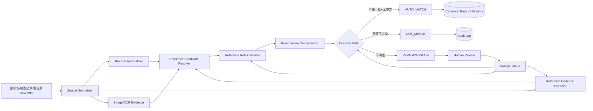

# An Entity-Matching System Based on Multimodal Data for Two Major E-Commerce Stores in Mexico

> 分析人：d  
> 对应需求：跨源二奢/腕表商品实体匹配系统（雷小安 × 腕表之家 × 奢当家）  
> 论文：Raúl Estrada-Valenciano, Víctor Muñiz-Sánchez, Héctor De-la-Torre-Gutiérrez, *Mathematics* 2022, 10(15), 2564  
> 原文：https://www.mdpi.com/2227-7390/10/15/2564  
> DOI：https://doi.org/10.3390/math10152564

## 0. 结论先行

这篇论文值得参考的是它把真实电商商品匹配拆成了 **候选构造 → 文本编码 → 图片编码 → 多模态融合 → 二分类** 的完整工程链路，并实际验证了图文融合的收益；但它的最佳 ImageBERT 模型 precision 只有 **86.26%**，不可能直接用于当前“绝对不能误匹配”的需求。

当前需求中，“同一个商品”的业务定义已经被严格限定为 **同一 reference number / 型号**。因此最重要的架构判断是：

> **不要把主问题建模成“两个商品像不像”的 pairwise 二分类；应把它重构为“从每条商品记录中高精度恢复 canonical reference，再按 canonical reference 做确定性实体归并”。**

也就是说，论文中的多模态模型适合降级为 **reference 抽取、证据补全、冲突检测和人工复核排序器**，而不是最终 match 决策器。

建议直接落地如下三态决策：

- `AUTO_MATCH`：品牌一致 + canonical reference 严格一致 + reference 属于当前售卖主体 + 无高置信冲突证据。
- `NOT_MATCH`：存在高置信冲突，例如同品牌但 canonical reference 不同。
- `REVIEW/ABSTAIN`：reference 缺失、多个候选、只在图片/OCR 中弱命中、标题是兼容配件语义等一律拒识，不自动合并。

这会把 100 万–1000 万量级问题从近似 `O(N²)` 的 pairwise matching，降成以 **单记录 reference resolution + 哈希/索引等值连接** 为主的近 `O(N)` 流程。

---

## 1. 论文技术实现与架构拆解

### 1.1 数据与候选对构造

论文选择墨西哥两个大型电商站点，抽取的主要字段包括：

- title
- brand
- category
- price
- image

候选构造不是全量笛卡尔积，而是从 e-shop 1 的商品标题发起搜索，在 e-shop 2 中取搜索结果前 3 个作为候选，再人工标注正负样本。最终数据集包含：

- 3489 对商品
- 941 对 positive
- 2548 对 negative
- 按 60% / 20% / 20% 做 stratified train/validation/test split

这个候选构造思路本质上就是 blocking：先用检索把搜索空间压小，再做昂贵的匹配模型。

### 1.2 文本预处理

论文做了较传统的文本清洗：

- lowercase
- 去特殊字符
- 去 stop words
- tokenization

这里对普通描述文本合理，但对腕表 reference **不能原样照搬**：reference 中的 `-`、`.`、`/`、空格、前导零、字母大小写有时携带型号语义，必须使用 brand-aware normalization，不能先暴力删除特殊字符。

### 1.3 图片编码：ResNet50 + 两种 pair 架构

论文用 ImageNet 预训练的 **ResNet50** 做图片 backbone，并提出两种结构。

#### 2-CNN

两张商品图分别经过 CNN 得到 embedding，然后直接 concat：

```text
image_a -> ResNet50 -> emb_a --\
                               concat -> Dense -> Dense -> binary classifier
image_b -> ResNet50 -> emb_b --/
```

优点：保留两侧 embedding 的完整信息，后续 MLP 可以自己学习跨图交互。

缺点：如果输入顺序不做对称化，天然可能学习出 `f(a,b) != f(b,a)`；同时直接 concat 对大量近似外观商品容易过拟合视觉相似性。

#### image-Siamese

两图共享网络得到 embedding，再计算 Euclidean distance，由距离驱动二分类：

```text
image_a -> shared CNN/Dense -> z_a --\
                                      Euclidean distance -> classifier
image_b -> shared CNN/Dense -> z_b --/
```

优点：天然适合相似性问题，参数共享，也更容易形成可检索向量。

论文结果里 image-Siamese 的单模态效果很好：precision 81.81%、F1 83.22%。

但它与文本融合后反而下降，论文认为原因之一是图像支路最后只压缩成一个 distance scalar，融合时信息量太少。

### 1.4 文本编码：BETO(BERT) + BiLSTM + Hybrid Pooling

论文使用西班牙语 BERT（BETO），把一对商品文本组织成：

```text
[CLS] offer_1_text [SEP] offer_2_text [SEP]
```

其中文本由 name / brand / category / price 等字段组合。

BERT 输出后继续经过：

```text
BERT token states
  -> Bidirectional LSTM
  -> max pooling + average pooling
  -> concat
  -> regularized dense layers
  -> classifier / text embedding
```

这是一个典型的 pairwise cross-encoding 思路：让两条记录在同一次 Transformer 前向中发生 token-level 交互。

对于当前需求，它适合做 **疑难 reference 候选的语义角色判断**，例如识别：

- “适配 126610LN 的表带”里的 126610LN 并不是当前售卖主体的 reference；
- “原装盒证，适用 XXX”中的型号不是商品本体；
- “同款/类似/兼容/适配”语义造成的假型号命中。

但不应该让 BERT 自由决定最终是否 match。

### 1.5 多模态融合：ImageBERT 与 BERTSiamese

#### ImageBERT

论文将 BERT 文本 embedding 与 2-CNN 图像 embedding 做 intermediate fusion：

```text
text pair -> BERT/BiLSTM/pooling -> text_emb --\
                                                concat -> MLP -> match probability
image pair -> two ResNet50 branches -> image_emb --/
```

这是论文最佳模型：

| 模型 | Accuracy | Precision | Sensitivity | F1 |
|---|---:|---:|---:|---:|
| 2-CNN | 0.8542 | 0.7210 | 0.8041 | 0.7492 |
| image-Siamese | 0.9107 | 0.8181 | 0.8600 | 0.8322 |
| BERT | 0.8735 | 0.7026 | 0.9214 | 0.7887 |
| **ImageBERT** | **0.9241** | **0.8626** | **0.8645** | **0.8584** |
| BERTSiamese | 0.8720 | 0.7034 | 0.8980 | 0.7835 |

可以看到多模态确实提升了平均指标，但 86.26% precision 意味着在自动接受的正例里仍有不可接受的误匹配。

#### BERTSiamese

它将文本 embedding 与图片 Siamese 的 Euclidean distance 拼接后分类：

```text
text_emb + image_distance -> MLP -> match probability
```

性能下降说明一个很重要的工程事实：

> **多模态不是“加了就一定更好”；模态融合之前必须保留足够的、与业务决策相关的证据维度。**

当前系统里图片尤其不能只压成一个“像不像”的相似度；应优先抽取更可解释的视觉证据，例如表背 reference OCR、表盘品牌/系列、配件类别、颜色/材质等冲突特征。

### 1.6 训练方法

论文 DL 模型使用：

- Keras / TensorFlow
- weighted binary cross entropy 处理类别不平衡
- Adam
- 最多 160 epochs
- early stopping，patience = 20
- Google Colab GPU

这套训练方式可以作为验证性 baseline，但当前需求真正稀缺的不是“更复杂的 pair classifier”，而是高质量的 **reference 证据标注与误匹配 hard case**。

---

## 2. 为什么论文方案不能原样用于当前需求

### 2.1 业务“同一实体”定义不同

论文的标签是人工判断两个 offer 是否为同一商品，模型学习的是综合相似度。

当前需求已经规定：

> 同一个商品 = 同一 reference number / 型号。

这意味着最终系统应该尽可能接近一个 **identifier resolution system**，而不是 general product similarity system。

### 2.2 论文最佳 precision 仍然远不够

ImageBERT precision 86.26%，对推荐/价格比较场景或许可用，但对于“不能误匹配”的主数据归并完全不够。

如果 1000 万记录中自动形成 100 万条合并关系，即使 precision 达 99.9%，理论上仍可能产生约 1000 条 false positive。当前需求必须通过：

- 极强硬规则；
- selective prediction / abstain；
- 高风险样本人工复核；
- 自动接受集合独立审计；

把自动合并集合压缩到非常可信的一小部分。

### 2.3 图片“相似”并不等于 reference 相同

腕表尤其存在以下 hard negative：

- 同系列不同尺寸；
- 同盘面不同材质；
- 同壳型不同机芯/年份；
- 同一个 family 下只差一两位 reference；
- 官图完全相同但实际 reference 不同；
- 表带、盒证、附件使用主表图片或出现主表 reference。

所以视觉相似度最多是辅助，不可以作为 `AUTO_MATCH` 的充分条件。

### 2.4 pairwise 方案不适合 100 万–1000 万持续增量

如果不先得到 identifier/blocking，三源数据做 pairwise 组合会迅速膨胀。

如果把 reference 先解析成 canonical key，则每条新记录只需：

1. 解析自身 reference；
2. 查询 `(brand_id, canonical_reference)` 索引；
3. 满足门控条件则挂到已有 canonical product；否则建新实体或进入复核。

吞吐和可解释性都会高很多。

---

## 3. 推荐的生产架构：Reference-First Multimodal Resolution



### 3.1 Raw 层：永远保留来源原始值

建议每条 offer 都不可变保存：

```text
source
source_offer_id
crawl_time
url
title_raw
brand_raw
category_raw
price_raw
reference_raw
attributes_raw_json
image_urls
```

不要把规范化结果覆盖原始字段。所有后续模型、规则升级后必须可以重跑。

### 3.2 Brand Canonicalizer

reference 通常只在品牌域内有意义，因此第一层先统一品牌：

```text
ROLEX / Rolex / 劳力士 -> brand_id=rolex
OMEGA / 欧米茄 -> brand_id=omega
Patek Philippe / 百达翡丽 -> brand_id=patek_philippe
```

品牌无法高置信解析时不允许自动 match。

数据库中建议维护：

```sql
brand_alias(
  alias_normalized text primary key,
  brand_id bigint not null,
  source text,
  confidence numeric,
  active boolean
)
```

### 3.3 Reference Evidence Extractor：先产生“证据”，不要直接产最终值

每个候选 reference 都必须带 provenance：

```json
{
  "value_raw": "126610LN",
  "normalized_candidate": "126610LN",
  "evidence_source": "structured_field | title | description | image_ocr | llm",
  "span": "劳力士潜航者 126610LN 黑水鬼",
  "extractor": "rolex_regex_v3",
  "extract_confidence": 0.999,
  "role": "unknown"
}
```

建议证据优先级：

1. 来源结构化 reference 字段；
2. 品牌专用 regex/grammar 从标题抽取；
3. 受限型号字典检索；
4. 图片 OCR（表背、保卡、吊牌）；
5. LLM 只做候选抽取/角色判断，不允许自由生成不存在的 reference。

### 3.4 Brand-aware Reference Canonicalizer

不要做全局统一的“删掉所有符号”。应该按品牌维护 normalization profile。

示例：

```python
NORMALIZERS = {
    "rolex": normalize_rolex_ref,
    "omega": normalize_omega_ref,
    "cartier": normalize_cartier_ref,
}
```

每个 normalizer 输出：

```json
{
  "canonical": "126610LN",
  "valid": true,
  "grammar_version": "rolex-v4",
  "transformations": ["uppercase", "trim_space"],
  "lossy": false
}
```

核心原则：

- 大小写统一通常安全；
- 前后空格安全；
- 内部空格、连字符、点号是否能删除必须按品牌验证；
- 任何 lossy transformation 都不能直接进入最高置信 `AUTO_MATCH`。

### 3.5 Reference Role Classifier：解决“出现了型号，但不是当前商品型号”

这是最容易制造 false positive 的环节，应该单独建模。

角色至少分成：

```text
PRODUCT_REFERENCE       当前售卖主体型号
COMPATIBLE_REFERENCE    兼容/适配对象型号
RELATED_REFERENCE       同系列/对比/类似款型号
ACCESSORY_TARGET_REF    表带/配件针对的腕表型号
STORE_SKU               店铺 SKU/平台货号
SERIAL_OR_OTHER_ID      序列号或其他编号
UNKNOWN
```

第一版完全可以用规则 + 小模型：

```text
“适用/适配/兼容/for/同款/可配/表带/保护壳/盒证” + ref
    -> 降级为 COMPATIBLE_REFERENCE / ACCESSORY_TARGET_REF
```

之后用几百条黄金标签训练一个轻量 cross-encoder/LLM classifier。

这正是论文 BERT pair 语义编码最值得迁移的部分：**不是判断 match，而是判断 reference 在上下文里的语义角色。**

---

## 4. 图片应该怎么用：从“相似度正证据”改为“结构化辅助证据”

论文 ImageBERT 证明图文联合能提升平均性能，但当前任务需要重新定义图片支路。

### 4.1 图片 OCR 优先级高于通用视觉 embedding

对于腕表，图片最有价值的信息往往不是“看起来像不像”，而是：

- 表背刻字；
- 保卡 reference；
- 吊牌；
- 盒贴；
- 机芯/底盖编号。

建议：

```text
image -> quality filter -> OCR -> ref candidate detector -> role/provenance -> canonicalizer
```

可选实现：PaddleOCR / RapidOCR；后续如果复杂版式多，再引入文档视觉模型。

### 4.2 CLIP/SigLIP embedding 只用于三件事

1. **人工复核排序**：把视觉冲突最大的候选排在前面；
2. **负向 veto**：同 reference 但图像明显是不同品类（腕表 vs 表带/盒子）时禁止自动通过；
3. **弱召回**：reference 完全缺失时，只用于找可能的人工复核候选，不自动建立实体关系。

不要做：

```text
image_similarity > 0.95 => match
```

因为同系列不同 reference 正是最危险的 hard negative。

### 4.3 建议的多模态 evidence vector

不要像论文 BERTSiamese 那样把图像压成一个 distance scalar。建议保留可解释字段：

```text
ref_exact_equal
brand_equal
role_confidence_left
role_confidence_right
structured_ref_left/right
ocr_ref_equal
ocr_conflict
category_equal
accessory_probability
visual_similarity
text_semantic_similarity
price_ratio
source_pair
```

这个 vector 可以用于：

- 审计；
- 学习一个 risk score；
- review queue 排序；
- selective threshold calibration。

但 `AUTO_MATCH` 仍以 reference 硬规则为核心。

---

## 5. 三态决策引擎

建议不要只输出 boolean，而是：

```text
AUTO_MATCH
NOT_MATCH
REVIEW
```

### 5.1 第一版可直接上线的规则

```python
def resolve(a, b):
    # 1. 品牌必须确定且一致
    if not a.brand_id or not b.brand_id:
        return "REVIEW", "brand_unknown"
    if a.brand_id != b.brand_id:
        return "NOT_MATCH", "brand_conflict"

    # 2. 两边都必须得到唯一、高置信、属于商品本体的 reference
    if len(a.product_refs) != 1 or len(b.product_refs) != 1:
        return "REVIEW", "reference_not_unique"

    ra = a.product_refs[0]
    rb = b.product_refs[0]

    if ra.lossy_normalization or rb.lossy_normalization:
        return "REVIEW", "lossy_reference_normalization"

    # 3. 高置信 reference 不同 -> 明确不匹配
    if ra.canonical != rb.canonical:
        return "NOT_MATCH", "reference_conflict"

    # 4. 同 reference 仍需要检查反证
    if a.accessory_probability > 0.2 or b.accessory_probability > 0.2:
        return "REVIEW", "accessory_risk"

    if a.high_conflict_ref or b.high_conflict_ref:
        return "REVIEW", "multiple_reference_conflict"

    if a.ocr_ref and a.ocr_ref != ra.canonical:
        return "REVIEW", "ocr_conflict_left"
    if b.ocr_ref and b.ocr_ref != rb.canonical:
        return "REVIEW", "ocr_conflict_right"

    return "AUTO_MATCH", "canonical_reference_exact"
```

### 5.2 更好的方式：根本不做 pairwise 主循环

既然 match key 是 `(brand_id, canonical_reference)`，则 canonical product registry 可直接做唯一索引：

```sql
create table canonical_product (
  product_id bigserial primary key,
  brand_id bigint not null,
  canonical_reference text not null,
  reference_scheme_version text not null,
  created_at timestamptz not null default now(),
  unique (brand_id, canonical_reference)
);
```

新 offer 解析成功后：

```sql
select product_id
from canonical_product
where brand_id = :brand_id
  and canonical_reference = :ref;
```

存在则挂载，不存在则新建 canonical product。

这样“实体匹配”变成“identifier resolution + registry attach”，天然适合持续增量。

---

## 6. 推荐数据模型

### 6.1 offer_raw

```sql
create table offer_raw (
  offer_id bigserial primary key,
  source varchar(32) not null,
  source_offer_id text not null,
  crawled_at timestamptz not null,
  title_raw text,
  brand_raw text,
  category_raw text,
  reference_raw text,
  attributes_raw jsonb,
  image_urls jsonb,
  unique(source, source_offer_id)
);
```

### 6.2 reference_evidence

```sql
create table reference_evidence (
  id bigserial primary key,
  offer_id bigint not null,
  value_raw text not null,
  canonical_candidate text,
  evidence_source varchar(32) not null,
  extractor_version text not null,
  extract_confidence numeric(6,5),
  role varchar(32) not null,
  role_confidence numeric(6,5),
  span text,
  metadata jsonb,
  created_at timestamptz not null default now()
);
```

### 6.3 offer_resolution

```sql
create table offer_resolution (
  offer_id bigint primary key,
  brand_id bigint,
  canonical_reference text,
  decision varchar(16) not null,
  reason_code text not null,
  product_id bigint,
  resolver_version text not null,
  resolved_at timestamptz not null default now()
);
```

### 6.4 resolution_event

所有自动合并必须可追溯：

```sql
create table resolution_event (
  event_id bigserial primary key,
  offer_id bigint not null,
  product_id bigint,
  decision varchar(16) not null,
  reason_code text not null,
  evidence_snapshot jsonb not null,
  resolver_version text not null,
  created_at timestamptz not null default now()
);
```

当规则或模型升级时，可以回答：

- 当时为什么合并？
- 使用了哪个 reference normalizer？
- OCR/标题分别抽到了什么？
- 哪一版阈值放行？

这对于“绝不能误匹配”的系统非常重要。

---

## 7. 100 万–1000 万规模下的工程实现

### 7.1 第一版不需要上特别重的流式架构

如果现有抓取是批量/周期增量，建议第一版：

- Python 3.12
- FastAPI：内部解析/复核 API
- PostgreSQL：canonical registry + resolution state + 唯一索引
- S3/MinIO：图片与原始快照
- Celery/RQ + Redis：异步 OCR/LLM/图片任务
- PaddleOCR/RapidOCR：图片文字
- Transformers + ONNX Runtime：角色分类/小模型推理
- Prometheus + Grafana：precision proxy、拒识率、冲突率、任务积压

1000 万记录对 PostgreSQL 的等值索引并不是问题；真正昂贵的是 OCR/LLM/视觉模型，所以应只对 **缺失 reference 或冲突样本** 触发。

### 7.2 分层成本策略

```text
L0 结构化字段 exact ref              最便宜
L1 品牌 regex/title parse             很便宜
L2 型号词典/检索                      便宜
L3 role classifier                    中等
L4 OCR                                中高
L5 multimodal/LLM                     高
L6 human review                       最高
```

只有上层无法确定时才进入下一层，避免对 1000 万商品全部跑大模型。

### 7.3 增量更新

每条 offer 增量到达时只处理自己：

```text
new offer
 -> source normalize
 -> brand resolve
 -> reference evidence
 -> gate
 -> registry lookup/attach
 -> audit event
```

不需要周期性全库重新做 pair matching。

当 normalizer / extractor 升级时，再按受影响品牌/来源做定向 backfill。

---

## 8. 黄金标签应该怎么标

需求允许人工标几百对。建议不要把全部预算都花在随机 match/non-match pair 上，而是围绕最危险的决策边界标注。

### 8.1 参考标签结构

每条记录标：

```json
{
  "brand": "rolex",
  "gold_reference": "126610LN",
  "reference_present": true,
  "reference_role": "PRODUCT_REFERENCE",
  "is_accessory": false,
  "ambiguous": false
}
```

pair 再标：

```json
{
  "left_ref": "126610LN",
  "right_ref": "126610LN",
  "same_by_business_definition": true,
  "hard_negative_type": null
}
```

### 8.2 优先收集 hard negatives

几百条预算里建议大量覆盖：

- 同品牌、只差 1 位的 reference；
- 同系列不同尺寸；
- 表带/盒证/附件标题出现主表 reference；
- 标题出现多个 reference；
- 平台 SKU 长得像 reference；
- reference 只在 OCR 中出现；
- 一个来源有结构化 reference，另一个只在标题中出现；
- 同一 reference 的不同分隔符/大小写/空格形式。

这些样本比随机负例更有价值。

### 8.3 数据切分不能只随机 pair split

至少增加：

- unseen reference split
- unseen brand/sub-family split
- source holdout
- time-based split

否则模型很容易记住常见型号，线上新增长尾 reference 时性能会虚高。

---

## 9. 评估与上线门槛

### 9.1 主指标不是 F1，而是 Auto-Match Precision

应该单独统计：

```text
AUTO_MATCH precision
AUTO_MATCH count / coverage
false_positive_count
REVIEW rate
reference extraction exact match
reference role precision
conflict detection recall
```

业务上允许漏配，所以 coverage 可以牺牲。

### 9.2 阈值要以“自动接受集合”校准

例如模型输出 risk score 时：

```text
score >= T_high -> 仍然不能单独 AUTO_MATCH，只能作为硬规则后的风险门控
score < T_low   -> NOT_MATCH / REVIEW
中间区域        -> REVIEW
```

不要使用传统 `0.5` 二分类阈值。

### 9.3 零误匹配需要持续审计

如果验证集中 1000 个自动接受样本 0 个错误，这并不能证明线上误匹配率“接近 0”。

可以使用简单的 rule-of-three 直觉：若抽样 `n` 个独立自动接受样本观察到 0 个错误，则 95% 置信水平下错误率上界约为 `3/n`。

例如想把上界压到 0.1%，需要大约 3000 个零错误审计样本。几百条黄金标签适合启动系统，但不足以支撑极高 precision 的统计承诺，因此建议上线初期持续人工抽检自动接受集合。

---

## 10. 与论文的“保留 / 替换”映射

| 论文设计 | 当前需求处理 | 原因 |
|---|---|---|
| 标题检索构造候选 | **保留思想，但主要改为 reference blocking** | 大规模必须先压缩候选 |
| ResNet50 图片 embedding | **降级为辅助** | 外观相似不能证明 reference 相同 |
| image-Siamese | **可用于 review 排序，不做 match gate** | 同系列 hard negative 风险高 |
| BERT pair encoder | **迁移到 reference role / conflict classifier** | 更符合语义消歧价值 |
| ImageBERT embedding concat | **改成可解释 evidence vector** | 需要审计、拒识与硬约束 |
| weighted BCE 二分类 | **改为三态决策 + selective gate** | precision-first，允许漏匹配 |
| pairwise 最终分类 | **替换为 canonical registry attach** | 业务定义已经是 reference equality |
| F1 为核心 | **替换为 auto-match precision + FP 数 + coverage** | 业务损失极不对称 |

---

## 11. 推荐直接落地的 MVP

### Phase 1：1–2 周可做出的 deterministic baseline

1. 建 `brand_alias` 与 canonical brand。
2. 选前 5–10 个最大腕表品牌，写 brand-specific reference regex/normalizer。
3. 区分 source structured reference、title reference、store SKU。
4. 建 `(brand_id, canonical_reference)` 唯一 registry。
5. 只对“结构化 reference 或高精度 title regex 严格一致”的记录 `AUTO_MATCH`。
6. 其他全部 `REVIEW`，先建立 precision 基线。

### Phase 2：用几百条标注解决最危险歧义

1. 标注 reference role。
2. 训练/提示一个轻量 role classifier。
3. 加入 accessory detector。
4. 对缺 ref 样本跑 OCR。
5. 收集同系列相邻 reference hard negatives。

### Phase 3：论文多模态能力的正确接入方式

1. 使用 CLIP/SigLIP 或轻量视觉 encoder 生成 embedding。
2. 训练冲突检测 / review prioritization 模型。
3. 可测试 ImageBERT 类融合模型，但只输出 risk/evidence score。
4. 对 `AUTO_MATCH` 集合做持续人工审计和阈值收紧。

---

## 12. 一个可直接实现的 Resolver 接口

```python
from dataclasses import dataclass
from typing import Literal

Decision = Literal["AUTO_MATCH", "NOT_MATCH", "REVIEW"]

@dataclass
class RefEvidence:
    canonical: str
    source: str
    extract_conf: float
    role: str
    role_conf: float
    lossy: bool = False

@dataclass
class Resolution:
    decision: Decision
    brand_id: str | None
    canonical_reference: str | None
    reason: str
    evidence: dict


def resolve_offer(offer) -> Resolution:
    brand = resolve_brand(offer)
    if not brand.is_high_confidence:
        return Resolution("REVIEW", None, None, "brand_unknown", {})

    evidences = extract_reference_evidence(offer, brand)
    product_refs = [
        e for e in evidences
        if e.role == "PRODUCT_REFERENCE"
        and e.extract_conf >= 0.995
        and e.role_conf >= 0.995
        and not e.lossy
    ]

    unique_refs = {e.canonical for e in product_refs}

    if len(unique_refs) == 0:
        return Resolution("REVIEW", brand.id, None, "no_trusted_reference", {
            "refs": evidences,
        })

    if len(unique_refs) > 1:
        return Resolution("REVIEW", brand.id, None, "conflicting_references", {
            "refs": evidences,
        })

    ref = next(iter(unique_refs))

    if detect_accessory(offer) >= 0.2:
        return Resolution("REVIEW", brand.id, ref, "accessory_risk", {
            "refs": evidences,
        })

    visual_conflicts = detect_visual_or_ocr_conflicts(offer, ref)
    if visual_conflicts:
        return Resolution("REVIEW", brand.id, ref, "visual_or_ocr_conflict", {
            "refs": evidences,
            "conflicts": visual_conflicts,
        })

    return Resolution("AUTO_MATCH", brand.id, ref, "trusted_reference", {
        "refs": evidences,
    })
```

然后由 registry 层执行：

```python
resolution = resolve_offer(offer)

if resolution.decision == "AUTO_MATCH":
    product = get_or_create_product(
        brand_id=resolution.brand_id,
        canonical_reference=resolution.canonical_reference,
    )
    attach_offer(product.id, offer.id, resolution)
else:
    enqueue_review_or_store_negative(offer.id, resolution)
```

这套接口的关键优点是：**模型只提供 evidence，最终 AUTO_MATCH 条件由版本化、可审计的 resolver 控制。**

---

## 13. 最值得从论文吸收的三个思想

### 13.1 先 blocking，再做昂贵判断

论文从一个站点的 title 搜另一个站点 top-3，本质上就是候选生成。当前应升级为：

```text
brand + reference candidate -> exact/blocking
```

只对不确定样本再做 NLP/OCR/视觉。

### 13.2 保留多模态，但改变权力边界

论文证明图文融合优于部分单模态 baseline，因此图片不能完全不用；但当前的正确边界是：

> **图片可以补 reference、发现冲突、帮助复核；不能在 reference 冲突时投票把两个商品合并。**

### 13.3 不要压缩掉对决策有意义的信息

论文 BERTSiamese 把图片支路最后压成一个 distance，融合性能反而下降，是一个很好的警示。

当前系统应优先存储原子证据，而不是只存一个总分：

```text
谁抽出的 reference？
来自哪个字段？
原始 span 是什么？
是否经过 lossy normalization？
图片 OCR 是否一致？
是否出现兼容/配件上下文？
```

这样才能真正做到高 precision 与可追责。

---

## 14. 最终推荐

如果现在要直接开始实现，我建议 **不要先训练 ImageBERT/CLIP matching classifier**，而是按下面顺序：

```text
1. Brand canonicalization
2. Reference evidence extraction
3. Brand-aware reference normalization
4. Reference role classification
5. (brand_id, canonical_reference) registry
6. Three-way decision gate: AUTO_MATCH / NOT_MATCH / REVIEW
7. OCR + multimodal conflict detector
8. 持续人工审计和黄金标签回流
```

对于这个 Spec，最大的架构收益不是“找到一个更强的相似度模型”，而是利用业务已经给出的严格定义，把问题从开放式 entity matching 收缩成 **高精度 canonical identifier resolution**。

论文的 ImageBERT 可以作为“多模态证据工程”的参考实现，但最终生产系统必须反过来设计：**硬 identifier 规则掌握合并权，模型只拥有补证和否决/拒识权。**
