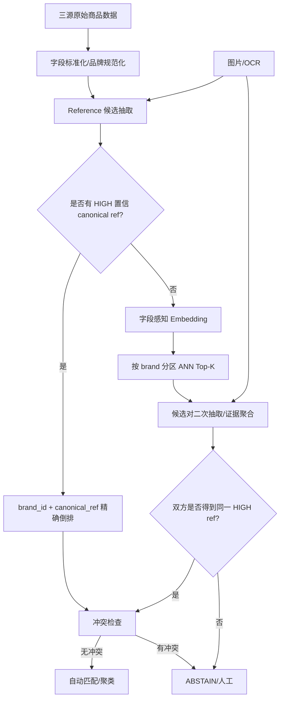
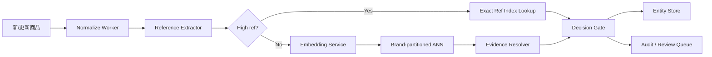

# DeepBlocker：面向跨源二奢/腕表实体匹配的候选生成层技术分析与落地方案

> 分析对象：[`qcri/DeepBlocker`](https://github.com/qcri/DeepBlocker)  
> 论文背景：Deep Learning for Blocking in Entity Matching: A Design Space Exploration（VLDB 2021）  
> 对应需求：Notion《调研计划 Spec：跨源二奢/腕表商品实体匹配系统（雷小安 × 腕表之家 × 奢当家）》  
> 需求核心：100 万–1000 万级持续增量商品；“同一个商品”定义为**同一 reference number / 型号**；字段稀疏；可用图片；**precision 极端优先，允许漏匹配**。

---

## 1. 结论先行

DeepBlocker 最值得复用的不是它当前仓库里的模型参数，而是它把大规模实体匹配拆成两层的思想：

1. **Tuple Embedding：把一条商品记录映射为向量；**
2. **Vector Pairing / Blocking：只为每条记录召回少量候选，而不是做全量笛卡尔比较。**

但对当前腕表/二奢需求，DeepBlocker **不能直接作为最终 matcher**。原因是业务已经给出了一个极强、极清晰的身份定义：

> 同一商品 ⇔ 同一品牌语义下的同一 canonical reference number。

因此推荐的生产方案是：

- **最终判定层只相信高置信 reference 硬证据；**
- DeepBlocker 思路只用于“reference 缺失/埋在标题/脏数据”的**候选召回层**；
- 图片、文本 embedding、LLM、相似度都只能帮助“找到可能是谁”，不能越过 reference 冲突直接判同；
- 所有证据不足或冲突样本默认 `ABSTAIN`，进入人工复核或保持未匹配。

如果只做第一版，甚至可以先不上深度模型：先做**品牌规范化 + reference 抽取/规范化 + 精确倒排索引**，这已经能覆盖最高置信的一大批数据。DeepBlocker/ANN 是第二阶段，用来提高 recall，而不是提高 precision。

---

## 2. DeepBlocker 解决的本质问题

实体匹配若直接对两个来源做 pairwise 比较，复杂度约为：

```text
|A| × |B|
```

若两个来源各有 100 万条记录，就是 `10^12` 对；三个来源再两两比较，成本更高。

Blocking 的目标不是直接判断“是否同一实体”，而是把比较空间压缩为：

```text
每条左表记录 -> Top-K 个右表候选
```

然后后续 matcher 只在候选集合上工作。

DeepBlocker 的 README 也明确把系统拆成：

```text
原始 tuple
  -> tuple embedding
  -> 向量索引/近邻检索
  -> candidate set
  -> 后续 entity matching
```

这与当前需求非常契合：千万级系统必须先做 candidate generation，否则无论后面的规则、LLM、视觉模型多强，都会被 pairwise 数量拖垮。

---

## 3. DeepBlocker 仓库架构拆解

仓库很小，核心文件只有几类：

```text
DeepBlocker/
├── deep_blocker.py              # 总编排器
├── tuple_embedding_models.py    # tuple -> vector
├── dl_models.py                 # AutoEncoder / Siamese 网络
├── vector_pairing_models.py     # vector -> Top-K candidates
├── blocking_utils.py            # candidate set 与评估
├── configurations.py            # 超参数
└── main.py                      # 示例入口
```

整体是一个非常清晰的 Strategy / Plugin 风格设计：

```text
DeepBlocker
 ├── ABCTupleEmbedding
 │    ├── AverageEmbedding
 │    ├── SIFEmbedding
 │    ├── AutoEncoderTupleEmbedding
 │    ├── CTTTupleEmbedding
 │    └── HybridTupleEmbedding
 │
 └── ABCVectorPairing
      └── ExactTopKVectorPairing
```

`DeepBlocker` 本身不关心具体 embedding 是什么，也不关心近邻检索怎样实现，只约定：

```python
embedding_model.preprocess(...)
embedding_model.get_tuple_embedding(...)

pairing_model.index(...)
pairing_model.query(...)
```

这个接口边界很值得直接借鉴。生产实现可以保留相同抽象，只把模型替换成更适合中文电商和大规模 ANN 的组件。

---

## 4. `DeepBlocker.block_datasets` 的实际执行链

`deep_blocker.py` 的主流程非常短：

```text
1. validate_columns
2. preprocess_datasets
3. concat(left_text, right_text)
4. tuple_embedding_model.preprocess(all_text)
5. get left embeddings
6. get right embeddings
7. pairing_model.index(right_embeddings)
8. pairing_model.query(left_embeddings)
9. Top-K neighbor indices -> candidate_set_df
```

### 4.1 预处理

代码把 `cols_to_block` 除 `id` 外的所有字段直接拼接为 `_merged_text`：

```python
self.left_df["_merged_text"] = self.left_df[
    self.cols_to_block_without_id
].agg(' '.join, axis=1)
```

优点：

- 统一输入接口；
- 对字段缺失天然兼容；
- 快速做 baseline。

缺点也很明显：

- `brand=Rolex`、`reference=126610LN`、`title=劳力士黑水鬼...` 在向量模型眼里失去字段角色；
- “平台 SKU”“品牌 reference”“兼容型号”“系列名”全被放进同一字符串；
- 对当前业务这种**编号角色极重要**的任务，直接 flatten 会增加 false positive 风险。

所以我们应该保留“统一 tuple embedding”这个接口，但输入需要改为**字段感知序列**：

```text
[BRAND] rolex
[SERIES] submariner
[REF_CANDIDATE] 126610ln
[TITLE] 劳力士 潜航者 黑水鬼 自动机械男表
[DESC] ...
```

或者分别编码后再融合，而不是裸拼接。

---

## 5. Tuple Embedding 的 5 种实现

### 5.1 AverageEmbedding

最简单方案：

```text
每个 token -> fastText 300d
整条记录 -> token vector 平均
```

优点是快、无监督；缺点是区分能力弱，尤其不适合 reference 这种字母数字组合。

例如：

```text
126610LN
126610LV
```

在商品语义上可能属于同系列、文本也高度相似，但业务上必须判成不同 reference。平均词向量不能承担最终判定。

### 5.2 SIFEmbedding

SIF 对高频词降权：

```text
weight(w) = a / (a + p(w))
```

并可去掉第一主成分。

这个思路对卖家标题中的高频噪声很有价值，例如：

```text
正品 / 二手 / 九五新 / 男表 / 自动机械 / 专柜 / 保真
```

这些词对“是哪一个 reference”贡献很小，应该低权重。

但 SIF 仍然是无字段语义的 bag-of-token 风格，不能解决“平台货号和品牌 reference 的角色冲突”。

### 5.3 AutoEncoderTupleEmbedding

流程是：

```text
SIF 300d
 -> Encoder: 300 -> 300 -> 150
 -> Decoder: 150 -> 300 -> 300
 -> 用重建损失训练
 -> 取 Encoder 的 150d 作为 tuple embedding
```

默认参数在 `configurations.py`：

```text
fastText dimension = 300
AE embedding       = 150
epochs             = 50
batch size         = 256
learning rate      = 1e-3
```

它不需要标签，本质是在当前左右表数据分布上做 self-supervised representation learning。

对我们的价值：

- 不依赖几百对人工黄金标签；
- 可以按品牌/来源分区做轻量域适配；
- 适合 Blocking 层。

但今天生产实现不建议继续使用 Wikipedia fastText + MLP AutoEncoder，可替换为现代中文/多语种文本 encoder，再做 ANN。

### 5.4 CTTTupleEmbedding

CTT 的关键思想是**合成正负样本**，不依赖人工标注。

代码对每条 tuple：

- 正样本：随机删除最多约 40% token，认为扰动前后仍是同一 tuple；
- 负样本：随机找另一条 tuple；
- 默认每条生成 5 个正样本，并按 1:1 生成负样本。

然后训练一个 Siamese summarizer：

```text
left  -> shared MLP -> h_left
right -> shared MLP -> h_right

abs(h_left - h_right)
 -> Linear
 -> sigmoid(match probability)
```

这是一种典型的 self-supervised metric learning 思路。

对于当前腕表数据，可把“随机删 token”升级为更业务化的增强：

```text
删除成色/价格/店铺营销词
随机改空格、横杠、大小写
中文/英文品牌别名替换
标题字段随机缺失
描述截断
图片 OCR 部分缺失
```

但有一个绝不能做的增强：

```text
不能把 reference 的关键字符变化当成正样本增强
```

例如 `126610LN -> 126610LV` 即使只差一个字符，也必须是 hard negative。

### 5.5 HybridTupleEmbedding

Hybrid = AutoEncoder + CTT 思路：

```text
原始 tuple
 -> SIF
 -> AutoEncoder representation
 -> synthetic pair training
 -> Siamese model
```

目标是先学紧凑表征，再学习适合 blocking 的 pair geometry。

架构思想可以借鉴，但当前代码实现有一个需要特别检查的问题，见后面的“代码级风险”。

---

## 6. Vector Pairing：当前仓库真正的扩展瓶颈

`vector_pairing_models.py` 里默认只有：

```python
ExactTopKVectorPairing
```

其核心代码是：

```python
all_pair_cosine_similarity_matrix = 1 - distance.cdist(
    query_embeddings,
    index_embeddings,
    metric="cosine"
)

topK_indices_each_row = np.argsort(
    -all_pair_cosine_similarity_matrix
)[:, :K]
```

也就是说它**真的构造完整 N×M 相似度矩阵**。

这只适合论文实验或中小数据集，不适合当前需求。

### 6.1 内存规模直观估算

若左右各 100 万条：

```text
1,000,000 × 1,000,000 = 10^12 similarities
```

即便每个 similarity 只按 float32 4 字节：

```text
约 4 TB
```

这里只是相似度矩阵，还不含 embedding、排序、DataFrame 等成本。

1000 万规模更不可能。

### 6.2 生产替换方案

保留 `ABCVectorPairing` 接口，直接替换为 ANN：

```text
Faiss HNSW / IVF-PQ
Milvus
Qdrant
pgvector + HNSW
Elasticsearch/OpenSearch kNN
```

推荐优先级取决于现有基础设施：

- 单机/离线批处理：Faiss；
- 已有 PostgreSQL 且规模可控：pgvector；
- 专门向量服务：Milvus/Qdrant；
- 已有 ES/OpenSearch：直接利用 kNN。

最重要的是：**按 brand_id 分区建索引**，不要做全局无约束 ANN。

---

## 7. Blocking 的评估指标

`blocking_utils.py` 主要算两个指标：

### 7.1 Blocking Recall

```text
golden matches 被 candidate set 覆盖的比例
```

这是 Blocking 最重要的指标。

Blocking 层宁可多召回一些候选，也不要把真实匹配提前丢掉。

### 7.2 CSSR / Candidate Set Size Ratio

```text
|candidate_set| / (|left| × |right|)
```

衡量候选压缩比。

对我们的系统应该增加：

- `Recall@K` 按品牌、来源对、是否有 reference 分桶；
- `Candidates per unresolved item`；
- `ANN hit rate`；
- `accepted precision`；
- `auto-merge coverage`；
- `abstain rate`；
- `reference conflict rate`；
- hard-negative false positive 数量。

Blocking recall 和最终 precision 必须分开看，不能混成一个 F1。

---

## 8. 当前 DeepBlocker 代码不能直接上生产的 7 个问题

### 8.1 ExactTopK 是 O(N×M)，千万级不可用

这是最明显的问题。必须换 ANN + 业务分区。

### 8.2 `id` 实际上被默认成 DataFrame 行号

`DeepBlocker.validate_columns()` 强制要求 `id` 字段，但最后 `topK_neighbors_to_candidate_set()` 并没有使用原始 `id` 值，而是：

```python
topK_df["ltable_id"] = topK_df.index
```

右侧同样直接使用 neighbor index。

因此仓库实现隐含假设：

```text
业务 id == 0-based DataFrame row index
```

这在生产环境很危险。数据过滤、重排、增量追加后都会出错。

生产实现必须维护：

```text
row_position <-> source_item_id
```

显式映射，向量索引的 external id 直接保存业务主键。

### 8.3 CTT/Hybrid 的训练结果在当前导出路径中疑似没有被使用

`CTTTupleEmbedding.preprocess()` 会训练：

```python
self.ctt_model = trainer.train(...)
```

但 `get_tuple_embedding()` 返回的是：

```python
self.sif_embedding_model.get_tuple_embedding(...)
```

没有调用：

```python
self.ctt_model.get_tuple_embedding(...)
```

Hybrid 也存在类似现象：训练了 `self.ctt_model`，但最终导出的还是 AutoEncoder embedding。

也就是说，从当前仓库代码路径看，Siamese summarizer 的训练效果可能没有真正进入用于 Top-K 的向量。

如果复现项目，应先做单元测试验证这一点；如果按生产方案实现，则直接重写 encoder 接口，不建议依赖这段原代码。

### 8.4 GPU 设备路径也需要修正

训练器会：

```python
self.model.to(self.device)
```

但后续 `get_tuple_embedding()` 创建的是 CPU tensor，并直接传给 model encoder；代码没有统一 `.to(device)` 再 `.cpu().numpy()`。

在有 CUDA 的机器上可能出现 device mismatch。

生产实现必须把推理设备管理放到统一 encoder service 里。

### 8.5 Flatten 字段会破坏编号角色

`manufacturer_part_number`、平台 SKU、卖家货号、兼容型号不能视为同一类 token。

这对当前需求是高风险问题，因为 precision 优先。

### 8.6 fastText Wikipedia 对中文二奢 + 字母数字 reference 不够贴域

尤其 reference 的关键信息不是“语义近似”，而是“字符身份”。

例如：

```text
116610LN
116610LV
126610LN
126610LV
```

语义模型可能都很近，但业务必须严格区分。

### 8.7 requirements 没有版本锁定

仓库只列：

```text
fasttext numpy pandas pathlib scipy sklearn torch torchtext
```

没有版本 pin，且部分 API 属于较老生态。适合作为研究代码，不适合作为直接部署依赖。

---

## 9. 对当前 Spec 的正确系统分层

应该明确区分两个问题：

### 问题 A：候选召回

> “这条记录可能和哪些记录是同一 reference？”

允许误召回，因为后面还有硬校验。

### 问题 B：最终身份判定

> “我们是否有足够证据自动声明它们就是同一 reference？”

这里绝不能因为文本/图片相似就放行。

推荐架构：



核心原则：

```text
Embedding / ANN 只能让候选进入验证层；
只有 canonical reference 硬证据才能进入自动匹配层。
```

---

## 10. 推荐的数据模型

### 10.1 `raw_item`

保存原始数据，不做覆盖：

```text
source
source_item_id
raw_title
raw_brand
raw_model
raw_reference
raw_description
image_urls
updated_at
raw_payload
```

主键：

```text
(source, source_item_id)
```

### 10.2 `normalized_item`

```text
item_uid
source
source_item_id
brand_id
brand_confidence
series_normalized
normalized_title
reference_status
best_canonical_ref
best_ref_confidence
embedding_version
extractor_version
updated_at
```

### 10.3 `reference_evidence`

一条商品可以有多个 reference 候选，必须保留 provenance：

```text
item_uid
candidate_ref_raw
canonical_ref
role
source_field
extract_method
confidence
span_start
span_end
image_id
ocr_bbox
validator_flags
extractor_version
```

`role` 至少区分：

```text
MANUFACTURER_REFERENCE
PLATFORM_SKU
SELLER_SKU
COMPATIBILITY_REFERENCE
ACCESSORY_REFERENCE
UNKNOWN_ID
```

这是防止误匹配的关键字段。

### 10.4 `match_decision`

```text
left_item_uid
right_item_uid
decision            # MATCH / REJECT / ABSTAIN
canonical_ref
reason_code
rule_version
model_version
evidence_snapshot
created_at
```

必须可审计、可重放。

---

## 11. Reference 抽取与规范化：真正的主战场

当前需求定义决定了系统成功与否主要取决于 reference extraction，而不是 pair classifier。

### 11.1 抽取优先级

建议从强到弱：

```text
1. 来源独立 reference/model 字段
2. 结构化规格参数
3. 标题中的品牌规则/正则
4. 描述文本
5. 图片 OCR（表背、保卡、吊牌、盒标）
6. LLM/序列标注模型辅助
```

每条证据都要保存来源和置信度。

### 11.2 Canonicalization 不能“一刀切去符号”

常见安全操作：

```text
Unicode normalize
trim
uppercase
统一全角/半角
统一常见连字符
去明确无语义的外围空格
```

但不应该直接：

```text
删除所有字母
删除所有后缀
把所有 / - . 都无条件删除
只保留数字
```

因为在部分品牌里后缀就是 reference identity 的一部分。

应采用：

```text
canonical_ref = brand_specific_normalizer(brand_id, raw_ref)
```

并保存：

```text
raw_ref
normalized_ref
normalization_rule_version
```

### 11.3 必须做 Reference Role Classification

很多电商标题会出现“适用于某型号”“兼容某型号”“替换某型号”。

腕表也存在：

```text
表带适配 126610LN
原装盒证对应 xxx
平台商品号 12345678
店铺库存号 A7788
```

这些编号都不能直接当作当前售卖主体的 reference。

因此抽取器输出不能只是字符串，而应该是：

```python
ReferenceCandidate(
    value="126610LN",
    role="MANUFACTURER_REFERENCE",
    belongs_to_subject=True,
    confidence=0.995,
    evidence=[...]
)
```

只有 `role=MANUFACTURER_REFERENCE` 且 `belongs_to_subject=True` 才有资格进入自动匹配。

---

## 12. DeepBlocker 思路如何改造成生产 Candidate Retrieval

### 12.1 输入不要裸拼字段

建议两种实现。

#### 方案 A：字段标签拼接

实现最简单：

```text
[BRAND] ROLEX
[SERIES] SUBMARINER
[REF] 126610LN
[TITLE] 劳力士 潜航者 黑水鬼 ...
[DESC] ...
```

用多语种 sentence embedding 模型编码。

#### 方案 B：多塔/多字段融合

```text
brand vector
series vector
title vector
description vector
OCR vector
image vector
```

再按字段置信度融合。

第一版建议先做方案 A，简单、可观察、容易快速验证。

### 12.2 ANN 一定要做业务分区

查询约束至少是：

```text
same canonical_brand
```

若品牌无法确定：

```text
不允许跨所有品牌自动匹配
```

可以进入人工探索索引，但不能进入自动判同路径。

品牌内还可按类别/系列继续分区：

```text
brand_id + category
brand_id + series_family
```

这样既提升速度，又减少“相似外观但不同品牌/系列”的干扰。

### 12.3 K 不要固定成 50

DeepBlocker 示例固定 `K=50`，生产可按场景动态设定：

```text
已有低置信 ref candidate：K=10
无 ref 但品牌+系列明确：K=20
只有品牌：K=50，仅供人工/离线补全
```

候选召回与判同必须解耦。

---

## 13. 最终判定规则：不要用相似度阈值直接放行

推荐的自动匹配 Gate：

```python
def decide_match(a, b):
    # 1. 品牌必须可靠一致
    if not same_high_conf_brand(a, b):
        return REJECT_OR_ABSTAIN("brand_conflict")

    # 2. 双方都必须拥有可用于身份判定的 reference
    ra = best_subject_manufacturer_reference(a)
    rb = best_subject_manufacturer_reference(b)

    if ra is None or rb is None:
        return ABSTAIN("missing_reference")

    # 3. reference 必须高置信
    if ra.confidence < HIGH_REF_THRESHOLD:
        return ABSTAIN("low_ref_confidence_left")
    if rb.confidence < HIGH_REF_THRESHOLD:
        return ABSTAIN("low_ref_confidence_right")

    # 4. canonical ref 必须严格一致
    if ra.canonical != rb.canonical:
        return REJECT("reference_conflict")

    # 5. 检查是否存在反证
    if has_strong_conflicting_reference(a, ra.canonical):
        return ABSTAIN("left_internal_conflict")
    if has_strong_conflicting_reference(b, rb.canonical):
        return ABSTAIN("right_internal_conflict")

    # 6. 图片/文本只做辅助校验，不允许推翻 ref 冲突
    if strong_visual_or_text_conflict(a, b):
        return ABSTAIN("multimodal_conflict")

    return MATCH(
        canonical_key=hash(a.brand_id + "|" + ra.canonical),
        reason="same_high_conf_canonical_reference"
    )
```

这比：

```python
if cosine_similarity > 0.95:
    MATCH
```

安全得多，也更符合 Spec。

---

## 14. 直接按 canonical key 聚类，而不是让 pairwise classifier 决定簇

既然“同一实体”被定义为同一 reference，那么真正稳定的实体键可以是：

```text
canonical_product_key = SHA256(brand_id + "|" + canonical_reference)
```

高置信 item 直接落到同一 bucket：

```text
Rolex|126610LN -> entity E1
Rolex|126610LV -> entity E2
```

这样从架构上避免：

```text
A ~ B
B ~ C
所以 A ~ C
```

这种由模糊相似度传递导致的错误聚类。

只有 reference 高置信一致时才共享 entity key。

---

## 15. 图片应该如何使用

图片非常有价值，但不能把“长得像”当成 identity。

推荐三个用途：

### 15.1 OCR 提取 reference

优先找：

```text
表背刻字
保卡
吊牌
盒标
发票/证书
```

OCR 输出作为独立 `reference_evidence`。

如果：

```text
标题抽取 = 126610LN
图片 OCR = 126610LN
```

可以显著提高 reference confidence。

### 15.2 ANN 辅助召回

对 reference 缺失商品，用 CLIP/商品视觉 embedding 帮助找到同系列候选。

但候选找到后仍需回到 reference gate。

### 15.3 冲突否决

若文本说某 reference，但图片明显属于另一个系列，系统不应自动切换到“视觉认为的 reference”，而应该：

```text
ABSTAIN + 人工复核
```

precision-first 系统最安全的视觉策略是“增强证据”和“发现冲突”，不是“覆盖硬规则”。

---

## 16. 千万级持续增量架构

推荐把“回填”和“增量”分开。

### 16.1 历史回填

```text
对象存储/数据仓库
 -> 批量标准化
 -> 批量 reference extraction
 -> 高置信 exact key join
 -> unresolved 批量 embedding
 -> 分品牌构建 ANN
 -> candidate verification
 -> 写 match_decision
```

### 16.2 增量链路



建议所有处理结果带版本：

```text
normalizer_version
extractor_version
embedding_version
ann_index_version
rule_version
```

以后规则升级可以重放，不需要污染原始数据。

---

## 17. 索引设计

### 17.1 Reference exact index

这是最重要的索引。

关系型数据库可直接：

```sql
CREATE INDEX idx_normalized_brand_ref
ON normalized_item(brand_id, best_canonical_ref)
WHERE best_ref_confidence >= :high_threshold;
```

查询：

```sql
SELECT item_uid
FROM normalized_item
WHERE brand_id = :brand_id
  AND best_canonical_ref = :canonical_ref
  AND best_ref_confidence >= :high_threshold;
```

### 17.2 ANN index

key 至少包含：

```text
brand_id
item_uid
embedding
embedding_version
```

推荐索引结构：

```text
brand_id -> one ANN partition / collection
```

大品牌再分 shard。

### 17.3 不要把所有 1000 万条都长期展开为 Top-K pair

如果 1000 万条每条保留 K=50：

```text
5 亿 candidate edges
```

存储和重算都会很重。

正确方法是：

- 已经拿到高置信 reference 的记录直接 exact-key 归组，不进入 ANN；
- 只有 unresolved subset 进入 ANN；
- candidate edge 设置 TTL 或只保存最终需要审计的候选；
- 可按增量事件实时查询，不必永久物化全量 Top-K。

---

## 18. 几百对黄金标签应该怎么花

因为最终定义是 reference identity，黄金标签最好不要只随机抽 pair。

应重点覆盖 hard cases：

```text
同品牌、同系列、不同 reference
只差 1 个字符的 reference
reference 后缀不同
标题出现“适配/兼容”型号
平台 SKU 像 reference
reference 只在图片 OCR 中出现
中英文品牌别名
字段缺失
来源字段互相矛盾
同 reference 不同年份/成色/附件状态
相似图片但不同 reference
```

建议标签集分成：

```text
positive pairs
hard negative pairs
reference extraction labels
reference role labels
conflict / abstain cases
```

尤其应该故意增加 hard negatives，而不是让训练集里大量“显然不同品牌”的简单负样本把指标刷高。

---

## 19. 评估标准应该改成 precision-first

不能只看 F1。

### 19.1 Final matcher

核心指标：

```text
Accepted Precision
= 自动 MATCH 中真正同 reference 的比例
```

同时看：

```text
Auto Match Coverage
Abstain Rate
False Positive Count
```

上线门槛应该以：

```text
hard-negative 集合 0 false positive
```

作为强约束之一。

当然，任何有限测试集都无法数学意义证明未来永远 0 FP，因此系统层面必须依赖：

- hard reference gate；
- 反证优先；
- abstention；
- 版本化审计；
- 灰度放量。

### 19.2 Blocking

Blocking 单独看：

```text
Recall@K
Candidate reduction
Latency
Index update latency
```

Blocking 有 false positives 不可怕；真正不可接受的是最终 matcher 的 false positive。

---

## 20. 推荐实现接口

可以直接沿用 DeepBlocker 的可插拔精神，但改成业务化 API。

### 20.1 Reference Extractor

```python
class ReferenceExtractor:
    def extract(self, item) -> list[ReferenceCandidate]:
        ...
```

### 20.2 Tuple Encoder

```python
class TupleEncoder:
    def encode(self, items) -> Matrix:
        ...
```

### 20.3 Candidate Retriever

```python
class CandidateRetriever:
    def index(self, brand_id, items, embeddings):
        ...

    def query(self, brand_id, embedding, top_k):
        ...
```

### 20.4 Match Gate

```python
class PrecisionFirstMatchGate:
    def decide(self, left, right, evidence) -> Decision:
        ...
```

### 20.5 Audit Store

```python
class MatchAuditStore:
    def save(self, decision, evidence_snapshot, versions):
        ...
```

这比把所有逻辑塞进一个“pair score model”更容易解释、监控和回滚。

---

## 21. 第一版直接可落地的最小方案

如果目标是尽快得到一个可用系统，我建议按下面顺序实现，不需要一开始就训练复杂模型。

### Phase A：品牌与 Reference 硬规则链

实现：

```text
source adapter
brand canonicalization
reference field parser
brand-specific regex/normalizer
reference role classifier
exact inverted index
precision-first decision gate
```

只自动匹配最强证据。

这一步本身就能产生业务价值，并建立高质量日志。

### Phase B：标题/描述中的 reference 抽取增强

引入：

```text
规则 + 小模型/LLM 双通道
```

LLM 只输出候选和 evidence，不直接输出 MATCH。

最终仍走 canonical reference gate。

### Phase C：DeepBlocker 风格 ANN 候选层

只处理：

```text
缺 reference
低置信 reference
多候选 reference
来源字段冲突
```

实现：

```text
field-aware text embedding
brand-partitioned ANN
Top-K candidate resolver
```

### Phase D：图片 OCR / 多模态

优先做 OCR，因为它比纯视觉“像不像”更直接接近 reference identity。

然后再考虑视觉 embedding 作为候选召回辅助。

---

## 22. 一个完整的增量处理示例

假设雷小安新增一条：

```text
title = "劳力士 黑水鬼 41mm 全套 126610LN"
brand = "ROLEX劳力士"
reference = null
images = [...]
```

### Step 1：品牌规范化

```text
ROLEX劳力士 -> brand_id=ROLEX
```

### Step 2：标题抽取

```text
candidate = 126610LN
role = MANUFACTURER_REFERENCE
belongs_to_subject = true
confidence = 0.997
```

### Step 3：canonicalization

```text
126610LN -> 126610LN
```

### Step 4：Exact Index

查找：

```text
(ROLEX, 126610LN)
```

腕表之家已有同 reference，奢当家也有同 reference。

### Step 5：冲突检查

若两边没有另一个高置信 reference 冲突：

```text
MATCH
canonical_product_key = hash("ROLEX|126610LN")
```

这条路径不需要 ANN。

---

## 23. 另一个 hard case 示例

商品标题：

```text
"劳力士潜航者风格表带 适配126610LN/126610LV"
```

若只靠 regex，会抽出两个 reference：

```text
126610LN
126610LV
```

但正确语义是：

```text
商品主体 = 表带
reference role = COMPATIBILITY_REFERENCE
```

因此：

```text
不能自动并入 Rolex|126610LN
不能自动并入 Rolex|126610LV
```

这说明“抽到 reference 字符串”还不够，必须判断**这个 reference 是否属于当前商品主体**。

这也是当前 Spec 要做到极高 precision 时最容易被忽略的一层。

---

## 24. 对 DeepBlocker 的最终取舍

### 可以直接借鉴

1. Blocking 与 Matching 解耦；
2. Tuple Embedding 与 Vector Pairing 插件化；
3. Self-supervised representation learning，不依赖大量标签；
4. Top-K candidate set 思路；
5. Blocking Recall + Candidate Reduction 分开评估。

### 不能直接照搬

1. `ExactTopKVectorPairing`；
2. 所有字段裸拼接；
3. Wikipedia fastText 作为 reference 核心表示；
4. DataFrame 行号充当业务 id；
5. 当前 CTT/Hybrid 导出路径；
6. 用向量相似度直接决定 MATCH；
7. 不区分 manufacturer reference 与 SKU/兼容型号。

---

## 25. 推荐的最终技术架构

```text
                 ┌──────────────────────────┐
                 │  雷小安 / 腕表之家 / 奢当家 │
                 └─────────────┬────────────┘
                               │
                         Source Adapters
                               │
                               v
                    ┌────────────────────┐
                    │ Raw Item Store      │
                    └─────────┬──────────┘
                              │
                  Normalize + Brand Resolver
                              │
                              v
                    ┌────────────────────┐
                    │ Reference Extractor │
                    │ field/title/OCR/LLM │
                    └───────┬────────────┘
                            │
              ┌─────────────┴──────────────┐
              │                            │
        High-confidence ref          unresolved / conflict
              │                            │
              v                            v
      Exact Ref Inverted Index       Tuple Encoder
              │                            │
              │                      Brand ANN Index
              │                            │
              │                      Top-K Candidates
              │                            │
              └─────────────┬──────────────┘
                            v
                 Precision-First Match Gate
                 - same brand
                 - same canonical ref
                 - high confidence
                 - no strong conflict
                 - otherwise ABSTAIN
                            │
             ┌──────────────┴───────────────┐
             v                              v
      Canonical Entity Store          Review / Audit Queue
```

---

## 26. 最终建议

对这个需求，真正的“护城河”不是训练一个更强的 pairwise matching 模型，而是建立一条：

```text
可解释、可审计、可拒识、reference 身份优先
```

的流水线。

DeepBlocker 很适合作为这个系统的**召回架构参考**，但最终生产实现应改为：

```text
DeepBlocker-style modular blocking
+ modern field-aware encoder
+ brand-partitioned ANN
+ reference exact inverted index
+ reference role classification
+ OCR evidence
+ strict canonical-reference match gate
+ abstention and audit
```

如果只选一个最值得立即实现的点，我会优先做：

> **`brand_id + canonical_reference` 的高置信倒排索引和 Match Gate。**

因为它直接把业务定义变成系统 invariant；之后无论加入 DeepBlocker、LLM、OCR、图片模型还是更先进的多模态 encoder，都只能负责“提高能拿到正确 reference 的覆盖率”，而不会改变最终判定原则。

这也是在“绝对不能误匹配、允许漏匹配”的约束下，比纯相似度模型更稳健的落地路径。

---

## 参考源码

- DeepBlocker README: https://github.com/qcri/DeepBlocker/blob/main/README.md
- 主编排器: https://github.com/qcri/DeepBlocker/blob/main/deep_blocker.py
- Tuple Embedding: https://github.com/qcri/DeepBlocker/blob/main/tuple_embedding_models.py
- DL Models: https://github.com/qcri/DeepBlocker/blob/main/dl_models.py
- Vector Pairing: https://github.com/qcri/DeepBlocker/blob/main/vector_pairing_models.py
- Blocking Utils: https://github.com/qcri/DeepBlocker/blob/main/blocking_utils.py
- Configurations: https://github.com/qcri/DeepBlocker/blob/main/configurations.py
