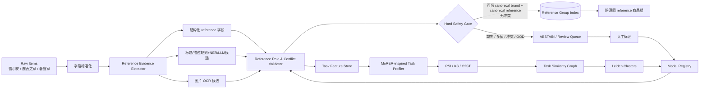

# Efficient Model Repository for Entity Resolution: Construction, Search, and Integration

> 文章：Victor Christen, Peter Christen, **Efficient Model Repository for Entity Resolution: Construction, Search, and Integration**, EDBT 2026, pp. 386–398.  
> 原文：https://openproceedings.org/2026/conf/edbt/paper-245.pdf  
> 调研清单来源：`奢侈品文章调研.md` 中的 MoRER 条目。  
> 目标需求：Notion「跨源二奢/腕表商品实体匹配系统（雷小安 × 腕表之家 × 奢当家）」——100 万–1000 万级持续增量数据；“同一商品”按同一 reference number 定义；字段稀疏；precision 极端优先、允许漏匹配；可使用图片；仅有几百对黄金标签。

## 0. 结论先行

这篇论文最值得借鉴的并不是“用一个模型判断两条商品是不是同一个商品”，而是 **把不同来源对、不同品牌、不同字段完整度下的匹配问题视为不同 ER Task，并建立可复用的模型仓库；再用无标签的特征分布判断新任务应该复用哪个模型、何时发生分布漂移、何时必须补标和重训。**

对当前二奢需求，建议采用一个比论文更保守的落地版本：

1. **最终自动合并不交给 ML/LLM。** 自动合并的唯一主键是经过严格校验的 `(canonical_brand, canonical_reference)`；任何模型只能帮助“抽取 reference、判断字符串角色、发现冲突、路由人工复核”，不能越过 reference 硬规则。
2. **把 MoRER 用在 reference 解析/校验模型的复用与漂移管理上。** 三个来源后续还会增加品牌、批次和字段形态，如果每来一个新来源/品牌都单独标注训练，会很快失控；MoRER 的 Task Profile → Task Graph → Leiden Cluster → Model Repository 正好解决这个问题。
3. **系统默认 fail-closed。** reference 缺失、多个候选 reference 冲突、品牌不确定、疑似配件/表带/盒证、OCR 与文本冲突、模型进入未覆盖分布时全部 `ABSTAIN/REVIEW`，不做自动合并。
4. **百万到千万级不要先做 pairwise matching。** 对能抽到可信 reference 的记录直接做哈希/索引分组，复杂度接近 O(N)；只有 unresolved 数据进入候选生成与人工复核支路。

因此，我认为 MoRER 对本需求的最佳定位是：**“模型路由与持续学习控制面”**，不是“最终实体匹配判定器”。

---

## 1. 论文到底解决了什么问题

多源 ER 中，假设已有数据源 `D1, D2, D3...`。每两个来源之间都形成一个 ER task，例如：

- `p1,2`: D1 ↔ D2
- `p1,3`: D1 ↔ D3
- `p2,3`: D2 ↔ D3

传统做法是每个 task 都重新标注、训练一个分类器；来源越多，任务数近似按 `O(S^2)` 增长。论文认为，这些 ER task 的“相似度特征分布”如果相近，则没有必要分别训练模型，可以复用同一个分类器。

MoRER 的核心流程是：

```text
已解决的 ER tasks
      │
      ▼
[1] 计算每个 task 的 pair-level similarity feature vectors
      │
      ▼
[2] 比较 task 间“特征分布”是否相似
    KS / Wasserstein / PSI / C2ST
      │
      ▼
[3] 构建 ER-task similarity graph
      │
      ▼
[4] Leiden 聚类：相似 task 进入同一 cluster
      │
      ▼
[5] 每个 cluster 只训练/维护一个 matcher
    Supervised 或 Active Learning (ALMSER / Bootstrap)
      │
      ▼
[6] 新 task 到来
    sel_base：选择最相似 cluster 的模型直接复用
    sel_cov：加入图重新聚类，覆盖不足则追加标注并重训
```

论文实验使用 Python 3.12、scikit-learn 1.5.1、networkx 3.3，并修改 ALMSER 实现与 Bootstrap/uncertainty active learning 方案。

### 1.1 Task 相似度如何计算

对一个 ER task，先对候选 record pair 计算统一的 feature vector，例如：

```text
[title_similarity, brand_similarity, model_no_similarity, price_similarity, ...]
```

MoRER 不直接拿几个均值比较，而是比较每一维特征的**完整分布**。论文尝试了：

- **Kolmogorov–Smirnov (KS)**：比较两个累积分布函数的最大距离；
- **Wasserstein Distance**：把一个分布搬运成另一个分布的代价；
- **Population Stability Index (PSI)**：比较分箱后的分布漂移；
- **Classifier Two-Sample Test (C2ST)**：训练一个分类器区分“样本来自 task A 还是 task B”，越分不出来说明两个 task 越相似。

单变量距离被转换为相似度后，论文还使用该 feature 的标准差作为权重，意图让区分力较强的 feature 获得更大权重。

### 1.2 Task Graph 与 Leiden 聚类

每个 ER task 是图中的一个点，task 间聚合后的分布相似度是边权：

```text
G_P = (ER Tasks, Similarity Edges)
```

然后运行 **Leiden community detection**，把相似任务划到同一个 cluster。论文选择 Leiden 的理由是：

- 能在弱连接的大图中找到内部连接更强的子群；
- 比较适合大量 task；
- 后续新 task 加入后可重新聚类。

每个 cluster 最终对应一个可复用模型 `M_Ci`。

### 1.3 Active Learning 预算怎么分

MoRER 不是简单把全部标注预算扔给一个全局模型，而是：

- 每个 cluster 有最低预算；
- 剩余预算按 cluster 中 feature vector 数量等规模因素分配；
- cluster 内通过 ALMSER 或 Bootstrap/uncertainty 选择更有信息量的 pair 让人工标注；
- 每个 cluster 只训练一个模型。

这使标注预算从“每一个来源对都花一遍”变成“相似来源任务共用一份”。

### 1.4 新 task 的两种路由策略

#### `sel_base`

认为 domain shift 很小。新 task 与已有 cluster 的训练 feature 分布做比较，选择最相似的 cluster，直接用其模型。

优点：快、零新增标注。  
风险：如果新 task 实际发生了明显分布漂移，会静默复用错误模型。

#### `sel_cov`

更适合持续增量场景：

1. 把新 task 加入 task graph；
2. 重新 Leiden clustering；
3. 观察 cluster 中“未被历史训练数据覆盖的新 feature vectors”比例 `cov`；
4. 当 `cov > t_cov` 时补充 active learning 标注并更新模型。

论文实验中，较小的 `t_cov` 在部分数据集能提高效果，但在 task 尺寸差异较大的 Dexter 上也可能因为一个很小的新 task 触发无意义重训。这一点对线上实现很重要：**不能只看比例，还要加绝对样本量门槛。**

---

## 2. 论文结果里与腕表 reference 最相关的信号

论文的 Dexter 数据集包含大量相机规格与 model number，存在“文本只差一点点但实际是不同型号”的情况。作者专门指出，这类 minor textual differences 对预训练语言模型 matcher 很困难；MoRER 的结构化相似特征方案在有限训练数据下反而有优势。

这与腕表 reference 的风险高度同构：

```text
126610LN  vs  126610LV
15400ST   vs  15500ST
5711/1A   vs  5712/1A
210.30.42.20.01.001 vs 210.30.42.20.03.001
```

这些字符串对语义模型来说“几乎一样”，但业务上必须视为完全不同的 reference。论文结果进一步说明：**最终匹配不应主要依赖语义 embedding 或 LLM 的“相似”判断，而应让 reference 成为结构化、可审计、可精确比较的主证据。**

同时，论文整体优化目标仍然主要是 Precision / Recall / F1 的综合表现。比如 Dexter 上 MoRER+ALMSER 在若干预算下 precision 约为 0.96，ALMSER 约为 0.97。这个水平对普通 ER 很优秀，但距离当前“绝不能误匹配”的约束还很远。因此 MoRER 不能原样作为最终合并器。

---

## 3. 当前需求与 MoRER 的对应关系

| 当前问题 | MoRER 可借鉴点 | 需要改造的地方 |
|---|---|---|
| 雷小安 / 腕表之家 / 奢当家字段结构不同 | 按 source pair / task 建 profile，而不是假设全局同分布 | 先定义统一的 reference-centric feature schema |
| 持续增量、新品牌、新批次 | `sel_cov` + task graph 重聚类 + 模型更新 | 增加 fail-closed、shadow 模式和绝对样本量门槛 |
| 只有几百对黄金标签 | cluster 级 Active Learning，共用标注预算 | 标签优先给 hard negative / 冲突案例，不做随机平均分配 |
| precision 极端优先 | task 路由可避免把错误模型应用到 OOD task | 最终自动合并必须改成 deterministic reference gate |
| reference 有时埋在标题 | 模型可负责抽取/校验，模型仓库可复用 | 模型输出只能是“证据”，不是最终 merge 决策 |
| 图片可用 | 可把 OCR/视觉证据做公共 feature | 图像只做支持/否决，不做单独自动放行 |
| 100 万–1000 万数据 | task clustering 减少训练与推理空间 | 主路径直接按 canonical reference 建索引，避免 pairwise O(N²) |

---

## 4. 推荐的直接落地架构



### 4.1 两个平面必须分开

**数据面（Data Plane）**：负责每条商品最终是否加入某个 reference group。这里必须是 deterministic、可审计的。  
**控制面（Control Plane）**：负责抽取模型/角色分类器/冲突模型该复用哪一个、是否 OOD、是否重训。这里使用 MoRER。

这个拆分能避免一个常见问题：为了“用了 AI”，把整个系统变成一个不可解释的 pair classifier；一旦误匹配，既无法证明原因，也很难止损。

---

## 5. Reference Evidence：先解决“这个字符串到底是不是当前商品的 reference”

当前最危险的不是 edit distance 算错，而是**抽到了错误类型的编号**。标题中可能同时出现：

- 品牌 reference / model number；
- 平台商品 ID；
- 店铺 SKU；
- 序列号；
- 表带/配件兼容型号；
- 保卡/盒证上的编号；
- OCR 误识别字符串。

建议一条商品保存多个 evidence，而不是直接写一个 `reference`：

```json
{
  "item_id": "...",
  "evidence": [
    {
      "value_raw": "126610 LN",
      "value_strict": "126610LN",
      "source": "title",
      "role": "product_reference",
      "role_confidence": 0.998,
      "context": "劳力士潜航者 126610 LN ..."
    },
    {
      "value_raw": "SPU-983421",
      "source": "platform_field",
      "role": "platform_sku",
      "role_confidence": 0.999
    }
  ]
}
```

### 5.1 Reference 规范化必须有“严格层”和“品牌规则层”

不要做一个全局 `remove_non_alphanumeric()`，它会造成不可逆的碰撞。

建议保存：

- `ref_raw`：原始文本；
- `ref_strict`：Unicode NFKC、大小写统一、规范空白，只做绝对安全的转换；
- `ref_brand_canonical`：应用品牌专属规则后的 canonical reference；
- `normalization_rule_version`：规则版本。

例如 Omega 的点号分段、AP/Patek 的 `/`、后缀材质码都可能含业务信息。只有经过品牌规则验证的等价写法才允许归一为同一个 canonical key。

### 5.2 OCR 的处理原则

OCR 对 `0/O`、`1/I`、`8/B` 等字符很容易混淆。图片证据建议：

- 可以帮助召回 reference candidate；
- 可以对文本 reference 提供 corroboration；
- 可以发现文本/图片冲突并触发拒绝；
- **若唯一 reference 只来自 OCR，不直接自动合并，进入 REVIEW。**

这样充分使用图片，但不会让视觉/OCR 误差破坏 precision。

---

## 6. 最终自动合并的 Hard Safety Gate

建议把状态设计成：

```text
UNRESOLVED
   │
   ├──> AUTO_MATCHED
   ├──> REVIEW_REQUIRED
   └──> REJECTED_AS_REFERENCE_EVIDENCE
```

只有满足以下全部条件才进入 `AUTO_MATCHED`：

1. `canonical_brand` 已确定，且没有跨来源品牌冲突；
2. 存在唯一、可信的 `canonical_reference`；
3. reference 的 role 是 `product_reference`，不是平台 SKU / 店铺 SKU / serial / accessory_compatible_reference；
4. 不存在第二个互斥 reference；
5. 商品类型不是“表带、配件、盒、证书、零件”等仅引用腕表型号的对象；
6. 规范化只使用白名单规则，没有模糊 edit-distance 修复；
7. 若存在多个独立 evidence，彼此不冲突；
8. 当前 task 没有被 MoRER 控制面标记为 OOD / drifted；
9. `rule_version`、`extractor_model_version`、全部 evidence 均写入审计日志。

最终 group key：

```text
entity_key = hash(canonical_brand_id, canonical_reference)
```

即使业务文字上说“同一个 reference 就是同一商品”，仍建议把 brand 加入 key；否则不同品牌偶然复用同一数字串会产生灾难性跨品牌误合并。

### 6.1 不允许作为自动匹配依据的信号

以下信号可以召回、排序、否决，但不能单独使一条记录自动通过：

- 标题 embedding 相似；
- CLIP/image embedding 相似；
- 图片外观相似；
- reference edit distance 很小；
- LLM 回答“这两个是同款”；
- 同系列、同尺寸、同材质；
- 价格相近。

这些信号尤其容易把“同系列不同 reference”的腕表错合并。

---

## 7. 如何把 MoRER 真正落到本项目

### 7.1 定义 ER Task：不要只按 source pair

只有三个来源时，纯 source-pair task 只有三组，任务数太少，MoRER 的模型仓库价值有限。建议把 task 定义细化为：

```text
task_id = (
  source_pair,
  brand_family,
  evidence_regime,
  time_window_or_batch
)
```

其中：

- `source_pair`: 雷小安↔腕表之家、雷小安↔奢当家、腕表之家↔奢当家；
- `brand_family`: Rolex / Omega / AP / Patek / Cartier / LV 等，或者数据量小时按 pattern family 聚合；
- `evidence_regime`: structured_ref_present / title_only / title+ocr / sparse_fields；
- `time_window_or_batch`: 用于检测后续爬虫字段变化、页面模板变化、来源规则变化。

这样才会形成足够多、又有业务意义的 task profile。

### 7.2 统一 feature schema

论文的限制之一是：task 之间要有可比较的公共 feature space。当前三个来源字段高度稀疏，因此应主动构造一个**reference-centric 公共 schema**，不要直接拿平台原始字段。

建议每个 candidate item / candidate pair 产生：

```text
brand_exact
brand_alias_confidence
ref_candidate_count
ref_strict_equal
ref_canonical_equal
ref_prefix_equal
ref_suffix_equal
ref_char_edit_distance
ref_pattern_valid_left
ref_pattern_valid_right
ref_role_prob_left
ref_role_prob_right
structured_ref_support_left/right
title_ref_support_left/right
ocr_ref_support_left/right
reference_conflict_left/right
accessory_prob_left/right
category_compatible
series_equal
price_log_ratio
image_similarity             # 仅辅助
missingness_mask_*           # 重要：字段稀疏本身也是分布信息
```

注意：模型可以看 `edit_distance`，但 Hard Safety Gate 不能因为 edit distance 小就自动合并。

### 7.3 Task Profile

每个 task 周期性抽样（例如最多 5 万条候选）并统计每一维 feature 的分布：

```json
{
  "task_id": "lxan-x-watchhome:rolex:title_only:2026w34",
  "schema_hash": "...",
  "n": 42173,
  "feature_profiles": {
    "ref_candidate_count": {"hist": [ ... ]},
    "ref_role_prob": {"hist": [ ... ]},
    "missingness": {"hist": [ ... ]}
  }
}
```

这些统计不需要标签，因此非常适合“黄金标签只有几百对”的情况。

### 7.4 Task Similarity：推荐 PSI + C2ST 双层

论文实验表明，不同 distribution test 在不同数据集上差异明显；PSI 比较稳健，而 C2ST 能捕捉多维联合分布。

生产建议：

1. **PSI 做 cheap first-pass**：每维 feature 快速检测漂移；
2. **C2ST 做 multivariate confirmation**：对于 PSI 边界或重要品牌，用轻量分类器判断新旧 task 是否可区分；
3. reference 关键 feature 手工提高权重，不完全采用论文“按标准差自动加权”；
4. 只有 `schema_hash` 相同才允许直接比较/复用模型。

### 7.5 Task Graph 与 Leiden

构建：

```text
node = task_id
edge_weight = task_similarity
```

只保留 `edge_weight >= task_sim_threshold` 的边，然后 Leiden 聚类。

每个 cluster 对应一个 extractor/validator model，例如：

```text
C1: Rolex + title-only + 雷小安/奢当家
    -> model_ref_role_rolex_title_v12

C2: Omega + structured-ref-rich + 腕表之家/奢当家
    -> model_ref_validator_structured_v7

C3: sparse + OCR-heavy
    -> model_ref_role_ocr_v4
```

模型仓库存的不只是权重文件，还必须存：

```text
model_id
cluster_id
feature_schema_hash
training_task_ids
label_set_version
algorithm
thresholds
calibration_info
created_at
code_commit_sha
rule_version
precision_on_auto_accept_set
known_failure_modes
```

### 7.6 新 task 路由

生产中建议实现 `sel_base` 和 `sel_cov` 的保守版本：

```python
if schema_hash_mismatch:
    return ABSTAIN_AND_LABEL

cluster, sim = nearest_cluster(task_profile)

if sim >= reuse_threshold and drift_score <= safe_threshold:
    use(cluster.model, shadow=False)
else:
    use(cluster.model, shadow=True)      # 只打分不影响自动合并
    enqueue_active_learning(task)
```

对 `sel_cov`，不要照搬一个纯比例阈值。建议初始策略：

```text
retrain if:
  unseen_coverage_ratio > 0.25
  AND unseen_candidate_count >= 2,000
  AND drift persists for >= 2 batches
```

阈值后续用真实数据调优。这样可避免论文在 Dexter 中观察到的“小 task 因比例高导致不必要重训”。

---

## 8. 几百对黄金标签应该怎么花

随机采 300 对并不能解决 precision-first 的关键问题。应该把标签集中到最危险的 hard cases：

1. **同品牌、同系列、只差一个字符的 reference**；
2. 标题同时出现两个 reference；
3. 表带/配件标题包含兼容腕表 reference；
4. 平台 SKU / 店铺 SKU 长得像品牌型号；
5. OCR `0/O`、`1/I`、`8/B` 混淆；
6. reference 在结构化字段与标题冲突；
7. 新品牌、新来源页面模板、新爬虫字段版本；
8. 图片非常像但 reference 不同；
9. brand 缺失或别名冲突；
10. 品牌历史上存在 reference 格式变体的案例。

MoRER/Active Learning 的作用是：**在每个 task cluster 中挑最有信息量、最靠近决策边界的样本给人标，而不是平均撒标签。**

### 8.1 “几百个零错误样本”不能证明绝对安全

如果抽样 `n` 个自动通过样本，观察到 0 个误匹配，经典的 “rule of three” 近似给出 95% 置信下错误率上界约 `3/n`。

- n = 300 且 0 错误，只能说明错误率上界大约仍可能接近 1%；
- 这远达不到“绝不能误匹配”。

所以黄金标签应被理解为**发现失败模式、训练 reference 角色/校验模型、校准 task 路由**，而不是用来证明一个黑盒 matcher 已经足够安全。安全性主要依靠 deterministic hard gate + abstention。

---

## 9. 数据库与服务设计

### 9.1 核心表

```sql
raw_item(
  item_id, source, source_item_id, title, raw_json,
  image_urls, crawled_at, updated_at
)

reference_evidence(
  item_id, evidence_id,
  ref_raw, ref_strict, ref_brand_canonical,
  evidence_source, role, role_score,
  context, model_version, rule_version
)

item_resolution(
  item_id,
  canonical_brand_id,
  canonical_reference,
  resolution_state,          -- AUTO_MATCHED / REVIEW_REQUIRED / UNRESOLVED
  entity_key,
  decision_reason,
  decision_version,
  updated_at
)

reference_group(
  entity_key,
  canonical_brand_id,
  canonical_reference,
  first_seen_at,
  last_seen_at
)

er_task_profile(
  task_id, schema_hash, profile_json,
  sample_count, drift_score, cluster_id, created_at
)

model_registry(
  model_id, cluster_id, schema_hash,
  artifact_uri, training_tasks, label_version,
  metrics_json, rule_version, created_at
)

review_queue(
  review_id, item_ids, reason,
  task_id, priority, status, label
)

decision_audit_log(
  item_id, old_state, new_state,
  evidence_snapshot, model_id, rule_version,
  created_at
)
```

### 9.2 技术栈建议

在 1000 万级别，不需要一上来堆过重基础设施：

- **PostgreSQL 16**：item metadata、reference index、group、audit；`(brand_id, canonical_reference)` B-Tree 唯一/普通索引足够；
- **S3/MinIO**：图片与大对象；
- **Python + FastAPI worker**：抽取/解析/分组服务；
- **Polars / DuckDB**：离线 task profiling；数据增长或任务复杂后再迁 Spark；
- **scikit-learn + LightGBM/XGBoost（可选）**：reference role / conflict verifier；
- **igraph/leidenalg 或 NetworkX**：task graph + Leiden；
- **MLflow（可选）**：模型仓库和版本记录；
- **队列**：现有系统若已有 Kafka 就沿用，否则 Redis Streams / RabbitMQ 足够。

**不建议把向量数据库放在自动匹配主路径。** 向量检索可用于 unresolved 候选或人工复核界面，但不能决定最终 merge。

---

## 10. 千万级主路径：避免笛卡尔积

只要目标定义就是“同 reference”，最优主路径实际上非常简单：

```python
def ingest(item):
    evidences = extract_reference_evidence(item)
    result = validate_and_canonicalize(evidences, item)

    if not result.safe:
        save_state(item, "REVIEW_REQUIRED", result.reason)
        return

    entity_key = hash_key(result.brand_id, result.canonical_reference)
    upsert_reference_group(entity_key, result.brand_id, result.canonical_reference)
    attach_item_to_group(item.id, entity_key)
```

没有必要对新商品与其他 999 万条商品逐一比较。

复杂度主要是：

- 每条 item 抽取 reference：O(文本长度 + 图片 OCR 可选成本)；
- group lookup/upsert：数据库索引 O(log G)，工程上接近常数；
- 只有 unresolved 支路需要 blocking / retrieval。

这比“先 blocking 出几十亿 pair，再让 matcher 判定”更符合业务定义，也更容易保证 precision。

---

## 11. 增量更新与模型漂移

每次新批次进入后：

1. 正常跑 reference evidence 与 hard gate；
2. 只对 task profile 做增量统计；
3. 计算 PSI/C2ST 与历史 cluster representative 的差异；
4. 若稳定：继续复用当前 extractor/validator；
5. 若 drift：模型先切到 shadow，自动路径只保留纯规则可确认样本；
6. Active Learning 挑一小批 hard cases 给人工；
7. 更新 cluster / model 后先离线回放，再逐步恢复非规则模型辅助。

重点是：**新模型上线不应扩大自动合并权限。** 模型只让更多 item 获得“可信 reference evidence”，最终仍经过同一个 deterministic gate。

---

## 12. 需要重点防的 8 类误匹配

| 风险 | 示例 | 防线 |
|---|---|---|
| 相邻 reference | 126610LN / 126610LV | canonical exact；禁止 edit-distance 自动放行 |
| 配件引用主商品 | “适配 126610LN 表带” | accessory classifier + reference role |
| 平台 SKU 冒充型号 | `SPU123456` | 编号角色分类器 |
| 多 reference 标题 | “5711/5712 同款...” | 多值冲突直接 abstain |
| OCR 字符混淆 | 0/O, 1/I | OCR 仅支持/召回，不独立放行 |
| 品牌别名/缺失 | AP / 爱彼 | canonical brand；品牌不确定不自动匹配 |
| 过度 normalization | 删除 `/.-` 后碰撞 | brand-specific rule + strict form 留档 |
| 图片近似 | 同系列外观几乎一致 | image 不能单独放行，只做冲突/人工排序 |

---

## 13. 评测方式也要从 F1-first 改成 Precision-first

建议分开报告：

```text
auto_accept_precision    # 自动合并集合的 precision，最高优先级
auto_accept_coverage     # 总数据里多少能自动处理
false_merge_count        # 必须单独报绝对数量
abstention_rate
review_precision / review_load
reference_extraction_precision
task_drift_detection_rate
new-task label cost
```

测试集切分不要只随机拆分。至少做：

- **按时间切分**：旧批次训练、新批次测试；
- **按 source/template 切分**：模拟爬虫页面变化；
- **按品牌留出**：模拟新品牌；
- **hard-negative 专项集**：同系列相邻 reference；
- **配件专项集**；
- **OCR 专项集**。

上线门槛建议写成规则，而不是“F1 达到多少”：

```text
若出现任何已知 false merge -> 阻断发布并回归全部 hard-negative tests
模型仅能影响 evidence / review priority，不能绕过 hard gate
OOD task 默认自动降级为纯规则路径
```

---

## 14. 可直接开始实施的分阶段方案

### Phase 1：先拿到一个绝对保守、可工作的主链路

- 建 `raw_item / reference_evidence / item_resolution / reference_group / audit_log`；
- 做 canonical brand；
- 从结构化 reference 字段和标题中抽候选；
- 做 strict + brand-specific reference normalization；
- 实现 accessory / multi-reference / conflict fail-closed；
- `(brand, reference)` 精确索引分组。

这一阶段即使只能覆盖 30%–60% 数据，也比高 recall 黑盒匹配安全得多。

### Phase 2：加入图片和 reference 角色分类

- OCR 只生成 evidence；
- 训练“编号角色分类器”：product_reference / platform_sku / serial / accessory_reference / unknown；
- 训练轻量 conflict verifier；
- 所有模型输出保留原始证据和版本。

### Phase 3：加入 MoRER 控制面

- 按 source pair × brand × evidence regime × batch 建 task profile；
- PSI + C2ST 计算 task similarity；
- Leiden 聚类；
- cluster → model registry；
- 新 task `sel_base`/`sel_cov` 路由；
- drift 时自动降级到规则路径。

### Phase 4：Active Learning 闭环

- 复核队列优先 hard negatives、漂移 task、模型分歧样本；
- 标签写回 model registry；
- 每次重训都做时间外推 + hard-negative 回归；
- 新模型先 shadow，再启用为 evidence producer。

---

## 15. 最小可行 API

```http
POST /resolve/item
{
  "source": "leixiaoan",
  "source_item_id": "...",
  "title": "...",
  "fields": {...},
  "image_urls": [...]
}
```

返回：

```json
{
  "state": "AUTO_MATCHED",
  "entity_key": "sha256:...",
  "canonical_brand": "ROLEX",
  "canonical_reference": "126610LN",
  "decision_reason": "unique_verified_reference",
  "evidence": [...],
  "rule_version": "ref-rule-17",
  "model_versions": ["role-rolex-title-v12"]
}
```

或者：

```json
{
  "state": "REVIEW_REQUIRED",
  "decision_reason": "multiple_conflicting_references",
  "candidates": ["126610LN", "126610LV"]
}
```

这种 API 设计从第一天就让“拒绝自动判断”成为一等公民，而不是把所有结果硬塞成 match / non-match。

---

## 16. 最终建议

MoRER 对本项目最大的价值是三个：

1. **把“持续新增来源/品牌”带来的重复标注成本压下来**：相似 task 共用模型；
2. **把分布漂移显式化**：不是等误匹配发生后才发现模型失效；
3. **让模型复用可审计**：知道当前 item 使用了哪个 task cluster、哪个模型、为什么允许复用。

但当前 Spec 的业务定义比一般 ER 更特殊：既然“同一商品 = 同一 reference”，且 precision 优先到可以牺牲 recall，就没有必要让通用 matcher 主导最终决策。最稳妥的系统应当是：

> **Reference-centric deterministic matching 作为数据面，MoRER-style task clustering/model repository 作为控制面，所有不确定情况一律 abstain。**

这比直接复制论文 classifier 更符合 100 万–1000 万持续增量、字段稀疏、图片可用、少量标注且“绝不能误匹配”的真实约束，也能在后续增加新平台时平滑扩展。