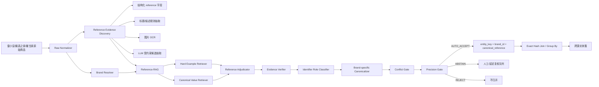

# Multi-Value-Product Retrieval-Augmented Generation for Industrial Product Attribute Value Identification：把 MVP-RAG 改造成 precision-first 的腕表 Reference-RAG

> 分析对象：Huike Zou et al., **Multi-Value-Product Retrieval-Augmented Generation for Industrial Product Attribute Value Identification**（EMNLP 2025 Industry Track）  
> 论文：https://aclanthology.org/2025.emnlp-industry.147/  
> 对应需求：Notion《调研计划 Spec：跨源二奢/腕表商品实体匹配系统（雷小安 × 腕表之家 × 奢当家）》  
> 需求核心：100 万–1000 万级持续增量；“同一个商品”按 **reference number / 型号一致**定义；字段稀疏；reference 可能埋在标题/描述中；有图片；**precision 极端优先，允许漏匹配**。

---

## 1. 结论先行

这篇论文非常适合当前需求，但**不能把原始 MVP-RAG 直接当成最终 matcher**。

论文解决的是 Product Attribute Value Identification（PAVI）：给定商品标题/描述，从动态属性值库中识别标准属性值。它的关键创新是同时检索两类上下文：

1. **Attribute Value Retrieval**：从标准属性值 taxonomy 中检索 top-k 候选值；
2. **Product Retrieval**：检索同类相似商品及其已知属性，作为 few-shot / reference context；
3. 把两路结果一起交给微调后的 Qwen2.5-7B-Instruct，输出标准属性值。

论文在闲鱼真实二手商品数据上报告：

- Xianyu-PAVI：Precision 93.8 / Recall 85.3 / F1 89.5；
- 数据包含 8,803 个类目、26,645 个 category-attribute 对、约 630 万 category-attribute-value 三元组；
- 方案已在真实工业环境中每天处理百万级商品。

这说明它非常适合做**百万级、动态 taxonomy、长尾属性值**的标准化识别。

但当前 Spec 的约束比论文严苛得多：

> **93.8% precision 对“绝不能误匹配”远远不够。**

因此推荐的改造不是：

```text
商品 A + 商品 B
  -> MVP-RAG / LLM
  -> same / not same
```

而是：

```text
MVP-RAG = reference 候选发现与标准化辅助层
Safety Kernel = 最终身份判定层
```

最终生产架构应是：

```text
原始三源商品
  -> 字段/文本/图片 OCR 多路 reference evidence discovery
  -> Reference-RAG
       - 检索 canonical reference 候选
       - 检索同品牌/同系列 hard examples
       - LLM 只做受约束的候选选择/证据解释
  -> Evidence Verifier
       - 原文回指
       - identifier role 判断
       - belongs-to-current-product 判断
  -> Brand-specific Canonicalizer
  -> Conflict Gate
  -> Precision Gate
  -> 仅 AUTO_ACCEPT 生成
       entity_key = (canonical_brand_id, canonical_reference)
  -> 三源按 entity_key exact join / group by
```

最重要的设计原则：

> **RAG 可以帮助发现 reference，但不能创造 identity；LLM 可以解释 evidence，但不能拥有自动合并权限。**

---

## 2. 论文为什么与当前问题高度同构

当前三源数据最难的不是“两个商品标题像不像”，而是：

```text
同一个 reference：
  126610LN
  Ref.126610LN
  126610 LN
  型号 126610LN
  劳力士潜航者 126610LN

以及大量危险干扰：
  适配 126610LN 的表带
  对比 126610LN
  店铺 SKU = 126610LN-202608-001
  序列号 / 保卡号
  同系列相邻型号 126610LV
```

这本质上就是一个“动态标准属性值识别”问题：

```text
输入：商品 title / description / OCR / structured fields
目标属性：reference number
标准值库：品牌官方/可信 reference registry
输出：canonical reference 或 ABSTAIN
```

论文的 PAVI taxonomy 可以几乎一一映射到腕表场景：

```text
论文：Category -> Attribute -> Attribute Value
腕表：Brand/Series -> Reference -> Canonical Reference Value
```

例如：

```text
Rolex
  Submariner
    124060
    126610LN
    126610LV

Omega
  Speedmaster
    310.30.42.50.01.001
    310.30.42.50.01.002
```

这意味着 MVP-RAG 的“值检索 + 同类商品检索 + 受约束生成”可以直接改造成 **Reference-RAG**。

---

## 3. 原论文架构：双路检索后再生成

论文将 MVP-RAG 分为两个主要组件：

```text
                ┌──────────────────────────┐
Product Query ──┤ Product Retriever        │
                │ BGE + cosine similarity  │
                │ same-category only       │
                └────────────┬─────────────┘
                             │ similar products
                             ▼
                           ┌─────┐
                           │ LLM │ -> normalized attribute values
                             ▲
                             │ candidate values
                ┌────────────┴─────────────┐
Product Query ──┤ Value Retriever          │
                │ TACLR                    │
                │ top-k attribute values   │
                └──────────────────────────┘
```

论文强调真正变化的核心在 **Retrieval**：不是只检索商品，也不是只检索属性值，而是两个层级同时检索。

### 3.1 Attribute Value Retrieval

对每个商品：

```text
query = title + description
```

对每个标准属性值，将 taxonomy 上下文编码到文本中：

```text
"a {category} with {attribute} being {value}"
```

然后使用 TACLR 编码 query 和 value corpus，并在对应 category 内计算相似度，选择 top-k 属性值。

这一点对 reference 很重要：

> 不应该让 LLM 在整个开放字符串空间里自由生成型号，而应该先把问题压缩成“在这个品牌/系列的少量候选 reference 中判断”。

### 3.2 Product Retrieval

论文使用 BGE-base 生成商品向量，通过 cosine similarity 检索相似商品，并加一条非常重要的限制：

> **只在相同 category 中检索。**

这是一个典型的 semantic retrieval + hard namespace gate。

映射到当前腕表任务，不应只按“大类腕表”过滤，而应升级成：

```text
canonical_brand_id 必须一致
  -> 可选：series / family 一致
  -> 才允许向量检索
```

也就是说：

```text
embedding 只负责在安全 namespace 里排序，不能跨品牌自由召回。
```

### 3.3 Generation

论文把以下五类内容组织成统一 prompt：

1. Task definition；
2. Note / 规则；
3. 同 category 的相似商品；
4. 当前商品信息；
5. candidate attribute values。

基础模型使用 **Qwen2.5-7B-Instruct**，采用全参数微调：

- 3 epochs；
- batch size 16；
- AdamW；
- max learning rate `2e-5`；
- 1% warmup；
- cosine learning-rate scheduler。

论文还专门加入 OOD attribute values 训练数据，以提升新属性值发现能力。

---

## 4. 论文中最值得当前 Spec 注意的实验结果

### 4.1 双路检索的价值主要体现在 precision

Xianyu-PAVI：

```text
Qwen2.5 fine-tune       Precision 84.5
TACLR                   Precision 85.4
w/o product retrieval  Precision 93.2
w/o value retrieval    Precision 91.5
MVP-RAG                 Precision 93.8
```

这说明：

- 把标准值候选检索放在生成前，可以明显抑制开放生成；
- 相似商品上下文进一步帮助 disambiguation；
- 双路结合更好。

但是对我们来说真正的结论不是“93.8 已经很好”，而是：

> **LLM/RAG 仍然只能是候选识别层，不是最终身份层。**

### 4.2 candidate value 不是越多越好

论文实验显示：随着候选属性值数量增加：

```text
true value coverage: 94.9% -> 99.6%
precision: 持续下降
```

F1 在候选数约 6 时达到峰值，继续增加候选会带入 misinformation。

这对相邻 reference 极其重要。

例如 Rolex Submariner：

```text
124060
126610LN
126610LV
116610LN
116610LV
...
```

如果把几十个近邻型号全部塞给模型，召回虽然更高，但模型更容易在高度相似的字符串之间错误选择。

所以当前系统应该用：

```text
small, high-quality candidate set
```

而不是“大召回后让 LLM 猜”。

建议第一版：

```text
reference candidate K = 3~6
```

并按如下顺序构造：

```text
1. exact / normalized lexical hit
2. brand-specific pattern hit
3. edit-distance 邻居
4. dense retrieval 邻居
```

### 4.3 同类商品检索数量也应限制

论文测试了 1~5 个 retrieved products，属性值 coverage 随数量增加，但模型 F1 变化有限。

论文后续分析固定用 4 个相似商品。

当前腕表任务更应该保守：

```text
positive-like examples: 1~2
hard-negative examples: 2~3
总上下文商品 <= 5
```

并优先放“易混淆反例”，而不是只有相似正例。

### 4.4 检索样本本身会错，不能盲信 RAG context

论文特意测试了 retrieved product 的属性值被改错后的情况。

对于 brand/model 这类显式属性，MVP-RAG 在部分 reference examples 出错时仍可能根据当前商品文本纠正；但当错误 example 占比过高时也会被带偏。

这直接说明：

> **检索到的历史商品不能被视为 ground truth，只能是 soft evidence。**

对当前系统，历史商品上下文绝不能进入最终自动归并条件。

---

## 5. 原论文 prompt 中一个非常适合直接借鉴的设计

论文 Appendix 的任务协议允许三种结果：

```text
1. 候选里存在正确值 -> 选择；
2. 值真实存在但不在 candidate 里 -> 可以生成，但最好不要；
3. 属性不存在 -> None / unknown。
```

这与 precision-first 非常契合。

但我们应该更严格地修改成：

```text
Reference-RAG Protocol

1. 只能输出可以在原始字段、标题/描述或 OCR token 中找到直接证据的 reference；
2. 不允许根据品牌、系列、外观或常识补全一个原文不存在的 reference；
3. candidate list 只用于识别/排序，不是事实来源；
4. retrieved products 只用于解释歧义，不是事实来源；
5. 如果出现多个互相冲突的品牌 reference，返回 AMBIGUOUS；
6. 如果字符串是平台 SKU、店铺货号、序列号、兼容/适配型号、对比型号，不能当当前商品 reference；
7. 只有原文 evidence span 能被 deterministic verifier 回指时，candidate 才有效；
8. 不确定时必须 ABSTAIN。
```

这会把生成问题改造成：

> **Evidence-grounded constrained selection**。

---

## 6. 推荐直接落地：Reference-RAG + Safety Kernel

### 6.1 总体架构



核心是把系统分成两层：

```text
Recall / Understanding Layer
  可以复杂，可以用 embedding / OCR / LLM / RAG

Safety / Identity Layer
  必须 deterministic、可审计、可回滚
```

---

## 7. Step 1：Reference Registry 是整个系统的主索引

MVP-RAG 的 attribute taxonomy 在当前系统中应升级成 `reference_registry`。

建议表结构：

```sql
CREATE TABLE reference_registry (
    brand_id              BIGINT NOT NULL,
    canonical_reference   VARCHAR(128) NOT NULL,
    series_id             BIGINT NULL,
    display_reference     VARCHAR(128) NOT NULL,
    lexical_forms         JSONB NOT NULL,
    normalization_policy  VARCHAR(64) NOT NULL,
    policy_version        INT NOT NULL,
    status                VARCHAR(32) NOT NULL,
    source_provenance     JSONB NOT NULL,
    created_at            TIMESTAMP NOT NULL,
    updated_at            TIMESTAMP NOT NULL,
    PRIMARY KEY (brand_id, canonical_reference)
);
```

其中：

```text
lexical_forms
```

可以包含：

```json
[
  "126610LN",
  "126610 LN",
  "Ref. 126610LN"
]
```

但 canonicalization 不能全局“一律删标点”。

必须按品牌维护：

```text
policy_id = rolex_reference_v3
policy_id = omega_reference_v2
policy_id = cartier_reference_v1
```

原因是：某些品牌的小数点、斜线、后缀本身就是 reference 语义的一部分。

---

## 8. Step 2：多路 Reference Evidence Discovery

每条商品记录不要只抽一个 reference，而是产生 candidate evidence list：

```json
{
  "product_id": "sdj:123456",
  "brand_id": 1001,
  "reference_candidates": [
    {
      "raw": "126610LN",
      "source_type": "STRUCTURED_FIELD",
      "source_field": "model_no",
      "source_span": null,
      "role": "BRAND_REFERENCE",
      "belongs_to_current_product": true,
      "extractor": "field_adapter_v2"
    },
    {
      "raw": "126610LN",
      "source_type": "TITLE",
      "source_field": "title",
      "source_span": [14, 22],
      "role": "UNKNOWN",
      "belongs_to_current_product": null,
      "extractor": "brand_regex_v4"
    }
  ]
}
```

候选来源按可信度大致排序：

```text
1. 已知语义的结构化 reference 字段
2. 品牌专用 regex / grammar
3. 页面详情中明确“型号/参考号/Ref.”上下文
4. OCR 明确字段（表背/吊牌/保卡）
5. 通用 identifier extractor
6. LLM candidate extraction
```

注意：

> **LLM 输出永远不能作为不可回指的 evidence。**

LLM 给出 `126610LN` 后，必须由 verifier 在原始文本/OCR token 中找到对应字符串，否则删除。

---

## 9. Step 3：把 MVP-RAG 的 Value Retriever 改造成 Canonical Reference Retriever

论文用 TACLR 从属性值库取 top-k。

第一版不需要一开始就复刻 TACLR，可以用更简单、更安全的多级召回：

```text
Level 0: exact lookup
Level 1: canonical normalization lookup
Level 2: brand-constrained lexical retrieval
Level 3: edit distance / n-gram retrieval
Level 4: brand-constrained dense retrieval
```

伪代码：

```python
def retrieve_reference_candidates(brand_id, raw_candidates, text):
    result = []

    for raw in raw_candidates:
        result += exact_lookup(brand_id, raw)
        result += normalized_lookup(brand_id, raw)
        result += lexical_lookup(brand_id, raw, top_k=3)

    if len(result) < 3:
        result += dense_lookup(
            namespace=f"brand:{brand_id}",
            query=text,
            top_k=3,
        )

    return dedupe_and_rank(result)[:6]
```

这里最关键的是：

```text
dense retrieval 不能跨 brand namespace。
```

否则像：

```text
116500LN
126610LN
WSSA0018
IW371604
```

这类字符模式与文本相似度会产生完全没有业务意义的近邻。

---

## 10. Step 4：Product Retriever 不应该检索“最像”，而要检索“最能消歧”

原论文 BGE Product Retriever 检索同类相似商品。

腕表场景应改成 **Hard Example Retriever**。

目标不是：

```text
找 4 个和当前商品最像的商品
```

而是：

```text
找 4 个最能证明“这个编号为什么是/不是当前商品 reference”的例子
```

建议检索 bucket：

```text
A. same brand + same canonical ref 的高质量正例       1 个
B. same brand + edit-distance 很近的相邻 ref          1~2 个
C. accessory-compatible-reference 反例                1 个
D. source SKU / serial number 混淆反例                 1 个
```

例如：

```text
Positive:
"劳力士潜航者 126610LN 全套" -> BRAND_REFERENCE 126610LN

Hard negative:
"劳力士潜航者 126610LV"      -> BRAND_REFERENCE 126610LV

Role negative:
"适配 126610LN 黑色胶带"      -> ACCESSORY_COMPAT_REFERENCE

SKU negative:
"库存号 126610LN-240819"      -> SOURCE_SKU
```

这比普通 semantic top-k 对 precision 更有价值。

---

## 11. Step 5：LLM 的输出不是 reference，而是“判决草案”

建议 LLM 结构化输出：

```json
{
  "decision": "SUPPORTED | AMBIGUOUS | NO_REFERENCE",
  "selected_candidate": "126610LN",
  "evidence": [
    {
      "source": "title",
      "raw": "126610LN",
      "span": [14, 22]
    }
  ],
  "identifier_role": "BRAND_REFERENCE",
  "belongs_to_current_product": true,
  "conflicts": [],
  "reason_code": "EXPLICIT_MODEL_CONTEXT"
}
```

注意：

```text
selected_candidate
```

只允许来自：

1. `reference_registry` 检索结果；或
2. 原文中真实出现、尚未进入 registry 的候选。

如果是第 2 种，只能进入：

```text
NEW_REFERENCE_REVIEW
```

不能直接自动创建新的实体 key 并跨源合并。

这是对论文 OOD generation 的关键收紧：

> 原论文为了适应动态 taxonomy，允许生成 OOD value；当前身份系统里，OOD reference 可以被发现，但不能未经 registry 审核就获得自动归并权。

---

## 12. Step 6：Safety Kernel 必须 deterministic

建议把最终 gate 写成普通代码，而不是 prompt。

伪代码：

```python
def precision_gate(evidence, registry, brand_policy):
    if evidence.brand_id is None:
        return ABSTAIN("NO_CANONICAL_BRAND")

    if evidence.identifier_role != "BRAND_REFERENCE":
        return REJECT("NOT_BRAND_REFERENCE")

    if evidence.belongs_to_current_product is not True:
        return REJECT("NOT_CURRENT_PRODUCT_REFERENCE")

    if not evidence.literal_span_verified:
        return ABSTAIN("NO_LITERAL_EVIDENCE")

    if evidence.has_conflicting_reference:
        return ABSTAIN("CONFLICTING_REFERENCE")

    canonical = brand_policy.normalize(evidence.raw_reference)
    if canonical is None:
        return ABSTAIN("NORMALIZATION_UNSAFE")

    ref = registry.get(evidence.brand_id, canonical)
    if ref is None:
        return ABSTAIN("UNKNOWN_REFERENCE")

    if not brand_policy.roundtrip_safe(evidence.raw_reference, canonical):
        return ABSTAIN("NON_REVERSIBLE_NORMALIZATION")

    return AUTO_ACCEPT(canonical)
```

最终跨源匹配只有：

```python
entity_key = sha256(f"{brand_id}\x1f{canonical_reference}")
```

两个商品只有 `entity_key` 完全一致才自动归并。

---

## 13. “绝不能误匹配”时的 AUTO_ACCEPT 规则

第一版建议非常保守。

### 13.1 AUTO_ACCEPT

至少满足：

```text
A. brand 已 canonicalize；
B. identifier role = BRAND_REFERENCE；
C. reference 有 literal evidence；
D. belongs_to_current_product = true；
E. brand-specific canonicalization 通过；
F. reference_registry 已存在该 canonical value；
G. 当前商品没有第二个冲突的 BRAND_REFERENCE；
H. 不存在 accessory/compatible/compare 语义；
I. 最终 entity_key 严格等值；
```

生产初期还可以加更严格条件：

```text
J. 至少两个独立证据源一致，例如：
   structured field + title
   title + OCR
   description + OCR
```

如果只有一个弱证据源：

```text
ABSTAIN
```

### 13.2 ABSTAIN

以下任何一种都不自动归并：

```text
reference 不在 registry
多个 reference 冲突
只有图像视觉相似，没有 OCR 字符证据
LLM 推测出 reference，但原文没有 literal evidence
品牌不确定
canonicalization 规则不确定
标题出现“适用/兼容/同款/对比”等高风险上下文
只有 source SKU 样式编号
```

### 13.3 REJECT

明确证据表明不是品牌 reference：

```text
ACCESSORY_COMPAT_REFERENCE
SOURCE_SKU
SERIAL_NUMBER
ORDER_ID
INTERNAL_ID
```

---

## 14. 图片应该怎么用：OCR 是证据，视觉相似度不是 identity

原论文明确指出它只使用文本，没有利用图片/视频。

当前 Spec 有图片，这是可以补强 MVP-RAG 的地方。

推荐图片链路：

```text
image
  -> image quality / view classifier
  -> OCR
  -> token boxes
  -> reference-pattern detector
  -> candidate evidence
```

重点图片：

```text
表背刻字
保卡
吊牌
证书
包装标签
```

OCR 输出同样必须保存：

```json
{
  "raw": "310.30.42.50.01.001",
  "source_type": "IMAGE_OCR",
  "image_id": "...",
  "bbox": [x1, y1, x2, y2],
  "ocr_engine": "...",
  "ocr_confidence": 0.97
}
```

视觉 embedding 可以用于：

```text
- 找相似商品辅助人工复核；
- 在文本缺失时生成候选；
- 发现明显图片冲突；
```

但不能用于：

```text
“图片非常像，所以 reference 相同” -> AUTO_ACCEPT
```

腕表同系列不同 reference 的外观可能极其相似，视觉相似度没有身份唯一性。

---

## 15. 千万级架构：真正的跨源匹配不需要 O(N²)

只要 reference extraction 成功，实体匹配本身非常简单。

### 15.1 数据流

推荐：

```text
Crawler / CDC
   -> Kafka
   -> Normalize / Extract workers
   -> Reference-RAG workers
   -> Safety Gate
   -> Entity Key Store
   -> Incremental cluster updater
```

### 15.2 存储建议

可以采用：

```text
Raw data / image metadata:
  Object Storage + Parquet/Iceberg

Reference registry / policies:
  PostgreSQL

Exact lookup:
  PostgreSQL / RocksDB / Redis / KV store

Lexical retrieval:
  OpenSearch / Elasticsearch

Dense retrieval:
  Milvus / pgvector / OpenSearch vector

Analytical audit:
  ClickHouse
```

具体产品不是关键，关键是把 exact identity store 与 fuzzy retrieval store 分开。

### 15.3 Matching Complexity

错误架构：

```text
三源两两全量 pairwise
O(N²)
```

推荐架构：

```text
每条商品 -> 抽 canonical reference -> hash key
O(N)
```

增量时：

```text
new_product
  -> entity_key
  -> lookup(entity_key)
  -> append to existing cluster / create new cluster
```

单条新增不需要重新扫描全部商品。

---

## 16. 数据模型建议

### 16.1 product_reference_evidence

```sql
CREATE TABLE product_reference_evidence (
    product_id             VARCHAR(128) NOT NULL,
    source_id              VARCHAR(32) NOT NULL,
    brand_id               BIGINT,
    raw_reference          VARCHAR(256),
    canonical_reference    VARCHAR(128),
    identifier_role        VARCHAR(64),
    belongs_to_product     BOOLEAN,
    source_type            VARCHAR(64),
    source_field           VARCHAR(128),
    source_span            JSONB,
    image_id               VARCHAR(128),
    bbox                    JSONB,
    extractor_id           VARCHAR(128),
    extractor_version      VARCHAR(64),
    normalization_policy   VARCHAR(64),
    policy_version         INT,
    literal_verified       BOOLEAN NOT NULL DEFAULT FALSE,
    decision               VARCHAR(32) NOT NULL,
    reason_codes           JSONB NOT NULL,
    created_at             TIMESTAMP NOT NULL
);
```

### 16.2 entity_membership

```sql
CREATE TABLE entity_membership (
    entity_key              CHAR(64) NOT NULL,
    brand_id                BIGINT NOT NULL,
    canonical_reference     VARCHAR(128) NOT NULL,
    product_id              VARCHAR(128) NOT NULL,
    source_id               VARCHAR(32) NOT NULL,
    decision_version        VARCHAR(64) NOT NULL,
    created_at              TIMESTAMP NOT NULL,
    PRIMARY KEY (entity_key, product_id)
);
```

这里不建议直接存一个不可解释的“match_score”。

应该存：

```text
证据 + policy version + decision reason
```

从而能回答：

> 为什么 2026-08-18 这两条商品被自动归在一起？

---

## 17. 如何利用“几百对黄金标签”

用户允许人工标注几百对，这些标签最有价值的用法不是随机采样训练一个 pair classifier。

应集中标：

```text
1. 同品牌相邻 reference hard negative；
2. reference vs source SKU；
3. reference vs serial number；
4. 当前商品型号 vs compatible/accessory 型号；
5. OCR 相近字符：0/O、1/I、5/S、8/B；
6. 不同格式但同一 reference 的 normalization positive；
7. 标题里同时出现多个 reference 的 ambiguous case；
8. 新增品牌/新来源的 schema drift。
```

黄金标签应该服务于三个组件：

```text
A. identifier role classifier
B. belongs-to-current-product classifier
C. precision gate audit/calibration
```

而不是直接训练：

```text
pair -> same / not same
```

因为最终业务定义已经明确是“reference 相同”，没有必要重新让模型学习一个模糊的 same-product 概念。

---

## 18. 评估指标：不要再把 F1 当主指标

论文以 Precision / Recall / F1 为主。

当前需求应该把指标改成：

```text
Primary:
- Auto-Accept Precision
- False Merge Count
- False Merge Rate

Secondary:
- Auto-Accept Coverage
- Reference Extraction Recall
- Abstain Rate
- Manual Review Load
- Unknown Reference Rate
```

特别要区分：

```text
reference extraction accuracy
```

与：

```text
entity auto-merge precision
```

前者可以 95%，只要后面 Safety Gate 把不确定结果拒掉，后者仍然可以接近 100%。

### 一个重要统计事实

“几百个标签里 0 个 FP”并不能证明极端高 precision。

经验上，如果抽样 `n` 个 AUTO_ACCEPT，观察到 0 个错误，95% 置信上界大约仍是：

```text
FP rate < 3 / n
```

所以：

```text
n = 300  -> 仍只能粗略支持 FP < 1%
n = 3000 -> 才接近 FP < 0.1%
```

因此“绝不能误匹配”不能只靠模型置信度统计保证，必须靠：

```text
hard invariants + deterministic gate + audit
```

这也是为什么本文推荐把模型放在 Safety Kernel 之前。

---

## 19. 分阶段落地方案

### Phase 0：先做 deterministic reference key（最快可上线）

目标：不用训练模型，先拿到一批极高 precision 的结果。

实现：

```text
1. 三源字段 mapping
2. canonical brand 表
3. 已知 reference registry
4. 品牌级 normalization rules
5. 明确 reference 字段 exact extraction
6. 高精度标题 regex
7. conflict gate
8. entity_key exact join
```

输出：

```text
AUTO_ACCEPT / ABSTAIN
```

这一步就应该能解决一部分商品，而且风险最低。

### Phase 1：加入 Reference-RAG

目标：提升 title/description 中 reference 的识别覆盖率。

实现：

```text
1. canonical reference lexical index
2. brand-constrained vector index
3. hard-example store
4. Qwen2.5 3B/7B constrained adjudicator
5. JSON schema output
6. literal evidence verifier
```

注意：

```text
LLM 只提升 evidence discovery，不改变 Safety Gate。
```

### Phase 2：图片 OCR

目标：处理标题没有 reference，但图片里有表背/保卡/标签型号。

实现：

```text
image view classifier
  -> OCR
  -> candidate reference detector
  -> brand policy normalization
  -> multi-evidence consistency
```

### Phase 3：active learning + drift monitoring

目标：持续增量下减少人工量。

重点监控：

```text
new brand
new reference
new source field layout
normalization conflict
role classifier drift
OCR confusion drift
```

人工标签优先投到这些边界样本。

---

## 20. 推荐的第一版服务拆分

如果直接工程实现，我建议拆成以下服务：

```text
brand-resolver
reference-extractor
reference-retriever
reference-adjudicator
reference-verifier
reference-canonicalizer
precision-gate
entity-index
review-queue
```

接口示例：

```http
POST /v1/reference/resolve
```

输入：

```json
{
  "source": "lei_xiao_an",
  "product_id": "123",
  "title": "劳力士潜航者 126610LN 黑盘 全套",
  "description": "...",
  "structured": {
    "brand": "Rolex"
  },
  "images": ["..."]
}
```

输出：

```json
{
  "brand_id": 1001,
  "raw_reference": "126610LN",
  "canonical_reference": "126610LN",
  "identifier_role": "BRAND_REFERENCE",
  "decision": "AUTO_ACCEPT",
  "entity_key": "...",
  "evidence": [
    {
      "source": "title",
      "span": [7, 15],
      "raw": "126610LN"
    }
  ],
  "policy": {
    "id": "rolex_reference",
    "version": 3
  },
  "reason_codes": [
    "BRAND_RESOLVED",
    "LITERAL_REFERENCE",
    "KNOWN_REFERENCE",
    "NO_CONFLICT"
  ]
}
```

---

## 21. 与论文原方案相比，哪些部分保留、哪些必须修改

| MVP-RAG 原设计 | 当前系统处理 |
|---|---|
| Category-constrained retrieval | 保留并强化为 Brand/Series namespace gate |
| TACLR value retrieval | 保留思想，改成 canonical reference retrieval |
| BGE product retrieval | 保留，但改成 hard-example retrieval |
| top-k candidate values | 保留，K 控制在 3~6 |
| Qwen2.5 generation | 保留为 adjudicator，不直接拥有 identity 权限 |
| OOD value generation | 只允许进入 NEW_REFERENCE_REVIEW，不直接 AUTO_ACCEPT |
| None/unknown | 强化成 ABSTAIN，一等公民 |
| 相似商品属性作为 context | 只作为 soft evidence，不能当 ground truth |
| text only | 增加 OCR evidence，不使用视觉相似度直接判 identity |
| Precision/F1 优化 | 改成 Auto-Accept Precision / False Merge 为主 |
| 单模型输出 | 增加 deterministic Safety Kernel |

---

## 22. 最终推荐

如果现在就开始开发，我不会从“训练一个跨源 pairwise matcher”开始。

我会按以下顺序落地：

```text
1. 建 reference_registry
2. 建 canonical_brand_id
3. 做三源字段适配
4. 做品牌级 deterministic canonicalizer
5. 做高 precision reference evidence extraction
6. 先上线 exact entity_key matching
7. 再加入 MVP-RAG 思路提高 reference extraction coverage
8. 最后加入 OCR 与 active learning
```

核心原因是：

> 既然业务已经把“同一个商品”定义为“reference number 相同”，那么系统最可靠的设计不是学习一个模糊的商品相似函数，而是把绝大多数智能能力用于**可靠地恢复 canonical reference**，然后让最终 identity join 保持极其简单、确定、可审计。

MVP-RAG 最适合放在这个体系的中间：

```text
它负责把动态、长尾、稀疏、脏文本中的 reference 问题变成一个小候选集上的受约束识别问题；
Safety Kernel 再把“模型可能正确”变成“证据满足规则才允许自动归并”。
```

这既利用了论文已经验证过的百万级工业 RAG 架构，又不会继承其 93.8% precision 对当前身份匹配而言不可接受的风险。

---

## 23. 参考资料

- MVP-RAG：Huike Zou et al., *Multi-Value-Product Retrieval-Augmented Generation for Industrial Product Attribute Value Identification*, EMNLP 2025 Industry Track  
  https://aclanthology.org/2025.emnlp-industry.147/
- TACLR：Yindu Su et al., *A Scalable and Efficient Retrieval-Based Method for Industrial Product Attribute Value Identification*  
  https://arxiv.org/abs/2501.03835
- BGE / C-Pack：Shitao Xiao et al., *C-Pack: Packed Resources For General Chinese Embeddings*, SIGIR 2024  
  https://arxiv.org/abs/2309.07597
- 当前需求：Notion《调研计划 Spec：跨源二奢/腕表商品实体匹配系统（雷小安 × 腕表之家 × 奢当家）》
