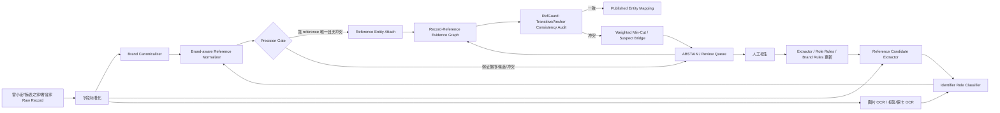

# TransClean: Finding False Positives in Multi-Source Entity Matching under Real-World Conditions via Transitive Consistency

## 0. 调研对象与结论

- 论文：**TransClean: Finding False Positives in Multi-Source Entity Matching under Real-World Conditions via Transitive Consistency**
- arXiv：https://arxiv.org/abs/2506.04006
- 正式版 DOI：10.1109/ACCESS.2025.3632400
- 作者实验代码：https://github.com/FernandoDeMeer/TransClean_repo
- 本次目标需求：跨雷小安、腕表之家、奢当家三源，100 万–1000 万级二奢/腕表记录持续增量匹配；“同一个商品”严格定义为**同一 reference number / 型号**；字段稀疏、reference 可能埋在标题，图片可用；**precision 极端优先，宁可漏配，绝不能误配**。

### 一句话结论

**不要直接把 TransClean 当成主匹配器；应该把它改造成 reference-first 系统之后的“图一致性安全审计层”。**

对本需求，最稳妥的实体键不是语义相似度，而是：

```text
entity_key = (canonical_brand_id, canonical_reference)
```

主链路先用保守的 reference 抽取、角色判别和品牌内规范化产生硬证据；只有硬证据满足严格条件才自动 attach 到 reference entity。TransClean 的传递一致性、Minimum Edge Cut、负传递边定位等思想，用于发现“某条弱边把两个不同 reference 的簇错误连起来”的情况，并把可疑边送人工，不负责越过 reference 硬规则创造自动匹配。

这是比“训练一个 pairwise matcher，把阈值调到 0.999”更符合该 Spec 的实现。

---

## 1. TransClean 原论文解决的核心问题

传统 Entity Matching 往往把任务做成 pairwise 二分类：对 `(record_i, record_j)` 判断 Match / NoMatch。但多源场景真正输出的不是孤立 pair，而是连通分量/实体组。

如果模型预测：

```text
A --Match-- B --Match-- C
```

即使没有直接评估 A-C，系统实际上已经通过传递关系把 A、B、C 归为同一实体。因此 A-C 是一个 **transitive match**。

TransClean 定义 **Transitive Consistency**：如果一个连通分量确实代表同一实体，那么模型对该分量中所有隐式 transitive pair 也应该倾向 Match；如果出现大量：

```text
A --Match-- B --Match-- C
但 matcher(A, C) = NoMatch
```

说明分量中很可能存在 false-positive bridge edge。

论文特别指出，多源越多，错误 pairwise edge 的传播危害越大，但反过来 transitive evidence 也越丰富，因此可以利用图一致性定位错误。

### 1.1 TransClean 三阶段

论文方法可以概括为：

1. **Initial Step with Finetuning**
   - 按每个 component 的 negative transitive predictions 数量排序；
   - 从高风险 component 中选：
     - Minimum Edge Cut 中的边；
     - negative transitive pair 两端节点之间 shortest path 上的边；
   - 对这些边做人工/伪标签，删除 false positive；
   - 用新标签继续 finetune pairwise matcher；
   - 重复多轮。

2. **Post Finetuning Cleanup & Checks**
   - 继续拆掉严重违反 transitive consistency 的 component；
   - 对仍有 negative transitive predictions 的 component 做集中检查；
   - 目标是得到基本 transitively consistent 的图。

3. **Edge Recovery**
   - 前面为了高效拆图会误删一些 TP；
   - 尝试把被删边加回来；
   - 只有加入后新产生的 transitive matches 仍全部一致，才恢复；否则人工判断或保持删除。

论文的关键工程点是：**不需要检查所有预测 pair，而是让图结构决定“最值得检查哪几条边”。**

---

## 2. 原项目代码架构

作者仓库 `FernandoDeMeer/TransClean_repo` 是 Python 项目，README 中的结构如下：

```text
TransClean_repo/
├── data/
│   ├── raw/
│   ├── processed/
│   └── result/
├── models/
├── scripts/
├── src/
│   ├── CLER/
│   ├── data/
│   ├── helpers/
│   ├── matching/
│   │   ├── matcher.py
│   │   ├── matcher_subclasses.py
│   │   └── LLM_labeling.py
│   └── models/
└── requirements*.txt
```

其中：

- `src/matching/matcher.py` 是主要 TransClean 实现，文件约 100 KB；
- `matcher_subclasses.py` 负责不同 blocking / pre-cleanup 的 matcher 适配；
- `src/models` 封装 DistilBERT 的训练、验证、额外 finetuning；
- `src/CLER` 是为多源数据做过修改的 CLER；
- 项目使用 NetworkX 一类图处理逻辑；
- README 暴露的 TransClean 默认 Match 概率阈值是 `0.999`；
- 论文实验通常设置 component size threshold `S=50`，避免对大 component 枚举二次方数量的 transitive pairs；
- 作者明确把 LLM 用作“选中边的 pseudo-labeler”，没有把慢速 LLM 用作全量 pairwise matcher。

这个代码结构证明 TransClean 本质上是一个**matcher-agnostic 的后处理/再训练框架**：前面可以换 DistilBERT、CLER 或别的 matcher，后面图清洗逻辑不必跟着换。

---

## 3. 为什么不能原样搬到腕表 reference 匹配

### 3.1 本需求的“实体定义”比一般 EM 更强

论文里的“same entity”通常需要模型从多个属性综合判断；但这里用户已经定义：

> 同一个商品 = 同一 reference number / 型号。

所以真正应该优化的是：

```text
reference 抽取正确率
+ reference 角色判别正确率
+ canonicalization 正确率
+ 自动 attach 的拒识策略
```

而不是训练一个通用文本语义 matcher 代替 reference。

### 3.2 0.999 模型概率不是“绝对不能误配”的保证

`p(match)=0.999` 只是模型内部置信度阈值，不是业务 precision 的统计保证，更不是逻辑保证。数据漂移、新品牌、新商家标题模板、配件标题等都可能造成高置信错误。

因此建议：

- 学习模型可以产生候选或风险分；
- **模型分数永远不能单独触发自动 merge**；
- 自动 merge 必须通过 reference 硬证据 gate。

### 3.3 原论文允许“先误删 TP，再 Edge Recovery”，本项目不需要追 recall

TransClean 为提升 F1，会在前期拆图时接受少量 TP 被删除，最后再 recover。

本 Spec 明确 precision 极端优先，所以应做更激进的安全版本：

```text
不确定 -> 不合并
冲突 -> 立即 quarantine
恢复边 -> 只有 reference 硬证据完全满足时才恢复
```

宁可保留 false negative，也不要为了 recall 让弱模型把边加回来。

### 3.4 不能在大 reference 簇里枚举所有 transitive pairs

如果某热门型号在三源累计有几万条 listing，把同 reference 的所有 pair 显式连边会达到 O(n²)，完全没必要。

本项目应该从“record-record 全连接图”改成：

```text
Record -> ReferenceEntity
```

的稀疏二部/星型表示。每条记录通常只有 1–3 个 reference evidence，整体边数接近 O(N)。

---

# 4. 推荐落地架构：Reference-First + TransClean-RefGuard

建议把系统拆为两层：

1. **Reference Decision Plane**：负责抽取、规范化和是否自动 attach；
2. **RefGuard Safety Plane**：借鉴 TransClean 对图做一致性检查、冲突切边、人工样本选择。



核心原则：

> **Reference Decision Plane 决定“能不能自动合并”；RefGuard 只拥有否决权和审计权，不拥有放宽硬规则的权力。**

---

# 5. 数据模型

建议第一版直接使用 PostgreSQL（或现有 OLTP）保存实体状态和证据，原始大字段/图片放对象存储；批处理可以用 Python + Polars/DuckDB，量再上升再换 Spark。

## 5.1 原始记录

```sql
create table product_record (
    id                bigint primary key,
    source            varchar(32) not null,
    source_item_id    varchar(128) not null,
    title             text,
    description       text,
    brand_raw         varchar(256),
    reference_raw     varchar(256),
    raw_json          jsonb,
    content_hash      varchar(64),
    ingested_at       timestamptz not null,
    updated_at        timestamptz not null,
    unique(source, source_item_id)
);
```

原始记录只追加/版本化，不在上面直接覆盖抽取结果，便于回放。

## 5.2 Identifier Evidence

```sql
create table identifier_evidence (
    id                 bigint primary key,
    record_id          bigint not null,
    brand_id           bigint,
    token_raw          varchar(256) not null,
    token_canonical    varchar(256),
    identifier_role    varchar(32) not null,
    evidence_channel   varchar(32) not null,
    source_field       varchar(64),
    extractor_version  varchar(64) not null,
    strength_tier      smallint not null,
    confidence         numeric(8,6),
    context_text       text,
    is_conflicting     boolean default false,
    created_at         timestamptz not null
);
```

`identifier_role` 至少区分：

```text
REFERENCE
PLATFORM_SKU
SELLER_SKU
SERIAL_NUMBER
ACCESSORY_COMPATIBLE_MODEL
CATALOG_ID
UNKNOWN
```

这是非常重要的一层：很多误匹配不是“字符串没抽出来”，而是把**平台货号 / 店铺 SKU / 序列号 / 配件适配型号**误当成 reference。

## 5.3 Reference Entity

```sql
create table reference_entity (
    entity_id          bigint primary key,
    brand_id           bigint not null,
    canonical_ref      varchar(256) not null,
    normalizer_version varchar(64) not null,
    status             varchar(32) not null,
    created_at         timestamptz not null,
    unique(brand_id, canonical_ref)
);
```

为什么必须带 `brand_id`：不同品牌可能存在相同数字/字母组合，reference 本质上是品牌命名空间内的 identifier。

## 5.4 Record -> Entity 决策

```sql
create table record_entity_link (
    record_id          bigint primary key,
    entity_id          bigint,
    decision           varchar(32) not null,
    decision_version   varchar(64) not null,
    reason_code        varchar(64) not null,
    evidence_ids       bigint[] not null,
    decided_at         timestamptz not null
);
```

`decision` 建议只有：

```text
AUTO_ACCEPT
MANUAL_ACCEPT
ABSTAIN
REJECT_CONFLICT
```

不要只有 bool `matched=true/false`，否则以后无法审计“为什么没合并”。

## 5.5 冲突和人工队列

```sql
create table match_conflict (
    id              bigint primary key,
    record_id       bigint,
    entity_id       bigint,
    conflict_type   varchar(64) not null,
    severity        smallint not null,
    evidence_ids    bigint[],
    status          varchar(32) not null,
    created_at      timestamptz not null
);
```

---

# 6. Reference 抽取：宁可少抽，不可错抽

建议不是“一把正则”，而是多 extractor 产生 evidence，再做合并。

## 6.1 Evidence Channel 分级

### Tier 4：最强

- 平台明确结构化字段 `reference/model/ref_no`；
- 品牌官方/可信 reference catalog 的 exact lookup；
- 人工确认。

### Tier 3：强

- 标题中只有一个候选，且有明显上下文：`Ref.`, `型号`, `腕表型号`, `参考编号`；
- 品牌特定 pattern 校验通过；
- OCR 在保卡/吊牌/表背区域识别到 reference，并与文本候选 exact 一致。

### Tier 2：中

- 标题里抽到一个符合 pattern 的 token，但缺少强上下文；
- OCR 单独识别；
- description 中孤立出现。

### Tier 1：弱

- 模糊字符串相似；
- LLM 猜测；
- 图片视觉相似度；
- embedding / ANN 召回。

**Tier 1 永远不能触发 AUTO_ACCEPT。**

---

# 7. Reference Canonicalization 必须品牌感知、保守、可版本化

这是最容易因为“清洗过度”制造 false positive 的位置。

统一可以做：

```text
Unicode NFKC
trim
大写化（若该品牌 reference 不区分大小写）
统一全角/半角
统一明显的空白字符
```

但以下操作不要全品牌通用：

```text
删除 . - / 空格
去前导 0
去品牌前缀
去后缀颜色/材质码
数字字母互换 O/0, I/1
```

这些必须进入 `brand_reference_rules` 白名单。

示例：

```python
normalize_reference(
    brand="ROLEX",
    raw="126610-LN",
    rules_version="rolex-v3"
) -> "126610LN"
```

但另一个品牌如果 `-LN` 是语义后缀，则不能删除。

所有结果必须存：

```text
raw token
canonical token
normalizer_version
```

以后规则变更才能全量回放。

---

# 8. Precision Gate：最终自动合并规则

这是整个系统最关键的地方。

建议第一版只有以下情况能自动 attach：

```python
def can_auto_attach(record):
    # 1. 品牌已高置信规范化
    if record.brand_strength < STRONG:
        return False

    refs = strong_reference_candidates(record)

    # 2. 强 reference 必须唯一
    if len(refs) != 1:
        return False

    ref = refs[0]

    # 3. token 必须被判为 REFERENCE，而不是 SKU/序列号/配件适配型号
    if ref.role != "REFERENCE":
        return False

    # 4. 任何独立强证据与其冲突，立即拒识
    if has_strong_conflicting_identifier(record, ref):
        return False

    # 5. 配件/表带/盒证/兼容型号等上下文，默认不自动归并到腕表 reference entity
    if has_accessory_risk(record):
        return False

    # 6. canonicalization 必须来自已发布、可审计的品牌规则版本
    if not ref.normalizer_rule_is_published:
        return False

    return True
```

### 8.1 自动决策矩阵

| 左侧证据 | 右侧证据 | canonical ref | 决策 |
|---|---|---|---|
| 结构化强 | 结构化强 | exact | AUTO_ACCEPT |
| 结构化强 | 标题强 | exact | AUTO_ACCEPT，可配置要求品牌 catalog 校验 |
| 标题强 | OCR 强 | exact | AUTO_ACCEPT，属于独立通道互证 |
| 结构化强 | 标题弱 | exact | ABSTAIN / 人工 |
| 任意强 | 任意强 | conflict | REJECT_CONFLICT |
| 只有视觉相似 | 只有视觉相似 | N/A | ABSTAIN |
| fuzzy ref 相似 | fuzzy ref 相似 | 非 exact | ABSTAIN |

这里的“左右侧”不是强制要做 pairwise 扫描，而是说明两个 record 要自动落到同一 entity 时，其各自 evidence 应达到什么级别。

---

# 9. 如何把 TransClean 改造成 RefGuard

## 9.1 图结构改变

不要创建：

```text
record A -- record B -- record C -- ...
```

的全量 pairwise clique。

创建：

```text
Record --evidence--> ReferenceAnchor
```

例如：

```text
        [Ref 126610LN]
        /     |      \
 雷小安A   腕表之家B   奢当家C
```

如果一条弱 evidence 把 C 又连到另一个强 anchor：

```text
[126610LN] -- C -- [126610LV]
```

这就是最值得审计的 bridge。

## 9.2 本需求中的“negative transitive prediction”如何定义

论文依赖 matcher 再预测隐式 pair。这里可以把更强的**reference contradiction**直接当 negative transitive evidence：

- 同一 component 出现两个不同的 Tier 3/4 canonical reference anchor；
- 两个节点有互斥的强品牌；
- 一个是腕表本体，一个被高置信判为配件；
- 两端都有强 reference，且 canonical ref 不同；
- 一个 record 同时出现两个强 reference，且不能通过上下文解释为“主商品型号 + 兼容型号”。

这种 hard negative 比通用文本 matcher 的 `NoMatch` 更可信。

## 9.3 Weighted Minimum Cut

论文用 Minimum Edge Cut 找可能的错误桥边。本项目建议做**带 evidence 强度容量的 min-cut**：

```text
Tier 1 weak model edge       capacity = 1
Tier 2 title/OCR edge        capacity = 3
Tier 3 contextual exact      capacity = 10
Tier 4 structured/manual     capacity = INF / 不自动切
```

对 component 内两个互相冲突的 reference anchor `r1`, `r2` 做 `s-t min cut`：

```python
def audit_conflicting_component(graph, anchor_a, anchor_b):
    cut_value, (left, right) = minimum_cut(
        graph,
        anchor_a,
        anchor_b,
        capacity="evidence_capacity"
    )
    suspect_edges = crossing_edges(left, right)
    return rank_by_lowest_strength(suspect_edges)
```

**注意：Tier 4 vs Tier 4 直接冲突时不要让算法自动“选一个切掉”。**

正确行为是：

```text
整个 record/component quarantine
-> 人工检查原始页面/图片
-> 可能是 source 字段脏、reference 角色错、品牌规则错
```

因为“两个强证据冲突”本身说明 extractor/data source 出现严重异常。

---

# 10. RefGuard 的安全版三阶段

借用 TransClean 名字，可以实现为：

## Stage A：Conflict Discovery

只扫描以下 component：

```text
strong_anchor_count > 1
OR strong_ref_conflict = true
OR ambiguous_reference_count > 1
OR accessory_risk = true
OR evidence_source_disagreement = true
```

优先级：

```text
P0: 两个 Tier4 reference 冲突
P1: 一个弱 bridge 连接两个 Tier3/4 anchor
P2: 多 reference title
P3: OCR 与结构化字段冲突
P4: 仅模型/视觉 edge
```

## Stage B：Safe Pruning

安全删除：

- identifier role 明确是 PLATFORM_SKU / SELLER_SKU；
- 兼容型号上下文中的 reference；
- 与强 anchor 冲突的 Tier 1 edge；
- min-cut 识别出的纯弱 bridge；
- 已有人工 NoMatch 标签的 edge。

不安全、必须人工：

- 两边都是强 evidence；
- canonicalization 规则可能造成碰撞；
- OCR 和结构化字段各自都强；
- 同品牌相邻 reference 且标题高度相似。

## Stage C：Strict Recovery

与原论文不同，恢复条件改成：

```python
def can_recover(edge):
    return (
        edge.reference_exact_equal
        and edge.role == "REFERENCE"
        and edge.has_strong_evidence_on_both_sides
        and not edge.creates_strong_anchor_conflict
        and not edge.accessory_risk
    )
```

没有模型置信度 recovery。

---

# 11. 100 万–1000 万数据规模怎么做

## 11.1 避免全量 Cartesian Product

1000 万记录全 pair 是不可行的；而本需求其实不需要传统 blocker 扫全 pair。

主路径是：

```sql
select / upsert reference_entity
where brand_id = ?
  and canonical_ref = ?
```

有明确 reference 的记录直接 hash/key lookup 到实体，复杂度接近 O(N)。

只对 `ABSTAIN` 记录做候选召回。

## 11.2 模糊召回只处理未决记录

例如：

```text
1000 万总记录
90% 能抽到强 reference -> 900 万直接 key attach
8% 信息不足 -> 不处理/等待增量信息
2% 有可疑 reference -> 20 万进入候选/人工/模型层
```

真正需要 embedding / ANN / LLM / 图 min-cut 的量可以被压到很小。

## 11.3 大簇不枚举 transitive pair

论文用 `S=50` 避免大 component 的 O(n²) transitive evaluation。这里可以更彻底：

- 同一个唯一强 anchor 下的 1 万条 listing 不需要任意 pairwise 检查；
- 只检查是否有第二个互斥强 anchor；
- 有冲突才构造局部 evidence subgraph。

也就是说，图审计复杂度主要跟**冲突证据数**有关，而不是跟同 reference listing 数平方相关。

## 11.4 第一版基础设施不需要过度设计

推荐：

```text
PostgreSQL 16             实体/证据/决策状态
S3/OSS/MinIO              原始 JSON、图片、OCR artefact
Python worker             extractor/normalizer/decision engine
Polars or DuckDB          日批/回放/统计
NetworkX                  只处理小型 suspicious component
Redis（可选）             热 reference lookup cache
Kafka/Pulsar（可选）      真正需要高吞吐实时增量时再上
```

1000 万量级不是必须一开始 Spark + 图数据库。

也不推荐把 Neo4j 作为主存储；这里图是审计视图，不是核心查询模型。

---

# 12. 持续增量架构

每条新/更新记录：

```python
def process_record(record):
    raw = persist_raw(record)

    brand = canonicalize_brand(raw)
    candidates = extract_reference_candidates(raw)
    candidates += extract_image_ocr_candidates(raw.images)

    evidence = classify_identifier_roles(candidates, raw)
    evidence = canonicalize_references(brand, evidence)
    persist_evidence(evidence)

    decision = precision_gate(brand, evidence)

    if decision.type == "AUTO_ACCEPT":
        entity = get_or_create_reference_entity(
            brand.id,
            decision.canonical_ref,
        )
        attach_record(raw.id, entity.id, decision)
        audit_local_component(entity.id)
    else:
        enqueue_review(raw.id, decision.reason)
```

`audit_local_component()` 只需要看此次变更影响的 reference entity / conflicting anchors，不必每日全库重跑。

当 extractor 或 normalizer 升级时：

```text
按 extractor_version / normalizer_version 重放
-> 生成新 decision_version
-> diff 旧映射
-> 任何 AUTO_ACCEPT -> REJECT/ABSTAIN 的变化先冻结，不直接静默拆线上实体
```

---

# 13. 图片怎么用

图片有价值，但应该是“reference evidence”，不是“外观像所以同款”。

优先级建议：

1. 保卡、吊牌、发票、表背刻字 OCR；
2. 表盘/底盖文字区域 OCR；
3. 图片分类判断 `watch / strap / box / accessory`；
4. 视觉 embedding 只用于人工队列排序或候选召回。

特别是腕表：同系列相邻 reference 可能外观几乎一样，所以**视觉相似不能单独触发 merge**。

可以把 OCR 作为独立 channel：

```text
标题抽到 126610LN
图片 OCR 也抽到 126610LN
=> 两个独立通道互证，强度上升
```

反之：

```text
结构化字段 = 126610LN
保卡 OCR = 126610LV
=> P0/P1 冲突，直接 quarantine
```

---

# 14. LLM 在这个系统里的正确位置

论文用 LLM 给 TransClean 选中的少量 pair 做 pseudo labeling，并且实验也显示当底层 matcher 较差时，LLM pseudo labels 会带来更多 TP 误删。

本项目建议：

### 可以用

- 把标题中的候选 token 分类为 `REFERENCE / SKU / SERIAL / ACCESSORY_COMPATIBLE_MODEL`；
- 解析特殊上下文；
- 为人工队列生成解释；
- 对未见过的标题模板做离线规则发现；
- 辅助标注，不直接发布结果。

### 不可以用

```text
LLM: “我觉得这两个 listing 是同一款，置信度 99.9%”
=> AUTO_ACCEPT
```

最终自动 attach 必须回到结构化 evidence gate。

---

# 15. 几百条人工黄金标签应该标什么

如果只有几百对预算，**不要全拿去随机标 pairwise Match/NoMatch**。

因为这里匹配定义完全由 reference 决定，更有价值的是标“产生 reference 的失败环节”。

建议标注任务占比：

```text
35% identifier role
    这个 token 是 reference、SKU、serial 还是兼容型号？

25% title reference span
    标出标题里真正属于当前商品的 reference span

20% hard-negative pair
    同品牌、同系列、相邻 reference、外观近似

10% OCR conflict
    0/O、1/I、8/B、断行、刻字模糊

10% canonicalization collision
    哪些格式变化可以安全归一，哪些不能
```

TransClean 的思想用于**挑样本**：优先标 min-cut bridge、negative-transitive component，而不是随机采样。

---

# 16. 必须专门构造的 Hard Negative 集

普通随机负样本太简单，无法验证“绝不能误配”。

黄金集必须覆盖：

1. 同品牌同系列、只差一位 reference；
2. 同一 reference 的不同格式（安全正例）；
3. 标题同时出现“当前腕表 reference + 适配表带 reference”；
4. 标题里有平台 SKU，长得像型号；
5. serial number 与 reference 格式相似；
6. 盒证/表带单卖，但标题提到腕表型号；
7. OCR `0/O`, `1/I`, `5/S`, `8/B` 混淆；
8. 多个品牌名共现；
9. 老款/新款 reference 在标题中同时出现；
10. “适用/兼容/替代/同款风格”语句；
11. 同 reference 但品牌被错误归一；
12. source 更新导致 reference 字段前后变化。

---

# 17. 线上指标：不要只看 F1

本项目核心 KPI 应该是：

```text
AUTO_ACCEPT precision
AUTO_ACCEPT coverage
ABSTAIN rate
conflict rate
manual queue size
strong-anchor collision count
negative-transitive component count
source-specific precision
brand-specific precision
extractor-version regression
```

其中最重要的是：

```text
AUTO_ACCEPT precision by evidence tier
```

必须拆开看，例如：

```text
Tier4 x Tier4
Tier4 x Tier3
Tier3 x Tier3
```

不能把它们混成一个总体 precision。

另外，几百个 label 无法证明“99.9%+ precision”。若要对如此高 precision 做统计下界，需要更多独立审计样本；因此第一阶段应该靠**业务硬约束 + 强拒识 + 定向审计**，不要给出不成立的统计保证。

---

# 18. 推荐代码模块

可以直接在现有服务中按以下模块落地：

```text
luxury_er/
├── ingestion/
│   ├── leixiaoan.py
│   ├── xcar_watch.py
│   └── shedangjia.py
├── brand/
│   ├── canonicalizer.py
│   └── aliases.yaml
├── reference/
│   ├── extractor.py
│   ├── role_classifier.py
│   ├── normalizer.py
│   ├── brand_rules/
│   │   ├── rolex.yaml
│   │   ├── omega.yaml
│   │   └── ...
│   └── evidence.py
├── decision/
│   ├── precision_gate.py
│   └── reason_codes.py
├── refguard/
│   ├── graph_builder.py
│   ├── conflict_detector.py
│   ├── weighted_min_cut.py
│   ├── review_ranker.py
│   └── recovery.py
├── review/
│   ├── queue.py
│   └── labels.py
├── jobs/
│   ├── incremental_match.py
│   ├── replay_version.py
│   └── audit_canary.py
└── metrics/
    └── precision_dashboard.py
```

---

# 19. 一个可以直接实现的 RefGuard 核心伪代码

```python
from dataclasses import dataclass

@dataclass
class Evidence:
    record_id: int
    brand_id: int
    canonical_ref: str
    role: str
    tier: int
    channel: str
    confidence: float


def auto_reference(evidences: list[Evidence]):
    strong = [
        e for e in evidences
        if e.role == "REFERENCE" and e.tier >= 3
    ]

    # 按 (brand, ref) 聚合
    keys = {(e.brand_id, e.canonical_ref) for e in strong}

    if len(keys) == 0:
        return ("ABSTAIN", None, "NO_STRONG_REFERENCE")

    if len(keys) > 1:
        return ("REJECT_CONFLICT", None, "MULTIPLE_STRONG_REFERENCES")

    key = next(iter(keys))

    # 独立强冲突：例如 SKU/配件上下文/另一个强品牌
    if has_hard_conflict(evidences, key):
        return ("REJECT_CONFLICT", None, "HARD_EVIDENCE_CONFLICT")

    # 可选：Tier3 必须双通道互证；Tier4 单通道可接受
    supporting = [e for e in strong if (e.brand_id, e.canonical_ref) == key]
    max_tier = max(e.tier for e in supporting)
    channels = {e.channel for e in supporting}

    if max_tier >= 4:
        return ("AUTO_ACCEPT", key, "STRUCTURED_STRONG_REFERENCE")

    if max_tier == 3 and len(channels) >= 2:
        return ("AUTO_ACCEPT", key, "MULTI_CHANNEL_EXACT_REFERENCE")

    return ("ABSTAIN", key, "SINGLE_CHANNEL_TIER3")
```

图审计：

```python
def audit_component(component):
    anchors = component.strong_reference_anchors()

    if len(anchors) <= 1:
        return Safe()

    # 两个或以上强 reference 在同一个 evidence component 中，必有问题
    conflicts = []

    for a, b in all_pairs(anchors):
        if a.key == b.key:
            continue

        cut = weighted_min_cut(
            component.graph,
            source=a.node,
            sink=b.node,
            capacity="evidence_capacity",
        )

        # 只有弱边组成的 cut 可以自动 quarantine/remove
        if all(edge.tier <= 2 for edge in cut.edges):
            conflicts.append(AutoQuarantine(cut.edges))
        else:
            conflicts.append(ManualReview(cut.edges))

    return conflicts
```

---

# 20. 分阶段落地方案

## Phase 1：先做 deterministic precision baseline

实现：

- 三源字段统一；
- brand canonicalization；
- structured/title reference extractor；
- identifier role 规则；
- conservative brand-specific normalizer；
- `(brand_id, canonical_ref)` entity 表；
- precision gate；
- 全量回放 100 万–1000 万数据。

目标不是高 recall，而是快速得到一个可信的 AUTO_ACCEPT 子集。

## Phase 2：RefGuard 图审计

实现：

- evidence graph；
- strong anchor conflict detector；
- weighted min-cut；
- review queue；
- hard-negative 报表。

这一步最接近 TransClean 的真正迁移价值。

## Phase 3：图片 OCR 与多通道互证

只做：

- 保卡/吊牌/表背文字识别；
- watch vs accessory 分类；
- OCR 与文本 exact cross-check。

不要先做视觉相似自动 merge。

## Phase 4：学习模型只提升未决 coverage

如果 deterministic baseline precision 足够，再对 `ABSTAIN` 做：

- small transformer / LLM identifier-role classifier；
- title reference span model；
- candidate ranking；
- active learning。

学习模型先优化“reference extraction”，而不是取代 entity key。

---

# 21. 对 TransClean 最值得直接抄的部分与不该抄的部分

## 值得直接参考

1. **Connected component 不等于可信实体**，必须审计隐式传递后果；
2. 用 negative transitive evidence 找高风险 component；
3. Minimum Edge Cut 定位造成大面积错误合并的 bridge edge；
4. shortest path 上的边比随机边更值得人工标；
5. 限制大 component 的二次方计算；
6. 把有限人工预算集中在图结构最敏感的边；
7. 增量新标签反哺模型/规则。

## 不应照搬

1. 用通用 pairwise matcher 作为最终 Match authority；
2. 因为阈值 `0.999` 就认为安全；
3. LLM pseudo-label 直接作为最终业务事实；
4. 为了 recall 自动 Edge Recovery；
5. 对同 reference 大簇生成所有 pairwise/transitive pair；
6. 用总体 F1 作为最主要上线指标。

---

# 22. 最终推荐方案

如果现在就要落地，我建议采用下面的原则作为系统 contract：

```text
1. canonical reference 是唯一主键证据。
2. canonicalization 必须品牌感知、版本化、可回放。
3. identifier 先判角色，再谈匹配。
4. AUTO_ACCEPT 只接受 exact reference 强证据。
5. fuzzy / embedding / LLM / visual similarity 没有自动合并权。
6. 任何强证据冲突立即 ABSTAIN/QUARANTINE。
7. 用 TransClean 的图一致性 + min-cut 找错误 bridge，而不是让它替代 reference。
8. 人工标签优先投到 reference span、identifier role、hard negatives 和冲突 bridge。
9. 增量更新只审计受影响局部 component。
10. 全量系统默认“不同”，只有充分正证据才 merge。
```

这个设计把需求里最重要的“**绝对不能误匹配，允许漏匹配**”落到了系统权限模型上：

- 抽取器能提供 evidence；
- 模型能提供 candidate/risk；
- RefGuard 能否决；
- **只有 Precision Gate 能自动确认实体归属**。

因此即使后续替换 OCR、LLM、Transformer、blocking 或图算法，核心安全边界不会被模型版本变化破坏。

---

## 资料来源

1. TransClean arXiv：https://arxiv.org/abs/2506.04006
2. TransClean PDF：https://arxiv.org/pdf/2506.04006
3. 作者代码：https://github.com/FernandoDeMeer/TransClean_repo
4. 正式版 DOI：10.1109/ACCESS.2025.3632400
